.. _ctf_writeups:

CTF Write-ups
=============

This page contains write-ups of past CTFs using RAMN. 
Feel free to contact us to add or remove your own write-ups, request more details, or request ECU firmware binaries.

DEFCON Embedded Systems Village 2024
------------------------------------

To be Added.

Participant Write-ups:

-  https://justinapplegate.me/2024/esvctf-playagame/

DEFCON Car Hacking Village 2024
-------------------------------

To be Added.

Automotive CTF Japan 2024
-------------------------

Participant Write-ups:

- https://laysakura.github.io/2024/09/09/automotive-ctf-2024-qual/ (JP)
- https://qiita.com/kusano_k/items/140d08521b9667cd6ab9 (JP)
- https://blog.hamayanhamayan.com/entry/2024/09/14/112907 (JP)
- https://emeth.jp/diary/2024/09/automotive-ctf-japan-writeup/ (JP)

Block Harbor VicOne Automotive CTF 2024
---------------------------------------

Flag format is bh{xxxx}. Each of the six teams was provided with two RAMN sets with CTF firmware, and there was an available reference RAMN with standard firmware shared between participants.
The letter in brackets in the challenge title indicates in which ECU the flag is located.

[FILE] SWD 1 (6 solves)
^^^^^^^^^^^^^^^^^^^^^^^

Intended difficulty: Easy.
Tags: Forensics.

.. code-block:: text

	The attached file is a logic analyzer capture of a RAMN ECU reprogramming session using an ST-LINK V2… 
	Can you figure out the plaintext (not obfuscated) flag embedded in firmware?
	
	
The provided file is a logic analyzer capture (from a Scanaquad SQ200).

.. code-block:: text

	Time;CH 1 SWCLK;CH 2 SWDIO
	0.000000000;1;1
	0.594872000;0;1
	0.594878000;1;1
	...

It can be loaded in tools such as PulseView to be decoded (the correct CSV format should be entered in the import options).
Once loaded, the signals can be decoded with the SWD protocol analyzer (as hinted by the title).

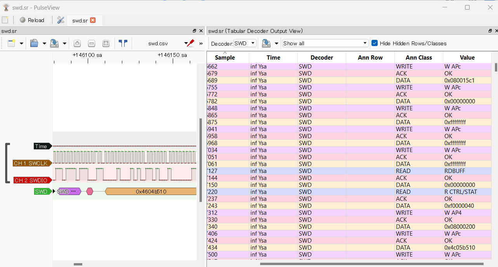

The decoded data can be exported in a text file.
Simply searching for the string "bh{" (62 68 7B in hex) in little-endian (7B6862) reveals the flag in plaintext.

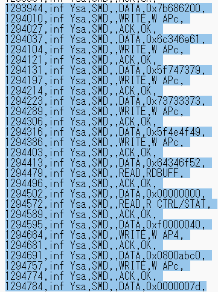
   
Flag: bh{an4lyst_s3ssION_Ro4d}.
	
[FILE] SWD 2 (3 solves)
^^^^^^^^^^^^^^^^^^^^^^^

Intended difficulty: Very Difficult. 
Tags: Forensics, Reverse.	

.. code-block:: text

	The firmware of challenge “SWD 1” broadcasts every second two flags in plaintext over CAN, using the same function. 
	CAN ID 0x12345678 is used to broadcast the (non-obfuscated) flag of "SWD 1".
	The flag of this challenge is the one transmitted with ID 0x7777.
	(Note: Flash starts at 0x08000000, RAM at 0x20000000. Reset_Handler() is at 0x08001570).
	

	
This challenge follows SWD 1.
The first step is to extract the full firmware from the logic analyzer capture. This can be done by looking for “W AP4” commands (which indicate the address), and for “W APc” commands (which indicate the data to write at that address). 
Players must write a script to reconstruct a binary file of the firmware (Code FLASH starts at 0x08000000; data is written in 32-bit little-endian chunks).

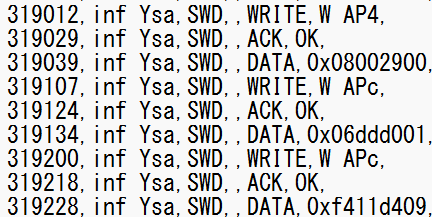

After the firmware file is reconstructed, it can be loaded in Ghidra. Memory map must be set according to prompt for easier analysis.
	
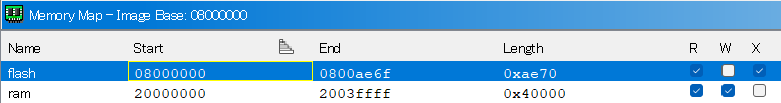
   
Searching for 0x12345678 reveals the function that sends the flags. This can be used to understand that the second flag (when not obfuscated) is located at 0x20030020.	

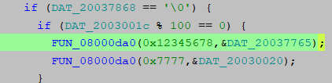

There is only one other reference to 0x20030020 - it can be inferred that this is the function that loads the flag in it.

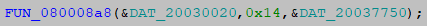
   
This reveals the function that deobfuscates the flag. 

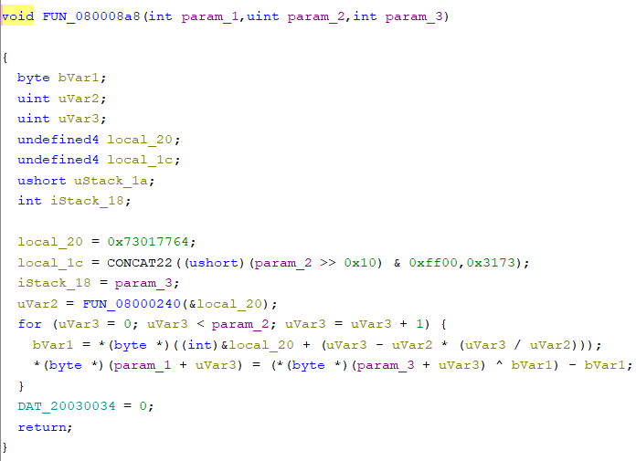
   
Which core part was originally in C:

.. code-block:: C

	uint8_t SECRET_KEY[] = "dw\x01ss1";
	flag_addr[i] = (obfuscated_flag[i] ^ SECRET_KEY[i % key_length]) -  SECRET_KEY[i % key_length];
   
The only remaining step is to identify where the obfuscated flag is.
It is known from previous steps that 0x20037750 is where the obfuscated flag is in RAM.
The challenge prompt provides the location of the Reset_Handler() function:   
   
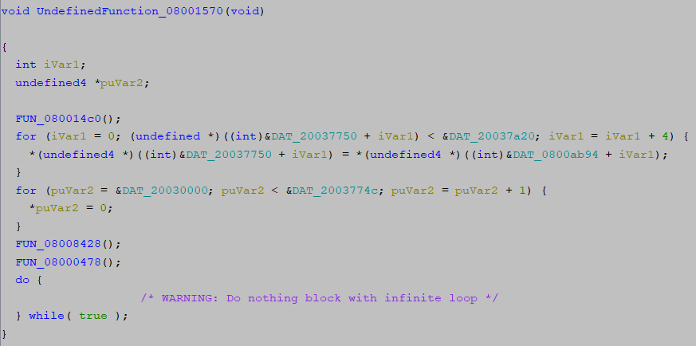

It can be deduced that the RAM default values are loaded from FLASH 0x0800ab94 to RAM 0x20037750 (the obfuscated flag coincidentally happened to be at the first address of the .data section, just before the flag of SWD1):

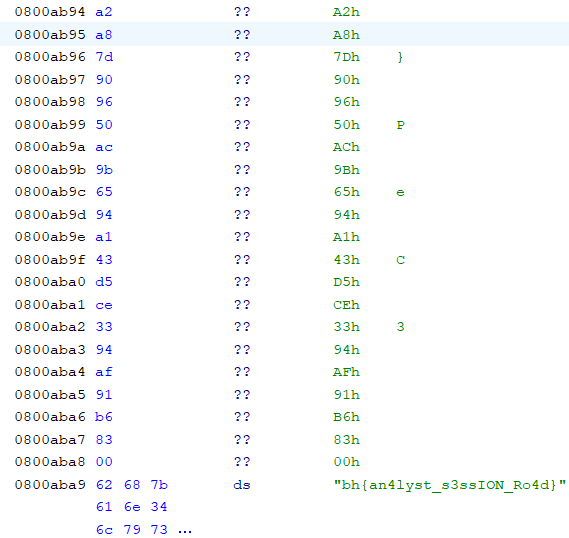

The steps above can be used to deobfuscate the flag as bh{pr0duct_AMB1tion}.

[D] Follow Me (6 solves)
^^^^^^^^^^^^^^^^^^^^^^^^

Intended difficulty: Easy. 
Tags: Hardware.

.. code-block:: text

	ECU D's LEDs are flickering when the engine key is on the “IGN” (rightmost) position. 
	We hope that you brought a logic analyzer to debug that…
	

LEDs are controlled by ECU D's SPI interface, and the SPI signals have clearly marked probes on the Body PCB.
Observing the SPI signal with a logic analyzer shows that ECU D normally updates the status of LEDs every 10 ms.	
	
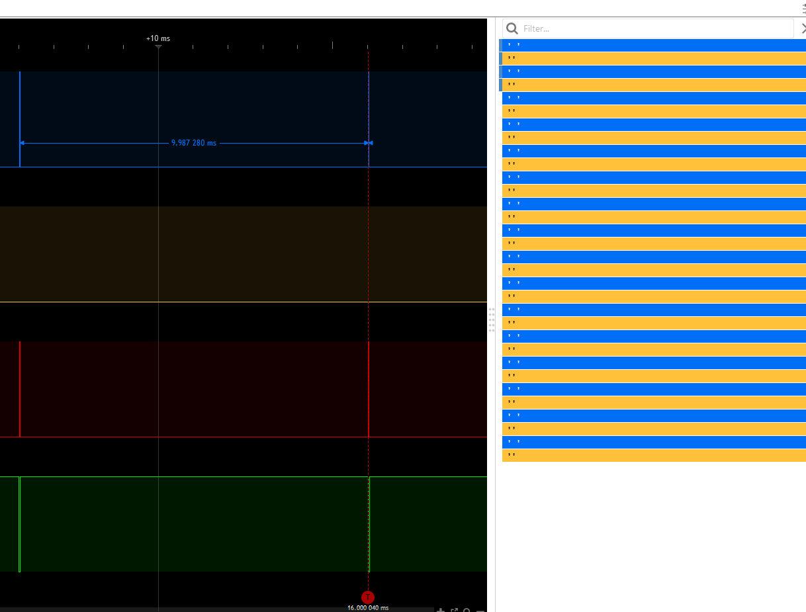
   
When the engine key is on the IGN position, it can be seen that there is a burst of data before the transmission of LED status - which is the flag in plaintext ASCII.

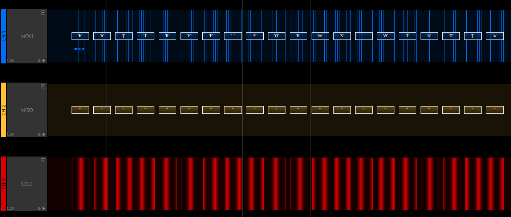

Flag: bh{TREE_FORMS_WIND}.

   
[D] I2C (4 solves)
^^^^^^^^^^^^^^^^^^^

Intended difficulty: Medium. 
Tags: Hardware.

.. code-block:: text

	This flag will be transmitted every second on CAN with ID 0x778
	if you can send any byte to ECU D on its I2C interface (port I2C2, address 0x63).
	Note: I2C pins have internal pull-up resistors. 

This challenge requires the player to read the `STM32L5x2 datasheet <https://www.st.com/resource/en/datasheet/stm32l552cc.pdf>`_ and identify possible pins for the I2C2 port.
	
SDA could be at PF0, PB11, or PB14; SCL could be at PF1, PB10, or PB13.
PB13 is already used by the SPI interface of the "Follow Me" challenge, and PF0/PF1 are not available on the 48-pin package used by RAMN.
This only leaves SDA:PB11/SCL:PB10 and SDA:PB14/SCL:PB10 as possible configurations to try on the board (with the former being the correct one).
This can be attempted with any I2C tool, such as an FT2232H board configured in I2C mode.
	
.. code-block:: python

	from pyftdi.i2c import I2cController

	i2c = I2cController()
	i2c.configure('ftdi://ftdi:2232h/1',frequency=10000)
	slave = i2c.get_port(0x63)
	print(slave.exchange([0xFF], 1))

Which triggers the transmission of the flag.

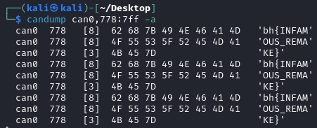
   
Flag: bh{INFAMOUS_REMAKE}.
	
[D] Forgotten Field (4 solves)
^^^^^^^^^^^^^^^^^^^^^^^^^^^^^^

Intended difficulty: Medium/Difficult. 
Tags: CAN, Hardware.

.. code-block:: text

	Many tools consider a CAN frame consists of arbitration, control, and data fields. 
	ID 0x607 thinks they should check some more.

The challenge prompt suggests that there is a "forgotten field" not displayed by most CAN tools such as candump.
A quick look at the CAN page on `Wikipedia <https://en.wikipedia.org/wiki/CAN_bus#/media/File:CAN-bus-frame-with-stuff-bit-and-correct-CRC.png>`_ shows that this is likely a reference to the CRC field (further hinted by the "check some" in the prompt).

The solution is therefore to look at the CRC field of CAN frames with ID 0x607.
The easiest way to do this is by looking at the CAN frames with a logic analyzer (it is easier if you turn off other ECUs, and look at the TX pin of ECU D directly instead of CANH/CANL).
An alternate way to solve this is to reconstruct CAN frames based on the data from candump (note that you must reproduce bit-stuffing before computing the CRC15 of the CAN protocol).

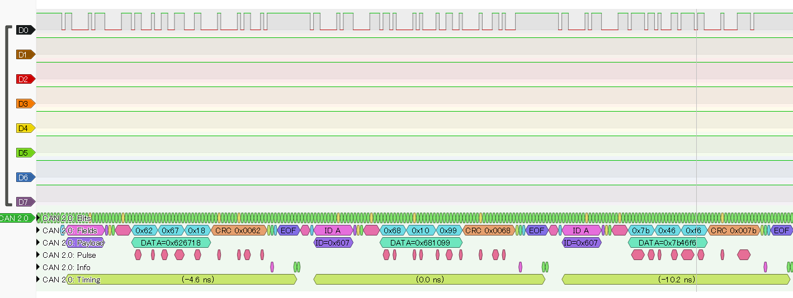
   
The flag is simply the CRC of the CAN frames (one byte per frame): bh{LAGGING_BEHIND}.  

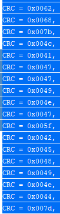
 
	
[C] CVE-2017-14937 (4 solves)
^^^^^^^^^^^^^^^^^^^^^^^^^^^^^

Intended difficulty: Easy. 
Tags: CAN, Hardware.

.. code-block:: text

	Go write something at 0x1111 and read something at 0x0000.
	
As the title implies, this challenge is a simple reproduction of CVE-2017-14937. CVE-2017-14937 details how the ECU's Security Access service can be used to unlock the ECU.
Once the ECU is unlocked, the player only needs to use the WriteDataByIdentifier service to write any data at DID 0x1111, which will allow them to read the flag using the ReadDataByIdentifier service with DID 0x0000.

Detailed participant write up available `here <https://laysakura.github.io/2024/10/24/automotive-ctf-2024-world-final/#c-cve-2017-14937>`_.

Flag: bh{SUP3RS0NIc}.
	
[B] Rush Hour (3 solves)
^^^^^^^^^^^^^^^^^^^^^^^^

Intended difficulty: Medium. 
Tags: CAN, Hardware.

.. code-block:: text

	We added a UDS disable feature to ECU B to prevent you from reading the flag. 
	Note: Flag is redacted in attached firmware - you must extract the flag from an actual RAMN board.
	
This challenge provides ECU B's firmware (with a redacted flag) as an attachment. The firmware is in .elf format, with debug symbols, making it easy to reverse engineer.
(Another reason to provide the firmware in .elf format was to make it easier to know correct Ghidra settings for challenges where only a .hex file was provided).

Searching for the flag reveals that it can be read using the ReadDataByIdentifier UDS service with DID 0x0001 (appearing as 0x100 in Ghidra because of ARM32's endianness).
	
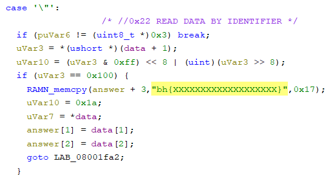
	
However, as specified in the challenge prompt, there is a global variable UDS_ENABLE that prevents the player from using UDS when it is set to 0.
	
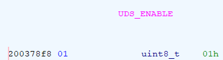
	
The player should notice that the default value of this variable is 1 (meaning UDS is available) but that it is set to 0 during boot.	
	
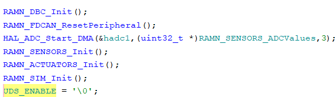
		
Because it is set to 0 AFTER the CAN peripheral has been activated, there is a 10 ms window during which UDS can be used.
The solution is therefore to spam the request while the ECU is booting.

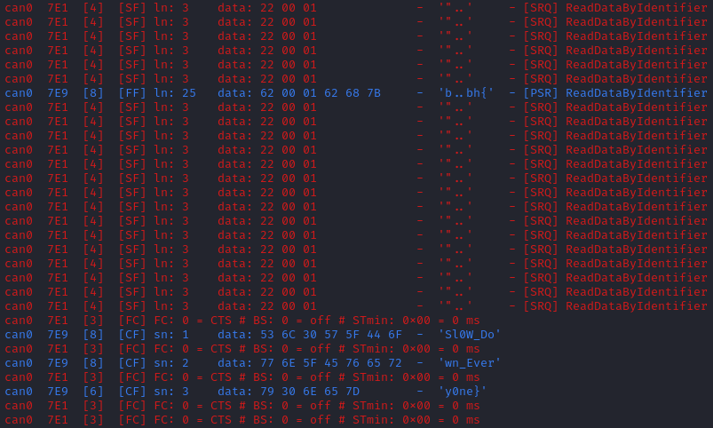
		
Flag: bh{Sl0W_Down_Every0ne}.
	
[A] slcan’t (2 solves)
^^^^^^^^^^^^^^^^^^^^^^

Intended difficulty: Medium. 
Tags: CAN, USB.

.. code-block:: text

	Why does ramn_utils.c need such a large ascii_hashmap? 
	We could use all those unused bytes to store a flag instead…

The table ascii_hashmap in ramn_utils.c (which code is available on github) is used to convert ASCII hexadecimal strings to bytes. 
Because hexadecimal characters only consist of "0 to 9", "A to F", and "a to f", the table is mostly filled with 0x00.

.. code-block:: C

	static const uint8_t ascii_hashmap[] =
	{
			0x00, 0x00, 0x00, 0x00, 0x00, 0x00, 0x00, 0x00, // ........
			0x00, 0x00, 0x00, 0x00, 0x00, 0x00, 0x00, 0x00, // ........
			0x00, 0x00, 0x00, 0x00, 0x00, 0x00, 0x00, 0x00, // ........
			0x00, 0x00, 0x00, 0x00, 0x00, 0x00, 0x00, 0x00, // ........
			0x00, 0x00, 0x00, 0x00, 0x00, 0x00, 0x00, 0x00, //  !"#$%&'
			0x00, 0x00, 0x00, 0x00, 0x00, 0x00, 0x00, 0x00, // ()*+,-./
			0x00, 0x01, 0x02, 0x03, 0x04, 0x05, 0x06, 0x07, // 01234567
			0x08, 0x09, 0x00, 0x00, 0x00, 0x00, 0x00, 0x00, // 89:;<=>?
			0x00, 0x0a, 0x0b, 0x0c, 0x0d, 0x0e, 0x0f, 0x00, // @ABCDEFG
			0x00, 0x00, 0x00, 0x00, 0x00, 0x00, 0x00, 0x00, // HIJKLMNO
			0x00, 0x00, 0x00, 0x00, 0x00, 0x00, 0x00, 0x00, // PQRSTUVW
			0x00, 0x00, 0x00, 0x00, 0x00, 0x00, 0x00, 0x00, // XYZ[\]^_
			0x00, 0x0a, 0x0b, 0x0c, 0x0d, 0x0e, 0x0f, 0x00, // `abcdefg
			0x00, 0x00, 0x00, 0x00, 0x00, 0x00, 0x00, 0x00, // hijklmno
			0x00, 0x00, 0x00, 0x00, 0x00, 0x00, 0x00, 0x00, // pqrstuvw
			0x00, 0x00, 0x00, 0x00, 0x00, 0x00, 0x00, 0x00, // xyz{|}~.
			0x00, 0x00, 0x00, 0x00, 0x00, 0x00, 0x00, 0x00, // ........
			0x00, 0x00, 0x00, 0x00, 0x00, 0x00, 0x00, 0x00, // ........
			0x00, 0x00, 0x00, 0x00, 0x00, 0x00, 0x00, 0x00, // ........
			0x00, 0x00, 0x00, 0x00, 0x00, 0x00, 0x00, 0x00, // ........
			0x00, 0x00, 0x00, 0x00, 0x00, 0x00, 0x00, 0x00, // ........
			0x00, 0x00, 0x00, 0x00, 0x00, 0x00, 0x00, 0x00, // ........
			0x00, 0x00, 0x00, 0x00, 0x00, 0x00, 0x00, 0x00, // ........
			0x00, 0x00, 0x00, 0x00, 0x00, 0x00, 0x00, 0x00, // ........
			0x00, 0x00, 0x00, 0x00, 0x00, 0x00, 0x00, 0x00, // ........
			0x00, 0x00, 0x00, 0x00, 0x00, 0x00, 0x00, 0x00, // ........
			0x00, 0x00, 0x00, 0x00, 0x00, 0x00, 0x00, 0x00, // ........
			0x00, 0x00, 0x00, 0x00, 0x00, 0x00, 0x00, 0x00, // ........
			0x00, 0x00, 0x00, 0x00, 0x00, 0x00, 0x00, 0x00, // ........
			0x00, 0x00, 0x00, 0x00, 0x00, 0x00, 0x00, 0x00, // ........
			0x00, 0x00, 0x00, 0x00, 0x00, 0x00, 0x00, 0x00, // ........
			0x00, 0x00, 0x00, 0x00, 0x00, 0x00, 0x00, 0x00  // ........
	};
	
	inline uint8_t ASCIItoUint8(const uint8_t* src)
	{
		return (ascii_hashmap[src[0]] << 4) + (ascii_hashmap[src[1]]);
	}
	

The challenge prompt suggests that the flag is located in that table.
Reading the source code shows that ASCIItoUint8 is used by the 't' command of the `slcan protocol <https://www.lawicel.com/can232/can232_v1.pdf>`_ when requesting the transmission of a CAN message using the slcan interface.

.. code-block:: C

	CANTxData[i++] = ASCIItoUint8(&USBRxBuffer[offset]);

The format of a transmit slcan command is t<id><dlc><data>.
A simple method to dump one byte from the table is to execute the slcan command t00210<index> to force ECU A to transmit the byte at <index> with CAN ID 0x002.
By repeating this command and observing the CAN bus at the same time (from an external CAN adapter), we can dump the entirety of the table - in which the flag is located.	
	

.. code-block:: python

	for i in range(0x100):
		command = bytes('t00210'.encode()) + (bytes([i])) + bytes('\r'.encode())
		ser.write(command)
		
.. code-block:: bash

	python -m can.logger -i pcan -c PCAN_USBBUS1 --filter 0x002:0x7FF

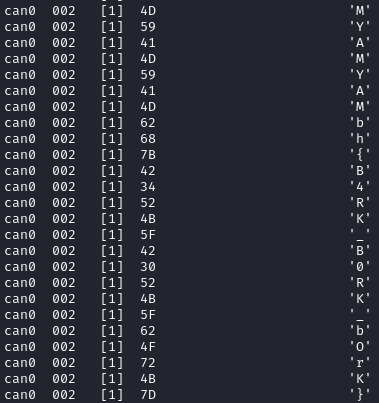
	
Flag: bh{B4RK_B0RK_bOrK}.

[C] DID not done (2 solves)
^^^^^^^^^^^^^^^^^^^^^^^^^^^

Intended difficulty: Medium/Difficult. 
Tags: UDS.

.. code-block:: text

	Flag is a 26-byte string at 0x0803e000 but Read Memory By Address won't let me read it :(

The challenge prompt gives the address and size of the flag.
Scanning the UDS services of ECU C reveals that the service DynamicallyDefineDataIdentifier is active.
This service can therefore be used to define a dynamic DID (which should be in the 0xF300-0xF3FF range according to UDS standard) at 0x0803e000 (with size 26).
The flag can then be obtained by reading that DID using ReadDataByIdentifier.

.. code-block:: bash   
   
   echo "2c 02 F3 00 14 08 03 e0 00 1A" | isotpsend can0 -s 7e2 -d 7ea 	
   echo "22 F3 00" | isotpsend can0 -s 7e2 -d 7ea 

Flag: bh{TAKE_THE_LONG_WAY_HOME}.
	
Participant `write-up available here <https://laysakura.github.io/2024/10/24/automotive-ctf-2024-world-final/#c-did-not-done>`_.

[A/C] Ramen Clicker (1 solve)
^^^^^^^^^^^^^^^^^^^^^^^^^^^^^

Intended difficulty: Medium/Difficulty. 
Tags: CAN, Hardware.

.. code-block:: text

	My high score is 0x9000.

The screen displays a "Ramen clicker" game, which counts up each time the SHIFT joystick is center-pressed.
The prompt suggests that the flag is displayed if the counter goes over 0x9000.

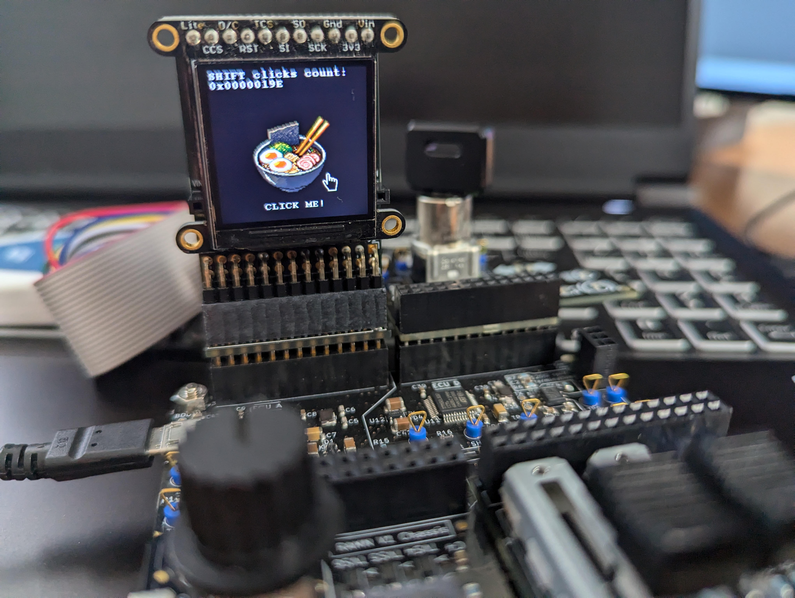
   
By observing the CAN bus, it can be observed that there is no authentication between ECU A and ECU C, therefore it is trivial to spoof the state of the joystick.
Using cansniffer, we can observe that 045#0106 corresponds to "joystick pressed" and 045#0101 corresponds to "joystick released" (first byte corresponds to gear status and can be ignored).

Trying to spoof these messages will however trigger the following screen:

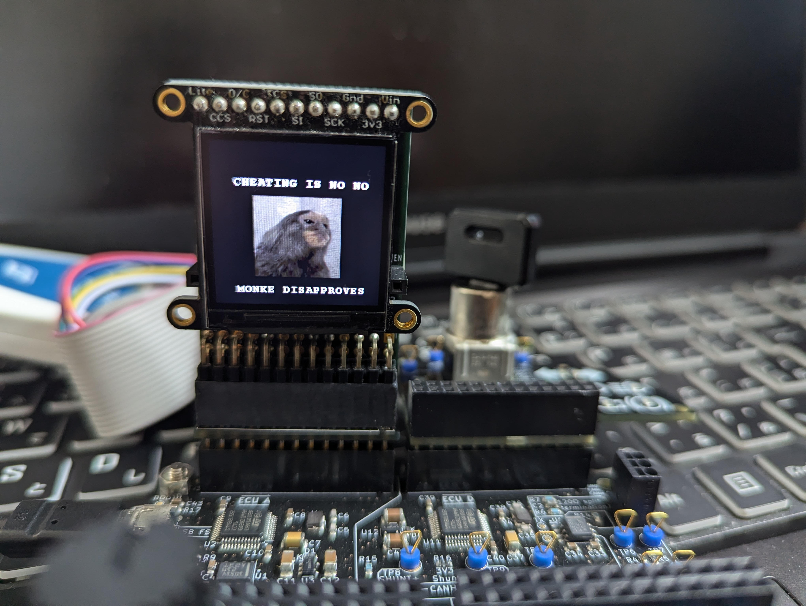
  
The anti-cheat system is not punishing, and the game can be restarted without a power reset.
Because the firmware isn't provided, it is not clear what triggers the anti-cheat system.
However, because there is no proper authentication, we know that it should be possible to impersonate ECU C, as long as the impersonation is not obvious.

The first step is to exclude ECU C (normally transmitting the joystick messages) from the CAN bus, which can be done for example by:

- Using the expansion header of ECU C to short the reset pin (21) to the ground pin (4) (jumping wires were provided for that purpose).
- Using the USB serial interface to shut down ECU's C power supply.

After that, the player can just send 045#0106 and 045#0101 to increment clicks.

Note: The anti-cheat system is triggered when ECU A does not receive a message with CAN ID 045 for more than 500 ms, or when ECU A receives a message with ID 001 (ECU C sends a message with ID 001 to warn ECU A when it itself receives a message with ID 045 and therefore knows that someone is cheating). There is no message frequency checking.
It is not necessary to know these exact conditions, the player only needs to attempt a relatively clean transition between normal traffic and compromised traffic.

.. code-block:: bash

	#Turn off ECU C or hold it in reset mode, then immediately execute
	timeout 1000s bash -c 'while [ $SECONDS -lt 1000 ]; \
	do \
	cansend can0 045#0106; \
	cansend can0 045#0101; \
	done'

An alternative solution is to physically press the button 0x9000 times.

Flag: bh{N1NN1KUM4SHIMA5HI}.
	
	
[D] Security Access 1 (1 solve)
^^^^^^^^^^^^^^^^^^^^^^^^^^^^^^^

Intended difficulty: Very Difficult. 
Tags: Reverse, UDS, Hardware.

.. code-block:: text

	The attached file corresponds to the firmware of ECU D, with all its flags redacted.
	Try to extract the real value of bh{XXXXXXXXXXXXXXXXXXX} from your RAMN hardware.

The attached file is a .hex file, with no debug symbols and therefore a bit difficult to reverse engineer.
The .hex file is common for challenges "Security Access 1" and "Security Access 2".
A superficial analysis with Ghidra (loaded in ARM v8 LE mode) reveals that, as the title suggests, flags can be read with ReadDataByIdentifier (DID 0x0001 and DID 0x0002) after Security Access is performed (for levels 0x01 and 0x03, respectively).

Following references leads us to the Security Access algorithm.

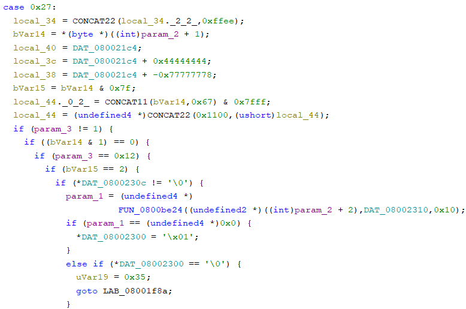

Security Access check for "Security Access 1" is performed by FUN_0900be24, which can be identified as "memcmp" by AI tools such as ChatGPT.
We can conclude that 08002310h is where the address of the expected 16-byte (static) password is.

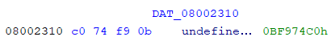
   
08002310h contains 0BF974C0h, but that address cannot be found in the firmware file.

Based on the address map of the `reference manual <https://www.st.com/resource/en/reference_manual/dm00346336-stm32l552xx-and-stm32l562xx-advanced-arm-based-32-bit-mcus-stmicroelectronics.pdf>`_, we can observe that 0BF974C0h is in the System memory bootloader area (in ROM). 
The trick is to identify that this value is in system memory and is therefore common to all STM32L552 microcontrollers (at least from the same batch), so it can be read from another ECU. Therefore, the password could be read:

- By using the ReadMemoryByAddress UDS Service of ECU C (which is not disabled, contrary to ECU D).
- By using one of the many memory dump methods (UDS, FDCAN Bootloader, JTAG, etc.) of an unlocked RAMN with standard firmware (which was made available to participants).

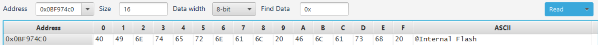
   
.. code-block:: bash   
   
   echo "27 01" | isotpsend can0 -s 7e3 -d 7eb
   echo "27 02 40 49 6E 74 65 72 6E 61 6C 20 46 6C 61 73 68 20"  | isotpsend can0 -s 7e3 -d 7eb
   echo "22 00 01"  | isotpsend can0 -s 7e3 -d 7eb
   
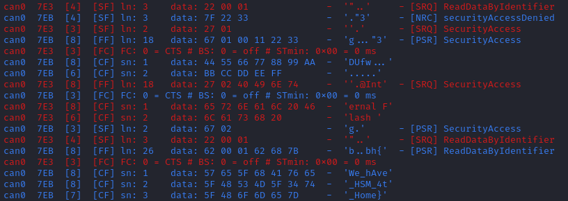
   
Flag: bh{We_hAve_HSM_4t_Home}.

[D] Security Access 2 (1 solve)
^^^^^^^^^^^^^^^^^^^^^^^^^^^^^^^

Intended difficulty: Very Difficult. 
Tags: Reverse, UDS.

.. code-block:: text

	Same as “Security Access 1”, but you are looking for bh{YYYYYYYYYYYYYYYYYYY}.

Following the same steps as "Security Access 1", we can identify the function that checks the password.

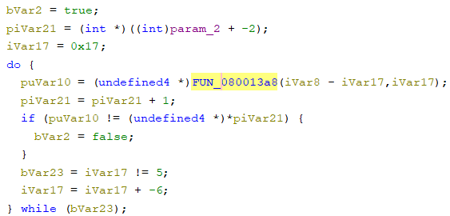

This function compares the provided password to four 32-bit values, based on a function that uses as a parameter the strings "HAPPY HAPPY HAPPY HAPPY", "HAPPY HAPPY HAPPY", "HAPPY HAPPY", and "HAPPY" (with their respective size).

Following references, and with help from ChatGPT, we can identify that:

- FUN_080013a8 function reads from 080013b8h (which value is 20032A14h).
- 20032A14h is initialized by FUN_0800139c with parameter 20032820h.
- 20032820h is loaded from 08000c64h, which value is 40023000h.

Therefore, the password is read in 32-bit chunks from 40023000h. Reading the `reference manual <https://www.st.com/resource/en/reference_manual/dm00346336-stm32l552xx-and-stm32l562xx-advanced-arm-based-32-bit-mcus-stmicroelectronics.pdf>`_ again, we can identify that this address corresponds to a Special Function Register of the CRC engine peripheral.
Although we could follow references to reverse engineer the parameters of the engine (initialized at FUN_08003580), there is no attempt limits, therefore we can also simply try all common CRC32 algorithms (with different endianness).

We can use https://crccalc.com/ with the default STM32 CRC engine algorithm (CRC-32/MPEG-2), which gives us 0x14b311c9, 0x6442CA33, 0xC25DE077, and 0x6DA5F0C1, and corresponds to the correct password.

.. code-block:: bash   
   
    echo "27 03" | isotpsend can0 -s 7e3 -d 7eb
    echo "27 04 C9 11 B3 14 33 CA 42 64 77 E0 5D C2 C1 F0 A5 6D" | isotpsend can0 -s 7e3 -d 7eb
    echo "22 00 02"  | isotpsend can0 -s 7e3 -d 7eb

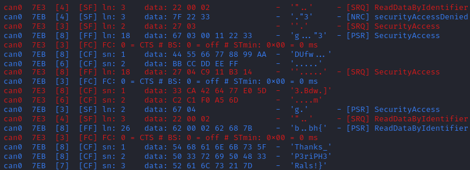

Flag: bh{Thanks_P3riPH3Rals!}.

 