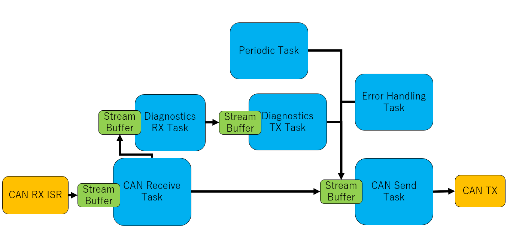
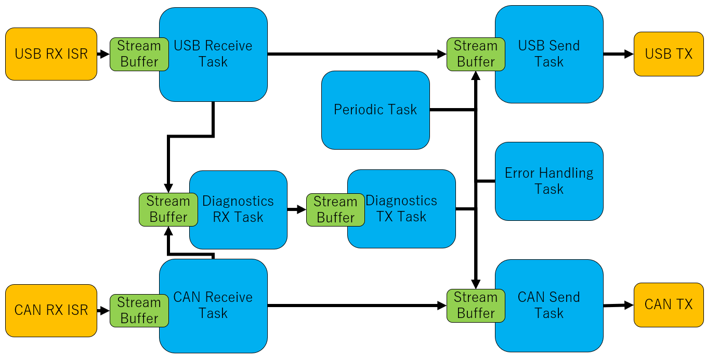

Firmware Architecture
=====================

ECU A, B, C and D share a common architecture, with the exception that ECU A also has USB enabled. In this page, we detail the architecture of the firmware for each ECU, starting with the simpler ECU B,C and D.

ECU B, C and D
--------------

Firmware of ECU B, C and D contains six tasks:

- The CAN Receive Task, which receives and processes CAN(-FD) message through a `Stream Buffer <https://www.freertos.org/RTOS-stream-buffer-example.html>`_ filled by the CAN-FD peripheral Interrupt Service Routine (ISR).
- The Diag RX Task, which receives and process full (reconstructed) diagnostic messages through a `Stream Buffer <https://www.freertos.org/RTOS-stream-buffer-example.html>`_ filled by the CAN Receive Task.
- The Periodic Task, which is executed periodically at a specified interval (typically, 10ms). It is responsible for updating various modules of the firmware. Periodic CAN messages are requested by this task.
- The Diag TX Task, which is responsible of de-constructing and sending diagnostic messages, with specified Flow Control settings.
- The CAN Send Task, which is responsible of sending CAN(-FD) messages requested through a `Stream Buffer <https://www.freertos.org/RTOS-stream-buffer-example.html>`_. Messages may be requested by any other task that needs to communicate over CAN.
- The Error Handling Task, which is woken up when an error needs to be processed and reported.

	Architecture of firmware of ECU B, C and D.

ECU A
-----

Firmware of ECU A is identical to ECU B,C and D, but with two additional tasks:

- The USB Receive Task, which receives USB commands and processes them
- The USB Send Task, which sends requested data (again, through a `Stream Buffer <https://www.freertos.org/RTOS-stream-buffer-example.html>`_) over USB.

With ECU A, Diagnostics may also be sent over USB instead of CAN(-FD).

   Architecture of firmware of ECU A.

