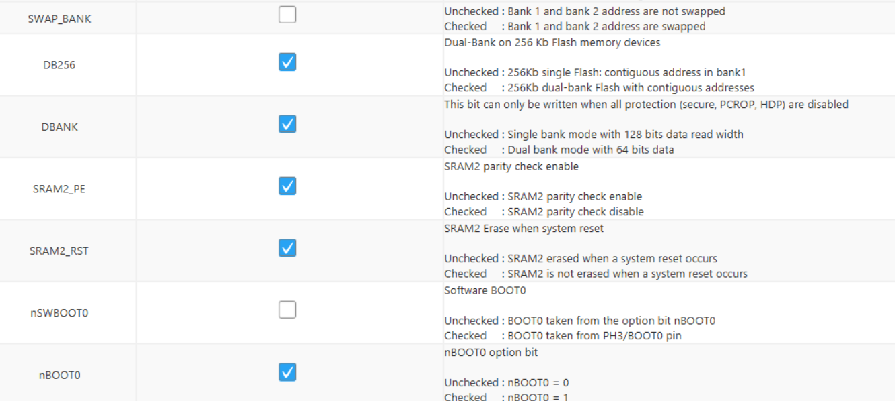

.. _common_issues:

Troubleshooting
===============

This page contains common troubleshooting approaches for RAMN, mostly to address reflashing and debugging issues.

.. _optionbyte_check:

Expected Option Bytes
---------------------

If you have trouble reprogramming or debugging RAMN, use STM32CubeProgrammer to make sure that the option bytes are as below. 
**Configurations are different for ECU A, and for ECU B/C/D.**

**Correct configuration for ECU A Option Bytes**:

**Correct configuration for ECU B/C/D Option Bytes**:

.. figure:: img/OptionBytes_ECUBCD.png

**SWAP_BANK** and **DBANK** may be modified when you use UDS reprogramming, but if you are encountering issues, try reverting to the default settings.

The **RDP Option Byte** should be set to **0xAA** to make sure that no memory protection is enabled.

After resetting option bytes, you may need to reflash the firmware again.

Failed Debugging
----------------

If you encounter debugging issues with STM32CubeIDE, but you are certain that the JTAG connections are correct (e.g., you can connect using STM32CubeProgrammer), try deleting ``RAMNV1 Debug.launch`` and start from a fresh debugging configuration (see :ref:`debugging_RAMN`). 

.. _inconsistent_protection:

Inconsistent Memory Protection
------------------------------

You can use the STM32 bootloader to enable memory read and memory write protections. Similarly, you can modify the RDP option byte to enable/disable memory protection.

Problems may arise if you enabled protection with one method, and removed it with another (e.g., if you enabled write protection using the STM32 bootloader, and removed read protection later with JTAG).
The microcontroller may appear as if it is unlocked, but will actually refuse firmware reprogramming or debugging.

If you suspect this issue (because you used memory protection in the past), try running both the "read unlock" and "write unlock" commands using the canboot.py script in the `scripts/STBootloader` folder.
**If your memory protection was inconsistent, those commands may return an error even though they actually succeeded.**

For example, for ECU B:

.. code-block:: powershell

	python canboot.py AUTO B -ru
	python canboot.py AUTO B -wu

Failed Reprogramming over CAN
-----------------------------

If reprogramming over CAN fails, it may be caused by an external CAN adapter that is actively destroying the traffic with error frames (because it does not perform a required baud rate change).
**Before reprogramming over CAN, make sure external CAN adapters are turned off and/or unplugged.**

DFU Issues
----------

The `DfuSe tool <https://www.st.com/en/development-tools/stsw-stm32080.html>`_ from STMicroelectronics can be used to program ECU A over USB (when ECU A is in DFU mode).
If ECU A is recognized as "DFU in FS Mode" over USB by Windows, but device information are "Unknown" or "Unavailable", you may need to separately install STM32 DFU drivers, which are located in the DFuse installation folder, for example:

:file:`C:\\Program Files (x86)\\STMicroelectronics\\Software\\DfuSe v3.0.6\\Bin\\Driver`
