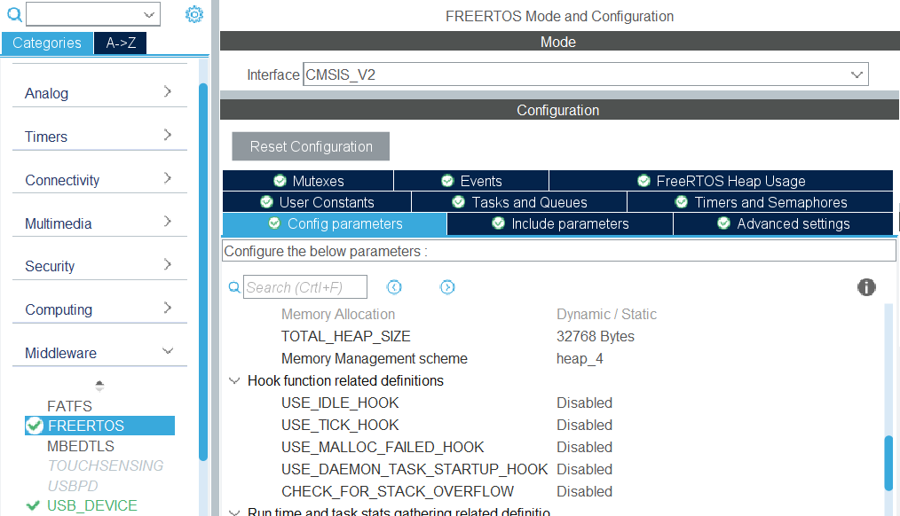

.. _common_issues:

Common issues with firmware
===========================

The STM32L5 microcontrollers used in RAMN are rather new and many quirks need to be addressed. This page attempts to give some pointers to fix issues with firmware.

Firmware Troubleshooting Guide
------------------------------

If your firmware has unexpected behavior, you may want to check all items in this section.

Check Option Bytes
******************

The **BOOT0** pin of RAMN's hardware is pulled-up, so that ECU A will start in DFU mode when the microcontroller is unprogrammed.
One side effect is that it may cause the interrupt vector table to be improperly configured when executing user code. Concretely, this will result in the Systick timer keeping a value of zero and never increasing.

Additionally, the **SWAP_BANK** option byte should be unchecked, or it will prevent reprogramming/debugging with ST-LINK.

.. warning:: Even when using an external JTAG debugger, the **nSWBOOT0**, **nBOOT0** and **SWAP_BANK** Option bytes need to be correctly configured.

   - ECU A: SWAP_BANK unchecked, nSWBOOT0 unchecked, nBOOT0 checked.
   - ECU B,C,D: SWAP_BANK unchecked, nSWBOOT0 checked, nBOOT0 checked.

.. figure:: img/OptionBytes_ECUA.png

   Correct configuration for BOOT option bytes of ECU A.

.. figure:: img/OptionBytes_ECUBCD.png

   Correct configuration for BOOT option bytes of ECU B, C, and D.   
  
.. warning:: the `ST-LINK Utility <https://www.st.com/en/development-tools/stsw-link004.html>`_, which can be used to overwrite option bytes of the STM32L4 microcontrollers, does not work with STM32L5. Instead, use `STM32Cubeprog <https://www.st.com/en/development-tools/stm32cubeprog.html>`_.
  

  
Check Linker Settings
*********************

The default project template of `STM32CubeIDE <https://www.st.com/en/development-tools/stm32cubeide.html>`_ comes with very restricted memory settings. Increasing the Minimum Heap Size and Minimum Stack Size may solve your issues.

.. warning:: When using STM32CubeIDE, do not overwrite the linker file (STM32L552CETX_FLASH.ld) manually. Open the .ioc file, Go to the "Project Manager" Tab , and find the Linker Settings in the Advanced Settings.

   Linker settings in the "Project Manager" tab.
  

Increase RTOS memory
********************

Issues can often be resolved simply by increasing the memory allocated to RTOS. Especially, try to incrase:

* TOTAL_HEAP_SIZE
* MINIMAL_STACK_SIZE  

   freeRTOS settings in STM32CubeIDE.

Verify Interrupt Table
**********************

STM32CubeIDE does not enable required automatically when adding or removing peripherals. Double-check necessary interrupts have been enabled in the NVIC section.

.. figure:: img/nvic_settings.png

   NVIC settings in STM32CubeIDE.
   
   
DFU Issues
----------

The `DfuSe tool <https://www.st.com/en/development-tools/stsw-stm32080.html>`_ from STMicroelectronics can be used to program ECU A over USB.
If ECU A is recognized as "DFU in FS Mode" over USB by Windows, but device information are "Unknown" or "Unavailable", you may need to separately install STM32 DFU drivers, which are located in the DFuse installation folder, for example:

:file:`C:\\Program Files (x86)\\STMicroelectronics\\Software\\DfuSe v3.0.6\\Bin\\Driver`

Failed reprogramming over CAN
-----------------------------

When ECUs are reprogrammed over CAN, it is possible that the CAN bitrate changes from the usual bitrate. If reprogramming over CAN fails, it may be caused by an external CAN adapter that has been left open, and is actively destroying the traffic with error frames (because it is still functioning with the original bitrate, and fails to understand the frames with a different bitrate.
Before reprogramming over CAN, make sure external CAN adapters are turned off and/or unplugged.

STM32CubeIDE
------------

.. warning:: Be careful when using STM32CubeIDE:

	* A frequent bug happens when the whole source code is deleted. Make manual backups regularly.
	* Do not overwrite code outside the :code:`USER CODE BEGIN` and :code:`USER CODE END` comments.
	* Do not change the name of tasks - the whole task function body will be deleted.
	  

