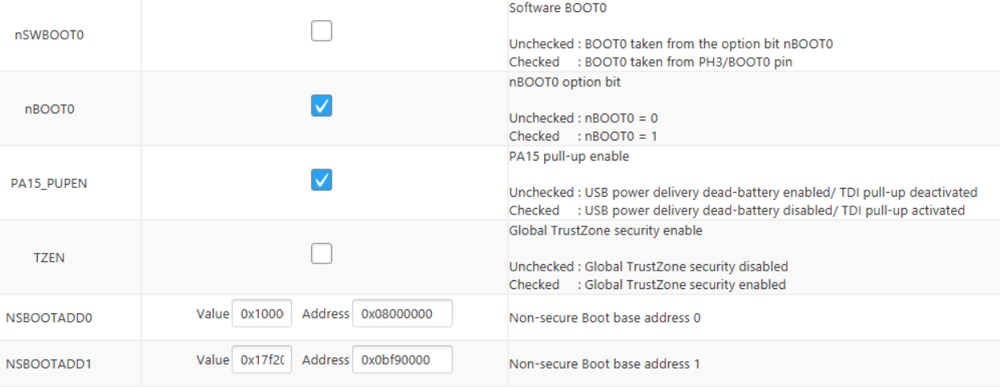

.. _common_issues:

Common issues with firmware
===========================

The STM32L5 microcontrollers used in RAMN are rather new and many quirks need to be addressed. This page attempts to give some pointers to fix issues with firmware.

Firmware Troubleshooting Guide
------------------------------

If your firmware has unexpected behavior, you may want to check all items in this section.

Check Option Bytes
******************

The BOOT0 pin of RAMN's hardware is pulled-up, so that ECU A will start in DFU mode when the microcontroller is unprogrammed.
One side effect is that it may cause the interrupt vector table to be improperly configured when executing user code. Concretely, this will result in the Systick timer keeping a value of zero and never increasing.

.. warning:: Even when using an external JTAG debugger, the BOOT Option bytes need to be correctly configured.

   Correct configuration for BOOT option bytes.
   
  
.. warning:: the `ST-LINK Utility <https://www.st.com/en/development-tools/stsw-link004.html>`_, which can be used to overwrite option bytes of the STM32L4 microcontrollers, does not work with STM32L5. Instead, use `STM32Cubeprog <https://www.st.com/en/development-tools/stm32cubeprog.html>`_.
  
  
Check Link Settings
*******************

The default project template of `STM32CubeIDE <https://www.st.com/en/development-tools/stm32cubeide.html>`_ comes with very restricted memory settings. Increasing the Minimum Heap Size and Minimum Stack Size may solve your issues.

.. warning:: When using STM32CubeIDE, do not overwrite the linker file (STM32L552CETX_FLASH.ld) manually. Open the .ioc file, Go to the "Project Manager" Tab , and find the Linker Settings in the Advanced Settings.

.. figure:: img/linker_settings.png

   Linker settings in the "Project Manager" tab.
  

Increase RTOS memory
********************

Issues can often be resolved simply by increasing the memory allocated to RTOS. Especially, try to incrase:

* TOTAL_HEAP_SIZE
* MINIMAL_STACK_SIZE  

.. figure:: img/freertos_settings.png

   freeRTOS settings in STM32CubeIDE.

Verify Interrupt Table
**********************

STM32CubeIDE does not enable required automatically when adding or removing peripherals. Double-check necessary interrupts have been enabled in the NVIC section.

.. figure:: img/nvic_settings.png

   NVIC settings in STM32CubeIDE.
   
   
DFU Issues
----------

The `DfuSe tool <https://www.st.com/en/development-tools/stsw-stm32080.html>`_ from STMicroelectronics can be used to program ECU A over USB.
If ECU A is recognized as "DFU in FS Mode" over USB by Windows, but device information are "Unknown" or "Unavailable", you may need to separately install STM32 DFU drivers, which are located in the DFuse installation folder, for example:

:file:`C:\\Program Files (x86)\\STMicroelectronics\\Software\\DfuSe v3.0.6\\Bin\\Driver`
  

