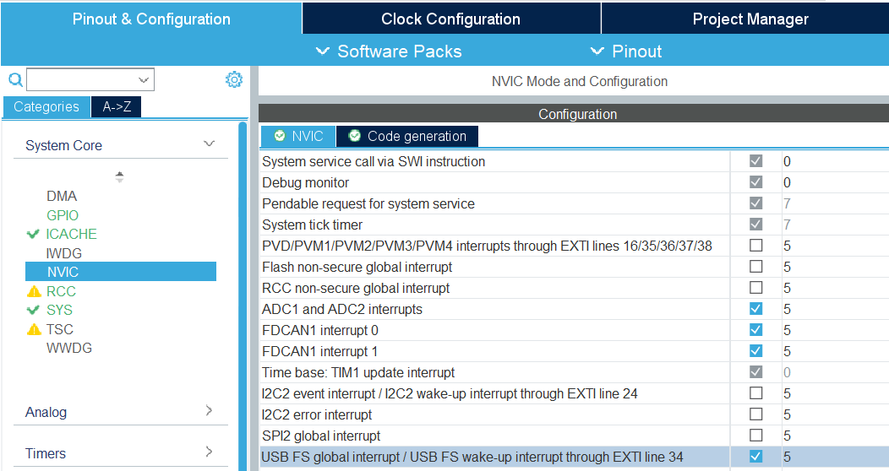
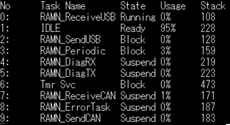

.. _customizing_guide:

Customizing Guide
=================

This page contains information on how to customize RAMN, and guidance on implementing some projects (e.g., adding a custom bootloader, adding message authentication, etc.).
If you want to learn what you can do with the default firmware, check the :ref:`quickstart_guide` or :ref:`userguide`.

**Summary:**

- All ECUs share the same source code, only their configuration differ (either ``#define TARGET_ECUA``, ``#define TARGET_ECUB``, ``#define TARGET_ECUC``, or ``#define TARGET_ECUD``).
- ``ramn_config.h`` holds the current configuration, ``ramn_customize.c`` provides hooks to common functions (e.g., a function that is called when a CAN message is received).
- When you add new CAN identifiers to the network, you need to update CAN filters (both standard and extended), or disable filters entirely.
- CAN peripherals are configured in CAN-FD mode but only use classic CAN messages. You can change the default traffic to CAN-FD following instructions on this page.
- You have a total of 256kB RAM, and either 256kB or 512kB Flash. If you run out of memory, you can reduce the size of CAN and USB buffers, enable compiler optimizations, or remove unused features (in ``ramn_config.h``).
- If you use STM32 code generation (i.e., if you modify ``RAMNV1.ioc``) be careful not to let it overwrite your own code.

RAMN is a regular STM32 project made with STM32CubeIDE, and based on HAL and FreeRTOS, for STM32L552 and STM32L562 microcontrollers.
If you need information not present on this page, you can always search the Internet for general STM32, HAL, and FreeRTOS resources.

**Content:**

.. contents::
   :depth: 3
   :local:

Modifying RAMN Firmware
-----------------------

The RAMN firmware is built with the GCC toolchain.
Although you are free to use any IDE you like, it is recommended that you install the most recent `STM32CubeIDE <https://www.st.com/en/development-tools/stm32cubeide.html>`_ from STMicroelectronics' website.

You can download RAMN's source code from `the Github repository <https://github.com/ToyotaInfoTech/RAMN>`_ (click "Code" then "Download ZIP").
The source code is in the `firmware/RAMNV1` folder.

After installing STM32CubeIDE, open it, create or open a workspace, then select "File" > "Import..." > "Existing Projects into Workspace", then select the path where `firmware/RAMNV1` is located.
Click "Next", then import the project with the default settings by clicking "Finish".

This will make the RAMN project available in your workspace.
The source code is the same for all ECUs:

- ECU A firmware is built with the ``TARGET_ECUA`` flag.
- ECU B firmware is built with the ``TARGET_ECUB`` flag.
- ECU C firmware is built with the ``TARGET_ECUC`` flag.
- ECU D firmware is built with the ``TARGET_ECUD`` flag.

You can change the default target ECU by modifying ``ramn_config.h`` and replacing ``#define TARGET_ECUA`` with your target.

**When you modify the source code, the modifications will apply to all ECUs**.
To write code specific to a single ECU, use ``#ifdef`` and ``endif`` preprocessor directives around it.
For example, to apply modifications only to ECU A:

.. code-block:: C

	#ifdef TARGET_ECUA
	// Code executed by ECU A
	#else
	// Code executed by ECU B, C, and D
	#endif

Alternatively, you can maintain four separate copies of the source code, allowing each ECU to have its own independent source code and reducing the risk of accidental modifications.

To build the firmware for the default target ECU that you defined in ``ramn_config.h``, select "Project" > "Build Project", or press the hammer icon. 
Firmware binary files (.elf, .bin, .hex), as well as debug information files (.list, .map), will be located in the `RAMNV1/Debug` folder.

Useful shortcuts:

- Use **Control+H** to search for strings (e.g., variables and functions mentioned in this page).
- Use **Control+Tab** to switch between source files and header files.
- Press **Control** and click a function name to go to its definition.
- Press **Alt+Left** to go back.
- To find where a variable or function is used, right click on it and select **"References"** > **"Project"**.

.. warning:: When changing the target ECU, STM32CubeIDE may take time to update references and may have trouble searching the project. 
	To avoid this issue, after changing the target ECU, you should select **"Project"** > **"C/C++ Index"** > **"Rebuild"**.

To build the firmware for all ECUs at once, you can use the build scripts in the `scripts/build` folder (make sure that STM32CubeIDE is closed first).
**You may need to update STM32CUBEIDEPATH in the build scripts (.bat or .sh files) to match your installation**. 

``BUILD_Clean_Debug.bat`` will build the firmware for all four ECUs, and put the new firmware files in the `scripts/firmware` folder.

.. warning:: Default RAMN is optimized to use most of the available memory. If your application requires significant memory usage, you may encounter:

	- "**region XX overflowed by YY bytes**" error when building the project.
	- ``calloc`` returning NULL.
	- Stack overflows in FreeRTOS tasks. 
	
	You can easily free memory for your application by reducing USB and CAN buffer sizes.
	Read the :ref:`about_memory` section to learn how to free more memory for your application.

.. note:: RAMN is configured by default to support memory protection. If your application requires strict memory protection (e.g., because you want to use RAMN for a Capture The Flag event where participants must not be able to dump memory), read the :ref:`about_security` section. 

	If memory protection isn't a concern (e.g., because you are using RAMN as a research or education platform), you can replace the content of ``STM32L552CETX_FLASH.ld`` with the content of ``STM32L552CETX_FLASH_INSECURE.ld`` (in `RAMNV1` folder) to free more memory for your application.

Flashing RAMN Firmware
----------------------

There are many interfaces available to flash a new firmware.
The fastest and easiest to use is the STM32 embedded bootloader interface (which can reprogram ECU A using DFU over USB, and ECU B/C/D over CAN-FD through ECU A).

The scripts ``ProgramECU_A.bat`` and ``ProgramECU_BCD.bat`` located in `scripts/STbootloader/windows` can be used to flash the firmware .hex files (``ECUA.hex``, ``ECUB.hex``, ``ECUC.hex``, and ``ECUD.hex``) located in the `scripts/firmware` folder.

See :ref:`flashing_scripts` for more details.

.. _debugging_RAMN:

Debugging RAMN Firmware
-----------------------

To debug the source code of a RAMN ECU, you need to purchase an external JTAG debugger and connect it to the ECU that you want to debug.
You can find details in the :ref:`jtag_interface` section (STM32CubeIDE can also flash ECUs, so you do not need to use STM32CubeProgrammer).

First, make sure that you have defined the target ECU that you want to debug in ``ramn_config.h``.
Connect a debugger to that ECU, and press the green bug icon in STM32CubeIDE (or select "Run" > "Debug").
If it is the first time that you run the debugger, you may see a prompt, for which you should keep the default settings.

If debugging fails, select "Run" > "Debug Configurations...", select the "Debugger" tab, and experiment with different settings (try different "Debug probe" settings, and try both SWD and JTAG).

If possible, try to enable RTOS Kernel Awareness (Enable "RTOS proxy", Driver: "FreeRTOS", Port: "ARM_CM33_NTZ") to get more debugging information, but turn it off if you encounter debugging issues.

STM32CubeIDE will automatically reflash the ECU connected via JTAG during debugging.
However, it cannot reflash other ECUs.
If your modifications impact all ECUs (e.g., changing the CAN baud rate), you need to use the flashing scripts to make sure all ECUs take into account your modifications.

Configuring the Firmware (ramn_config.h)
----------------------------------------

You can configure the firmware by editing ``ramn_config.h`` in the `Core/Inc` folder.

As explained earlier, this file defines the target ECU for debugging or building the firmware in STM32CubeIDE.

Read the comments in ``ramn_config.h`` and adjust the settings to match your needs.  
Key configuration options include:

- ``ENABLE_USB_DEBUG``: Enables additional debug output over USB (e.g., human-readable CAN errors).  
- ``LED_TEST_DURATION_MS``: Set to `0` to skip ECU D’s LED test at startup.  
- ``WATCHDOG_ENABLE``: Enables a watchdog timer to reset RAMN if its main periodic task crashes.  
- ``AUTO_RECOVER_BUSOFF``: Resets the CAN/CAN-FD peripheral if the ECU enters bus-off mode.  
- ``HANG_ON_ERRORS``: Forces an infinite loop on some non-critical errors (instead of ignoring them).  

You may also want to adjust timeout values such as ``ISOTP_TX_TIMEOUT_MS`` or ``UDS_SESSION_TIMEOUT_MS`` to either match real-world conditions or make the ECU easier to interact with. 
For example, ``UDS_SESSION_TIMEOUT_MS`` is set to ``5000``, which forces the ECU to revert to the UDS default session if no request is received for more than 5 seconds during an extended diagnostics session.
If you increase this value, it will be easier for the user to experiment with UDS, but it will not be representative of real ECUs (which require periodic "Tester Present" requests).

.. _simple_can_modifications:

Simple Modifications to CAN Traffic (Identifiers, Periods, etc.)
-----------------------------------------------------------------

RAMN typically uses two types of CAN messages: "commands" and "controls".  
Command messages are sent by an external ECU/computer to request an ECU to apply a specific value to its actuators (e.g., CARLA can use this to request ECU C to accelerate).  
Control messages report the actual values of the controls applied (e.g., the actual accelerator position applied by ECU C).

For example, if CARLA wants the vehicle to apply a 100% accelerator value, it can send a request to ECU C using the accelerator command message.  
ECU C may decide to apply 100% accelerator based on this message.  
However, if ECU C detects that the current speed exceeds a certain threshold or the brake pedal is pressed, it can choose to ignore the command and apply 0% accelerator instead.  
This approach can be used to implement various closed-loop control algorithms (For example, to implement `PID and bang-bang controllers <https://github.com/ToyotaInfoTech/RAMN/blob/main/misc/PID_example.pdf>`_).

You can modify ``ramn_vehicle_specific.h`` to update the basic properties of RAMN's CAN traffic.  
For instance, if you want to use ID 0x25 instead of 0x24 to represent the brake message, change ``CAN_SIM_CONTROL_BRAKE_CANID`` from ``0x24`` to ``0x25``.

.. _canfd_upgrade:

Upgrading to CAN-FD
^^^^^^^^^^^^^^^^^^^

You can upgrade from CAN to CAN-FD by modifying ``ramn_vehicle_specific.h``:

- Change ``CAN_MAX_PAYLOAD_SIZE_DEFAULT`` to ``64`` (to enable 64-byte payloads).  
- Change ``CAN_SIM_FORMAT_DEFAULT`` to ``FDCAN_FD_CAN``.  
- Change ``CAN_SIM_BRS_DEFAULT`` to ``FDCAN_BRS_ON`` (if you want to enable bitrate switching).

.. warning::

    When you update the default traffic to CAN-FD, you will lose compatibility with most slcan tools. It is recommended to use an external CAN-FD adapter.  
    On Linux, you can use the scripts in `scripts/vcand` to generate a virtual CAN-FD interface from RAMN's slcan interface.

.. _advanced_can_modifications:

Advanced Modifications to CAN Traffic (Payload Format, etc.)
------------------------------------------------------------

``ramn_dbc.c`` is a module used to maintain a database of the most recent values of incoming CAN/CAN-FD messages.  
This ensures that all ECUs have access to all RAMN controls, even if a control belongs to another ECU.  
For example, if you want to know the status of ECU C's joystick from ECU A, you can simply read the value of ``RAMN_DBC_Handle.joystick``.

- The function ``RAMN_ACTUATORS_ApplyControls`` in ``ramn_actuators.c`` is responsible for determining the payload to set for outgoing periodic CAN/CAN-FD messages.  
- The function ``RAMN_DBC_FormatDefaultPeriodicMessage`` in ``ramn_dbc.c`` formats the message by adding a counter and a CRC32 checksum.  
- The function ``RAMN_DBC_Send`` actually transmits the CAN messages.  
- The function ``RAMN_DBC_ProcessCANMessage`` interprets and records incoming CAN messages in the RAMN_DBC module.

If you want an ECU to stop sending messages, simply comment out the call to ``RAMN_DBC_Send``.  
See :ref:`example_MAC` for a customization example.

.. note:: ECU A also uses ``RAMN_DBC_ProcessUSBBuffer`` to convert USB data received from CARLA into CAN messages.  

.. _modifying_can_filters_or_baudrate:

Modifying CAN Filters or Baud Rate
----------------------------------

If you want to add new CAN messages to the traffic specifications (instead of just modifying existing ones), you must ensure that the new CAN identifiers are not filtered.  
You can do this by:

- Commenting out ``USE_HARDWARE_CAN_FILTERS`` in ``ramn_config.h``. This disables hardware filters, which slightly increases CPU load.  
- Alternatively, add your new identifiers in ``recvStdCANIDList`` and ``recvExtCANIDList`` in ``ramn_canfd.c``, separately for standard and extended identifiers.

If you want to modify the default baud rate, you should modify the CAN/CAN-FD peripheral settings in the `RAMNV1.ioc` file, as explained in the :ref:`modify_ioc` section.  
Refer to the :ref:`bit_timings` section if you are not familiar with bit timings.  
Alternatively, you can override the default nominal baud rate by modifying ``FDCAN_Config`` to call ``RAMN_FDCAN_UpdateBaudrate`` with your new baud rate before initializing the peripheral.

.. note::

	If you only want to temporarily change the baud rate, you do not need to modify the firmware, you can simply use UDS (:ref:`diag_tutorial`) and USB commands (:ref:`usb_tutorial`).

.. _modifying_uds_interface:

Modifying the UDS Interface
---------------------------

If you want to customize the UDS interface (either to modify an existing service or add a new one), you need to update the ``ramn_uds.c`` file.  
You should modify ``RAMN_UDS_ProcessDiagPayload`` for physical addressing and/or ``RAMN_UDS_ProcessDiagPayloadFunctional`` for functional addressing (if needed).  
Be aware that functional addressing is only valid for Single-Frame messages, as per the standard specifications.  

If you need to execute your code after the answer is sent (e.g., because the ECU will reset or change baud rate and needs to answer first), send a positive response in the processing function, and perform the actual operation in ``RAMN_UDS_PerformPostAnswerActions``.

Adding New Content
------------------

``ramn_customize.c`` is a module designed to make it easier to add custom content to RAMN.  
This is the module you should use if you want to build on top of RAMN, without changing its default behavior.  
There are various functions in ``ramn_customize.c`` that allow you to add your own code in different tasks. For example:

- ``RAMN_CUSTOM_Update`` is called by RAMN's main periodic task every 10ms (by default). It is called by the same tasks that handle other periodic processing (e.g., sending out CAN messages, or updating the screen or LEDs).  
- ``RAMN_CUSTOM_CustomTaskX`` functions are called by unused tasks, parallel to the main periodic task. They can be used to execute something in parallel with the main periodic task.  
- ``RAMN_CUSTOM_ProcessRxCANMessage`` is called by RAMN's CAN receiving task when a new CAN message has been received.  
- ``RAMN_CUSTOM_ProcessCDCLine`` is called by RAMN's USB receiving task when a new line has been received over USB serial (CDC).  
- ``RAMN_CUSTOM_TIM6ISR`` is called by a periodic timer (by default, every second). This can be used to execute something with accurate timing, independent of FreeRTOS.  
- ``RAMN_CUSTOM_ReceiveUART`` is called when a UART command line has been received.  
- ``RAMN_CUSTOM_ReceiveI2C`` and ``RAMN_CUSTOM_PrepareTransmitDataI2C`` are called when an I2C RX or TX command has been received (RAMN ECU in **device** mode).  

You can also use TIM16 to access a high-accuracy free-running timer, which is not used by other modules (see comments in ``ramn_customize.c``).  
You can modify TIM6 and TIM16 without impacting RAMN features.

Read ``ramn_customize.c`` for examples, e.g., how to send CAN messages.

.. warning:: 

	**SPI functions (used to update ECU A's screen) can only be called from the same task**, which by default is the main periodic task that calls ``RAMN_CUSTOM_Update``.  
	This is because the task waits for a transfer-complete notification from the SPI module before resuming execution, but if you call it from another task, that task will not get the notification.  
	
	If you want to use SPI from another task, you need to update the calls to ``RAMN_SPI_Init`` or ``RAMN_SCREENMANAGER_Init`` to make the SPI module notify your task instead.  

Customizing ECU A's Display
----------------------------

``ramn_screen_manager.c`` is a module that handles ECU A's display, allowing the user to switch between various screens by pressing left and right on the joystick.

If you want to modify available screens, as well as the default screen loaded after boot, modify the content of ``screens`` and ``DEFAULT_SCREEN`` in ``ramn_screen_manager.c`` and ``ramn_screen_manager.h``.

If you want to add a new custom screen, you need to create a ``RAMNScreen_t`` structure with function pointers (e.g., Init, DeInit, Update, etc.) to your code.  
It is recommended that you create a new module (.c and .h files) and imitate the content of ``ramn_screen_saver.c`` and ``ramn_screen_saver.h``, which demonstrate a simple screen capable of reading inputs and updating the screen.  
Simply copy-paste the content of these files and replace "screensaver" and "screen_saver" strings with the name of your new screen.
Then, modify the files to implement the behavior that you want, and add your structure to the ``screens`` array in ``ramn_screen_manager.c``.

If you want to display an image, you can use the ``image_to_C.py`` script in the `misc` folder to convert an image file to source code that can be added to a .c file (RGR565 array).  
Then, use ``RAMN_SPI_DrawImage`` with your image to display it (preferably in the Init function that only gets called once, and not the Update function, that is called periodically).
ECU A's display size is 240x240. The "internal screen" has a size of 236x195 (starting at offset x=2, y=2).

You can use ``RAMN_SPI_SetScroll`` or ``RAMN_SPI_ScrollUp`` to scroll the display (including images).  
Depending on how much of the display you want to scroll, you may want to call ``RAMN_SCREENUTILS_PrepareScrollScreen()`` during the Init phase, and call ``RAMN_SPI_SetScroll(SCREEN_HEADER_SIZE)`` during the DeInit phase.  
The display has a 240x320 display buffer, despite only having a 240x240 display area. This means that if you want to scroll the screen, you need to draw a screen with height 320 (but for which only 240 lines are displayed at once).

.. _saving_data:

Saving Data in Flash Memory
---------------------------

You can use ``ramn_eeprom.c`` to save data in the emulated EEPROM (using STM32's flash memory).  
This module allows reading and writing 32-bit values to 16-bit indexes ("addresses").  
Since some of these indexes are used to store DTCs and VIN, you should use indexes higher than ``DTC_LAST_VALID_ADDRESS`` (or disable features using them by searching for references to ``RAMN_EEPROM_Write32``).

The EEPROM emulation layer may have compatibility issues with FreeRTOS, so make sure that you always check for errors when using it, and test it in various conditions.
If you encounter frequent errors with the ``ramn_eeprom.c`` module, feel free to contact us so that we can investigate them.

If you need more memory than the EEPROM emulation can provide, you can use functions in ``stm32l5xx_hal_flash.h`` (comments at the beginning of the file explain how to use it).  
Be aware that there are significant limitations to writing flash memory while executing code from it.

.. _modify_ioc:

Modifying the .ioc File
-----------------------

``RAMNV1.ioc`` is the configuration file for STM32CubeIDE’s code generation.  
It defines the microcontroller’s pin configurations, interrupts, peripherals (CAN/CAN-FD, SPI, etc.), and FreeRTOS settings.

You can edit ``RAMNV1.ioc`` in STM32CubeIDE, which provides a graphical interface for modifying settings (e.g., adding a new GPIO pin or adjusting a peripheral's baud rate).  
Although it is possible to modify these settings directly in source code (e.g., by editing ``hlpuart1.Init.baudrate = 115200;`` in ``main.c``), STM32CubeIDE can automatically detect invalid configurations, which can save debugging time.

Double-click RAMNV1.ioc in the project explorer to open the default tab "Pinout & Configuration".
Select "Project" > "Generate Code" to regenerate code based on your changes, if you are not automatically prompted when saving.

System and Peripheral Settings
^^^^^^^^^^^^^^^^^^^^^^^^^^^^^^

Most of the settings can be modified in the "Pinout & Configuration" tab.

You can modify peripheral settings in the "Connectivity" category.
For example, select LPUART1 to modify the default UART baud rate.
Select "FDCAN1" to modify the default CAN/CAN-FD settings.

STM32CubeIDE does not enable required interrupts automatically when adding new peripherals.
Always check necessary interrupts have been enabled in the NVIC section.

.. _freeRTOS_settings:

FreeRTOS Settings
^^^^^^^^^^^^^^^^^

FreeRTOS settings are in the "Middleware and Software Packs" > "FreeRTOS" menu ("Config parameters").
There, you can notably modify "Minimal Stack Size" to prevent stack overflow issues, and modify TOTAL_HEAP_SIZE if you need more FreeRTOS heap memory.
Note that those settings are different from the main stack and heap sizes described in :ref:`linker_settings`.
If you are not sure which one you should modify, try modifying both.

In the "Config parameters" menu, you can also change the "Memory Management scheme", which by default is "heap_4".
Other schemes may not support the ``free()`` function, so it is preferable that you do not change it.

If you do not need FreeRTOS runtime stats, you can also disable "GENERATE_RUN_TIME_STATS", "USE_TRACE_FACILITY" and "USE_STATS_FORMATTING" to optimize your project.
If you do so, you should also disable ``GENERATE_RUNTIME_STATS`` in ``ramn_config.h``.

Open the "Tasks and Queues" tab to modify/add/delete FreeRTOS tasks.
Double-click a task to modify its settings (the most important settings being the **Priority** and the **Stack Size**).
Be aware that if you rename a task, STM32CubeIDE will actually delete the code inside that task and generate a new task, so you should copy its content first, then paste it inside the new task after code generation.

.. _clock_settings:

Clock Settings
^^^^^^^^^^^^^^

If you want to use the internal clock instead of the external crystal, read the comments at the bottom of ``ramn_config.h``.

To modify the CPU clock  (SYSCLK), select the "Clock Configuration" tab (top menu) and modify the PLLCLK **N** and **R** parameters.
By default RAMN only uses 80MHz, but you can go up to 110MHz. After modifying this clock, make sure to change **Q** so that PLLQ remains 40MHz.

Since timers rely on SYSCLK, you will also need to modify TIM6 and TIM16 settings if you use them (default RAMN does not require them; they are only preconfigured for your convenience).

.. _linker_settings:

Linker Settings
^^^^^^^^^^^^^^^

To increase the main stack and main heap sizes (which are different from the FreeRTOS heap and stack sizes described in :ref:`freeRTOS_settings`), select the "Project Manager" tab (top menu), and update "Minimum Heap Size" and "Minimum Stack Size".

For other settings, you will need to modify ``STM32L552CETX_FLASH.ld`` directly.

Other Tools
^^^^^^^^^^^

You can use the "Tools" tab to use other STM32CubeIDE tools, e.g., to compare your project to another project, or to have an overview of the power consumption of the microcontroller after your changes.

.. warning:: 

	STM32CubeIDE may delete code when you use the code generation feature.
	If you make modifications to automatically generated files (mainly, ``main.c`` and ``main.h``), always make them between ``USER CODE BEGIN ...`` and ``USER CODE END ...`` comments, otherwise they will be deleted.
	It is preferable to use a version control system and check for differences when you use the code generation feature, to ensure your code does not get accidentally deleted. 

Optimizing Performance
----------------------

You can use FreeRTOS and STM32CubeIDE tools to optimize your application.

.. _compiler_optimizations:

Compiler Optimizations
^^^^^^^^^^^^^^^^^^^^^^

You can enable compiler optimizations by selecting **"Project"** > **"Properties"**, then **"C/C++ Build"** > **"Settings"**, then **"MCU GCC Compiler"** > **"Optimization"**.  
There, you can select an optimization level to enable optimizations, favoring speed or size. 

FreeRTOS Runtime Stats
^^^^^^^^^^^^^^^^^^^^^^

On ECU A, you can use the slcan 'X' command (see :ref:`usb_tutorial`) to display FreeRTOS runtime stats.  
You can see the same information in **STM32CubeIDE** when debugging (Select **"Window"** > **"Show View"** > **"FreeRTOS"** > **"Tasks List"**):

You can see the **CPU usage** and the **lower bound of available stack** for each task.  
**Stats are computed from boot time, meaning "Usage" shows the average usage since boot, NOT peak usage.**  
If you want to observe stats under heavy load, reboot and immediately start the heavy processing task.

If CPU usage is high (e.g., due to heavy software algorithms), you may want to increase the CPU clock speed (see :ref:`clock_settings`) or refactor your code.

"Stack" shows how much memory remains before a task overflows.  
If this value is close to zero, you need to increase the task’s stack size (see :ref:`freeRTOS_settings`).  

You can use **"Window"** > **"Show View"** > **"Static Stack Analyzer"** to get a better overview of stack usage.  
*(You may need to select "File" > "Refresh" and then click the refresh icon in the Stack Analyzer window to see correct values.)*  
Be aware that some views display sizes in words (32 bits), while others display sizes in bytes (8 bits).

.. image:: img/stack_usage.png
   :align: center

.. warning:: 

	If you used the code generation features, you may need to add ``volatile`` to ``ulTotalRunTime`` (line 396 of ``tasks.c``) for stats to be correctly read in STM32CubeIDE.  
	If you encounter runtime stats issues in STM32CubeIDE, follow the steps `here <http://community.st.com/t5/stm32-mcus/how-to-enable-freertos-run-time-and-stack-usage-view/ta-p/627524>`_.

FreeRTOS stats are computed using **TIM7**. If you need better accuracy, you can modify TIM7's counter period value (e.g., from 7999 to 799), but this will increase CPU load.

Once you are done optimizing your application, you can disable runtime stats (see :ref:`freeRTOS_settings`).

.. note::

	``RAMNV1.ioc`` was created for STM32L552 microcontrollers.
	If you have STM32L562 microcontrollers and want to use their cryptographic hardware peripherals, you must manually update "STM32L552" references to "STM32L562".

.. _about_memory:

Understanding RAMN's Memory
---------------------------

Please read :ref:`memory_layout`, especially if you need memory protection.

If you run out of memory and do not need memory protection, try replacing the content of ``STM32L552CETX_FLASH.ld`` with the content of ``STM32L552CETX_FLASH_INSECURE.ld``.
Also try enabling :ref:`compiler_optimizations`.

If you run out of memory in the **INSECURE_RAM region**, try reducing the value of the following definitions in ``ramn_config.h`` (some definitions may be different for ECU A and for ECU B/C/D):

- ``USB_RX_BUFFER_SIZE``
- ``USB_TX_BUFFER_SIZE``
- ``CAN_RX_BUFFER_SIZE``
- ``CAN_TX_BUFFER_SIZE``
- ``USB_COMMAND_BUFFER_SIZE``

If you run out of memory in the **RAM region**, you should try reducing heap and stack sizes, as explained in the :ref:`modify_ioc` section.
If you do not know which size to reduce, start with "Minimum Heap Size" (in :ref:`linker_settings`).

If you use the default ``STM32L552CETX_FLASH.ld`` linker script, you can move a variable from RAM to INSECURE_RAM by adding ``__attribute__ ((section (".buffers")))`` to its definition.
If there is a large variable that you consider does not need protection (e.g., non-critical FreeRTOS task stacks), you can move them to INSECURE_RAM and use the freed space for your own application.

.. _about_security:

Understanding RAMN's Security Features
--------------------------------------

Hardening
^^^^^^^^^

You can use the ``HARDENING`` flag in ``ramn_config.h`` to disable features that would easily compromise device security.
When you enable this flag, you will get various compile errors to indicate which other flags you should also enable/disable.
Address them by following prompted recommendations, or by deleting the ``#error`` directives.

If you do not need some of the remaining features, remove them by editing the source code directly.
Notably, we recommend that you review available UDS services and edit ``RAMN_UDS_ProcessDiagPayload`` and ``RAMN_UDS_ProcessDiagPayload``.
Remember to rebuild the index to make sure STM32CubeIDE correctly highlights which functions are still available (Select **"Project"** > **"C/C++ Index"** > **"Rebuild"**).

.. _memory_protection:

Memory protection
^^^^^^^^^^^^^^^^^

You can use the ``MEMORY_AUTOLOCK`` flag in ``ramn_config.h`` to protect memory.
When this flag is enabled, the STM32 RDP option byte will be set during boot to **temporarily** enable memory protection.
**You will not be able to debug the firmware anymore until you remove the protection, so it should be done after you are done debugging it.**

To make sure that memory protection is active, you need to ensure that the firmware has been executed at least once (which may not be the case depending on the tool that you used to program the firmware).
It is therefore preferable that you remove any JTAG debugger and power-cycle RAMN once.

Using the default protection mechanism (RDP level 1), **memory protection can be removed at any time, but memory will be automatically erased**.
You can use RDP level 2 (by updating ``RDP_OPTIONBYTE`` in ``ramn_config.h``) to **permanently lock** your device, but you will naturally lose the ability to reflash and debug it.

To remove protection for ECU A, you can use the 'D' slcan command. By default, this command requires a "password" that is defined by ``DFU_COMMAND_STRING``.
However, this "password" is only to prevent accidental memory erasure (e.g., because of fuzzing); it is always possible to remove protection over JTAG without any password.

ECU A protection is automatically removed by ``ECUA_OptionBytes_Reset.bat`` and ``ProgramECU_A.bat``.
If you changed the password, you need to update the ``ECUA_goToDFU.py`` script accordingly.
You can use the ``Unlock_BCD.bat`` script to remove memory protection for ECU B/C/D.

Alternatively, you can enable and disable memory protection using the STM32 bootloader interface.
The STM32 bootloader can independently enable/disable read and write protections.
For ECU A, you can use the DFU tool provided by STMicroelectronics (or STM32CubeProgrammer).
For ECU B/C/D, you can use the ``canboot.py`` python script in the scripts/STBootloader folder: 

.. code-block:: powershell

	# Enable memory read protection for ECU B
	python canboot.py AUTO B -rp
	
	# Enable memory write protection for ECU B
	python canboot.py AUTO B -wp

	# Remove memory read protection for ECU B
	python canboot.py AUTO B -ru
	
	# Remove memory write protection for ECU B
	python canboot.py AUTO B -wu

If you directly use the STM32 bootloader interface, make sure to use consistent memory protection, or you may run into issues (See :ref:`inconsistent_protection`).

Read :ref:`memory_layout` to learn about how memory can (or cannot) be protected by the **MEMORY_AUTOLOCK** flag.
Remember that SRAM1 (INSECURE_RAM region) cannot be protected, unless you permanently lock your device (see :ref:`ram_details`).

The following JTAG behavior is expected when RDP level 1 memory protection is active:

- Users can connect over JTAG and remove memory protection (triggering a mass memory erase).
- Users cannot read/write Flash (will return an error).
- Users cannot read/write SRAM2 ("**RAM**") (will only show zeroes, without returning an error).
- Users can read/write SRAM1 ("**INSECURE_RAM**"). **However, users cannot resume execution**.
- Users can execute arbitrary code, but that arbitrary code cannot access SRAM2 or Flash.

.. _unique_security_seed:

Unique Hardware Seed
^^^^^^^^^^^^^^^^^^^^

You can use the 8 bytes located at ``HARDWARE_UNIQUE_ID_ADDRESS`` if you need a seed for a key derivation function that generates a unique key per ECU.

Additional Security Features (TrustZone, etc.)
^^^^^^^^^^^^^^^^^^^^^^^^^^^^^^^^^^^^^^^^^^^^^^

STM32L5 microcontrollers have an MPU if you need to enable memory protection.

Although they are disabled by default, you can enable `TrustZone features <https://www.st.com/resource/en/application_note/an5347-arm-trustzone-features-for-stm32l5-and-stm32u5-series-stmicroelectronics.pdf>`_ for your application.
Refer to the `STM32L552 datasheet <https://www.st.com/resource/en/datasheet/stm32l552cc.pdf>`_ for more information about STM32L552 security features.

If your RAMN has STM32L562 microcontrollers, you also have access to a cryptographic engine (e.g., for AES and public key operations).
Refer to the `STM32L562 datasheet <https://www.st.com/resource/en/datasheet/stm32l562ce.pdf>`_ for details.

Exploring RAMN's Security
-------------------------

Analyzing RAMN Firmware in Ghidra
^^^^^^^^^^^^^^^^^^^^^^^^^^^^^^^^^

If you want to analyze RAMN firmware in Ghidra, you should use the .elf file that is created in the *RAMNV1/Debug* or *RAMNV1/Release* folder when building the firmware.
The STM32L552/STM32L562 microcontrollers used by RAMN rely on ARM Cortex M-33 cores, which only support thumb instructions.

**Note that changing compiler optimization settings will typically lead to very different binary code.**

Contrary to the .hex file, the .elf file has debug symbols, which greatly simplifies analysis.
If you want to remove debug symbols, you need to use the arm toolchain, not the default toolchain that you may have on your system.
For example, you should use ``arm-none-eabi-strip`` instead of just ``strip``.

When you load a .hex file in Ghidra, it may struggle to analyze it because it misses information about the memory map.
The firmware's default start address (Flash) is 0x08000000.
You should open "**Tools**" > "**Memory Map**", and add regions as defined in ``STM32L552CETX_FLASH.ld``.
You can also add information about special registers (e.g., peripherals) based on the `STM32L5 reference manual <https://www.st.com/resource/en/reference_manual/dm00346336-stm32l552xx-and-stm32l562xx-advanced-arm-based-32-bit-mcus-stmicroelectronics.pdf>`_.
Search for **Memory map and register boundary addresses** and **peripheral register boundary**.
You can find online resources to help you automate this.

.. _write_shellcode:

Writing ARM shell code for RAMN
^^^^^^^^^^^^^^^^^^^^^^^^^^^^^^^

You can write ARM shell code (binary code) that can be executed on RAMN using common shell code writing tools.
You must select "ARM (thumb)" as the target (16-bit instructions for ARM Cortex M-33).
TrustZone is not used by default, and there is no need for privilege escalation.
By default, RAM execution is enabled to allow users to easily test shell code.

You can use UDS Routine 0x209 (see :ref:`routine_control`) to test a payload over CAN.
The diagnostics task will jump to the address of your payload.
This routine requires that you first perform the simple security access method described in :ref:`security_access`, to prevent accidental execution during fuzzing.
Because UDS data is directly copied to memory, you must provide instructions in Little Endian (``nop`` should appear as ``00BF`` on your CAN payload, not ``BF00``).

The function will not automatically return, therefore you should save context and safely return yourself, e.g., by executing ``bx lr`` (``7047``) at the end.
The UDS service will only answer if your code successfully returned (the answer comes after payload execution, not before).

For example, payload ``00BF7047`` will execute a NOP instructions and return.

Writing ARM shell code for RAMN is not particularly difficult, but be aware that most resources online consider Linux embedded systems, not FreeRTOS embedded systems.
While most of the techniques are valid, it is not possible for example to "pop a shell" with a syscall on RAMN, since there is no shell.
Similarly, be aware that most tasks spend their time sleeping, waiting for a notification to continue.
If you exploit a task and call a function that waits for a notification meant for another task, it will hang forever, unless you first overwrite the notification handler or find another way to notify it.
Similarly, a task may not check that a resource is available because it expects to be the only one using it, so you may inadvertently impact other tasks.

Debugging with OpenOCD
^^^^^^^^^^^^^^^^^^^^^^

You can connect OpenOCD debuggers to RAMN's ECUs.
See :ref:`jtag_interface` for connections.

You should use the ``stm32l5x.cfg`` config file (on Linux, it is typically found somewhere in `/usr/share/openocd`).

Start an openocd server and connect to it with:

.. code-block:: bash

	openocd -f <your_debugger.cfg> -f stm32l5x.cfg
	nc localhost 4444  # replace 4444 with actual openocd server port

You can then execute debugging commands, e.g:

.. code-block:: bash

	set_reg {pc 0x08000000}
	read_memory 0x200000000 32 100
	resume

Guidance for Typical Projects
-----------------------------

Preparing RAMN for a Capture The Flag Event (or Similar)
^^^^^^^^^^^^^^^^^^^^^^^^^^^^^^^^^^^^^^^^^^^^^^^^^^^^^^^^

You can follow the instructions on this page to create CTF challenges.
For example, you can modify CAN identifiers following the instructions in the :ref:`simple_can_modifications` section, and have participants guess your new identifiers.
You can find examples of both simple and advanced CTF challenges in the :ref:`ctf_writeups` section.

If you want to use RAMN for Capture The Flag events or similar activities, you need to ensure that users cannot easily read out the firmware or execute arbitrary code.
**If your CTF targets beginners, you may skip the instructions in this section**.

To make sure users cannot easily dump the firmware, you should modify ``ramn_config.h`` so that:

- ``HARDENING`` is enabled, to remove potentially dangerous features (UDS services to read/write memory, etc.).
- ``MEMORY_AUTOLOCK`` is enabled, to automatically enable STM32 memory protection (RDP) during boot, thus preventing memory dump using JTAG or bootloader mode. 

Additionally, consider turning on compiler optimizations to remove unused code that may stay in memory.
You cannot debug your firmware when the ``MEMORY_AUTOLOCK`` flag is defined, so you should turn it on only after you are done developing.

Read the :ref:`about_security` section to learn more about memory protection.
Remember that ``MEMORY_AUTOLOCK`` will only protect the Flash and the SRAM2 ("RAM") regions of memory. SRAM1 ("INSECURE_RAM") will still be readable over debugging interfaces.
Therefore, you should make sure that no sensitive data (flags, etc.) is stored in SRAM1.
By default, the source code will not put anything in SRAM1 unless you actively declare a variable there (See :ref:`ram_details`).
RAMN only uses SRAM1 for communications buffers (USB, SPI, CAN, etc.), because they will always be exposed outside anyway.

RAM is executable by default.
If you prevent RAM code execution, you will lose the ability to remove memory protection over USB (using the slcan 'D' command) and will only be able to remove ECU A's protection using JTAG.

Because ECU A has the most complex features, it is the most likely to have unintended vulnerabilities, that may end up being easier to exploit than your actual challenges.
If you want to implement a CTF for advanced users, it is advisable to implement the most difficult challenges on ECU B/C/D.

Many USB and UDS services are still active when ``HARDENING`` is enabled, which may confuse participants who think that they are targets to analyze.
You should make clear to participants which services are out of scope (to prevent them from wasting time).

Once you are done with the CTF, if you enabled ``MEMORY_AUTOLOCK``, you can remove memory protection by executing ``Unlock_BCD.bat`` then ``ECUA_OptionBytes_Reset.bat`` in the `scripts/STBootloader/windows` folder.
**ECU A needs to be programmed with a valid firmware to execute** ``Unlock_BCD.bat`` **, so ECU A should be erased last.**
Then, you can execute ``ProgramECU_A.bat`` and ``ProgramECU_BCD.bat`` (from the original Github repository) to restore the original firmware.

.. _example_MAC:

Implementing a Secure CAN bus (SecOC, etc.)
^^^^^^^^^^^^^^^^^^^^^^^^^^^^^^^^^^^^^^^^^^^

To implement your own message authentication or encryption mechanism over CAN (or CAN-FD), edit the following ``ramn_dbc.c`` functions:

- ``RAMN_DBC_FormatDefaultPeriodicMessage`` to implement your mechanism (e.g., encrypt the payload, compute a MAC instead of a CRC32, etc.).
- ``RAMN_DBC_ProcessCANMessage`` to implement the associated message processing (e.g., decrypt the payload, verify the MAC, etc.).

Read the :ref:`canfd_upgrade` section if you want to use CAN-FD instead of CAN. Read the :ref:`advanced_can_modifications` section to learn more about the ``ramn_dbc.c`` module.

To modify only a specific CAN/CAN-FD message (e.g., the brake control message) instead of all messages, update ``RAMN_DBC_Send`` to call your function instead of ``RAMN_DBC_FormatDefaultPeriodicMessage``.  
For example:

.. code-block:: C

	if (periodicTxCANMsgs[i]->header->Identifier == CAN_SIM_CONTROL_BRAKE_CANID) 
	{
	// Your custom code, for the brake control message
	}
	else 
	{
	// Original code, applied to other messages
	}

For cryptographic operations, you can use one of the many **embedded** software cryptography libraries (e.g., `Tiny AES <https://github.com/kokke/tiny-AES-c>`_ or `CMOX <https://wiki.st.com/stm32mcu/wiki/Security:Introduction_to_the_cryptographic_library_with_STM32>`_).
If your RAMN has STM32L562 microcontrollers, you also have access to a hardware cryptography engine for private and public key operations.

After building and flashing the firmware for **all** ECUs, RAMN should continue operating as usual, but with your updated traffic specifications.

Refer to:

- :ref:`unique_security_seed` if you need a unique hardware seed for key derivation.
- :ref:`saving_data` if you need to store permanent data (e.g., counters).

.. _example_secureboot:

Implementing a Custom Bootloader (OTA, Secure boot, etc.)
^^^^^^^^^^^^^^^^^^^^^^^^^^^^^^^^^^^^^^^^^^^^^^^^^^^^^^^^^

First, read the :ref:`memory_layout` section to understand the default memory layout.

You should assume that you cannot write data to the internal flash while executing code from it. You can either:

- Use STM32 in dual bank mode, which makes it possible to execute code from one bank while writing code to the other.
- Use STM32 in single bank mode, but execute your code from RAM.

If you want to use the dual bank mode to implement internal memory reflashing, **make sure that you use microcontrollers with 512KB memory** (STM32 microcontroller reference ending with CET6).
Otherwise, your microcontrollers only have one 256kB flash bank.

You can put a function in RAM by using ``__attribute__((__section__(".RamFunc")))``. Refer to ``ramn_memory.c`` for such an example.
If you want to perform write operations on flash, you will likely also need to use ``__disable_irq();`` to disable interrupts, since by default Interrupt Service Routines are located in flash.

UDS reprogramming relies on dual bank mode, and it may switch banks and overwrite any area of memory. 
Therefore you may want to disable UDS reprogramming (undefine ``ENABLE_UDS_REPROGRAMMING`` in ``ramn_config.h``), or update the UDS reprogramming interface in ``ramn_uds.c`` to be compatible with your bootloader.

RAMN does not have a custom bootloader, and immediately runs the firmware that you flashed. However, STM32L5 microcontrollers already have an **embedded hardware** bootloader.
That bootloader is typically executed only when the BOOT0 pin is high during boot.

- ECU A **ignores** the status of the physical BOOT0 pin, and bases its decision to enter bootloader mode based on its STM32 option bytes (**nSWBOOT0** and **nBOOT0**).
- ECU B/C/D base their decision to enter bootloader mode from the status of their physical BOOT0 pins (which are driven by ECU A).

That STM32 bootloader is in read-only memory and cannot be modified.
You can modify the address of the STM32 bootloader (**NSBOOTADD1** option byte, by default 0x0BF90000) to entirely replace it, but this is not recommended since you will lose the ability to use the scripts in the `scripts/STBootloader` folder.
Similarly, you can change the application boot address (launched when BOOT0 is low) by modifying the STM32's **NSBOOTADD0** option byte (by default, 0x08000000).

If your goal is to implement a proof of concept (e.g., OTA, secure boot, etc.) for research or education purpose, we recommend that you:

- Ignore STM32's bootloader and option bytes and consider that **0x08000000** is where code execution "securely" starts.
- Write your custom bootloader at **0x08000000** (you can use RAMN's original source code, or any STM32CubeIDE template project).
- Write application(s) at **0x08000000 + bootloader max length** (use a copy of RAMN's default source code and modify it as explained below).

You can modify the memory layout used by your application by modifying the line ``FLASH (rx) : ORIGIN = 0x8000000, LENGTH = 248K`` in ``STM32L552CETX_FLASH.ld``.
If you modify the origin address of the project, you also need to make sure that the interrupt table vector points to the new origin. This is done by modifying the very first lines of ``main()`` in ``main.c``:

.. code-block:: C

	__disable_irq();
	SCB->VTOR =  /* interrupt table location, whatever you set ORIGIN to in STM32L552CETX_FLASH.ld*/ ;
	__DSB();
	__enable_irq();

Those lines are needed to make sure that the code starts correctly even if a previous stage (previous bootloader) modified the interrupt table vector.
**If you create a new STM32CubeIDE project for your bootloader, you also need to add these lines to point the interrupt table vector to your bootloader's origin (even if it is the default 0x08000000)**.
This is because STM32CubeIDE template projects do not reset the interrupt table vector, but it may have been modified by the STM32 embedded bootloader.

Once you are done developing your bootloader, if absolutely needed, you can disable the STM32 embedded bootloader, for example by setting the **NSBOOTADD0** and **NSBOOTADD1** to your bootloader's address, and enabling (permanent) memory protection (see :ref:`memory_protection`).
Refer to `Boot configuration <https://www.st.com/content/ccc/resource/training/technical/product_training/group1/5a/01/e5/24/db/15/41/81/STM32L5-System-Boot_Configuration_BOOT/files/STM32L5-System-Boot_Configuration_BOOT.pdf/_jcr_content/translations/en.STM32L5-System-Boot_Configuration_BOOT.pdf>`_ for more details.

.. _creating_expansion:

Creating a New Expansion
^^^^^^^^^^^^^^^^^^^^^^^^

For details on expansion hardware, see the :ref:`expansions` page.  

The easiest interface to use to design an expansion is **UART**, but you can also use I2C (master or device), SPI (master or device), timer-based interfaces (e.g., PWM control for WS2812B LEDs and servomotors), Analog-to-digital converters (ADCs), and GPIOs (e.g., for bitbanging or interrupts).

**UART (LPUART1 at 115200bps) and I2C (I2C2 in device mode, address 0x77) are pre-configured for your convenience only; they are not actively used.**
SPI (SPI2) is configured and is actively used by ECU A and D to control the display and LEDs.
**If you want to use SPI for your own expansion with ECU A and D, you will need to multiplex communications, and you will not be able to use SPI in device mode** (unless you get rid of the original expansions).

There is an SD card reader on ECU A, which can be used to access an SD card in SPI mode. It is not actively used by RAMN, but it is functional.
**The PB10 pin is used for both the pre-configured I2C SCL pin and the CS pin of the SD card reader on ECU A, so unless you know what you are doing, you should assume that you cannot simultaneously use both the SD card reader and I2C**.

If you plan to exceed a total 500 mA power draw for RAMN, you should update the “MaxPower” field of the USB descriptor (in ``usbd_composite.c``).

.. warning::

	Before fabricating your expansion, we highly recommend that you open the ioc file (see :ref:`modify_ioc`), and fully configure the microcontroller to make sure that **all** the features that you need are available on the pins that you use, and to automatically check for potential conflicts.

UART
####

You need to connect the TX and RX pins to enable communications with the device on your expansion (or only one of these pins if communications only go one way).

- Connect **LPUART1_RX (PA3) to the TX pin** of your device (RAMN uses it as UART input).
- Connect **LPUART1_TX (PA2) to the RX pin** of your device (RAMN uses it as UART output).

In other words, you likely need to **cross RX and TX pins** between RAMN and your expansion.
.
Optionally, you can use PA6 as "CTS" and PB1 as "RTS".

To enable UART in RAMN's firmware, you need to define the ``ENABLE_UART`` flag in ``ramn_config.h``.
After that, you can use the hooks in ``ramn_customize.c`` to send and receive UART data (mainly, you can use ``RAMN_CUSTOM_ReceiveUART`` and ``RAMN_UART_SendFromTask`` or ``RAMN_UART_SendStringFromTask``).

Refer to the :ref:`modify_ioc` section if you need to change the baud rate or change other UART settings. There are a few additional steps required for ECU A (detailed in ``ramn_config.h``).

I2C
###

You need to connect:

- **PB10 (I2C2_SCL)** to the **SCL** pin of the device on your expansion.
- **PB11 (I2C2_SDA)** to the **SDA** pin of the device on your expansion.

By default, RAMN is configured in **I2C device mode**. There is no need to "cross wires" with I2C, so directly connect SCL to SCL and SDA to SDA.
If you want to use a RAMN ECU as an I2C master, you only need to change the I2C2 peripheral configuration (see :ref:`modify_ioc`), the connections remain the same.

**Internal pull-ups are enabled by default, so you may want to disable them if there are already present on your expansion.**

To enable I2C in RAMN's firmware, enable the ``ENABLE_I2C`` flag in ``ramn_config.h``.
You can then use the hooks in ``ramn_customize.c`` (``RAMN_CUSTOM_ReceiveI2C`` when receiving data and ``RAMN_CUSTOM_PrepareTransmitDataI2C`` when a request for transmission was received).

If you want to use RAMN as a master, you can use the HAL library directly (using functions such as ``HAL_I2C_Master_Transmit`` and ``HAL_I2C_Master_Receive``, following the many STM32 tutorials online).
Refer to the SPI section for usage examples (I2C is similar to SPI).

.. note::  If you want to use DMA functions with I2C, you need to also update the DMA configuration in the RAMNV1.ioc file (to configure I2C DMA) and regenerate the code (see :ref:`modify_ioc`).

SPI
###

You need to connect SCK, MISO, MOSI, and CS pins.
If there are no communications from device to master, you do not need the MISO pin.

By default, RAMN is configured in **SPI master mode**, and you should connect the following pins:

- **PB13 (SPI2_SCK)** to the SCK pin of the device on your expansion.
- **PB14 (SPI2_MISO)** to the MISO pin of the device on your expansion.
- **PB15 (SPI2_MOSI)** to the MOSI pin of the device on your expansion.
- **PA8 (Other_nCS)** to the CS pin of the device on your expansion.

**PB2 (LCD_nCS)** is used as the "chip select" (CS) pin for ECU A and ECU D's expansions.
You should not use it for your own expansion.

There is no need to cross wires with SPI (Connect MISO to MISO and connect MOSI to MOSI). 
By default, **PB14 (MISO) has an internal pull-up resistor active** (to be compatible with the SD Card reader on ECU A's expansion). You should deactivate it if your expansion already features one or does not require one.

If you want to use SPI to access the SD Card reader on ECU A's display, you must modify the RAMNV1.ioc file to disable I2C and configure **PB10** as an output (See :ref:`modify_ioc`), then use it as the SD Card CS pin.

To enable SPI in firmware, enable the ``ENABLE_SPI`` flag in ``ramn_config.h``. DMA is already configured for SPI.
You can use the HAL SPI interface (e.g., ``HAL_SPI_Transmit_DMA``, etc.) following the many STM32 tutorials online.

.. warning:: 

	RAMN's SPI functions typically work by starting a transfer and sleeping until a transfer complete notification is received.
	``ramn_spi.c`` assumes the SPI peripheral is ready when a function is called, and only notifies the main periodic task when a transfer is over, so you should only call SPI functions from the main periodic task, e.g., in ``RAMN_CUSTOM_Update``.
	Alternatively, you can modify the SPI module to change that behavior.

If you write your code in the main periodic task (e.g., in ``RAMN_CUSTOM_Update`` in ``ramn_customize.c``), the SPI peripheral will always be ready when your code is called, and you should return only when the peripheral is ready again.

For example, you can transmit and receive an SPI message with (pseudo-code):

.. code-block:: C

	HAL_GPIO_WritePin(Other_nCS_GPIO_Port, Other_nCS_Pin, GPIO_PIN_RESET); // Set CS pin low
	HAL_SPI_Transmit(hspi, tx_buffer, tx_size, timeout_in_ms); // Transmit Message
	HAL_SPI_Receive(hspi, rx_buffer, rx_size, timeout_in_ms); // Receive Answer
	HAL_GPIO_WritePin(Other_nCS_GPIO_Port, Other_nCS_Pin, GPIO_PIN_SET); // Set CS pin high

The code above will use 100% CPU while waiting and prevent lower-priority tasks from executing, therefore it is preferable that you use equivalent functions that use the DMA (and let other tasks execute while waiting).
To call a DMA function and wait for a notification, you can use for example:

.. code-block:: C

	HAL_GPIO_WritePin(Other_nCS_GPIO_Port, Other_nCS_Pin, GPIO_PIN_RESET); // Set CS pin low
	result = HAL_SPI_TransmitReceive_DMA(hspi, tx_buffer, rx_size, size); // Start transfer
	if (result == HAL_OK) ulTaskNotifyTake( pdTRUE, portMAX_DELAY); // Wait for a notification
	HAL_GPIO_WritePin(Other_nCS_GPIO_Port, Other_nCS_Pin, GPIO_PIN_SET); // Set CS pin high
	
Then, you need to make sure that your task is notified and resumes execution when the transfer is over, by overwriting the callback associated to the function you called.

.. code-block:: C

	void HAL_SPI_TxRxCpltCallback(SPI_HandleTypeDef *hspi)
	{
	BaseType_t xHigherPriorityTaskWoken = pdFALSE;
	vTaskNotifyGiveFromISR(<your_task>,&xHigherPriorityTaskWoken); // Notify task
	portYIELD_FROM_ISR( xHigherPriorityTaskWoken ); // Make your task run as soon as possible.
	}

If you encounter issues, make sure SPI interrupts are enabled (see :ref:`modify_ioc`).

Analog-to-Digital Converters (ADCs)
###################################

**PA6, PA7, PB0, and PB1 can be used as ADCs** without conflicting with other interfaces.
If you need more ADCs, you can also disable the UART interface, which will free up PA2 and PA3, also configurable as ADCs.

By default, RAMN uses the DMA to periodically read from the ADCs and automatically store the most recent 12-bit values in an array of 16-bit variables.

If this behavior is what you need, you simply need to configure your new ADC pin(s) as **"ADC1_INx"**, and update the ADC1 settings in the .ioc file to include your new ADC(s) (see :ref:`modify_ioc`).
Remember to update all relevant fields, including the "Number Of Conversion" field.
Then, update ``NUMBER_OF_ADC`` in ``ramn_sensor.h`` to include your new ADC(s).
For ECU A, you should also define the ``ENABLE_ADC`` flag in ``ramn_config.h``.

If you need another behavior, you should configure your ADC pins as **"ADC2_Inx"** (2 instead of 1), then configure ADC2 following the many STM32 tutorials online to match your needs.

.. _timers:

Timers (PWM)
############

**PA6, PA7, PB0, and PB1** are not attributed and can be configured as timers (either input or output).
They can typically be used to read and write PWM signals, **but different timers have different capabilities, so you should check that those pins have the exact capabilities that you need**.

RAMN does not need UART and I2C by default.
If you do not use UART, you can also use PA2 and PA3 as timer pins.
If you do not use I2C, you can also use PB10 and PB11 as timer pins.
For ECU B and C, which do not use SPI, you can also consider using all the SPI pins as timer pins.

GPIOs and Interrupts
####################

**PA6, PA7, PB0, and PB1** are not attributed and can all be configured as GPIOs or external interrupts.

Generally, most STM32 pins can be used as GPIOs or external interrupts.
If you need a lot of them, consider disabling unused interfaces and reusing their pins, as explained in :ref:`timers`.

General FreeRTOS Tips
---------------------

Refer to :ref:`architecture` for an overview of how FreeRTOS is used to implement RAMN's features.
Below are some FreeRTOS tips for users unfamiliar with RTOS:

- Unlike multi-tasking operating systems such as Linux, FreeRTOS strictly enforces task priorities.
  A low-priority task will not execute **at all** if a higher-priority task is ready to run.
  If you add a high-priority task, ensure it does not starve lower-priority tasks of CPU time (it should never actively wait for something).
  Similarly, if you add a low-priority task, verify that it does not get resource-starved when RAMN is under high load.
  You can use the ``UDS_LoadTest.py`` script in the `scripts/diagnostics` folder to test for such issues. You can use ``vTaskPrioritySet()`` to dynamically change priorities.

- Use ``taskYIELD()`` (or ``portYIELD_FROM_ISR()``) to allow higher-priority tasks to execute immediately.
  However, this will **not** allow lower-priority tasks to run if a higher-priority task is ready to run.

- Most functions cannot be called from Interrupt Service Routines (ISRs).
  Functions that can be used in ISRs typically have names ending in "FromISR".
  
- ISRs should typically only be used to copy data and notify a task, that will perform the actual processing. 
  For example, if you use ``RAMN_CUSTOM_TIM6ISR``, it should only be used to notify another task, using ``vTaskNotifyGiveFromISR()`` (see ``HAL_UART_TxCpltCallback`` for an example).

- Use queues and stream buffers to exchange data between tasks or between tasks and ISRs:

  - Queues store fixed-length items and support multiple senders and receivers.
  - Stream buffers store variable-length items but (by default) only support one sender and one receiver.

- Use semaphores to implement mutexes. 
  FreeRTOS mutexes implement priority inheritance: if a low-priority task acquires a mutex also requested by a high-priority-task, the low-priority task becomes a high-priority task until it releases it.
  You cannot acquire mutexes in ISRs.

- Queues, stream buffers, and semaphores (along with other synchronization primitives)
  must be initialized before use, either via static or dynamic allocation
  (e.g., ``xStreamBufferCreateStatic()``).

- Tasks must never return. If you modify ``RAMN_CUSTOM_CustomTask`` functions, ensure that they contain an infinite loop or end with ``vTaskDelete(NULL)``.

- Use ``osDelay()`` to make a task sleep and allow other tasks to execute.
  If your task has a variable execution time, use ``vTaskDelayUntil()`` to calculate the delay
  relative to when the task started execution (rather than when the delay function was called).

Limitations
-----------

There is no built-in method in RAMN to determine whether a specific CAN message queued for transmission was successfully sent or not.
By default, the CAN peripheral auto-retransmission is enabled, meaning the ECU will reattempt transmission until it succeeds or enters bus-off mode.

If you disable auto-retransmission, consider modifying ``RAMN_SendCANFunc()``, ``HAL_FDCAN_TxBufferCompleteCallback()``, and ``HAL_FDCAN_ErrorCallback()`` to track which messages were sent and which were not.

Note that when auto-retransmission is disabled, the observed behavior is that **an ECU will not reattempt transmission if it loses arbitration** (which is a normal occurrence and not a "real" CAN error).
You may also want to modify the source code to change that behavior.