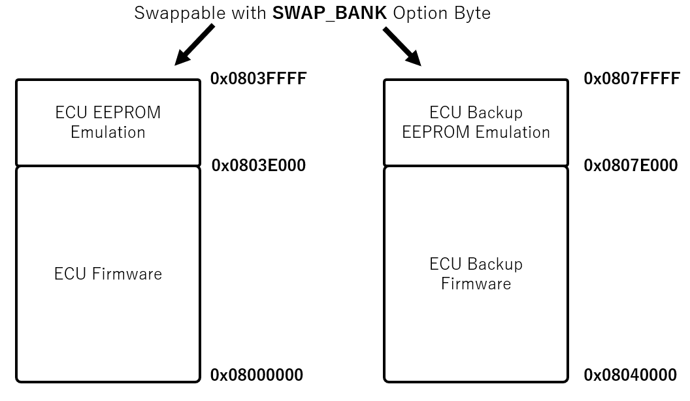
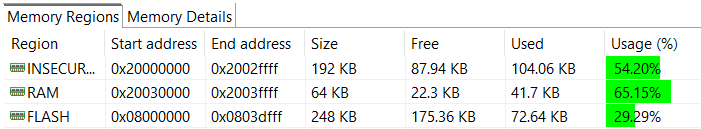
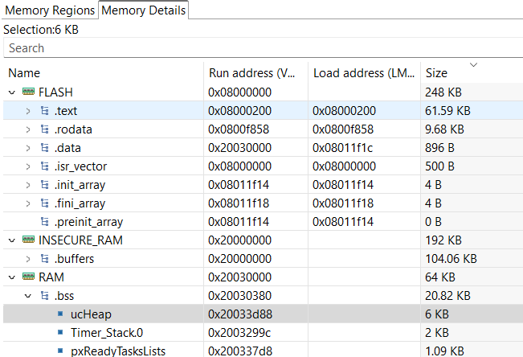

.. _memory_layout:

Memory Layout
=============

RAMN ECUs have three main memory regions: 

- **FLASH** (256kB or 512kB depending on the microcontroller), starting at 0x08000000.
- **INSECURE_RAM** (192kB, corresponding to **SRAM1**), starting at 0x20000000.
- **RAM** (64kB, corresponding to **SRAM2**), starting at 0x20030000.

If you run out of memory, see :ref:`about_memory`.

Memory Protection
-----------------

It is possible to **temporarily** protect **FLASH** and **RAM** from JTAG memory access (for example, if you want to use RAMN for a Capture The Flag event and need to protect its memory, but do not want to permanently lock your device).
You can use the RDP option byte (with level 1), which can be reversed at any time to allow ECU reprogramming.
**When a temporary memory protection is removed, firmware is automatically erased.**

**However, it is not possible to protect INSECURE_RAM without permanently disabling JTAG (RDP protection level 2).**

If you want to enable memory protection, see :ref:`memory_protection`.

.. note:: If you do not plan to use any of the memory protection features, you can (and should) replace the content of ``STM32L552CETX_FLASH.ld`` with ``STM32L552CETX_FLASH_INSECURE.ld``, which only defines one large 256kB RAM region (considered insecure) when compiling.

FLASH
-----

RAMN's ECUs make use of the dual bank architecture of the STM32L5. The memory layout of the FLASH memory is as below (if the microcontroller only has 256kB of memory, only the left part is present).

	Memory Layout of RAMN's ECUs
		
ECU firmware only uses one of the two flash banks at a time. The bank is divided in two parts:

- The Firmware Area, which holds the code currently being executed.
- The EEPROM Emulation Area, which holds data such as VIN, DTC, and other dynamic data.

When reprogramming the ECU **over UDS (NOT over other interfaces)**, the ECU will actually copy the new firmware, as well as the current EEPROM, to the inactive bank.
Once the copy is completed, the ECU will switch the **SWAP_BANK** Option Bytes to swap the two banks, effectively updating the firmware run by the ECU.

.. warning:: Swapping banks may confuse many external tools, such as STM32CubeIDE or STM32CubeProgrammer. Before using those tools, you should ensure that the **SWAP_BANK** Option Byte is unchecked.

If you do not need EEPROM emulation and want to use the entirety of the flash for your own application, you can disable the ``ENABLE_EEPROM_EMULATION`` flag in ``ramn_config.h``. Then you can modify ``STM32L552CETX_FLASH.ld`` and replace ``LENGTH = 248K`` with ``LENGTH = 256K``.

Similarly, if you do not need UDS reprogramming and your microcontroller has 512kB flash (microcontroller reference ending with CET6), you can also disable the ``ENABLE_UDS_REPROGRAMMING`` flag in ``ramn_config.h`` and use ``LENGTH = 512K``.
You will also need to make sure that the **SWAP_BANK** Option Byte is unchecked in STM32CubeProgrammer (see :ref:`optionbyte_check`).

When you disable the ``ENABLE_UDS_REPROGRAMMING`` flag, ECUs will not accept UDS reprogramming, but ECUs will still be reprogrammable using JTAG or the STM32 bootloader interface (in `scripts/STbootloader`).

.. _ram_details:

RAM
---

Regions
^^^^^^^

STM32L5 microcontrollers have two RAM areas: SRAM1 and SRAM2.
**SRAM1 cannot be protected** unless JTAG is **permanently** disabled, so it will always be readable unless you are willing to permanently lock your device. 
SRAM2, however, can be temporarily protected.

As a result, RAMN defines the RAM and INSECURE_RAM regions. By default, variables are put in the RAM region. However, that region is only 64kB.
To avoid filling it too quickly, variables that are large but that do not hold critical data are put in the INSECURE_RAM region.
This is done typically for USB, SPI, and CAN buffers, which only hold data that could be read by accessing those interfaces anyway.
Concretely, this can be done by adding ``__attribute__ ((section (".buffers")))`` to the variable declarations.

.. warning:: INSECURE_RAM has the "NOLOAD" parameter set, meaning you cannot initialize them when you declare them (e.g., if you write ``__attribute__ ((section (".buffers"))) uint8_t example = 1``, example will not hold 1 but it will hold whatever was in memory during boot). You can disable this behavior by removing ``(NOLOAD)`` in ``STM32L552CETX_FLASH.ld``, but this will result in the generation of very large .bin files.

Heaps and Stacks
^^^^^^^^^^^^^^^^

Because RAMN relies on FreeRTOS, there are two heaps and several stacks:

- **STM32 main Heap and Stack** (**._user_heap_stack**, defined in ``STM32L552CETX_FLASH.ld``).
- **FreeRTOS Heap** (**ucHeap** in **.bss**), used to dynamically allocate tasks.
- **FreeRTOS Stacks** (**Timer_Stack.0**, **Idle_stack.2**, and an **independent stack** for each task, in **.bss**).

If you run out of memory or encounter stack overflows, make sure that you identify which heap/stack can be made smaller and which heap/stack should be made bigger.

Memory Analysis
---------------

You can observe RAMN's memory usage by building the project and selecting **"Window"** > **"Show View"** > **"Build Analyzer"** (you may need to select **"File"** > **"Refresh"** then click the refresh icon in the build analyzer window to have it displayed correctly).
This will show you how much percentage is currently in use. 

   
You can select the "Memory Details" tab to have a better overview of which variables are using space.
If you need more memory, there are suggestions of variables to make smaller in the :ref:`about_memory` section.
   

   
