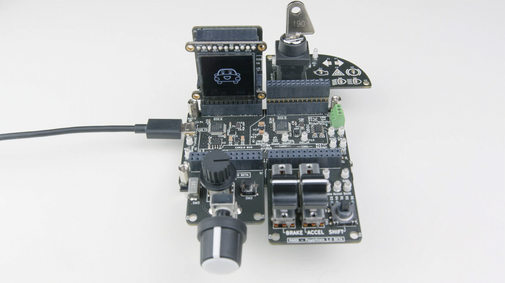
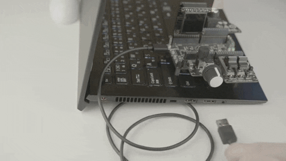
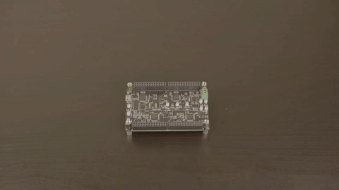
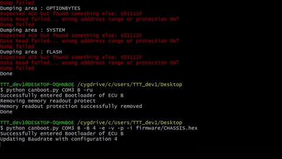
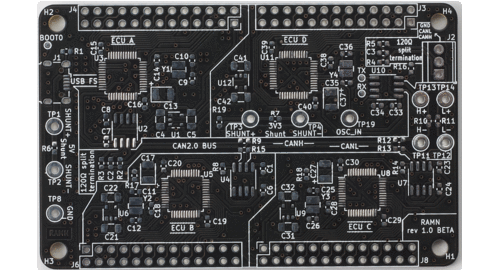
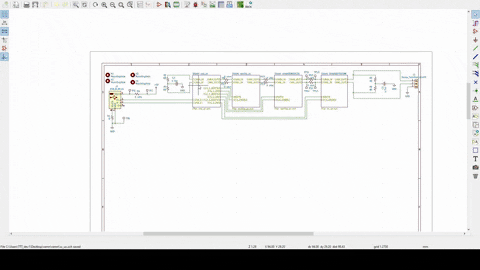
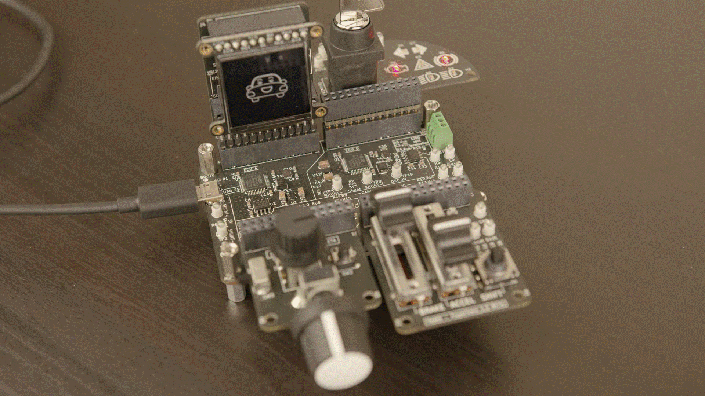

General Information
===================
	
What is RAMN ?
--------------

RAMN (Resistant Automotive Miniature Network) is a credit-card size ECU testbed for safely studying and researching automotive systems.

RAMN is a collection of PCBs (Printed Circuit Boards) that can be used together to simulate a CAN-FD network of ECUs (Electronic Control Unit).

Main Features
-------------

ECU Network Simulation
**********************

RAMN simulates a CAN-FD network of 4 ECUs (Electronic Control Unit). By default, Network traffic specifications are identical to those of `PASTA <https://github.com/pasta-auto/PASTA1.0>`_. 

.. image:: gif/block_diagram.gif
   :align: center

Interactive
***********

RAMN can be expanded with boards using Arduino-style pin headers. You can add sensors and actuators, and physically interact with the ECUs.

.. image:: gif/sm_simple.gif
   :align: center

Plug and Learn
**************

RAMN implements the slcan protocol over USB. It is recognized as a standard CAN-to-USB adapter. No need to buy and connect other tools, just plug RAMN to a USB port to get started.

Expansions
**********

You can stack expansion boards to add new features, such as Trusted Platform Modules (TPM), external memories, and JTAG debuggers.

Drive it
********

RAMN can be connected in closed-loop with the open-source autonomous driving simulator `CARLA <https://carla.org/>`_. Values from the virtual world, such as car speed and throttle control, take a physical form on the CAN-FD bus and inside the ECUs. You can drive the car yourself, or let a self-driving algorithm do the job.

.. image:: gif/carla.gif
   :align: center

Programmable
************

All four ECUs can be reprogrammed over USB using the microcontrollers’ built-in hardware bootloader: no need for a JTAG programmer.

Easy Layout
************

RAMN only consists of Printed Circuit Boards designed with high tolerances. PCBs only have two layers, with SMD components on the same side. All components can be soldered by hand, which makes RAMN accessible to beginners in electronics.

Built with Open-Source Tools
****************************

All PCBs are designed with the open-source CAD tool `KiCad <https://kicad.org/>`_. The firmware of the microcontrollers is based on the open-source RTOS `freeRTOS <https://www.freertos.org/>`_, and the open-source library STM32 HAL.

Usage Examples
--------------

We make RAMN open source in hope of facilitating education and research of automotive systems. RAMN could be used:

* When providing training in electronics and automotive systems.
* When developing and evaluating automotive technologies.
* For research, especially if temperature and manufacturing tolerances matter.
* For CTF and bug bounty programs that require hardware.
* And more!
	
Education
*********

RAMN tries to employ as many popular technologies as possible – not just CAN-FD. Expansion boards feature clip-on probes to observe important signals, and can be used to study analog circuits, SPI, I2C, UART, etc.

.. image:: gif/education.gif
   :align: center

Research
*********

RAMN has the size of a credit card. It is inexpensive and is ideal for situations that require many boards, for example when evaluating the impact of manufacturing tolerances on a technology, or when subjecting the testbed to conditions likely to break it.
Real ECUs are different from popular development boards because they are designed to resist the harsh environment in which they operate. RAMN is mostly made of automotive grade components that are designed to operate from -40 to 150 degrees Celsius. The microcontrollers are not automotive grade, but they can operate from -40 to 125 degrees Celsius. RAMN tries to keep a balance between open-source, cost, and fidelity to real ECU networks. The expansion boards are not automotive grade.
A terminal block at the end of the CAN-FD bus lets you add other nodes. It can be used to develop and evaluate ECUs. One limitation though: the CAN-FD bus is terminated, so it cannot be connected to a real car.

Contact
-------

Follow us (or send us a message) at `@ramn_auto <https://twitter.com/ramn_auto>`_ to stay updated!

License
-------

RAMN is open-soure, with permissive licenses. Please check the `license file <https://github.com/ToyotaInfoTech/RAMN/blob/main/LICENSE.md>`_ for more information.

