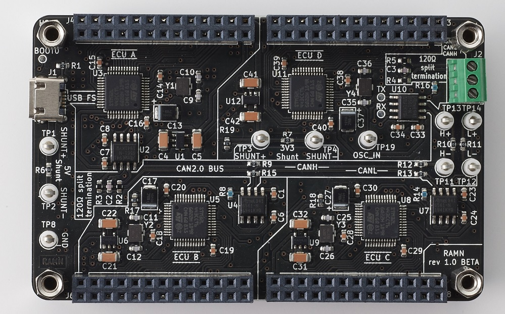
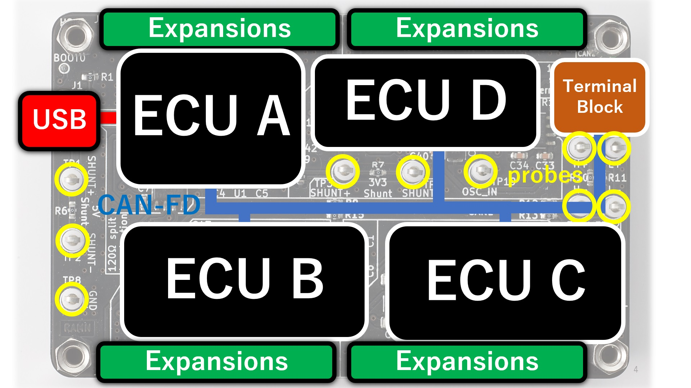
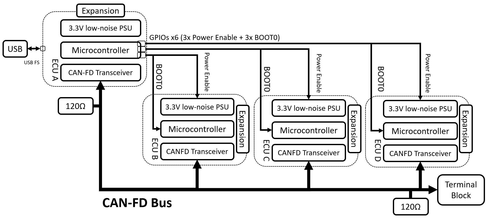

.. _hardware:

Hardware
========

This page gives details about RAMN's hardware.

Overview
--------

RAMN's main board is a credit-card size PCB with 4 ECUs, a CAN FD bus and a USB port.

   Main board of RAMN

RAMN's main board can be expanded with expansions boards to add features such as sensors and actuators.

.. figure:: img/simple_setup_annotated.jpg

   Simple setup of RAMN with 4 expansions: SCREENS (GATEWAY), CHASSIS, POWERTRAIN, BODY.

ECUs (Electronic Control Units)
*******************************

There are 4 ECUs on RAMN (ECU A, ECU B, ECU C, and ECU D), and they all share a common design:

* :ref:`An individual power supply <powersupply>`
* :ref:`A Microcontroller <microcontroller>`
* :ref:`A CAN FD transceiver <canphy>`
* :ref:`An expansion port <expansions>`

ECU A additionally features a USB connection. The USB port is the main 5V power supply for the whole board, and is also used as a mean to reprogram all ECUs.
ECU A has 6 `GPIOs <https://en.wikipedia.org/wiki/General-purpose_input/output>`_ that are used to control:

* The power supply of ECU B, ECU C, and ECU D
* The boot mode (BOOT0 pin) of ECU B, ECU C, and ECU D

ECU D has an additional `shunt resistor <https://en.wikipedia.org/wiki/Shunt_(electrical)#Use_in_current_measuring>`_ and clip-on probes for easier measurements.

CAN FD bus
**********

RAMN features a `CAN FD <https://en.wikipedia.org/wiki/CAN_FD>`_ bus that connects the 4 ECUs and is terminated on both side by `120ohm split-terminations <https://e2e.ti.com/blogs_/b/industrial_strength/posts/the-importance-of-termination-networks-in-can-transceivers>`_.

The CAN FD bus features `shunt resistors <https://en.wikipedia.org/wiki/Shunt_(electrical)#Use_in_current_measuring>`_ and clip-on probes for easier measurements as well.

The CAN FD bus can be accessed from outside through a `terminal block <https://en.wikipedia.org/wiki/Screw_terminal>`_.

Block Diagrams
**************

   Simple Block diagram of RAMN's main board.

   Block Diagram of RAMN showing connection between ECUs.

Schematics Details
------------------

.. toctree::
   :maxdepth: 1
   :caption: RAMN:

   hardware/ecus
   hardware/canbus
   hardware/usb

.. toctree::
   :maxdepth: 1
   :caption: Expansions:

   hardware/screens
   hardware/chassis
   hardware/powertrain
   hardware/body
   hardware/debugger

Design Rules
------------

.. toctree::
   :maxdepth: 2

   hardware/designrules

Versions
--------

The current version of RAMN hardware in active development (on the main branch) is aimed at ease of fabrication and cost. The original version of RAMN is archived and are available in the `misc folder <https://github.com/ToyotaInfoTech/RAMN/tree/main/misc>`_ in file RAMN_V1_reference_PCB.zip.  This archived version uses some parts which are not easy to source from turnkey fabrication services and/or are not cost effective for orders by 'users' of RAMN. We recommend that, in academic setting, the original archived version of RAMN is used for reference.

Fabrication
-----------

.. toctree::
   :maxdepth: 2

   hardware/fabrication
