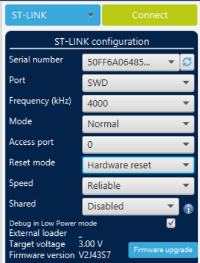

.. _flashing:

Firmware Flashing
=================

RAMN has four ECUs, each requiring a different firmware file (ECUA.hex, ECUB.hex, ECUC.hex, and ECUD.hex).

Interfaces
----------

Firmware files can be flashed using one of three interfaces:

- **The STM32 Embedded Bootloader interface (USB)**: The STM32L5 microcontrollers used by the RAMN ECUs have two boot modes: application mode and bootloader mode. In bootloader mode, microcontrollers accept various flashing commands over USB and CAN-FD. **This interface is accessible over USB for all ECUs, even on a fresh (unprogrammed) RAMN board**.
- **The Hardware interface (JTAG)**: this interface is available on all STM32 microcontrollers. It can be used with a JTAG debugger such as the `ST-LINK/V2 <https://www.st.com/en/development-tools/st-link-v2.html>`_. It can also be used on a fresh, unprogrammed board.
- **The UDS interface (USB, CAN)**: this interface is accessible only on an ECU with a valid firmware, and with two memory banks (microcontroller reference finishing with "CET6").

How to use the UDS interface is detailed in the UDS user guide. The other interfaces are described in this page.

Important Knowledge
-------------------

- ECU A controls the power supply and boot mode of ECU B, C, and D. **ECU A must always be flashed first**, otherwise ECU B, C, and D will not be powered.
- ECU B has a steering wheel potentiometer that may be either "linear" or "algorithmic", depending on component availability. If the LCD screen does not show "STEER 0%" when the steering wheel is centered, it means you must replace "ECUB.hex" with "ECUB_LINEAR.hex" (simply delete ECUB.hex and rename ECUB_LINEAR.hex with ECUB.hex).
- When you reprogram an ECU using the UDS interface, the new firmware is actually written to a different memory bank, and the option bytes of the microcontroller are set so that that memory bank becomes the new application firmware (memory bank swap). Some tools, including ST official tools, may not understand this memory swap and generate errors because of it. If that is the case, reflash the ECU over UDS to revert to the other, "default" memory bank\ [#f1]_.
- ECU A and ECU B, C, and D have different option bytes. If you accidentally flash ECU B, C, or D with a firmware file for ECU A, they will not accept to go into bootloader mode anymore\ [#f2]_.
- You can follow instructions at :ref:`try_out_controls` to verify that your board is fully functional.
- If you encounter issues, always verify option bytes (:ref:`common_issues`).

STM32 Embedded Bootloader Interface
-----------------------------------

How It Works
^^^^^^^^^^^^

Design
""""""

`AN2606 from STMicroelectronics <https://www.st.com/resource/en/application_note/an2606-stm32-microcontroller-system-memory-boot-mode-stmicroelectronics.pdf>`_ explains in detail how STM32 microcontrollers boot.
RAMN uses STM32L5 microcontrollers. By default, STM32L5s start in bootloader mode if their BOOT0 pin is HIGH when they boot. This behavior can be overridden by programming STM32L5's option bytes so that a value written in memory is used instead of the status of the BOOT0 pin.

ECU A's BOOT0 pin is set to HIGH in hardware. Fresh, unprogrammed boards will therefore always boot in bootloader mode, and will listen for bootloader commands, including memory flashing commands, over USB (DFU commands, which are detailed in `AN3156 <https://www.st.com/resource/en/application_note/an3156-usb-dfu-protocol-used-in-the-stm32-bootloader-stmicroelectronics.pdf>`_).

ECU A firmware is configured to set its own option bytes so that the BOOT0 pin will be ignored for all subsequent boots, and therefore ECU A will boot in application mode regardless of the status of its BOOT0 pin if a valid firmware has been executed at least once.

ECU A's settings can be reset with a specific USB or UDS command, listed in the commands list. When that command is executed, ECU A reverts its option bytes and resets itself, forcing itself to go into bootloader mode again.

ECU B, C, and D have their BOOT0 pin and power supply controlled by ECU A. ECU B, C, and D always boot following the status of the BOOT0 pin. Therefore, ECU A can isolate a specific ECU and force it to boot in bootloader mode, allowing users to send STM32 bootloader commands over CAN-FD (See `AN5405 <https://www.st.com/resource/en/application_note/an5405-how-to-use-fdcan-bootloader-protocol-on-stm32-mcus-stmicroelectronics.pdf>`_).

Flashing Sequence
"""""""""""""""""

You only need a USB connection to flash all ECUs.
The flashing sequence is as follows:

1. Reset ECU A option bytes to force ECU A into bootloader mode (This can be skipped on a fresh board).
2. Write ECU A's firmware over USB using a DFU tool.
3. Use ECU A to write ECU B, C, and D's firmware with the "canboot.py" python tool. This tool translates USB commands to CAN-FD commands.

Flashing Scripts
^^^^^^^^^^^^^^^^

The Github repository contains various scripts to flash RAMN's ECUs. You first need to prepare your environment, either on Linux or Windows.

Windows Environment
"""""""""""""""""""

1. `Install STM32CubeProgrammer <https://www.st.com/en/development-tools/stm32cubeprog.html>`_. This requires that you create a free account with STMicroelectronics. If you encounter issues later, try installing the drivers located at "Program Files/STMicroelectronics/STM32Cube/STM32CubeProgrammer/Drivers" (`instructions here <https://www.st.com/resource/en/user_manual/um2237-stm32cubeprogrammer-software-description-stmicroelectronics.pdf>`_).
2. `Install the latest python release for Windows <https://www.python.org/downloads/windows/>`_. Make sure that you check "Add Python to environment variables".
3. Download the `RAMN repository <https://github.com/ToyotaInfoTech/RAMN>`_ on your computer (select Code > Download Zip).
4. Open a command prompt in the RAMN/scripts folder (you can do this by opening the RAMN/scripts folder with File Explorer and typing "cmd" in the address bar at the top) and enter:

.. code-block:: console

    $ python -m pip install -r requirements.txt

5. (If required) Edit scripts/STbootloader/windows/ProgramECU_A.bat and modify STM32PROG_PATH to match your installation path.

Linux Environment
"""""""""""""""""

1. Install dfu-util:

.. code-block:: console

    $ sudo apt-get update && sudo apt-get install dfu-util

2. Clone RAMN's repository:

.. code-block:: console

    $ git clone https://github.com/ToyotaInfoTech/RAMN

2. Install the modules in requirements.txt:

.. code-block:: console

    $ pip install -r requirements.txt

Note that if you use a virtual machine, RAMN serial port and RAMN DFU port will be considered different; you will need to forward both to your VM.

Scripts
"""""""

The STM32 Embedded bootloader interface requires a CAN baudrate change. If present, you must disconnect external CAN tools that may interfere with it.
Then, follow the instructions below:

1. Open folder scripts/STbootloader/windows or scripts/STbootloader/linux.
2. If the board is not in DFU mode (e.g., it is not a fresh board), run ECUA_OptionBytes_Reset.bat (ECUA_OptionBytes_Reset.sh on Linux).
3. Run ProgramECU_A.bat (ProgramECU_A.sh on Linux) to flash ECU A. This should take approximately 5 seconds.
4. Run ProgramECU_BCD.bat (ProgramECU_BCD.sh on Linux) to flash ECUs B, C, and D. This should take approximately 30 seconds.

.. warning::

    As of 2024, the DFU tool provided by STMicroelectronics does not work well on some computers.
    You may need to run the script several times in a row until it succeeds. Trying different USB ports of your computer may help.
    The program should display "Start operation achieved successfully" in green when it is successful.
    If you encounter too many issues, try using the Linux dfu-util tool instead.

JTAG Hardware Interface
-----------------------

You can also reprogram ECUs using an `ST-LINK/V2 <https://www.st.com/en/development-tools/st-link-v2.html>`_ and the `STM32CubeProgrammer <https://www.st.com/en/development-tools/stm32cubeprog.html>`_ tool.
You should be able to reprogram ECUs using other hardware/software compatible with STM32; however, we have not tested them.

With the JTAG interface, you can only flash one ECU at once, so you need to repeat the firmware flashing steps for each ECU.
Always make sure ECU A is programmed first, otherwise other ECUs may not be powered.

Preparing Your Environment
^^^^^^^^^^^^^^^^^^^^^^^^^^

1. Obtain an `ST-LINK/V2 <https://www.st.com/en/development-tools/st-link-v2.html>`_. Be careful of clones, which may not be supported by ST.
2. Obtain a RAMN debugger expansion, or prepare jumper wires to connect manually to the RAMN ECUs.
3. `Install STM32CubeProgrammer <https://www.st.com/en/development-tools/stm32cubeprog.html>`_. This requires that you create a free account with STMicroelectronics.

Connecting your Debugger
^^^^^^^^^^^^^^^^^^^^^^^^

If you own a RAMN debugger expansion (the one with the JTAG connector on it), simply insert it in the expansion port of the ECU that you want to reprogram.
The correct orientation of the expansion board is so that it does not go over the main RAMN board (You should still be able to see the ECU microcontroller after inserting the expansion).

If you do not own a RAMN debugger expansion, use jumper wires to connect ST-LINK/V2 pins to the expansion port of the ECU that you want to reprogram:

- Pin 1 and 2 of ST-LINK/V2 (VCC) to pin 1 of the expansion port (3V3_ECU).
- (Optional) Pin 3 of ST-LINK/V2 (TRST) to pin 26 of the expansion port (SYS_JTRST).
- Pin 4 of ST-LINK/V2 (GND) to pin 4 of the expansion port (GND).
- Pin 5 of ST-LINK/V2 (TDI) to pin 23 of the expansion port (SYS_JTDI).
- Pin 7 of ST-LINK/V2 (TMS_SWDIO) to pin 22 of the expansion port (SYS_JTMS-SWDIO).
- Pin 9 of ST-LINK/V2 (TCK_SWCLK) to pin 24 of the expansion port (SYS_JTCK-SWCLK).
- Pin 13 of ST-LINK/V2 (TDO_SWO) to pin 25 of the expansion port (SYS_JTDO-SWO).
- Pin 15 of ST-LINK/V2 (NRST) to pin 21 of the expansion port (nRST).

Refer to the `ST-LINK/V2 manual <https://www.st.com/resource/en/user_manual/um1075-stlinkv2-incircuit-debuggerprogrammer-for-stm8-and-stm32-stmicroelectronics.pdf>`_ and `RAMN github repository <https://github.com/ToyotaInfoTech/RAMN>`_ for details about the connections

Using STM32CubeProgrammer
^^^^^^^^^^^^^^^^^^^^^^^^^

Connect
"""""""

Launch STM32CubeProgrammer, select "ST-LINK" in the top-right menu, then click "Connect".
You may be prompted about a debugger firmware update first.
If connecting fails, try using the same settings as those in the screenshot below.

(Optional) Verify Option Bytes
""""""""""""""""""""""""""""""

If you are unsure about the status of your ECUs, typically because you interacted with UDS reprogramming or memory protection features, verify the status of option bytes.
Select the "OB" icon in the left pane and verify that:

- Read Out Protection > RDP shows "AA".
- User Configuration > SWAP_BANK is unchecked.
- (FOR ECU A) User Configuration > nSWBOOT0 is **unchecked** and nBOOT0 is checked.
- (FOR ECU B, C, and D) User Configuration > nSWBOOT0 is **checked** (nBOOT0 does not matter here).

Refer to :ref:`common_issues` for screenshots of the correct configurations.
If any of these option bytes are incorrect, correct them and click the "Apply" button. It is not uncommon for this command to fail, so you may need to retry several times.
Be extremely careful with the "RDP" option byte, as it may permanently lock your ECU if something other than "AA" is applied.

Reflash
"""""""

- Click the "Erasing & Programming icon" in the left pane (second icon from the top).
- (Optional) Click "Full Chip Erase" (top right of the window) to fully erase the memory (including internal EEPROM, which contains VIN and DTCs).
- Click "Browse", select the firmware file (.hex file for your ECU), check "Verify programming" and "Run after programming", then click "Start Programming".
- Wait for the flashing process to finish.

Repeat these steps for each ECU that you want to reprogram.

.. rubric:: Footnotes

.. [#f1] RAMN's custom UDS Routine Control 0x0211 can be used to force a memory bank swap, but avoid using it unless you know what you are doing.
.. [#f2] You can fix the option bytes using a JTAG debugger. You can use UDS Routine Control 0x0210 to reset the BOOT0 option bytes. This UDS command will force ECU A into bootloader mode, so you will need to reprogram it.