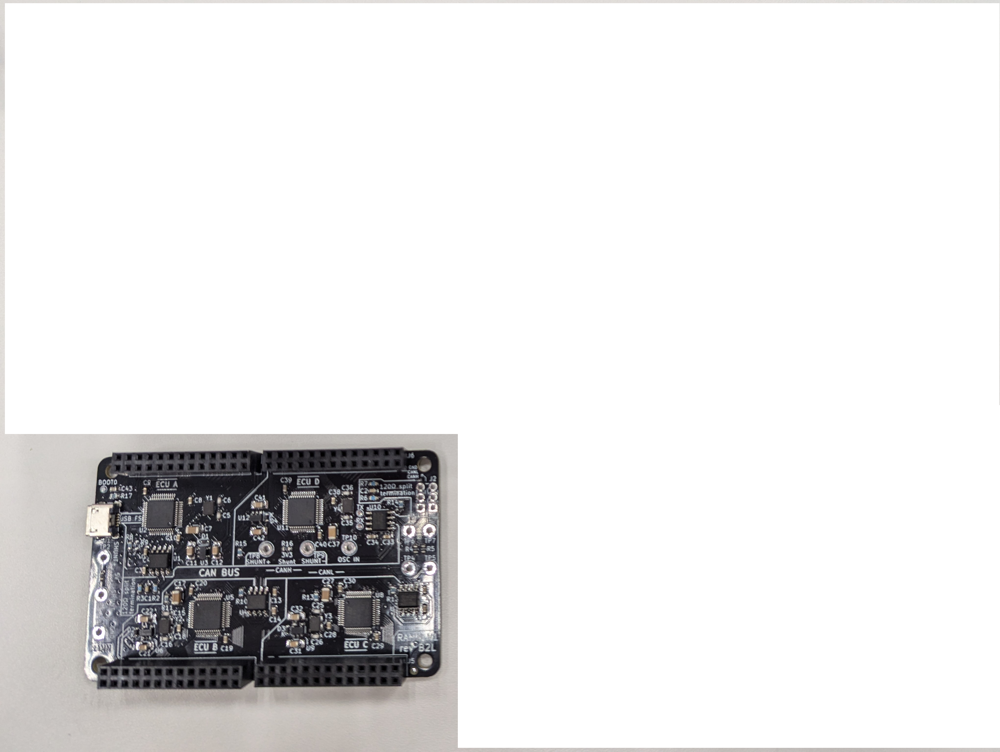
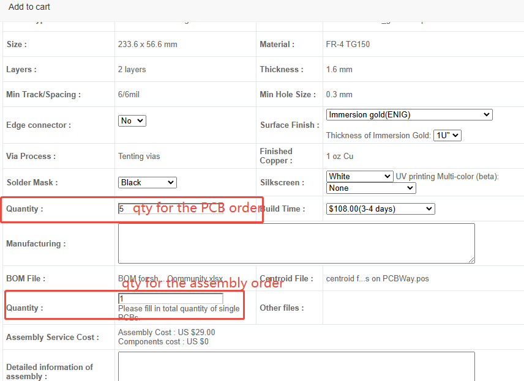

PCB Ordering
============

.. image:: img/1000015167.jpg
   :align: center

The design files are complete enough that you can fabricate and/or
assemble your own RAMN and expansions. But there are two 're-orders' that can
be made from PCBWay to get your own RAMN: 1) the mainboard and 2) the
expansions (excluding the optional debugger expansion). The mainboard is usable for many applications
all by itself, but acquiring the expansions is required for changing the
simulated vehicle state e.g. driving the car in CARLA.

Click the buttons below to access the PCBway re-order pages.

.. button-link:: https://www.pcbway.com/project/shareproject/https_github_com_ToyotaInfoTech_RAMN_mainboard_ONLY_0dae9b72.html
    :color: primary
    :expand:

    Mainboard from PCBWay

.. image:: img/1000015167-expansions.png
   :align: center

.. button-link:: https://www.pcbway.com/project/shareproject/https_github_com_ToyotaInfoTech_RAMN_pods_ONLY_3ff2c7a7.html
    :color: secondary
    :expand:

    Expansions Panel from PCBWay

The bill of materials used in the above orders were tailored to match
the components that are available from PCBWay, and some parts are
removed (marked DNP) to reduce costs (e.g. test points).

Parameters
----------

You should keep most of the default parameters of PCBway: FR4 material, 2 layers, 1.6mm thickness, 1oz (35um) copper.

You should be able to select any surface finish, although we suggest that you stay away from any solution with lead.
"HASL lead free" is typically the cheapest solution without lead, but may tarnish over time.
We typically use "Immersion gold (ENIG)", and haven't tried other surface finishes ourselves.

"Solder Mask" corresponds to the color of the board, and "Silkscreen" corresponds to the color of the text and lines.
You can select any color you like, although you should ensure enough contrast to read the text (e.g., do not select white soldermask with white silkscreen).

If you select black, white, or matte black soldermask, PCBway may warn you that the soldermask constraints of RAMN cannot be respected (the soldermask spacing between microcontroller pins and USB connector pins is 0.20mm, but PCBway asks for at least 0.22mm).
If you want to use one of these colors anyway, it is typically OK to ask PCBway to ignore the issue, or to remove problematic soldermask themselves. This will however slightly increase the probability of soldering issues.

Ordering Fewer Than a Quantity of Five (5)
------------------------------------------

The PCBWay ordering system might make it seem like ordering 5 or more is required; however, only (bare) PCBs must be ordered at a minimum of 5. It is possible to order as little as 1 assembled mainboard and/or expansions panel.

Customers can select the number of PCBs and assembled boards separately when placing an order. As shown in the pic below, for example: we have checked 5 pieces in the PCB order column, while we filled in only 1 set for the assembly order. This way, we will finally get 4 bare boards and 1 assembled board with components installed.

The more boards you order, the cheaper they become.
If you order 5 assembled RAMN sets, the expected cost is approximately 210 USD per full RAMN set (including the external components below, assuming a green soldermask and ENIG surface finish, and without the optional debugger expansion).
If you order only one set, that cost however becomes 430 USD.

Production notes
----------------

BOM component references
########################

Expansions (1_screens to 5_debugger) use non-overlapping references and can easily be panelized together.
The main board (0_ramn) has components references that overlap with the expansions, and some fabs may refuse panelization because of that reason.

Clarifications
##############

Below are clarifications based on past questions from fabs.

- Orientation of D8 on 4_body PCB is as specified by the graphics at the bottom-right of the PCB's silkscreen (same orientation for all LEDs; K up and A down). The dot near the bottom of D8 is just art, it does not indicate the cathode.
- Y1, Y2, Y3, Y4 do not have orientation (they are passive crystals, despite their unusual footprint).
- RK09D1110C0R may not be easily available. RK09K1110B26 and RK09K1110A2S are acceptable alternative, but they may need small adjustments to prevent the knob from hitting the edge of the PCB. The knob may also come off more easily as a result.
- SSQ-113-23-G-D can be replaced with SSQ-113-23-L-D, SSQ-113-23-F-D, or SSQ-113-23-T-D. They can also be replaced with 4UCON TECHNOLOGY 18507, but those have softer pins, which are more prone to bending.
- LEDs can be replaced with SML-D12P8WT86, SML-D12D1WT86, and SML-D12V1WT86 (depending on color).
- It is acceptable to replace most components with alternatives. STM32L562CET6 and STM32L552CET6 are the preferred choices for microcontrollers. STM32L562CET6 is the same as STM32L552CET6 but has an encryption engine (not required by RAMN, but appreciated by user when available; may be more difficult to import/export due to restrictions).  STM32L562CCT6 is compatible but does not support some minor features, such as UDS reprogramming.

Notes from past issues
######################

ECU A's screen (external-1 in BOM) is rather fragile and requires careful handling and packaging.

We have had past production issues with badly soldered potentiometers (RV1 and RV2).
Similarly, we have had one rare occurrence of a defective SW2 (OS102011MA1QN1), probably also due to bad soldering.
Those should require extra attention during soldering and quality check.
