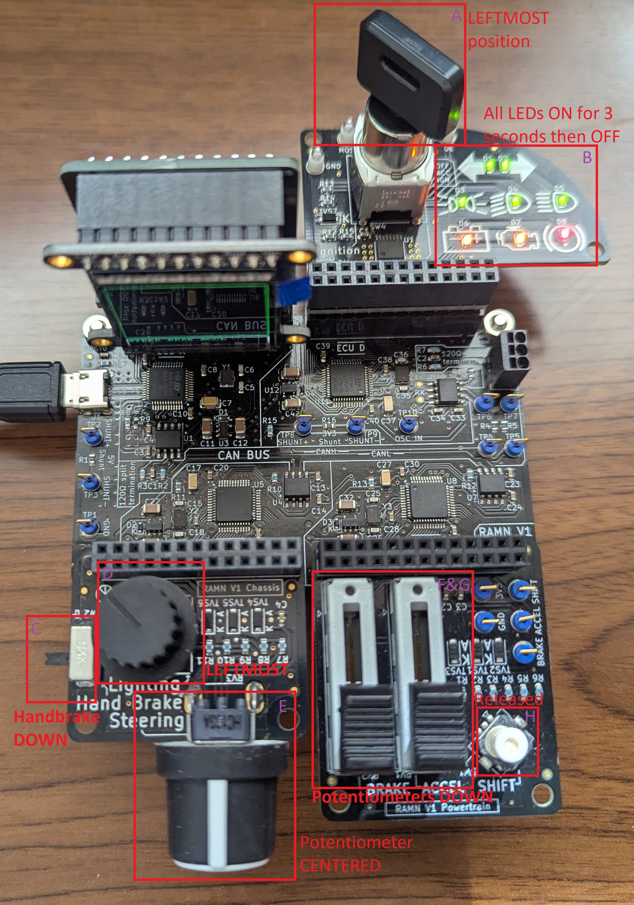
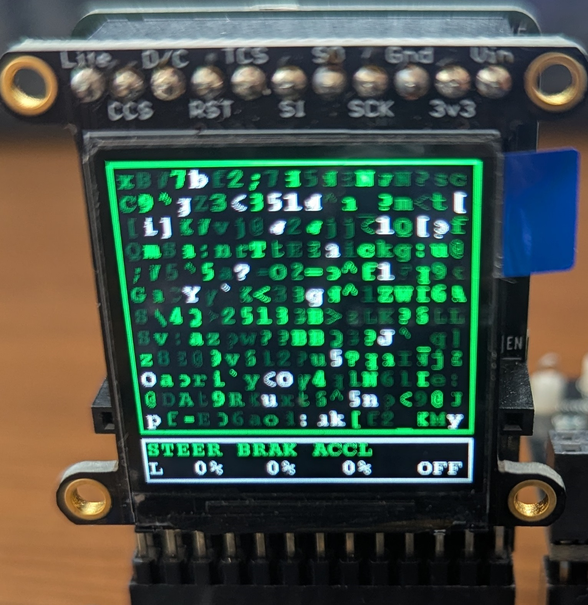
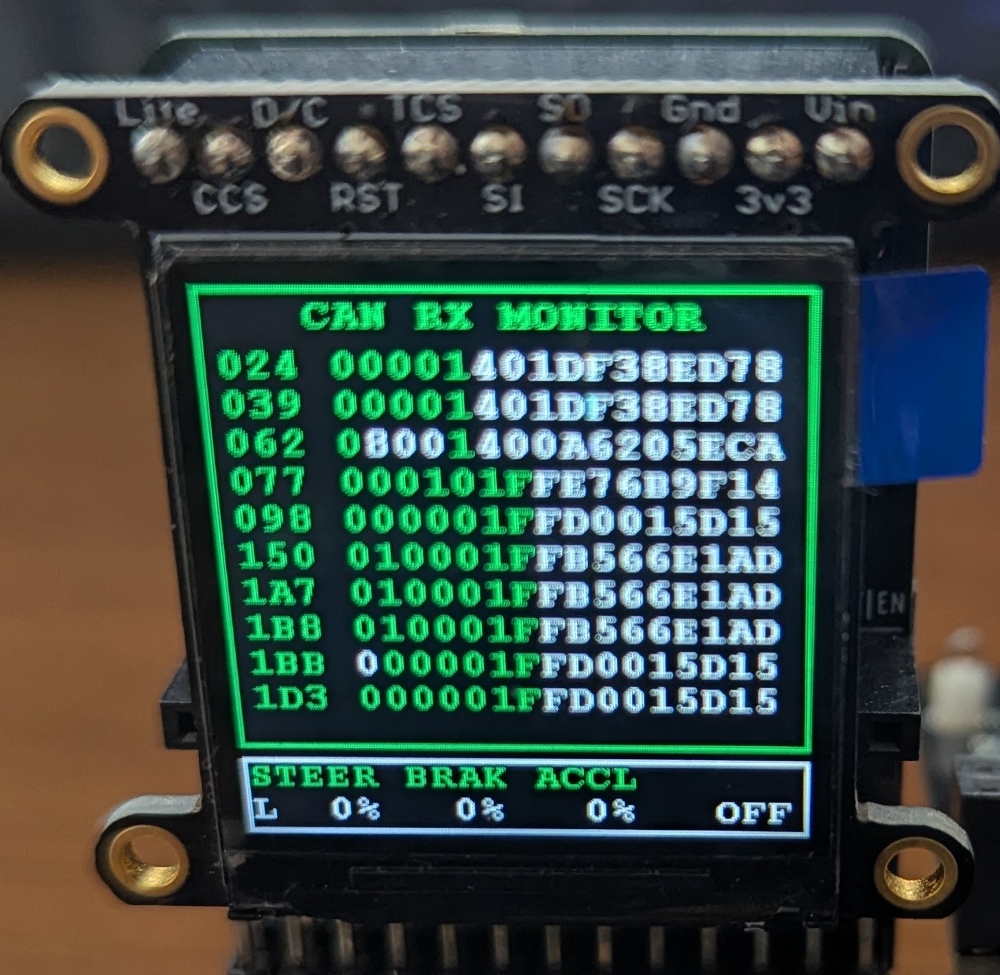

.. _qualitycheck:

Quality Check
=============

This page describes a procedure to verify that a board is correctly flashed and functional.
If you encounter an issue at any of the steps below, refer to the :ref:`quality_troubleshooting` section.

Before starting, make sure that you have flashed the board with the latest firmware following the :ref:`flashing_scripts` instructions.

Procedure
---------

Step 1: Assemble and verify LED status after boot
#################################################

Make sure that the board is assembled as shown in the picture below. **Position all actuators as shown in the picture (neutral position).**
Unplug the USB cable, then replug it to power up the board. **Make sure that ALL LEDs (in B square) light up for about three seconds, then all turn off.**

   
Step 2: Verify data on screen
#############################

ECU A's screen can be used to check the status of each actuator. 
**Verify that the bottom of the screen shows the same data as the picture below**. Screen color is random, and may be different at each power cycle.
"STEER" shows the status of the steering potentiometer (in E square), L for Left and R for Right. When centered, it should be between "L 5%" and "R 5%". 

   
Step 3: Verify CAN bus traffic
##############################
   
**Press the SHIFT joystick (in H square) to the right, then release it. Verify that LED D2 (in B square) is now blinking. Verify that the screen now shows similar data as the picture below.**
The main screen should be filled with letters and numbers.
   

   
Step 4: Test the handbrake
##########################

Move the Handbrake (in C Square) up. Verify that the bottom of the screen now shows "SB".

Step 5: Test the headlights
###########################

Move the headlights switch (in D square) from the leftmost position to the rightmost position. When moving the switch between positions, the bottom of the screen should show "CL", "LB", then "HB".
   

Step 6: Test Chassis
####################

Move the chassis potentiometer (in E square) to the leftmost position and verify that "STEER" now shows "L100%". Move it to the rightmost position and verify that it shows "R100%".

Step 7: Test brake and accelerator
##################################

Move the brake and accelerator potentiometers (in F&G square) all the way up. Verify that the screen now shows "98%" (or a value above 95%) for brake "BRAK" and "ACCL".

Step 8: Test the engine key
###########################

Move the engine key (in A square) from left, to middle, to center. Verify that the text at the bottom-right of the screen goes from "OFF" to "ACC" to "IGN".
  
Step 9: Test SHIFT joystick
###########################

The SHIFT joystick has 5 positions (excluding the released state): Left-pressed, Right-pressed, Up-pressed, Down-pressed, and Center-pressed.

**Hold each of these positions and verify that the bottom of the screen respectively shows "LT", "RT", "UP", "DW", and "MD".**
(When using left/right, you will move between screens. If you end up on a screen that has no bottom text, try moving to another screen).
  
   
.. _quality_troubleshooting:

Troubleshooting
---------------

If the steering potentiometer does not show 0% when centered, you may have flashed the wrong firmware (see :ref:`flashing`).
You can fix this problem by flashing ECU B with the alternative firmware (most likely, linear in place of logarithmic).

If actuators are responsive but show erroneous values (for example, the screen shows "UP" when you press the SHIFT joystick down), your board may require calibration. 
Please contact us for assistance.

Make sure to remove external CAN adapters, if present.

If you fail at any of the steps above, it may be because of an improperly flashed board. 
Reflash the board following the :ref:`flashing_scripts` instructions.
If possible, also verify the option bytes (see section :ref:`verify_option_bytes`).
When correctly flashed, the board should show up as a serial device (COM port on Windows, /dev/ttyACMx on Linux), not as a "DFU in FS mode" device or a power-only device.

If you are certain that the board is correctly flashed, then you may have faulty connections (which you can identify by visual inspection) or a faulty component (which you should try to resolder, or replace).
Feel free to contact us for assistance.

