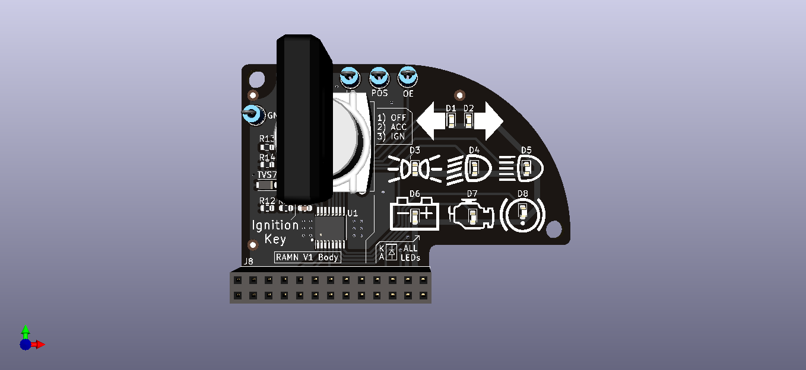
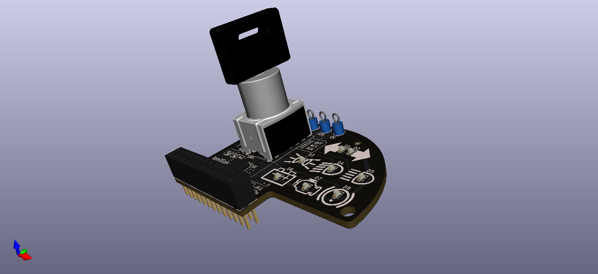
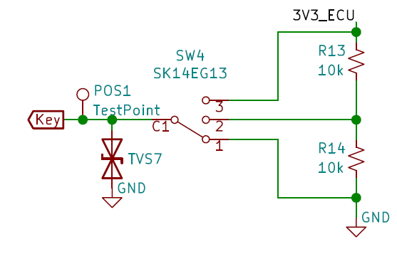
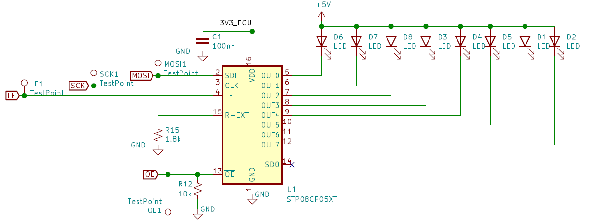
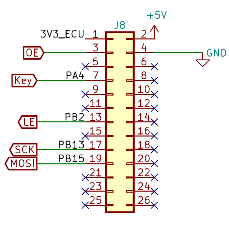

.. _body_expansion:

Body
====

The BODY expansion is the expansion associated to ECU D, and is used to realize two simple functions usually in the BODY domain of a car:

* Engine Key
* Lights

   

   

Engine Key
----------

The Engine key has three positions which are assigned to:

* Engine OFF
* Accessory
* Ignition

The engine key is simulated by a `SK14EG13 <https://www.nkkswitches.com/pdf/SK_PCBmountMiniature.pdf>`_ from NKK switches. The SK14EG13 is an `SP3T switch <https://en.wikipedia.org/wiki/Switch#Contact_terminology>`_ (Single Pole, Triple Throw).
The schematic is therefore rather simple:

	Schematic of the Engine Key circuitry

The rotation of the key selects a point from a `voltage divider <https://en.wikipedia.org/wiki/Voltage_divider>`_ (Position 1 -> 0V, Position 2 -> 1.65V, Position 3 -> 3.3V), which is measured by an ADC on the ECU.
A `TVS diode <https://en.wikipedia.org/wiki/Transient-voltage-suppression_diode>`_ is used for ESD protection, since the key is expected to be manipulated by the user.

.. note:: Originally, we selected the `60538 (M1 Series) <https://jp.rs-online.com/web/p/key-switches/0332571/>`_ from Saia Burgess, which arguably looks better and is more challenging for lock-pickers. Unfortunately, that component is not easy to find as of 2021. During our testing, we also had the issue of the component breaking and creating a short-circuit on the 3V3 line.

Lights
------

The lights are simulated by 8 LEDs (D1~D8) located near silkcreen markings ressembling dashboard symbols:

* Left Turn Indicator *(D1 - Output 6)*
* Right Turn Indicator *(D2 - Output 7)*
* Tail Lamp *(D3 - Output 3)*
* Low Beam *(D4 - Output 4)*
* High Beam *(D5 - Output 5)*
* Battery Warning *(D6 - Output 0)*
* Check Engine *(D7 - Output 1)*
* Parking Brake *(D8 - Output 2)*

	Schematic of the Lights circuitry

The LEDs are driven by a `STP08CP05 <https://www.st.com/resource/en/datasheet/stp08cp05.pdf>`_ IC. The STP08CP05 is a LED driver controlled by a simple `shift-register <https://en.wikipedia.org/wiki/Shift_register>`_ circuit. In practice, the STP08CP05 is controlled by the SPI output of ECU D, and is multiplexed with other SPI devices (TPM, Screens, etc.). The SPI signals can easily be accessed through external probes.

Communications are done in 3.3V, but the LEDs are powered from the 5V line. R15 is used to set the current (~10mA). 

The Output Enable (OE) pin is pulled-down, so the STP08CP05 is active from start-up, which may result in some flickering when powering-up. This behavior is preferable to losing a GPIO from the ECU.

LEDs are in a 0603 package. LEDs in this type of package are available in many colors.

.. note:: Although LEDs are available in many different colors, LEDs of different color typically require different currents to reach the same intensity (even if they come from the same series). When selecting LEDs of different colors, please check the recommended current and ensure they are close enough.

Pinout
------

	Pinout of the BODY expansion's connector

