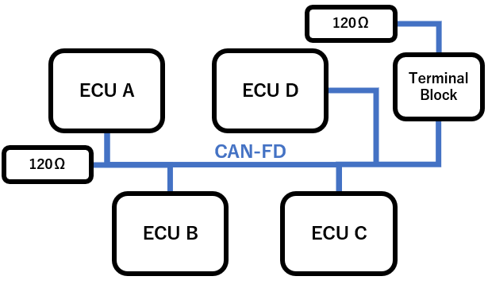
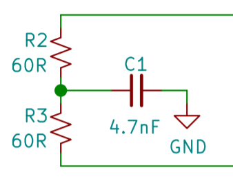

CAN/CAN-FD Bus 
==============

When simplified, the layout of the CAN bus can be approximated by the following figure.

   Simplified layout of the CAN/CAN-FD bus.
   
.. note:: Please refer to the :ref:`impedance_matching` section for information about impedance matching of the CAN/CAN-FD bus.

The CAN-FD bus is terminated on both side by `120ohm split-terminations <https://e2e.ti.com/blogs_/b/industrial_strength/posts/the-importance-of-termination-networks-in-can-transceivers>`_.

   Terminator used at each end of the CAN/CAN-FD bus.

