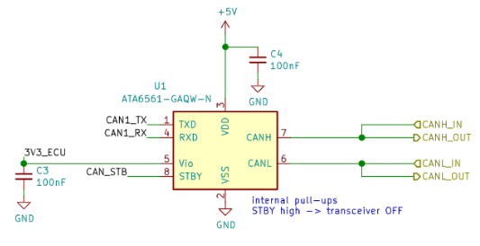

.. _canphy:

CAN-FD Transceiver
==================

All ECUs feature the same CAN-FD PHY (Physical layer) design, which is a simple CAN-FD transceiver IC, supported by bypass capacitors. The transceiver draws its power from the 5V line (VDD), but uses 3.3V for communication (Vio).

   CAN-FD PHY used by ECUs. 
   
Most CAN transceiver ICs use identical packages and layout, and are therefore interchangeable. We built prototypes with either of the following components:

* `ATA6561-GAQW-N <https://ww1.microchip.com/downloads/en/DeviceDoc/20005991B.pdf>`_ (BETA). It is qualified for automotive use (AEC-Q100), but its bitrate is limited to 5 Mbps.
* `MCP2558FD-H/SN <https://ww1.microchip.com/downloads/en/DeviceDoc/20005533A.pdf>`_ (V1). It has a maximum bitrate of 8 Mbps, but is still pending AEC-Q100 qualification (?). 

MCP2558FD-H/SN is our preferred choice, since it has a higher maximum bitrate.

The PHY Chip features a "STBY" (Standby) or "S" (Silent) pin to disable the transceiver:

* When STBY/S is HIGH, the transceiver is disabled and the ECU is unable to communicate on the CAN-FD bus.
* When STBY/S is LOW, the transceiver is enabled and the ECU can communicate on the CAN-FD bus

The STBY/S pin features an `internal pull-up <https://en.wikipedia.org/wiki/Pull-up_resistor>`_, meaning that the STBY/S pin must be actively set to LOW to enable communications. 
On a typical design, it is preferable to leave STBY/S pulled-up to make sure an unprogrammed ECU will not interfere with the CAN-FD bus. 
However, since RAMN uses the CAN-FD bus to program the ECUs from their (unprogrammed) factory state, the STBY/S pin is pulled-down externally, to allow the hardware built-in bootloader to communicate over CAN-FD.

.. note:: When an ECU is not used, It is preferable to program it to disable its CAN-FD transceiver.
