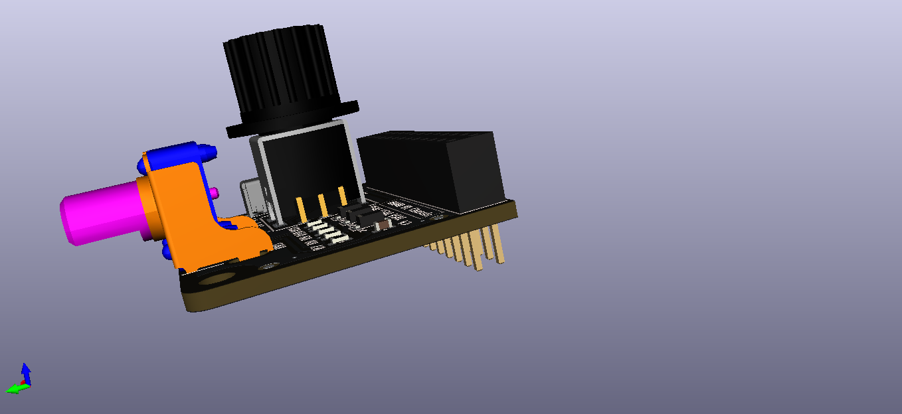
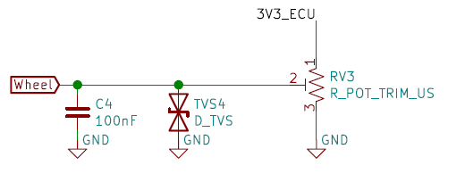
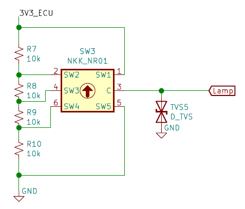
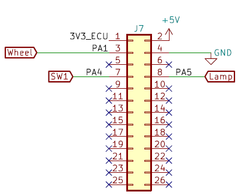

Chassis
=======

The CHASSIS expansion is used to simulate some functions usally found in the Chassis domain of a car:

* Steering Wheel
* Parking Brake

Although not traditionally part of the Chassis domain, the lighting switch is also present on the Chassis domain.

.. image:: img/chassis/chassis.png
   :align: center
   

   
Steering Wheel
--------------

The Steering wheel is simulated by a rotating potentiometer. A `TVS diode <https://en.wikipedia.org/wiki/Transient-voltage-suppression_diode>`_ is used for ESD protection, and a capacitor also protects the ECU input from chattering.

	Schematic of the Steering wheel circuitry
	
Parking Brake
-------------

The parking brake is simulated by a pulled-up sliding switch. A `TVS diode <https://en.wikipedia.org/wiki/Transient-voltage-suppression_diode>`_ is used for ESD protection.

.. figure:: img/chassis/sidebrake.png

	Schematic of the Parking Brake circuitry
	
Lighting Switch
---------------

The lighting switch is simulated by a rotating switch from the `NR01 series <https://www.nkkswitches.com/pdf/NR01%20Rotaries.pdf>`_ of NKK switches. A `TVS diode <https://en.wikipedia.org/wiki/Transient-voltage-suppression_diode>`_ is used for ESD protection.
The rotation of the switch selects a point from a `voltage divider <https://en.wikipedia.org/wiki/Voltage_divider>`_ , which is measured by an ADC on the ECU.

	Schematic of the Lighting switch circuitry
	
	
Pinout
------

	Pinout of the CHASSIS expansion's connector

