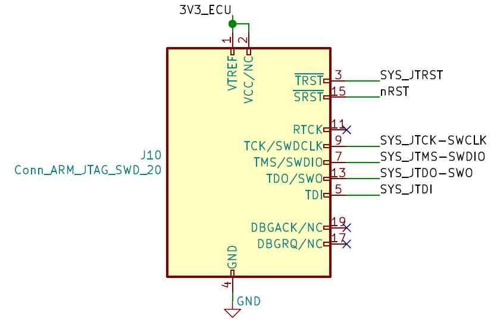
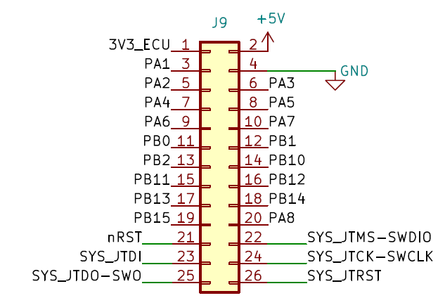

Debugger
========

The DEBUGGER expansion is used to easily probe every output of the expansion pin socket, as well as to easily connect a JTAG debugger to the ECU.

.. image:: img/debugger/debugger.png
   :align: center
   
.. image:: img/debugger/debugger_tilt.png
   :align: center
   
   
JTAG Debugger
-------------

A `standard 20-pin JTAG connector <https://www.digikey.com/en/products/detail/assmann-wsw-components/AWHW-20A-0202-T/5050385>`_ is present on the debugger expansion. This allows the user to connect a debugger such as the `ST-LINK V2 <https://www.st.com/en/development-tools/st-link-v2.html>`_ to easily develop and debug new firmware for the ECU. 
   

	Schematic of the JTAG circuitry
	
Pinout
------

	Pinout of the DEBUGGER expansion's connector

