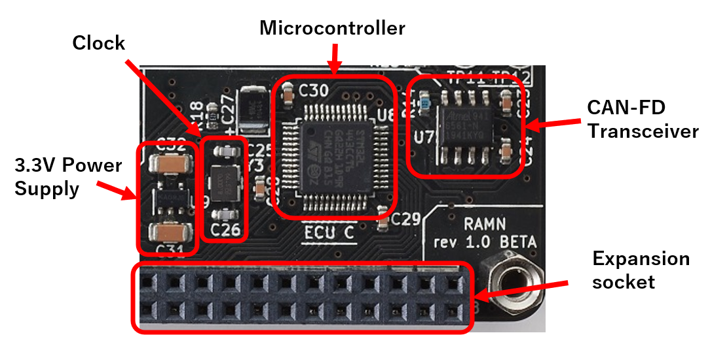

ECUs
====

There are 4 ECUs on RAMN's main board, and they all share a common design and pin assignment, which is detailed below.

.. toctree::
   :maxdepth: 3
   
   powersupply
   microcontroller
   canphy
   
   

   Annotated close-up picture of ECU C.
   