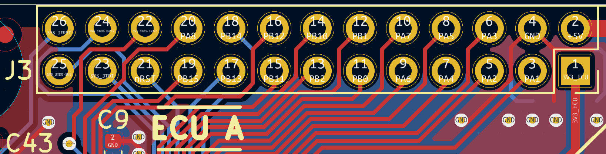
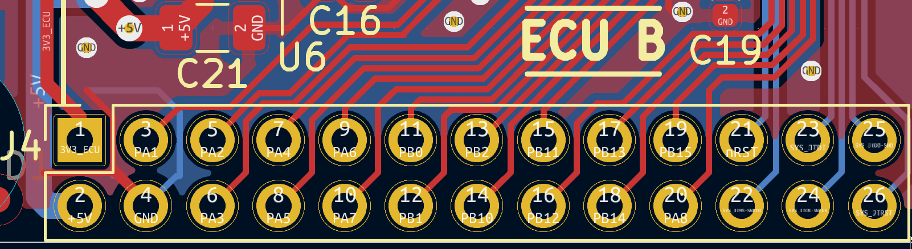
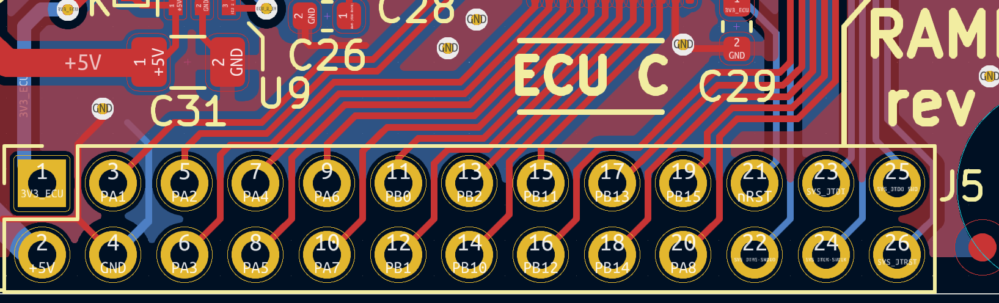
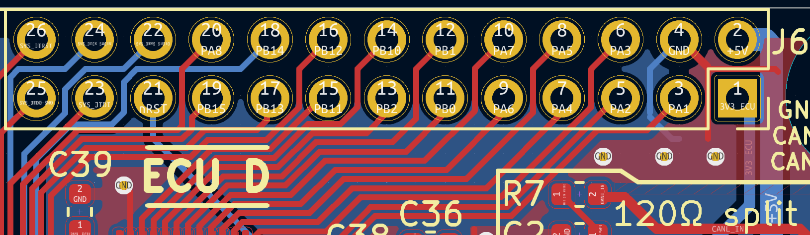

.. _expansions:

Expansion Port
==============

The ECU expansion port is a 26-pin socket:

- RAMN's main PCB main uses **M20-7831346** connectors (2.54mm pitch, two 13-pin rows).
- ECU A expansion (connected vertically) uses an **Amphenol 68021-226HLF** connector.
- ECU B, C, and D expansions (connected horizontally) use **SAMTEC SSQ-113-03-G-D** connectors (SSQ-113-23-L-D, SSQ-113-23-F-D, SSQ-113-23-T-D should also be compatible).

All ECUs share a common hardware peripheral configuration, so that programming is easier and misconfigurations are less likely to happen.
For example, the PA1 pin is always configured as an ADC. In the chassis expansion, it is connected to the steering wheel potentiometer.
In the powertrain expansion, it is connected to the brake potentiometer. Each expansion has different sensors and circuitry, but the ECUs still share the same peripheral configuration.
This also means that binary inputs (such as the side-brake) are treated as ADC inputs instead of simple GPIO inputs.

Designing a Custom Expansion
----------------------------

You can use **SAMTEC SSQ-113-03-G-D** connectors to create new expansions stackable with other expansions (see :ref:`expansions_demo`), as long as you avoid conflicts.
To get started, we recommend that you make a copy of the debugger expansion in the `hardware/V1_revB/5_debugger` folder and modify it with `KiCAD <https://www.kicad.org/>`_.
This expansion uses the stackable **SAMTEC SSQ-113-03-G-D** connector, and already features all possible signals - simply delete what you do not need.

The following pins are **actively used** by the original RAMN expansions:

- **PA1 :** ADC (ECU B, C, D).
- **PA4 :** ADC (ECU B, C, D).
- **PA5 :** ADC (ECU B, C, D).
- **PB2 :**  GPIO output, CS pin for SPI2 communications (display for ECU A, LED driver for ECU D).
- **PB12:** GPIO output, ST7789 display DC pin (ECU A) or LED driver LE pin (ECU D).
- **PB13:** SPI2 SCK (ECU A, D).
- **PB14:** SPI2 MISO (ECU A) - currently unused but reserved for future use.
- **PB15:** SPI2 MOSI (ECU A, D).

The following pins are always **free and can be used to create new expansions** compatible with any RAMN ECU.
**Some pins are pre-configured for your convenience, but you may use them in any configuration you want:**

- **PA2 :** 	free, pre-configured as LPUART1_TX.
- **PA3 :** 	free, pre-configured as LPUART1_RX.
- **PA6 :** 	free.
- **PA7 :** 	free.
- **PB0 :** 	free.
- **PB1 :** 	free.
- **PB10:** 	free, pre-configured as I2C2_SCL.
- **PB11:** 	free, pre-configured as I2C2_SDA.
- **PA8  :** 	free, pre-configured as additional SPI CS pin.

Although **PB13**, **PB14**, and **PB15** are already used, SPI protocol supports multiplexing, so you can reuse them for your expansion too, but only for SPI communications.
You only need to assign one **CS pin** per SPI device that you want to connect, and reuse the already defined **SPI2 SCK (PB13)**, **SPI2 MOSI (PB15)**, and **SPI2 MISO (PB14)** pins.
Note that for ECU A and D, you will need to share the SPI bandwidth, but it is possible to limit the original expansions' bandwidth to a minimum).

**If you need help selecting pins, read** :ref:`creating_expansion`.
Refer to the `STML552 datasheet <https://www.st.com/resource/en/datasheet/stm32l552cc.pdf>`_ (Table 21) for pin capabilities.
Typically, you can use the following interfaces:

- **LPUART1** (UART interface).
- **I2C2** (I2C interface, master or device).
- **SPI2** (SPI interface. On ECU A and D, you must share the bus with the exisiting application).
- **OCTOSPI1** (**NOT** regular SPI, but an interface typically used for external flash).
- **ADCs** (Analog-to-digital converters)
- **Timers/PWMs** (input or output).
- **GPIOs** (input or output).
- **External interrupts**.

.. warning::

	Although most interfaces are available simultaneously, there are a few conflicts, so remember to check for compatibility issues (see :ref:`creating_expansion`):
	
	- OCTOSPI1 cannot be used simultaneously with I2C2.
	- For ECU A and D, SPI2 can only be used in master mode.
	- If you want to use the (currently unused) SD Card reader on ECU A, you need to use PB10 as the SD Card SPI CS pin.

If the available pins are not enough, **consider making expansions compatible with only one ECU** (e.g., you can make an expansion that reassigns **PA1**, **PA2** and **PA5**, but that expansion will only be compatible with ECU A, and you will need to use a different peripheral configuration for ECU A).

.. warning::

	Avoid drawing more than a few mA from the 3V3 pin, because it is directly connected to the power supply of the ECU, which has limited capacity.
	Instead, you should draw power from the 5V pin, which is directly connected to the USB 5V line.

.. _expansion_pinout:

Pinout
------

The expansion port pinout is shown below.

.. figure:: img/ecu_socket_pinout.png
   
   ECUs expansion port connections.

The pinout is the same for all ECUs. They are oriented differently depending on their location on the board.
Refer to the following KiCAD screenshots to ensure that you have the correct orientation.

   
   Layout of ECU A's expansion port.

   Layout of ECU B's expansion port.

   Layout of ECU C's expansion port.

   Layout of ECU D's expansion port.