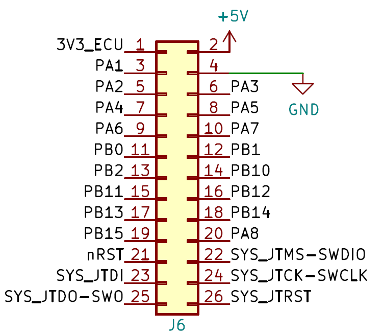
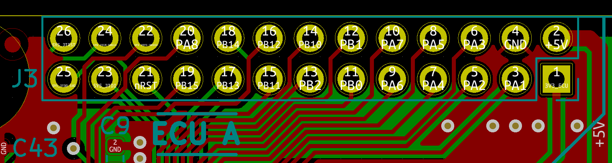

.. _expansions:

Expansion socket
=================

The expansion port of each ECU is a 26-pin socket.

By default, all ECUs share a common hardware peripherals configuration, so that programming is easier and so that misconfigurations are less likely to happen.

For example, PA1 is always configured as an ADC. In the chassis expansion, it is connected to the steering wheel potentiometer. In the powertrain expansion, it is connected to the brake potentiometer. Different sensors and circuits, but same peripherals configuration in the ECU. This also means that binary inputs (such as the side-brake) are treated as ADC input instead of GPIO input.

By default, features of pins are assigned as shown below.

=====  =====  ===== ===== =====  ===== =====  ===== ===== ===== ===== =====  =====   =====   =====   =====  =====
PA1    PA2    PA3   PA4   PA5    PA6   PA7    PB0   PB1   PB2   PB10   PB11  PB12    PB13    PB14    PB15   PA8

ADC    QSPI   QSPI  ADC   ADC    QSPI  QSPI   QSPI  QSPI  GPIO  GPIO  GPIO   GPIO    SPI2    SPI2    SPI2   GPIO

=====  =====  ===== ===== =====  ===== =====  ===== ===== ===== ===== =====  =====   =====   =====   =====  =====

Please refer to the `latest pinout description file <https://github.com/ToyotaInfoTech/RAMN/blob/main/hardware/V1/RAMNV1_pinout.pdf>`_ on Github for the exact assignment.

   
   ECUs expansion port connections.

   
   Layout of ECU A's expansion port, as seen in KiCAD.	 