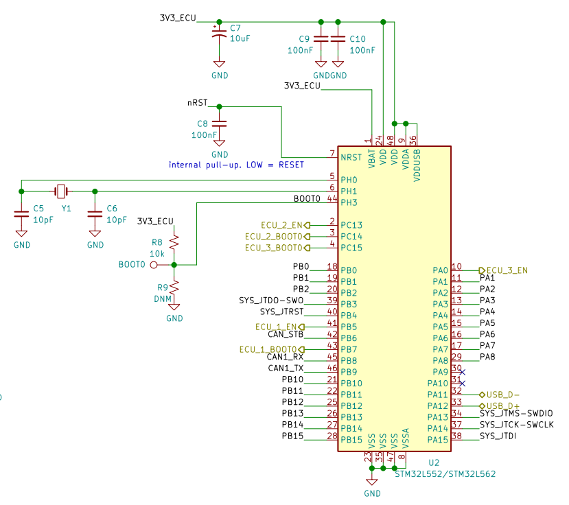
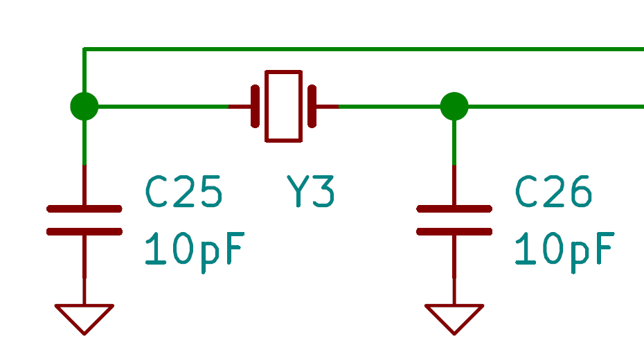
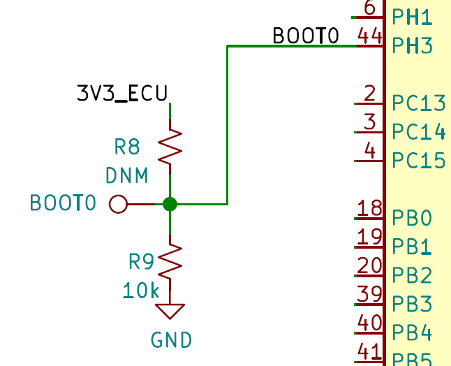
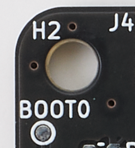

.. _microcontroller:

Microcontroller
===============

Microcontroller selection
-------------------------

The ECUs can be populated with microcontrollers from either the STM32L4 or STM32L5 family. More precisely, the ECUs can accomodate the following microcontrollers:

* STM32L433CxTx (e.g.  STM32L433CCT6)
* STM32L443CxTx (e.g.  STM32L443CCT6)
* STM32L552CxTx (e.g.  STM32L552CET6)
* STM32L562CxTx (e.g.  STM32L562CET6)

.. note:: For `STM32L microcontrollers <https://www.st.com/resource/en/datasheet/stm32l562ce.pdf#page=336>`_, the last four letters of the part number are used to specify:

   * Pin count (C -> 48 pins)
   * Flash Memory size (C -> 256 KB, E -> 512 KB)
   * Package ( T -> LQFP)
   * Temperature range (3 -> from -40 to 125 degrees C, 6 -> from -40 to 85 degrees C)

   RAMN requires the microcontrollers to be in a LQFP48 package.
   
The newest `STM32L5 <https://www.st.com/resource/en/datasheet/stm32l562ce.pdf>`_ family offers many advantages over the `STM32L4 <https://www.st.com/resource/en/datasheet/stm32l443vc.pdf>`_ family, notably:

* Better CPU performances (165DMIPS vs 100DMIPS)
* More RAM (512kB vs 64kB)
* TrustZone and other security features
* Integrated CAN-FD controller

as such, we use the `STM32L552CET6 <https://www.st.com/resource/en/datasheet/stm32l552ce.pdf>`_ as the standard microcontroller for RAMN. Source code for STM32L4 family, used in the BETA version of RAMN, is published on the github repository but is not maintained.

Although not automotive-grade, the STM32L5 microcontrollers have characteristics and features typical of automotive-grade microcontrollers. This makes them a good choice for simulating ECUs using readily-available components (not requiring NDAs or high volumes).

Surrounding circuitry
---------------------

   Circuitry surrounding the ECUs' microcontroller.
   
As much as possible, we try to follow the `hardware design guidelines <https://www.st.com/resource/en/application_note/dm00532722-getting-started-with-stm32l5-series-hardware-development-stmicroelectronics.pdf>`_ of STMicroelectronics. 
The microcontroller VDD pins are connected to individual 100nF `decoupling capacitors <https://en.wikipedia.org/wiki/Decoupling_capacitor>`_, and a common 10uF capacitor. The RST pin is also connected to a 100nF capacitor.
To save space, the VDDA pin is **NOT** connected to external decoupling capacitors and ferrite beads. Similarly, VBAT does not feature a decoupling capacitor.

Clock
*****

A crystal from the NX3225GD is selected as the clock source of the microcontroller. The `NX3225GD family <https://www.ndk.com/en/products/search/crystal/1189074_1494.html>`_ is automotive-grade, is 	present on the `STM32 compatible crystals list <https://www.st.com/resource/en/application_note/cd00221665-oscillator-design-guide-for-stm8afals-stm32-mcus-and-mpus-stmicroelectronics.pdf>`_ and has also been selected on some `Nucleo designs <https://www.st.com/resource/en/user_manual/dm00231744-stm32-nucleo32-boards-mb1180-stmicroelectronics.pdf>`_ .
NX3225GD crystals are widely available in 8MHz and 10MHz version. RAMN can be used with both, but because of the internal PLL circuitry, the 8MHz does not allow reaching the maximum system clock of 110MHz for the STM32L5 family. Therefore, the 10MHz crystal is preferred.

The NX3225GD crystal has a load capacitance of 8pF, which is relatively low compared to similar products. Assuming a stray capacitance of 3pF, two external 10pF capacitors were selected to approximate a 8pF load (3 + 10/2 = 8).

Although not ideal, the layout follows best practice by keeping the crystal close to the microcontrollers, and shielding the clock lines from other signals.

   Clock circuitry on every ECU.

Boot Selection Resistors
************************

Please refer to the Boot section of more information on how ECUs boot.
On STM32L4 and STM32L5 families, the BOOT0 pin is used by default to specify in which mode the microcontroller should start.
Resistors R8 and R9 can be used to select the BOOT0 pin state of ECU A. Only ONE of those resistors should be populated at a time.

   Boot mode selection resistors of ECU A.

The `boot patterns <https://www.st.com/resource/en/application_note/cd00167594-stm32-microcontroller-system-memory-boot-mode-stmicroelectronics.pdf#page=24>`_ are different for STM32L4 (Pattern 6) and STM32L5 (Pattern 12)

STM32L4 will start the embedded bootloader when the flash memory is unprogrammed. This means a freshly-made board can directly be programmed over USB, no matter the state of BOOT0.
Therefore, we use R9 to pull the BOOT0 pin down, and R8 is not populated. On the first connection, ECU A will start in DFU mode and be ready for programming over USB. Once ECU A is programmed, and because BOOT0 is pulled down, the board will launch the programmed firmware from the next reboot.

STM32L5 will **NOT** start the embedded bootloader even if the flash memory is unprogrammed. To ensure a fresh board can be programmed over USB, we therefore need to use R8 to pull the BOOT0 pin up and force the ECU to start in DFU bootloader. R9 is left unpopulated.
This means that ECU A will **always** start in STM32 bootloader mode, until the option bytes are overwritten with new values forcing another boot process.

Finally, the BOOT0 pin of ECU A can be accessed externally through a test pad next to the USB port. It can be used to change the boot mode temporary at any time.

   ECU A Boot0 test pad.

The BOOT0 pin of ECUs B, C, and D are controlled by ECU A. ECU A should ensure the BOOT0 pin of each ECU is properly set before activating their power supply.