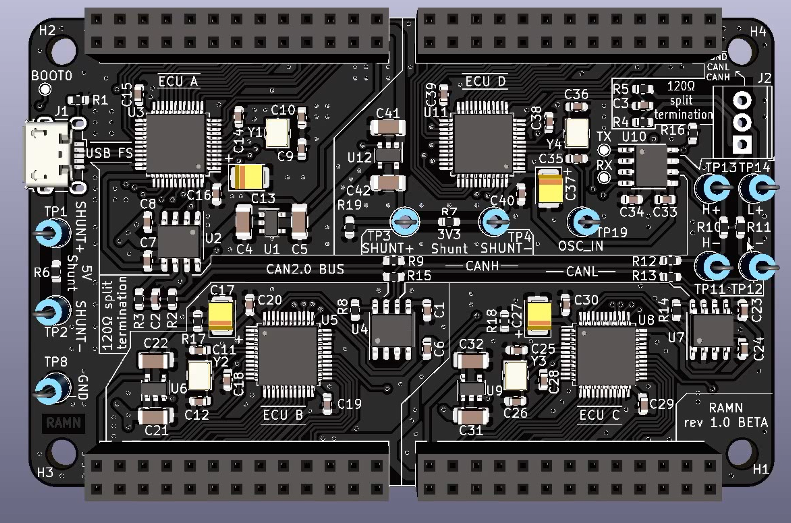
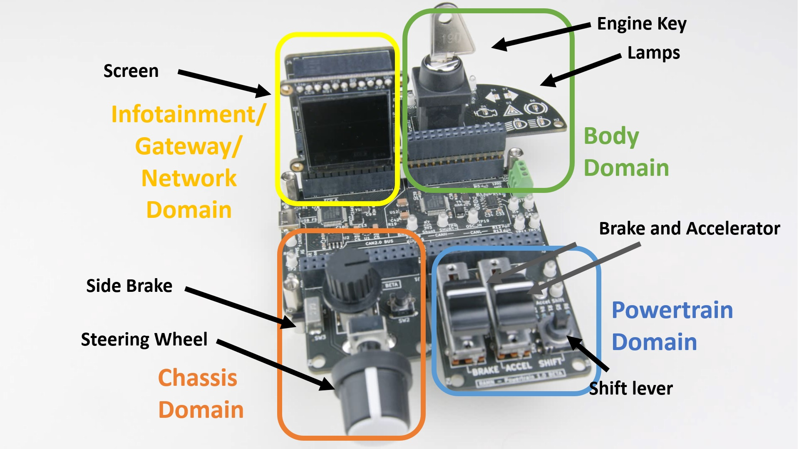
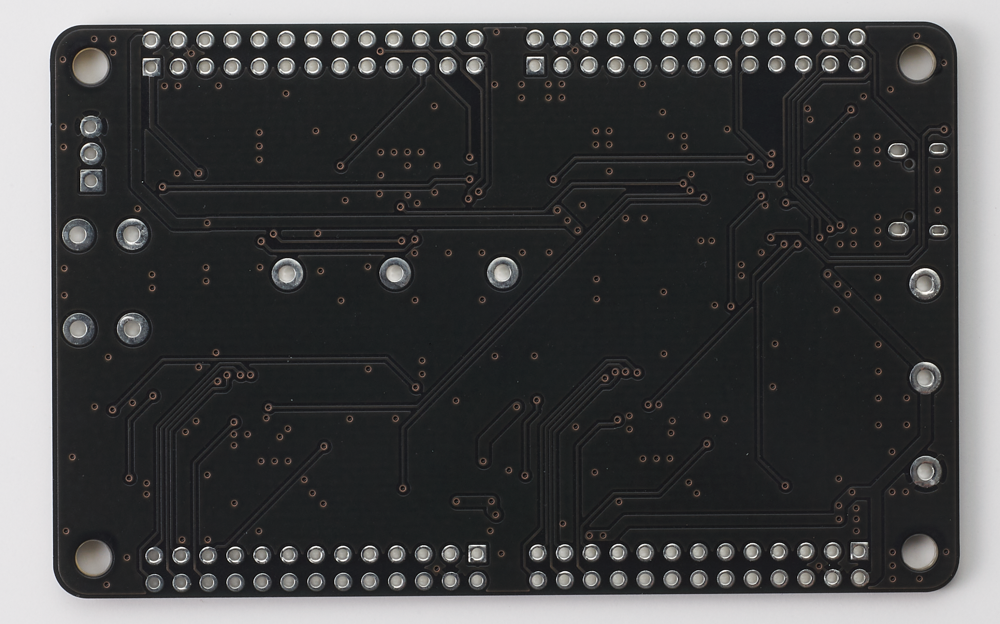
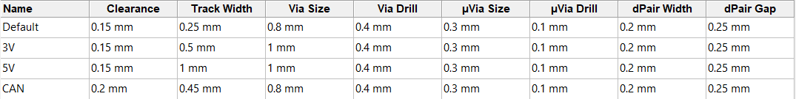
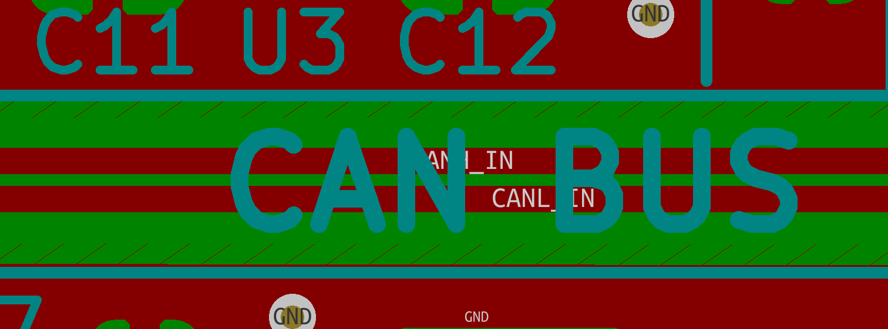
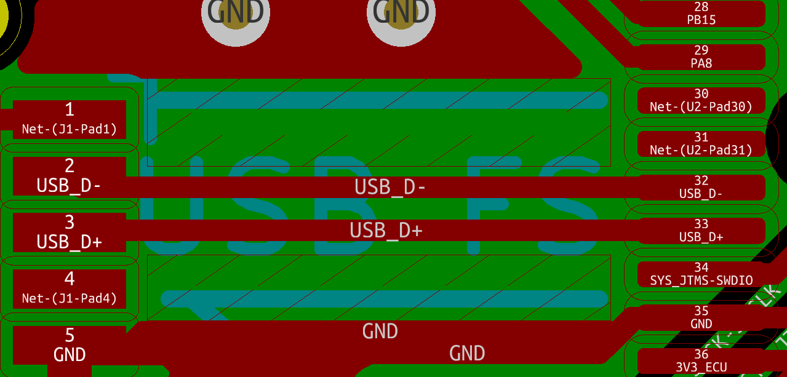

.. _hardware_overview:

Overview
========

CAD Software
------------

PCBs are designed using `KiCAD <https://kicad.org/>`_, which is an open-source tool for PCB design.
Design files can be found in the `hardware/V1_revB` folder of the `Github repository <https://github.com/ToyotaInfoTech/RAMN>`_:

- `0_ramn` contains design data for RAMN's main PCB.
- `1_screens` to `5_debuggers` contain design data for RAMN's expansions.

.. figure:: img/kicad1.png

   PCB CAD view of RAMN in KiCAD
   
   

   3D view of RAMN in KiCAD

Design
------

RAMN's main board is a credit-card size PCB with 4 ECUs, a CAN FD bus and a USB port.

.. figure:: img/ramn_board.jpg

   Main board of RAMN

RAMN's main board can be expanded with expansions boards to add features such as sensors and actuators.

   Simple setup of RAMN with 4 expansions: SCREENS (GATEWAY), CHASSIS, POWERTRAIN, BODY.

ECUs (Electronic Control Units)
*******************************

There are 4 ECUs on RAMN (ECU A, ECU B, ECU C, and ECU D), and they all share a common design:

* :ref:`An individual power supply <powersupply>`
* :ref:`A Microcontroller <microcontroller>`
* :ref:`A CAN FD transceiver <canphy>`
* :ref:`An expansion port <expansions>`

ECU A additionally features a USB connection. The USB port is the main 5V power supply for the whole board, and is also used as a mean to reprogram all ECUs.
ECU A has 6 `GPIOs <https://en.wikipedia.org/wiki/General-purpose_input/output>`_ that are used to control:

* The power supply of ECU B, ECU C, and ECU D
* The boot mode (BOOT0 pin) of ECU B, ECU C, and ECU D

ECU D has an additional `shunt resistor <https://en.wikipedia.org/wiki/Shunt_(electrical)#Use_in_current_measuring>`_ and clip-on probes for easier measurements.

CAN/CAN FD bus
**************

RAMN features a `CAN FD <https://en.wikipedia.org/wiki/CAN_FD>`_ bus that connects the 4 ECUs and is terminated on both side by `120ohm split-terminations <https://e2e.ti.com/blogs_/b/industrial_strength/posts/the-importance-of-termination-networks-in-can-transceivers>`_.

**By default, RAMN only uses classic CAN messages and can be used with classic CAN controllers.**

The CAN FD bus features `shunt resistors <https://en.wikipedia.org/wiki/Shunt_(electrical)#Use_in_current_measuring>`_ and clip-on probes for easier measurements as well.

The CAN FD bus can be accessed from outside through a `terminal block <https://en.wikipedia.org/wiki/Screw_terminal>`_.

Block Diagrams
**************

.. figure:: img/block_diag.jpg

   Simple Block diagram of RAMN's main board.

.. figure:: img/block_diag_gpio.png

   Block Diagram of RAMN showing connection between ECUs.

Hardware Design Rules
---------------------

Guidelines
**********

RAMN aims to promote education and research in automotive systems. To stay close to automotive electronics, we use AEC-Qxxx grade 0 (or equivalent) components for the ECU network board. To keep the board small and affordable, many protections (e.g. ESD protection, pull-up/pull-down resistors, etc.) are omitted, and the board would not meet reliabilily levels required in safety-critical systems.

.. figure:: img/front_pcb.png

   Picture of RAMN PCB's front size, before components soldering.

   Picture of RAMN's PCB's back size, before components soldering.

All boards are designed using only two layers, with all components on the same side. 
The boards have large manufacturing tolerances (e.g. large track width and clearance), and we restrict components to those with visible external pins, unless there really is no viable alternative.
All those elements ensure that the PCBs can be manufactured and assembled at a low cost. The board is also accessible to hobbyists who would like to fabricate and solder the board themselves.

   Design tolerances for RAMN's PCB.

.. _impedance_matching:

Impedance Matching
******************

Since frequencies involved in RAMN are relatively low, proper impedance matching is not a high priority. However, good design guidelines are followed when possible.

CAN/CAN-FD Bus
^^^^^^^^^^^^^^

Although the quality of the CAN/CAN-FD bus line is limited by the tight layout, the many connections, and the use of only 2 layers, we tried to keep a 120ohm differential impedance on the CAN-FD bus.
More precisely, we used a trace width of 0.45mm and a spacing of 0.2mm, which according to `EEWeb's Edge Coupled Microstrip Impedance calculation tool <http://eeweb.com/tools/edge-coupled-microstrip-impedance/>`_, should lead to a 120ohm differential impedance on a standard 35um copper 1.6mm FR-4 thick layout.

   Layout of the CAN-FD bus.

USB
^^^

For the USB line, no impedance matching is attempted. Instead, we follow `FTDI's recommendations for USB hardware design <http://ftdichip.com/Documents/AppNotes/AN_146_USB_Hardware_Design_Guidelines_for_FTDI_ICs.pdf>`_:

* Equal length for D+ and D-
* Ground plane under the D+ and D-
* Etc.

   Layout of the USB connection.
   
