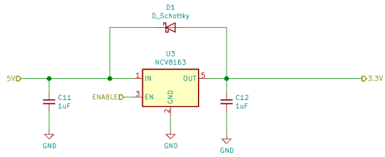

.. _powersupply:

Power Supply
============

All ECUs have their own independent power supply, but all power supplies share this common design.

   Power supply used by ECUs. 

The power supply blocks transforms the USB 5V power supply into a 3.3V power line that is used to power the STM32L5 microcontroller of the ECU.

This operation is achieved using an `NCV8163 <https://www.onsemi.com/pdf/datasheet/ncv8163-d.pdf>`_, an `LDO <https://en.wikipedia.org/wiki/Low-dropout_regulator>`_ from ON Semiconductor.
The NCV8163 only requires 1uF capacitors at its input and output. It also features an **ENABLE** pin, which can be used to power ON and OFF ECUs individually.

The NCV8163 is an Ultra-Low Noise regulator qualified for automotive use, making it a perfect choice for studying side-channel analysis of ECUs. 
While it is designed to handle a maximum 250 mA output current, the small package (TSOP-5) and the layout of RAMN make it unlikely that it could handle the power dissipation associated with high currents. As such, the NCV8163 is only used to power the microcontroller of the ECU. 

.. warning:: Although the 3.3V line is available on the expansions pin header of each ECU, it is not advised to draw too much current from it. 
   When a 3.3V power supply is needed on an expansion board, we usually add another NCV8163 dedicated to it, ensuring stacking many boards would not lead to over-temperature conditions.

During our evaluation tests, we did not notice abnormal temperature elevation, even at full CPU speed and many peripherals activated. The NCV8163 features protection against current overload, output short-circuit and overheating.
According to the `datasheet's recommendations <https://www.onsemi.com/pdf/datasheet/ncv8163-d.pdf#page=14>`_, we added an external Shottky diode to protect the NCV8163 against reverse currents. 

.. note::  Except for ECU A, all power supplies have their ENABLE pin pulled-down (= power supply OFF). ECU A must actively enable the power supply of ECU B,C,D. ECU B,C,D will stay unpowered if ECU A is not programmed correctly.
