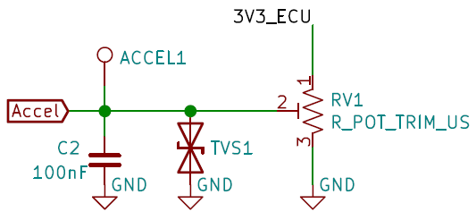
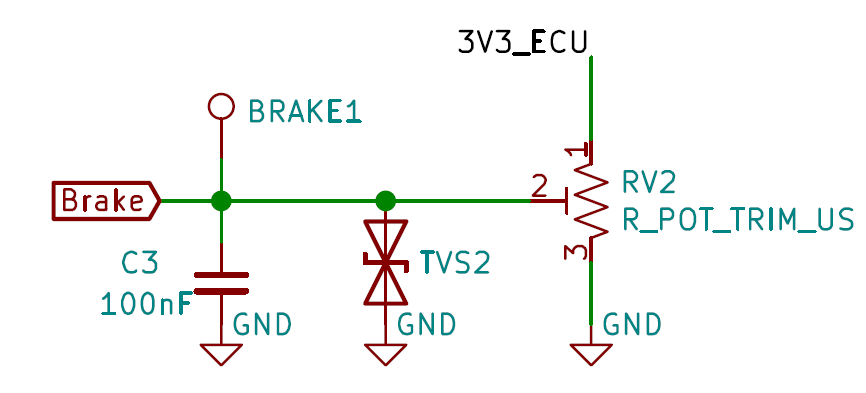
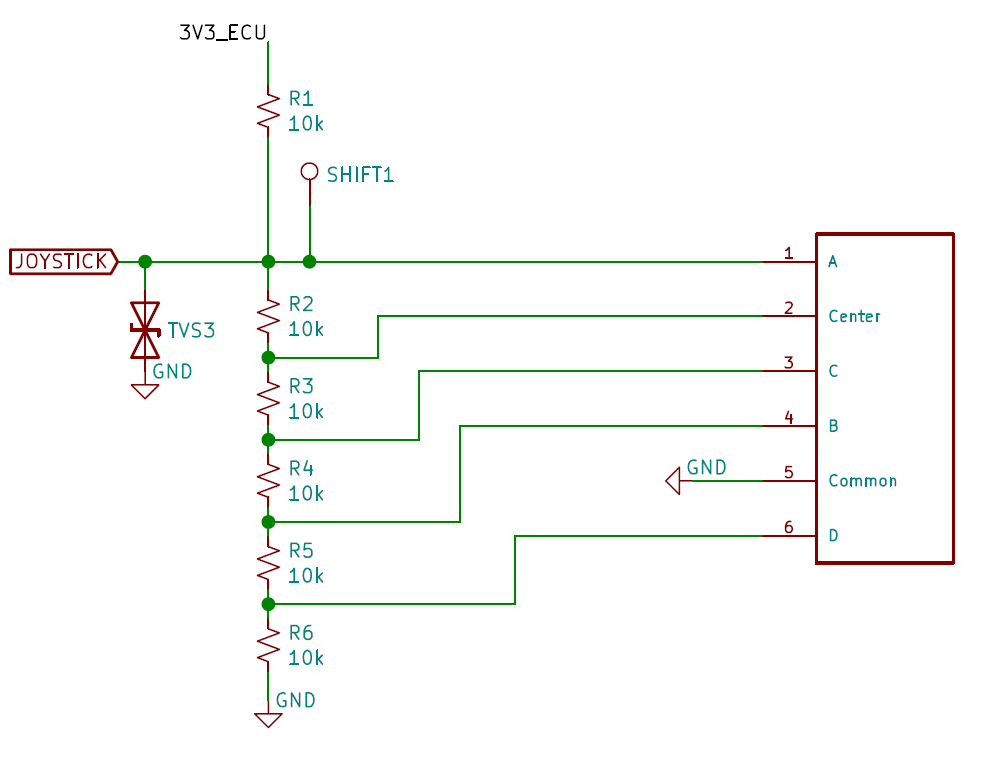
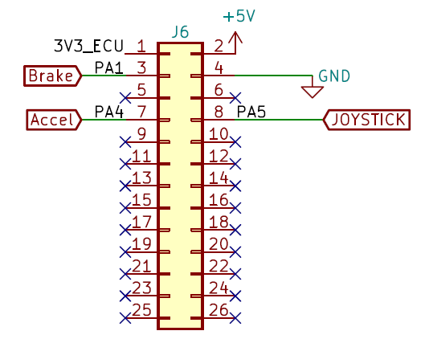

Powertrain
==========

The POWERTRAIN expansion is used to simulate some functions usally found in the Powertrain domain of a car:

* Accelerator
* Brake
* Shift lever

.. image:: img/powertrain/powertrain.png
   :align: center
   
.. image:: img/powertrain/powertrain_tilt.png
   :align: center
   
Accelerator
--------------

The accelerator is simulated by a sliding potentiometer. A `TVS diode <https://en.wikipedia.org/wiki/Transient-voltage-suppression_diode>`_ is used for ESD protection, and a capacitor also protects the ECU input from chattering.

	Schematic of the Accelerator circuitry
	
Brake
-----

The brake is simulated by a sliding potentiometer, with the same circuitry as the accelerator. A `TVS diode <https://en.wikipedia.org/wiki/Transient-voltage-suppression_diode>`_ is used for ESD protection, and a capacitor also protects the ECU input from chattering.

	Schematic of the Brake circuitry
	
Shift lever
-----------

The shift lever is simulated by a 4-direction joystick, with center-push function. The selected component is a `SKRHADE010 <https://tech.alpsalpine.com/prod/e/html/multicontrol/switch/skrh/skrhade010.html>`_ from Alps Alpine.

We originally selected the SKQUCAA010, also from Alps Alpine, which is easier to manipulate, but that part is reaching its `EOL <https://en.wikipedia.org/wiki/End-of-life_product>`_ and might not be easy to find soon.

The motion of the joystick selects a point from a `voltage divider <https://en.wikipedia.org/wiki/Voltage_divider>`_ , which is measured by an ADC on the ECU. A `TVS diode <https://en.wikipedia.org/wiki/Transient-voltage-suppression_diode>`_ is used for ESD protection.

	Schematic of the Shift Lever circuitry
	
	
Pinout
------

	Pinout of the POWERTRAIN expansion's connector

