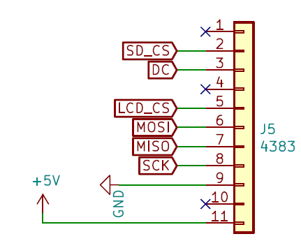
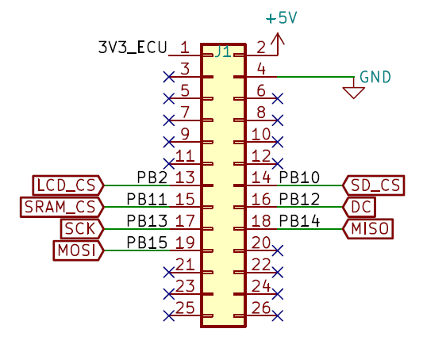

Screens (Gateway/Infotainment)
==============================

The SCREENS expansion is used to add a screen to an ECU. Although it can be used on any ECU, it is by default the expansion we use for ECU A (Gateway ECU). 

.. image:: img/screens/screens.png
   :align: center
   
.. image:: img/screens/screens_tilt.png
   :align: center
   
This expansion features various `pin sockets <https://en.wikipedia.org/wiki/Pin_header>`_ to connect screens from `Adafruit <https://www.adafruit.com/>`_.
Our preferred choice is the 240x240 TFT color Screen `Adafruit 4313 <https://www.adafruit.com/product/4313>`_, since it has a good balance between size, readability, and cost.

We selected those screens mainly because they can be powered by 5V but controlled by 3.3V logic, without external components.

.. warning:: We only tested screens for the J5 pin sockets. Other screens are not guaranteed to work.

Compatible Screens
------------------

J5
******

* `Adafruit 4383 <https://www.adafruit.com/product/4383>`_
* `Adafruit 4313 <https://www.adafruit.com/product/4313>`_
* `Adafruit 4311 <https://www.adafruit.com/product/4311>`_
* `Adafruit 3533 <https://www.adafruit.com/product/3533>`_

J2 (Untested)
*************

* `Adafruit 1431 <https://www.adafruit.com/product/1431>`_
* `Adafruit 1673 <https://www.adafruit.com/product/1673>`_

J3 (Untested)
*************

* `Adafruit 4086 <https://www.adafruit.com/product/4086>`_
* `Adafruit 4197 <https://www.adafruit.com/product/4197>`_
* `Adafruit 4098 <https://www.adafruit.com/product/4098>`_
* `Adafruit 4196 <https://www.adafruit.com/product/4196>`_
* `Adafruit 3625 <https://www.adafruit.com/product/3625>`_

J4 (Untested)
*************

* `Adafruit 326 <https://www.adafruit.com/product/326>`_
* `Adafruit 938 <https://www.adafruit.com/product/938>`_

Pinout
------

	Pinout of the SCREENS expansion's connector

