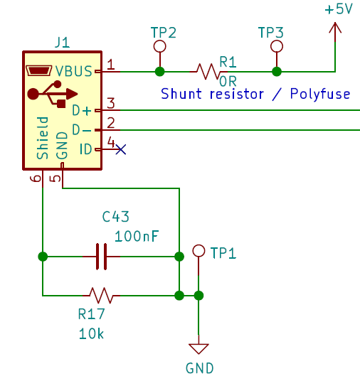

USB
==========

USB is used for two purposes:

* Power supply of 5V to all ECUs and expansions.
* Communication between ECU A and USB host.

Designing a device suitable for `USB-IF certification <https://www.usb.org/compliance>`_ requires to follow `many guidelines <https://www.ftdichip.com/Documents/AppNotes/AN_146_USB_Hardware_Design_Guidelines_for_FTDI_ICs.pdf>`_.
Since RAMN is not meant to be used as a "proper" USB device (such as a keyboard, mouse, etc.) we do not attempt to fulfill all USB-IF requirements. Concretely, this means there is no "VBUS filter" on the board (ferrite beads, etc.)

The USB connection circuit simply features an RC filter between SHIELD and GROUND. A `Shunt resistor <https://en.wikipedia.org/wiki/Shunt_(electrical)#Use_in_current_measuring>`_ can be used for simple power analysis. It is also possible to replace the shunt resistor by a `polyfuse <https://en.wikipedia.org/wiki/Resettable_fuse>`_.

   USB connection circuitry.
   
.. warning:: Unless you replace the shunt resistor by a fuse, RAMN assumes that the USB host is protected against failures of its loads (short-circuits, etc.). There is no special ESD protection except for a simple RC filter.

   