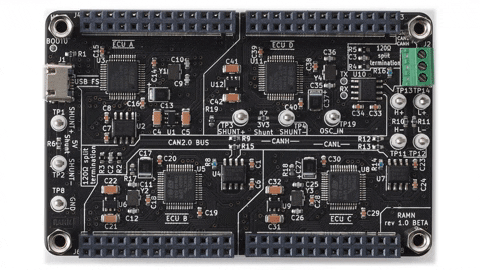
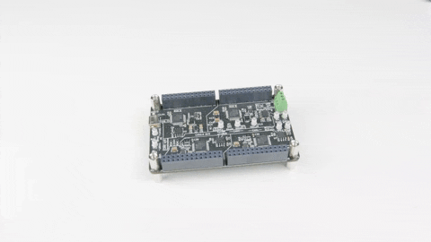

.. _quickstart_guide:

Quick Start Guide
=================

Understanding The Board
-----------------------

To start using RAMN, you need the main board, with the four ECUs on it.

You can identify the ECUs on the board from the silkscreen:

- ECU A is at the top left, next to the USB connector.
- ECU B is below ECU A.
- ECU C is to the right of ECU B.
- ECU D is to the right of ECU A.

Adding Expansions
-----------------

To physically interface with the ECUs, you can add expansions to each ECU.
These expansions should be connected as shown in the animation below.

.. note::
    If you do not plan to use the controls (for example, if you only want to try UDS commands), the expansions are not required.

You can look at the silkscreen to identify the role of each control:

- ECU A has a screen on which it can display information about the CAN bus.
- ECU B has a rotating potentiometer to simulate the steering wheel, a two-position switch to simulate the parking brake, and a rotating four-position switch to simulate the lighting controls.
- ECU C has a sliding potentiometer to simulate the accelerator pedal, another sliding potentiometer to simulate the brake pedal, and a joystick to simulate the gear stick. This joystick can be pressed up/down to request a gear change, right/left to control the turn indicators, and middle-pressed to simulate a horn press.
- ECU D has an engine key and eight LEDs. The engine key has three positions: OFF, ACC (Accessory), and IGN (Ignition).

.. _try_out_controls:

Trying Out Controls
-------------------

The LEDs on ECU D's expansion simulate a simple dashboard. They can help you verify that each control is working correctly.
By default, the CAN bus is always active when the power is on, so you may leave the controls in whatever state you prefer (e.g., engine key OFF).

- LED D1 is the left turn indicator. It should start blinking if you left-press the joystick of ECU C.
- LED D2 is the right turn indicator. It should start blinking if you right-press the joystick of ECU C.
- LED D3, D4, and D5 represent the clearance light, the lo-beam, and the hi-beam, respectively. They should light up in order when you turn the lighting control switch on ECU B.
- LED D6 is the "battery" indicator. By default, it is ON when the engine key is either on "ACC" or "IGN".
- LED D7 is the "check engine" indicator. By default, it is ON when the self-driving algorithm is used and the steering wheel potentiometer is not centered. It is used to indicate that the self-driving algorithm commands are currently ignored, and the current position of the steering wheel potentiometer is applied instead.
- LED D8 is the "parking brake" LED. It is ON when the parking brake is active. Contrary to a real vehicle, this LED is also ON when the brake pedal is pressed.

.. note::
    Although the "battery" and "check engine" are scary in a real vehicle, they do not indicate a problem of failure with your RAMN board.

.. warning::
    If the screen does not say "STEER 0%" when you center the steering wheel, it means that you have installed a logarithmic firmware for a board with linear potentiometers, of vice-versa.
    The board is still usable as is, but you will probably need to update the firmware of ECU B if you want the drive a vehicle in the simulator.

Before going any further, you should verify that you board works correctly. Connect your board to the USB port of your computer, or to a USB power supply that can provide more than 300mA. The status of each control should be displayed at the bottom of the screen of ECU A.
Move each control and verify that its status is updated on the screen (and LEDs, when applicable).
If that is not the case, you may need to reflash you board (See :ref:`flashing`).

Choosing Your CAN Adapter & Tools
-----------------------

To interact with RAMN's CAN bus, you have two options for adapters:

1. Use your own adapter, e.g., publicly available CAN adapters such as CANtact, and software such as savvyCAN.
2. Use RAMN built-in adapter (RAMN itself acts as an "slcan" adapter over USB, so if your software is compatible with slcan you do not need to connect any hardware).

And also two options for (software) tools:

1. Use your own tools, e.g., SavvyCAN, BUSMaster, scapy-automotive, your own python-can scripts.
2. Use the Linux built-in tools (i.e. can-utils).

If you want to use your own adapter, you only need to connect the "CANH" and "CANL" wires of your adapter to the terminal block of the CAN bus of RAMN, located at the top right of the board.
Each pin of the terminal block consists of a large round hole, and a smaller rectangular hole. You should insert the wire that you want to connect in the round hole, and an internal spring will lock it in place.
To remove a wire, insert something in the rectangular hole (e.g., a precision scew driver) and pull the wire.
The terminal block has three pins, and the corresponding signals are labeled on the silkscreen next to it:

- Top pin is GND (Ground).
- Middle pin is CANL (CAN Low).
- Bottom pin is CANH (CAN High).

You only need to connect the CANH and CANL pins of RAMN to the CANH and CANL pins of your CAN adapter.
After that, you should be ready to use your favorite set of tools. The CAN bus is always active as long as the RAMN board is powered.

The rest of this documentation focuses on built-in RAMN adapter and built-in Linux tools.

Using Built-in Tools
--------------------

To get started with CAN bus analysis on RAMN, we recommended that you prepare a Linux environment (virtual or native) with can-utils.

.. _install_linux:

Preparing a Linux Machine with can-utils
^^^^^^^^^^^^^^^^^^^^^^^^^^^^^^^^^^^^^^^^

Windows
"""""""

On Windows, we recommend that you install VirtualBox and use a Linux distribution image. A common choice by car enthusiasts is Kali Linux [#f1]_. 

.. [#f1] If you cannot (or will not) run Linux in a VM for can-utils, we reccomend learning and using the platform-independent python-can which will work on all (python) platforms.

- `Download and install VirtualBox <https://www.virtualbox.org/wiki/Downloads>`_.
- `Download a Kali Linux VirtualBox Image <https://www.kali.org/get-kali/#kali-installer-images>`_.
- Unzip the 7z image using `7zip <https://www.7-zip.org/>`_.
- Double-click the vbox file to open it with VirtualBox. If you encounter USB issues, open Settings > USB and try USB 2.0 or USB 3.0 (virtual machine must be powered off).
- Login with username kali (password kali).

From here, you should be able to follow the Linux instructions below.

Linux
"""""

- Open a terminal window (e.g., right-click the desktop and click "Open Terminal here").
- Type the following commands to install can-utils:

.. code-block:: bash

    $ sudo apt-get update
    $ sudo apt-get install can-utils

.. _end_install_linux:

USB Connection
^^^^^^^^^^^^^^

Connect your board to your computer using a USB cable. On Windows, it should appear as a "USB Serial Device" and be attributed a COM port number (e.g., COM1).
If that is not the case, you may need to install `STM32 Virtual COM Port Drivers <https://www.st.com/en/development-tools/stsw-stm32102.html>`_.

Once the board is recognized by windows, you must forward the USB port to Virtual Box. Select Devices > USB and click Toyota Motor Corporation RAMN Virtual ComPort.
You can open Devices > USB > USB Settings..., then click the + icon to add RAMN so that Virtual Box will always automatically forward the USB port.

On Linux, RAMN should appear at the end of the dmesg command, and be attributed a device file (typically, /dev/ttyACM0).

Starting slcand
^^^^^^^^^^^^^^^

By default, RAMN acts as an slcan adapter. You can use the slcand command to start RAMN as a native Linux CAN interface.

.. code-block:: bash

    $ sudo slcand -o -c /dev/ttyACM0 && sudo ip link set up can0

Replace /dev/ttyACM0 by the device file that was attributed by your computer.

After executing this command, you should be able to see the CAN interface as "can0" using ifconfig:

.. code-block:: bash

    $ ifconfig

Observing CAN Traffic with Cansniffer
^^^^^^^^^^^^^^^^^^^^^^^^^^^^^^^^^^^^^

To observe the most recent CAN message for each identifier and highlight bit changes, you can use the following command:

.. code-block:: bash

    $ cansniffer -c can0

The first two bytes of each message represent the status of something on the board. Try moving controls and observe how these values change.
The following two bytes represent a message counter, and the last 4 bytes represent a random value.

Dumping CAN Traffic
^^^^^^^^^^^^^^^^^^^

If you want to see all CAN frames instead of the most recent frame for each identifier, you can use the candump command.

.. code-block:: bash

    $ candump can0

This command will dump all CAN frames, which can be overwhelming.
You can use filters to only display specific CAN IDs. To add a filter, add ",<filter>:<mask>" after the name of your can interface.
For example, to only display ID 0x150, use the following command:

.. code-block:: bash

    $ candump can0,150:7ff

This command should only show CAN frames with ID 0x150. Move the lighting control switch on ECU B expansion and observe how the first byte changes.
This should allow you to understand how ECU B transmits the status of this switch on the CAN bus.

Sending CAN Frames
^^^^^^^^^^^^^^^^^^

You can use the cansend command to send CAN messages.
Make sure the lighting LEDs (LEDs D3 to D5 on the Body ECU expansion) are OFF by moving the Lighting controls switch on ECU B to the leftmost position.
You can send the following message to "spoof" the lighting controls:

.. code-block:: bash

    $ cansend can0 150#02
    $ cansend can0 150#03
    $ cansend can0 150#04

You should be able to briefly control the status of LEDs on the Body expansion from your terminal.
But only briefly, because ECU B is still sending CAN frames, overwriting your CAN messages. In fact, you may see an error message on ECU A indicating anomalies with the CAN bus, because two ECUs are sending CAN frames with the same ID.
To address this issue, you need to prevent ECU B from sending CAN messages. A quick method to do this is to use UDS.

Sending UDS Commands
^^^^^^^^^^^^^^^^^^^^

`UDS <https://en.wikipedia.org/wiki/Unified_Diagnostic_Services>`_ is a set of standard diagnostic commands that can be sent using the `ISO-TP <https://en.wikipedia.org/wiki/ISO_15765-2>`_ transport layer.
You can use the isotpsend, isotprecv, and isotpdump commands to easily interact with these layers.

Type the following command to dump CAN messages containing UDS commands:

.. code-block:: bash

    $ candump can0,7e0:7F0

This command will dump messages with IDs ranging from 0x7e0 to 0x7eF, which correspond to the IDs used by the UDS layer of RAMN.
It should show nothing now as no UDS messages are being sent.

Open another terminal, and type the following command:

.. code-block:: bash

    $ isotpdump -s 7e1 -d 7e9 -c -u -a can0

This command will dump and parse UDS commands for ECU B, which accepts commands at ID 0x7e1 and answers at ID 0x7e9.
This command should also show nothing for now.

Open yet another terminal, and type the following command:

.. code-block:: bash

    $ isotprecv -s 7e1 -d 7e9 -l can0

This command will receive and display the answers to the UDS commands that you send to ECU B.

Finally, open a fourth terminal and type the following command to send your first UDS command to ECU B:

.. code-block:: bash

    $ echo "3E 00" | isotpsend -s 7e1 -d 7e9 can0

Notice that the source and destination arguments have been swapped from the previous command.
This command sends the 2-byte command "3E 00" to ECU B, which corresponds to the "Tester Present" command.
This is an optional command to let the ECU now that you are currently diagnosing it and that it should wait for your commands.
You should see on your "isotprecv" terminal that ECU B has answered "7E 00", which means the command was accepted.
You can look at your "isotpdump" terminal and observe the corresponding interaction in color (red is the request, blue is the answer).
If you look at your "candump" terminal, you will observe the corresponding CAN messages. Notice that they are actually 3-bytes long: this is because the first byte is used to specify the length of the UDS payload, which is 2 bytes.

You can use UDS to send and receive large payloads. For example, use the "Read Data By Identifier" service (0x22) to ask the ECU its compile time (argument 0xF184):

.. code-block:: bash

    $ echo "22 F1 84" | isotpsend -s 7e1 -d 7e9 can0

You should see in your "isotprecv" terminal that you have received a large answer, that should be interpreted by your "isotpdump" terminal.
In your "candump" terminal, you can observe that many CAN messages have been exchanged. This corresponds to the ISO-TP layer, which allows sending large messages using only CAN frames with less than 8 bytes each.
Isotpdump, isotpsend, and isotprecv make this layer transparent to you.

Finally, you can use RAMN custom routine controls (UDS service 0x31) to ask ECU B to stop sending CAN messages (Routine 0x0200).

.. code-block:: bash

    $ echo "31 01 02 00" | isotpsend -s 7e1 -d 7e9 can0

Move the lighting switch and observe how the LEDs of ECU D do not change anymore.
You can now control the lighting switch with the following commands, without ECU B being in your way.

.. code-block:: bash

    $ cansend can0 150#02
    $ cansend can0 150#03
    $ cansend can0 150#04

Congratulations, you are now a CAN bus expert. Follow the full user guide to learn more.
