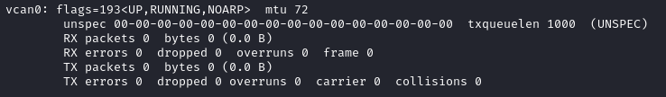
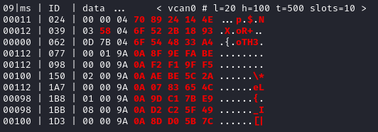
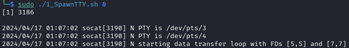
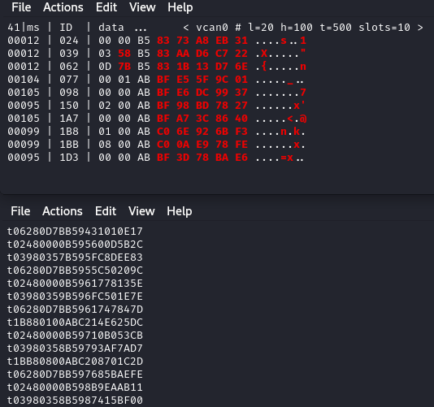
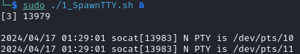
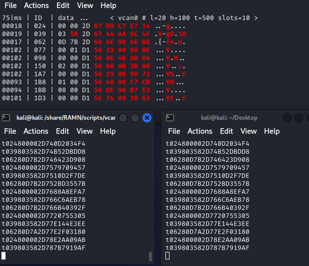

.. _vcand:

vcand
=====

CAN FD Support
^^^^^^^^^^^^^^

The vcand script can be used on Linux (and Linux only) to:

- Use the CAN FD features of RAMN directly with socketcan (i.e., as a CAN FD-compatible alternative to slcand).
- Multiplex RAMN's serial interface, so it can be opened by different applications at the same time.

To use it, start by executing *0_SetupVCAN.sh*:

.. code-block:: bash

    $ sudo ./0_SetupVCAN.sh

This should start a virtual CAN interface called "vcan0", which should show up with ``$ ifconfig``.

If you only want to use vcand for its CAN FD slcan support, you can run RAMN_VCAND.py from this step:

.. code-block:: bash

    $ sudo python RAMN_VCAND.py

You can select which serial port to use for RAMN by editing *VCAND_HARDWARE_PORT* (default: AUTODETECT) in *scripts/settings/linux.ini* or by using the -r option.
Then, you should be able to see RAMN's CAN traffic on vcan0, for example with:

.. code-block:: bash

        $ cansniffer -c vcan0

Contrary to slcand, this script will support CAN FD frames.

Serial Multiplexing (2 ports)
^^^^^^^^^^^^^^^^^^^^^^^^^^^^^

If you want to keep RAMN's serial port accessible even when Linux is using it as a CAN interface, you can use the multiplexing feature of this script.
Open a new terminal and execute:

.. code-block:: bash

        $ sudo ./1_SpawnTTY.sh

This will create a pair of virtual serial devices, in this case /dev/pts/3 and /dev/pts/4.

.. note::
    If you do not want to open several terminals, you can execute this script in the background instead:

    .. code-block:: bash

            $ sudo ./1_SpawnTTY.sh &

    If you do not see any output, try executing this command instead to spawn the terminals:

    .. code-block:: bash

            $ socat -d -d pty,raw,echo=0 pty,raw,echo=0

You must provide **the first device** that you created as a parameter to RAMN_VCAND.py, and you will be able to use **the second device** as you would use RAMN without multiplexing.

Execute the script with the -p1 argument to provide the path to the first device:

.. code-block:: bash

    $ sudo python RAMN_VCAND.py -p1 /dev/pts/3

From this step, you can use the vcan0 interface while still being able to access RAMN's serial port.
However, you should not use RAMN's hardware serial port (e.g., /dev/ttyACM0) anymore, but instead use the **second device** instead (in this case, /dev/pts/4).

For example, you can observe CAN traffic on vcan0 while accessing the serial terminal on /dev/pts/4:

.. code-block:: bash

    $ sudo picocom --imap crcrlf --echo /dev/pts/4

This will allow you for example to observe CAN traffic even when you are using CARLA scripts and diagnostic scripts.
To achieve this, you will need to set *PORT* in *scripts/settings/linux.ini* to the second pts (in this example, /dev/pts/4).

Serial Multiplexing (3 ports)
^^^^^^^^^^^^^^^^^^^^^^^^^^^^^

If you want to use a third port (to observe the CAN bus while you are using both the CARLA scripts and diagnostic scripts), you can execute 1_SpawnTTY.sh to spawn a new pair of devices.
Then, provide the **first device of each pair** as -p1 and -p2 arguments. You will then be able to use the **second device of each pair** as serial terminals.
Note that all data is mirrored between the two ports.

Execute the following command to spawn a new pair of virtual devices:

.. code-block:: bash

        $ sudo ./1_SpawnTTY.sh

Then, provide the **first devices of each pair** as -p1 and -p2 arguments:

.. code-block:: bash

    $ sudo python RAMN_VCAND.py -p1 /dev/pts/3 -p2 /dev/pts/10

.. warning::
    Make sure that you do not use two devices belonging to the same pair as -p1 and -p2 (e.g., ``-p1 /dev/pts/3 -p2 /dev/pts/4`` or ``-p1 /dev/pts/10 -p2 /dev/pts/11``), as this would create a feedback loop that would overflow the device.

Then, you should be able to access the ports from the **second devices**, in this example /dev/pts/4 and /dev/pts/11.
For example, you can type in two different terminals:

.. code-block:: bash

    $ sudo picocom --imap crcrlf --echo /dev/pts/4

and

.. code-block:: bash

    $ sudo picocom --imap crcrlf --echo /dev/pts/11

From this point, you should be able to interact with the same traffic from three different interfaces.

