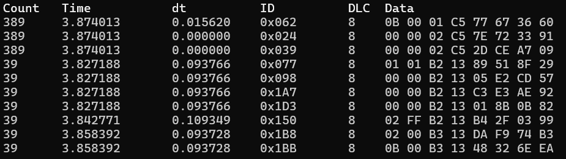
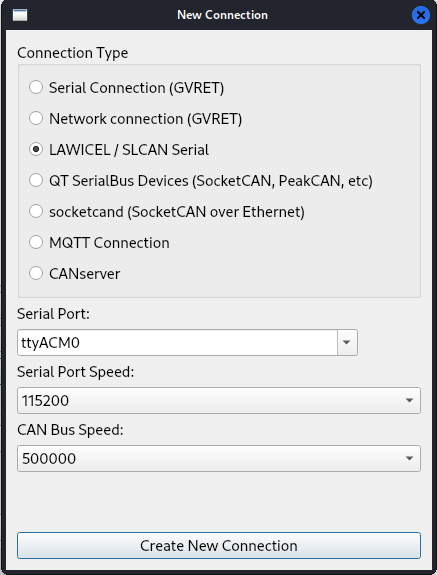
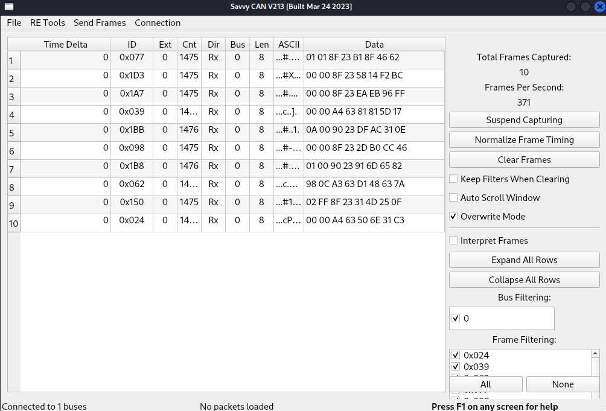
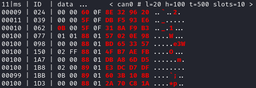
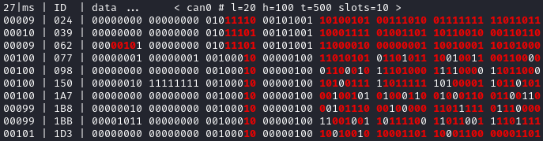
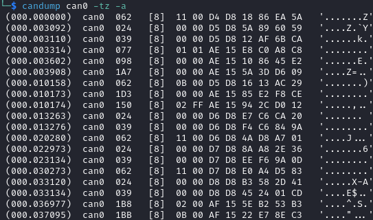
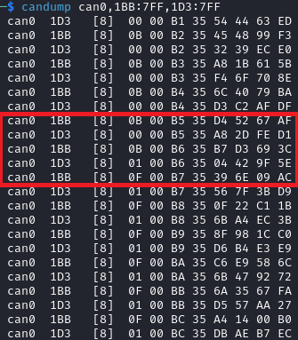
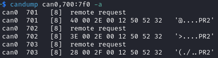
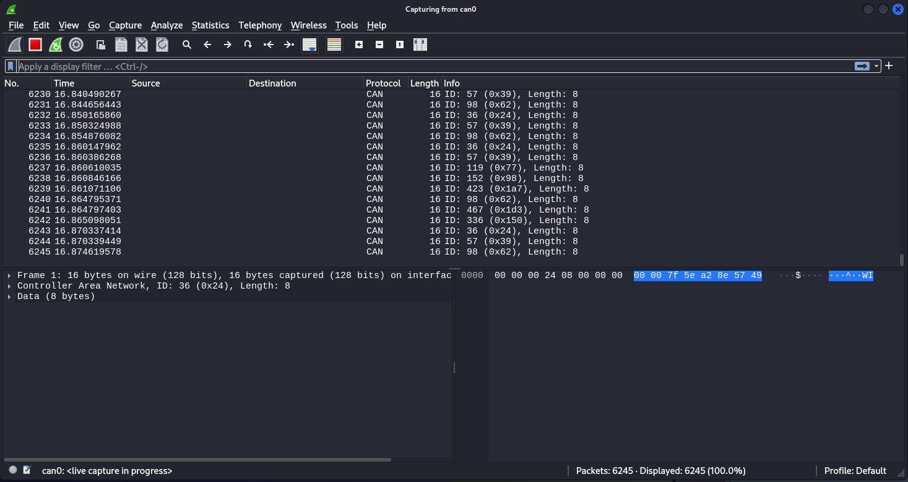

.. _interacting_with_CAN:

Interacting with CAN
====================

Introduction
------------

`Controller Area Network (CAN) <https://en.wikipedia.org/wiki/CAN_bus>`_ is the most popular communication protocol found in vehicles.
It uses **only two wires, common to all ECUs**: CAN High (CANH) and CAN Low (CANL).
CAN only supports broadcasting, with no built-in restrictions: any ECU can send any message, and all ECUs connected to the same CAN bus will receive the same messages.
A CAN frame is simply a bitstream of zeroes and ones, with a fixed nominal baudrate (typically 500 kbps in modern vehicles).

A CAN frame contains:

- An **arbitration identifier** (often called **CAN ID** or just **ID**), which length can be 11 bits (*standard identifier*) or 29 bits (*extended identifier*).
- Bit Flags: **RTR** (Remote Transmission Request) and **IDE** (Identifier type).
- The payload data size (Data Length Code, **DLC**), ranging from 0 to 8 bytes.
- The actual payload **Data**.

ECUs are typically assigned arbitration identifiers that they use to periodically broadcast data, with different periods.
For example, with RAMN, ID 0x24 (transmitted every 10 ms) represents the brake pedal status, and ID 0x1B8 (transmitted every 100 ms) represents the engine key status.

Lower IDs have a higher priority: if two ECUs attempt to transmit at the same time, the ECU transmitting the higher ID will yield the bus and wait for another opportunity.
This ensures that the most important messages are always transmitted first.
If a message has a low ID, you can assume that it is important.

In addition to periodic CAN messages, ECUs may receive and transmit aperiodic messages, such as diagnostic messages.
ECUs may implement diagnostic interfaces defined by standard documents:

- `Unified Diagnostic Services (UDS) <https://en.wikipedia.org/wiki/Unified_Diagnostic_Services>`_
- `Keyword Protocol 2000 (KWP2000) <https://en.wikipedia.org/wiki/Keyword_Protocol_2000>`_
- `Universal Measurement and Calibration Protocol (XCP) <https://en.wikipedia.org/wiki/XCP_(protocol)>`_

Because CAN frames can only hold small payloads of 8 bytes or less, it is challenging to transmit large data (such as ECU firmware files) using CAN.
The XCP protocol is built around this limitation; however, UDS and KWP2000 rely on an intermediary **transport layer** called `ISO-TP (ISO 15765-2) <https://en.wikipedia.org/wiki/ISO_15765-2>`_.
The ISO-TP layer divides large payloads (up to 4095 bytes for the original version, and up to 4294967295 bytes for recent versions) into several CAN frames, and adds a flow control mechanism to ensure that they can be reconstructed by a receiver.

There are recent evolutions of the CAN protocol developed to enable higher bandwidths:

- `Controller Area Network with Flexible Data-Rate (CAN FD) <https://en.wikipedia.org/wiki/CAN_FD>`_
- `CAN XL <https://www.can-cia.org/can-knowledge/can/can-xl/>`_

In fact, RAMN's ECUs use CAN FD, but by default they only use classic CAN frames to stay compatible with popular tools not compatible with CAN FD.

Refer to the :ref:`advanced_can` section to learn about other CAN concepts that you may encounter but are not strictly required to continue this guide.

Connecting to CAN
-----------------

To connect to a CAN bus, you only need to connect the CANH and CANL wires of a CAN receiver to the CANH and CANL wires of the CAN bus.
In a real vehicle, this would typically be done using the `On-board Diagnostics (OBD-II) data link connector <https://en.wikipedia.org/wiki/Data_link_connector>`_ found below the instrument cluster.
Experimenting on a real vehicle does come with risks: you probably do not want to risk damaging a vehicle that you still intend to drive on public roads for years to come.
`RAMN <https://github.com/ToyotaInfoTech/RAMN>`_ was designed to replace a real vehicle with a simple four-ECU network embedded in a small form factor, in order to encourage education and research in automotive systems.

RAMN has a built-in USB to CAN adapter.
**Connecting RAMN to your computer is equivalent to connecting a USB to CAN adapter to the OBD-II port of a vehicle, but without the risks.**

CAN only supports broadcast transmissions: all ECUs always see the same traffic.
Whatever you receive over CAN is exactly what every other ECU sees; ECUs typically employ CAN filters to process only the messages that they need.

With CAN, you can:

- Connect to and disconnect from a CAN bus at any time (Hot plug/unplug).
- Observe CAN traffic between ECUs without employing man-in-the-middle techniques such as ARP poisoning.

Observing CAN on a Computer
---------------------------

Computers typically do not have a built-in CAN interface, and a special interface is therefore needed for them to connect to a CAN bus.

There are many USB-CAN adapters available on the market.
If you own such an adapter, you can connect it to RAMN's terminal block and get started with your experiments, following whatever guide that came with it.

The rest of this guide will assume that you use RAMN's built-in USB to CAN adapter.
RAMN implements the "slcan" protocol, also known as the "LAWICEL" or "Serial" protocol, which is supported by many CAN analysis software tools.

When using RAMN as your USB to CAN adapter, you will need to specify "*slcan*" as the interface type, and RAMN's serial port as the channel (typically, *COMx* or */dev/ttyACMx*).

Simple Examples
^^^^^^^^^^^^^^^

Python-CAN (Windows, Linux)
"""""""""""""""""""""""""""

Make sure that you have installed python on your computer (see :ref:`analysis_environment`).
Connect your board to your computer, open Windows's Device Manager, and find what new device appears in "Ports (COM & LPT)".
RAMN should typically be assigned a COM port number, such as "COM1".

Open a command window (open Powershell or press Windows+R) and execute the following command to observe the latest CAN frame for each CAN ID:

.. code-block:: bash

    $ python -m can.viewer -i slcan -c COM1

This may require that you install python modules with the command :code:`python -m pip install "python-can[viewer]"`.
Press Q to quit. From here, you should be able to directly use `python-can scripts <https://python-can.readthedocs.io/en/stable/scripts.html>`_ with RAMN.

SavvyCAN (Windows, Linux)
"""""""""""""""""""""""""

If you are not comfortable with command lines, you can try `SavvyCAN <https://www.savvycan.com/>`_ as an alternative for a tool with a GUI.
Simply download the latest SavvyCAN binary and install it.
(On Linux, download the .AppImage file and make it executable by typing :code:`chmod +x file.AppImage` then execute it by typing :code:`./file.AppImage`)

- Open the application and press "Connection -> Open Connection Window" in the top bar.
- Select "Add New Device Connection".
- Select LAWICEL/ SLCAN Serial.
- Enter the correct serial port (e.g., /dev/ttyACM0 or COM1).
- Use the default Serial Port Speed.
- **Input the correct CAN Bus Speed (by default, 500000)**.
- Press "Create New Connection".
- (Optional: press "Save Bus Settings")

It is important that you select the correct CAN Bus Speed (and do not mistake it with Serial Port Speed).
You can then close the window, and you should be able to observe CAN messages.

Refer to the `SavvyCAN documentation <https://www.savvycan.com/docs/>`_ for how to use the software.

Interfacing with Linux
----------------------

For the rest of this guide, we will focus on Linux and the `can-utils package <https://github.com/linux-can/can-utils>`_, often used by car enthusiasts.
Linux supports CAN as a standard interface, which means you can use it like any other linux interface.

.. _use_slcand:

Converting slcan to socketCAN
^^^^^^^^^^^^^^^^^^^^^^^^^^^^^

You can identify which name was given to your RAMN's slcan (serial port) by typing :code:`dmesg` and looking for the most recent device added, which should start with "*/dev/ttyACM*".
Some tools, such as wireshark, may not directly support slcan, but may support interfaces such as socketCAN.
For these tools, you can execute the following command to convert an slcan interface (e.g., /dev/ttyACM0) to a socketCAN interface (e.g., can0):

.. code-block:: bash

    $ sudo slcand -o -c /dev/ttyACM0 && sudo ip link set up can0

After executing this command, you should be able to see a new "can0" interface with the :code:`ifconfig` command.
This should allow you to use tools from the can-utils package, which are detailed in the following section.
In some environments, you may encounter issues with the command above.
If that is the case, try attributing a different name to the CAN interface, e.g., use "slcan0" instead of "can0" for all following commands.

.. code-block:: bash

    $ sudo slcand -o -c /dev/ttyACM0 && sudo ip link set up slcan0

On Linux, only one program can open a serial device at once, but several programs can open a CAN interface.
This means that if you use slcan directly, you will only be able to execute one CAN command at a time, but if you use socketCAN, you will be able to execute several commands in parallel.
In general, if a tool supports both socketCAN and slcan, you should use socketCAN.

.. note::
    When using a serial port with slcan, you may be asked for two baudrates/bitrates: the one for the serial port, and the one for the CAN bus.
    The baudrate of the serial port does not matter because it is virtual; however, the baudrate of the CAN bus matters and should be set correctly (by default, 500000 bps).

.. warning::
    Before starting slcand, make sure that no other program is currently using RAMN's serial port.
    When you use slcand, the serial port will always be busy and will not be accessible by other programs, such as TeraTerm.
    You can shutdown slcand and release the serial port with the following command:

    .. code-block:: bash

        $ sudo killall -w slcand

.. _slcan_baudrate:

CAN Baudrate
^^^^^^^^^^^^

You can change the CAN baudrate of your slcan adapter using the -s option, with an integer that corresponds to the following baudrates:

- 0 - 10000 bps
- 1	- 2000 bps
- 2	- 5000 bps
- 3	- 100000 bps
- 4	- 125000 bps
- 5	- 250000 bps
- 6	- 500000 bps (RAMN's default)
- 7	- 800000 bps
- 8	- 1000000 bps

For example, ``sudo slcand -o -c -s8 /dev/ttyACM0`` will open RAMN with a 1000000 bps CAN baudrate.
**Note that this only applies to the adapter (ECU A) and not other ECUs, so by default this should only display CAN errors.**
If you want to use another baudrate than the default 500000 bps, you must either reflash all ECUs, or use the UDS Link Control service (see :ref:`diag_tutorial`).

RAMN's vcand scripts
^^^^^^^^^^^^^^^^^^^^

The slcand command has two disadvantages:

- It does not support CAN FD.
- It monopolizes RAMN's serial port and prevents you from sending serial commands.

You can use `RAMN's vcand scripts <https://github.com/ToyotaInfoTech/RAMN/tree/main/scripts/vcand>`_ to create virtual additional serial interfaces and to convert a serial interface to a **CAN FD** socketCAN interface.

Refer to :ref:`vcand` for usage.

Note that as of 2024, these scripts are implemented in python and are not optimized for low CPU usage.

Experimenting with CAN on Linux
-------------------------------

Cansniffer
^^^^^^^^^^

cansniffer is probably the first command that you will want to try on a new network.
It allows you observe the **most recent frame** for each CAN identifier, and to highlight bit changes in color.

You can launch it with the following command:

.. code-block:: bash

    $ cansniffer -c can0

To quit, press "q" then ENTER, or press "Control+C".

If you prefer to observe CAN messages in binary format, you can use the -B (or -b) option:

.. code-block:: bash

    $ cansniffer -B -c can0

Once cansniffer is launched, you can still type commands, listed in cansniffer's help page (type commands directly in cansniffer's window and press ENTER).

On a modern automotive network, you will probably be overwhelmed with information, because there should be many CAN messages with many byte changes, even though the vehicle is in an idle state.
This is because CAN messages may implement complex algorithms, and include volatile fields such as message counters, Cyclic Redundancy Checks (CRCs) and Message Authentication Codes (MACs).

A useful command to filter volatile fields is the "#" (notch) command, which allows you to ask cansniffer to stop highlighting byte changes that have already been observed.
This allows you to make later changes (when you move RAMN's controls) more obvious.

Try typing the "#" commands several times in a row, without touching the controls.
You should observe that less and less bits get highlighted in color.
Then, move the brake controls on RAMN's board and observe cansniffer: the 2-byte payload of the brake message sent by ECU B should be highlighted and easy for you to spot.
You should also observe that one other bit from another CAN message is flipping when you move the brake pedal between and 0% and 100%: this bit corresponds to the status of the brake LED of ECU D (if that is not the case, verify that the Hand Brake is at the bottom position).
Because ECUs interact with each other, you cannot assume that a single control impacts only a single CAN message, and identifying the purpose of CAN messages can be tricky.

.. note::
    - For analog controls, you may observe that the last bits are changing even when the controls are not moved. This is caused by the analog noise of the sensors.
    - Integers may be represented with the Big Endian or Little Endian format. RAMN relies on ARM microcontrollers, which use Little Endian. This means that a payload may appear in the "wrong order" on cansniffer: for example, a value of 0x0FFF may appear as 0xF0FF.

If you want to filter out some messages from cansniffer, you can use the "-" command (e.g., "-024" to hide message 0x024).
You can also use the "n" command to filter all messages, then use the "+" command to add a message to observe (e.g., "+024" to only show message 0x024).
Use the "a" command to display all messages again.

Candump
^^^^^^^

Although cansniffer is a great tool to have an overview of a CAN bus traffic, it only displays the latest frame for each identifier.
To observe all CAN frames, in the same order in which they appeared, you can use candump instead.

.. code-block:: bash

    $ candump can0

Press Control+C to exit. You can use the -tz option to add timestamps, and the -a option to add ASCII output.

Not all messages have the same period, so you will observe some messages more frequently than others.
There are two main use cases for candump:

- To record a CAN traffic, for example to analyze it later offline (e.g., if you must share your RAMN board with someone else).
- To analyze the flow of specific CAN messages.

To record a CAN traffic to a file, you can use the -l option:

.. code-block:: bash

    $ candump -l can0

This will record the CAN traffic to a file, with an auto-generated name. If you want to specify the file name, use -f <filename> instead (this may only work on recent versions).

On a real network, you will probably observe so many frames that the output of candump will be too much to process.
Typically, you will want to identify interesting identifiers using cansniffer, then analyze them further with candump using filters.
Refer to the :ref:`can_filters` section for more information about filters.

You can apply a filter in candump by adding ",<value>:<mask>" after the interface name, with values in hexadecimal. For example:

.. code-block:: bash

    $ candump can0,1BB:7FF

You should observe on RAMN that although the output of candump is overwhelming, the output of the command above is not.
You can add several filters to candump, for example to observe IDs 0x1BB and ID 0x1D3, use:

.. code-block:: bash

    $ candump can0,1BB:7FF,1D3:7FF

This can be useful to identify relationships between CAN messages, for example:
place the brake pedal at zero, and the Hand Brake at the bottom position. This should ensure that the brake LED is OFF.
When you move the Hand Brake switch, you should observe that the brake LED lights up.
You can observe on cansniffer that two CAN IDs (0x1BB and 0x1D3) have a payload that changes as a result.
Because the LED and the switch are located on different ECUs, you can infer that one CAN message probably indicates the status of the brake LED and the other indicates the status of the switch, but
you do not know which one is which, because they appear to change simultaneously in cansniffer.

If you use the command above while moving the switch, you can observe that 0x1D3 changes value before 0x1BB does,
allowing you to deduce that 0x1D3 represents the value of the switch and 0x1BB represents the status of LEDs (which changes as a consequence of the reception of message 0x1D3).

Cansend
^^^^^^^

Cansend allows you to send CAN messages, using a CAN ID and a payload as arguments (in hexadecimal).

For example, to send a message with CAN ID 0x123 and a one-byte payload of 0xFF, use:

.. code-block:: bash

    $ cansend can0 123#FF

Using cansend, you can for example test the theory that 0x1BB represents the LEDs status and 0x1D3 represents the hand brake switch status.
Record a message from 1BB when the Hand Brake is at the ON position (top position), then move the Hand Brake to the OFF position (bottom position).
Make sure the brake pedal is at 0% and does not interfere with the brake LED.

You can replay a CAN message (in this example, with payload 07008A756501D87F) using cansend:

.. code-block:: bash

    $ cansend can0 1bb#07008A756501D87F

By sending this message, you are telling all ECUs "the brake LED is on", but that in itself does not turn the LED on.
However, if you record a message with CAN ID 0x1D3 when the hand brake is ON and send it again when the hand brake is off, you should observe that the brake LED briefly lights up:

.. code-block:: bash

    $ cansend can0 1d3#01008A754AC9B735

This is because this message says "The Hand Brake switch is ON", which itself causes ECU D to light up the brake LED.
However, it only lights up temporary because ECU B is still transmitting messages (telling ECUs that the Hand Brake switch is OFF), immediately overwriting whatever value you have sent.

You can use simple bash scripts to automate some transmissions, for example, if you want to send a message 100 times in a row:

.. code-block:: bash

    $ for i in {1..1000}; do cansend can0 1d3#01008A754AC9B735; done

Or if you want to flood the CAN bus with the same message for 2 seconds:

.. code-block:: bash

    $ timeout 2s bash -c 'while [ $SECONDS -lt 10 ]; do cansend can0 1d3#01008A754AC9B735; done'

.. warning::
    If you send CAN messages normally transmitted by another ECU, and that other ECU is still actively transmitting, you may generate CAN errors.
    If you cause too many errors, you may force ECUs to disconnect from the CAN bus (see :ref:`can_errors`).
    By default, only a power reset will let ECUs reconnect, but you can configure RAMN's ECUs to auto-reconnect.

You can also use cansend to send messages with the RTR bit flag set, using *"<can id>#R<dlc>"* as its argument.
RAMN's ECU B, C, and D will answer to CAN RTR frames with IDs 0x701, 0x702, and 0x703 (respectively) with their hardware serial number.

You can display these messages in candump with:

.. code-block:: bash

    $ candump can0,700:7f0 -a

And, in another terminal, you can send the RTR frames:

.. code-block:: bash

    $ cansend can0 701#R8
    $ cansend can0 702#R8
    $ cansend can0 703#R8

Which should yield the following result:

Canplayer
^^^^^^^^^

You can "replay files" (i.e., send all CAN messages observed in a log file) generated by candump using canplayer.
You need to specify two interfaces as arguments: the interface from which you want to read messages in the file, and the interface on which you want to send the same messages.
Typically, you will want to use the same:

.. code-block:: bash

    $ canplayer -I <file> can0=can0

If you get errors, try executing ``$ sudo ifconfig can0 txqueuelen 10000``.

Here, we specify can0=can0 because we want to read messages on interface can0 (in the file) and replay them on can0 (actual hardware).

Canplayer is useful when you want to repeat a specific sequence of CAN messages, for example to repeat a UDS command that is fragmented in many CAN messages.
Canplayer is also useful when you want to isolate an ECU from the CAN bus on which it is normally connected.
Many ECUs will go to sleep if they do not detect normal CAN traffic, so using canplayer in an infinite loop ("-l i" option) can prevent it:

.. code-block:: bash

    $ canplayer -I <file> -l i can0=can0

Modern ECUs may not react well to canplayer because they have a message authentication mechanism preventing ECUs from accepting replayed messages.

Wireshark (Linux)
^^^^^^^^^^^^^^^^^

If you are familiar with wireshark, you can launch it and directly observe your socketCAN interface (e.g., you can directly open can0).
You should be able to apply usual Wireshark filters, and Wireshark should be able to parse complex CAN traffic such as UDS commands.

.. _advanced_can:

(Slightly) Advanced CAN concepts
--------------------------------

CAN Bus Termination
^^^^^^^^^^^^^^^^^^^

For `impedance matching <https://en.wikipedia.org/wiki/Impedance_matching>`_,
CAN requires that two resistors of 120 ohm be connected between each end of the CANH and CANL wires (which are common to all ECUs).
These resistors are present on RAMN, so if you use an external tool, make sure that it does not have termination resistors (usually by removing a jumper, or flipping a switch).

Dominant and Recessive Bits
^^^^^^^^^^^^^^^^^^^^^^^^^^^

CAN only requires two wires: CANH and CANL, common to all ECUs.
To transmit a "zero" bit, a CAN transceiver generates a voltage difference of 2V between CANH and CANL (**dominant bit**).
To transmit a "one" bit, a CAN transceiver does nothing (**recessive bit**), which results in a 0V voltage difference between CANH and CANL.

If two transceivers attempt to transmit simultaneously a different bit, that bit will have the value of the dominant bit, which is 0.

Flags and Other CAN Bus Fields
^^^^^^^^^^^^^^^^^^^^^^^^^^^^^^

The CAN ID and the payload are the most important fields of a CAN frame, but other fields are present:

- The Start of Frame (SOF) bit is the first bit of every CAN frame. It is used to synchronize receivers.
- The Remote Transmission Request (RTR) bit is a bit to request the transmission of a specific CAN ID. It is however not used in practice.
- The Identifier Extension Bit (IDE) bit specifies whether the identifier size is 11 bits or 29 bits.
- The Data Length Code (DLC) field specifies the size of the payload. It is a 4-bit field and can therefore range from 0 to 15, but only CAN FD supports payloads larger than 8.
- The Cyclic Redundancy Check (CRC) bits are used to verify the integrity of the frame.
- The Acknowledgment bits are used **by receivers** to signal that a CAN frame was correctly received.
- The End of Frame (EOF) and InterFrame Spacing (IFS) fields are a period of silence after Acknowledgment.

These fields sometimes have delimiters and reserved bits around them.

Bit Stuffing
^^^^^^^^^^^^

CAN frames are transmitted as a bitstream with a nominal bitrate.
To ensure that enough voltage transitions, necessary for clock synchronization, are observed on the CAN bus, CAN employs a bit stuffing mechanism:

- If a frame has five successive 0, a 1 must be inserted after the 5th bit.
- If a frame has five successive 1, a 0 must be inserted after the 5th bit.

For example, if a CAN controller wants to send the identifier 0x3E0 (0001111100000 in binary), the bitsteam of the identifier would be 00011111\ **0**\ 00000\ **1**.

Bit stuffing and destuffing are done in hardware, so unless you watch CAN voltages with a logic analyzer, you will not be aware of bit stuffing.
Bit stuffing does not apply to the fields after the CRC.

.. _can_errors:

Error Frames and Bus Off
^^^^^^^^^^^^^^^^^^^^^^^^

If something is wrong with a CAN frame (wrong bit stuffing, wrong CRC, etc...), that problem will be detected by ECUs on the bus.

The default behavior of ECUs is to assume "I am correct and the CAN bus is wrong" and destroy the current CAN frame for everyone ("Error active").
Concretely, if an ECU detects an error, it immediately signals it by transmitting an Error Frame, which consists of six consecutive dominant bits (zeroes).
Because these bits are dominant, they necessarily overwrite whatever transmission is ongoing, and because six successive zeroes are a violation of bit stuffing, it ensures that all other ECUs (that may not be aware of the error) also detect an error.

ECUs have internal counters that they increase when they detect errors, and decrease when they detect a valid frame.
If these counters reach a certain threshold, they start to assume "I may be the cause of CAN errors" and stop destroying frames with active Error Frames (they become "Error passive").

If errors continue, the ECU will consider that it should enter the "bus off" state, and disconnect from the CAN bus.
You will encounter bus off problems if you set the wrong baudrate for your CAN receiver.

Follow `this link <https://www.csselectronics.com/pages/can-bus-errors-intro-tutorial>`_ to learn more about CAN Errors. Errors defined by the CAN protocol are:

- **Bit Error**: (transmitter only) an ECU attempted to transmit a bit, but a different bit was observed on the bus.
- **Stuff Error**: bit stuffing was not done correctly.
- **CRC Error**: CRC did not match the expected value.
- **Form Error**: a fixed bit did not have the expected value (e.g., ECU observed a zero for the first EOF bit, but that bit is always supposed to be a one).
- **Acknowledgment error**: (transmitter only) the ACK bit was not observed as dominant (nobody acknowledged). See the section below for details.

Similar to Error Frames are **Overload Frames**. They have the same form as Error Frames, however they do not increment the error counters.
They can only be sent during the transmission of the IFS field (the "intermission"), either because an ECU wants extra time to process a frame, or because an ECU detected a violation of the intermission by another ECU.

Acknowledgment
^^^^^^^^^^^^^^

CAN frames have an "ACK" bit, which is always dominant, and which must be transmitted by all **receivers** to confirm that they received the frame correctly.
It is important to note that this bit (and this bit only) is **transmitted by receivers (plural)**, not the transmitter of the frame.

The ACK bit must always be sent by receivers, even if they have filters activated and they do not care about the frame that they just received.

Some CAN controller have a listen-only mode, which typically will not acknowledge frames.
A consequence of the acknowledgement mechanism is that a CAN bus must always have **at least two active ECUs**.

.. _can_filters:

CAN Filters
^^^^^^^^^^^

Because the CAN protocol only allows broadcasting frames, ECUs are overloaded with messages that they do not need.
As a result, CAN controllers often have many options to set up various CAN filters, to only receive message with identifiers that they care about.

Modern microcontrollers accept various filter types, but traditionally a filter is defined with a **value** and a **mask**.
Tools such as candump accept filters in the format "<value>:<mask>".
The **mask** indicates which bits of the identifier you care about (1 means you care, 0 means you do not), and the **value** indicates what those bits should be (either 0 or 1).

Let us consider the case of an acceptance filter for standard identifiers, which are 11 bits long.
Both the mask and value are the same length as the identifiers.

A mask of 0x7FF would be 11111111111 in binary, and would indicate that you care about **all the bits** in the identifier.
As a result, the CAN filter will only accept messages for which the identifier is exactly the same as the value.
For example, filter "1BB:7FF" used with candump will only display CAN messages with ID 0x1BB.

.. code-block:: text

    value: 00110111011 (0x1BB)
    mask:  11111111111 (0xFFF)
    ---------------------
    ID:    00110111011 (0x1BB only)

A mask of 0x000 would be 00000000000 in binary, and would indicate that you care about **none of the bits** in the identifier.
This means that the CAN filter will accept every identifier (CAN controllers may require different filters for extended and standard identifiers, so you may still be rejecting extended identifiers).

if you start candump with the filter "1BB:000", it will display all IDs - the 1BB does not have any impact here, because the mask says that none of the bit matters.
This mask is identical to "000:000" and "FFF:000".

.. code-block:: text

    value: 00110111011 (0x1BB)
    mask:  00000000000 (0x000)
    ---------------------
    ID:    ??????????? (any)

Masks do not have to be either 0x000 or 0x7FF, you can use them to specify more advanced conditions.

For example, you can use 001:001 (care about only the last bit, which should be 1) to only show odd identifiers, or 000:001 (care about only the last bit, which should be 0) to only show even identifiers.

.. code-block:: text

    value: 00000000001 (0x001)
    mask:  00000000001 (0x001)
    ---------------------
    ID:    ??????????1 (any value ending with 1)

.. code-block:: text

    value: 00000000000 (0x000)
    mask:  00000000001 (0x001)
    ---------------------
    ID:    ??????????0 (any value ending with 0)

To specify a range, you can use a mask that starts with 1s and ends with 0s. One common filter that you will want to remember is 7e0:7F0.
This filter indicates that you want to display can IDs ranging from 0x7e0 to 0x7ef, which correspond to UDS diagnostic messages in RAMN.

.. code-block:: text

    value: 11111100000 (0x7e0)
    mask:  11111110000 (0x7f0)
    ---------------------
    ID:    1111110???? (any byte from 11111100000 to 11111101111, i.e., 0x7e0 to 0x7ef)

.. _bit_timings:

Bit Timings
^^^^^^^^^^^

A CAN bus has a single, fixed nominal baudrate, which is often 500 kbps in modern vehicles.
Most CAN tools will allow you to specify the baudrate of the CAN bus immediately, but others may ask you for concrete bit timings.

Theory
""""""

The CAN protocol divides a single bit into several **time quanta**.
A **time quantum** corresponds to the **period of the clock of the CAN controller**.
RAMN's CAN controllers use a clock of 40 MHz, therefore the associated time quantum is 25 ns.

CAN controller consider that a **bit** is the sum of **four segments**, each made of several time quanta:

- The Synchronization Segment.
- The Propagation Segment.
- The Phase Buffer Segment 1.
- The Phase Buffer Segment 2.

ECUs all rely on different clocks, which are imperfect and slightly desynchronized.
CAN controllers can adjust the length of a CAN frame bit by adjusting the length of Phase Buffer Segment 1 and Phase Buffer Segment 2 dynamically.
The Synchronization Jump Width (SJW) parameters specify how wide these adjustments can be.

The sample point corresponds to the end of phase buffer segment 1 and the start of phase buffer segment 2.
It is the point in time where the CAN signal voltage is physically observed by the CAN receiver.
If it is too early, you risk reading the voltage before it has stabilized (e.g., because of `ringing <https://en.wikipedia.org/wiki/Ringing_(signal)>`_).
If it is too late, you risk reading the next bit.
The sample point is typically recommended to be between 75% and 90%.

Practice
""""""""

The synchronization segment is always one time quantum long.
In practice, the propagation segment and phase Buffer Segment 1 are often merged into a single segment.
Therefore, STM32 CAN controllers (and any CAN controller in general) will ask you for two values that decide the baudrate:

- TSEG1: size of the propagation segment + phase buffer 1 segment.
- TSEG2: size of the phase buffer 2 segment.

You need to select TSEG1 and TSEG2 so that:

.. math::

    Multiplier = 1 + T_{SEG1} + T_{SEG2}

where multiplier is the ratio between your CAN bit time and your CAN controller time quantum.

For example, if your CAN controller has a clock of 40 MHz (time quantum of 25 nanoseconds) and you want a CAN baudrate of 500 kbps (bit time of 2 microseconds),
your multiplier is:

.. math::

    Multiplier = {\frac{40000000 Hz}{500000 Hz} = \frac{2 \mu s}{25 ns} = 80}

Therefore, you can select any TSEG1 and TSEG2 as long as:

.. math::

     {T_{SEG1} + T_{SEG2} = Multiplier - 1 = 79}

RAMN uses TSEG1 = 60 and TSEG2 = 19. The sample point is therefore located at 76% (60 + 1 divided by 80).
However, it could use other pairs, e.g., TSEG1 = 69 and TSEG = 10, and it would still have the exact same baudrate.

For the SJW value, start with the lowest value and increase it if you encounter CAN errors.

.. _can_fd:

CAN FD
^^^^^^

`Controller Area Network with Flexible Data-Rate (CAN FD) <https://en.wikipedia.org/wiki/CAN_FD>`_ is a recent evolution of CAN that allows for higher bandwidths.
RAMN is compatible with CAN FD. This section summarizes the minimum you should know when using CAN FD instead of CAN.

Although CAN FD controllers understand and can transmit classic CAN frames, **classic CAN controllers do not understand CAN FD frames and will therefore destroy them**.
If you want to transmit a CAN FD frame, you need to ensure that all ECUs on the bus are compatible with CAN FD (which is the case for RAMN by default).

CAN FD allows for a maximum payload of 64 bytes. The DLC field size (4 bits) is unchanged, and DLCs above 8 represent specific sizes:

- DLC of 9 means the payload size is 12.
- DLC of 10 means the payload size is 16.
- DLC of 11 means the payload size is 20.
- DLC of 12 means the payload size is 24.
- DLC of 13 means the payload size is 32.
- DLC of 14 means the payload size is 48.
- DLC of 15 means the payload size is 64.

CAN FD introduces "bit rate switching": CAN controllers can increase the baudrate (i.e., shorten the bit time) when transmitting data.
Bit rate switching happens when the Bit Rate Switch (BRS) flag is set.
Therefore, CAN FD controllers will ask for two different sets of bit timings: "Nominal" and "Data".

CAN FD adds an "Error State Indicator" bit flag in CAN FD frames, which is used to specify whether the transmitter of the frame is currently in active or passive error mode (see :ref:`can_errors`).

There is no RTR flag in CAN FD.

There are actually `two versions of CAN FD <https://can-newsletter.org/engineering/standardization/141209_iso-can-fd-or-non-iso-can-fd>`_: "ISO CAN FD" and "non-ISO CAN FD", non compatible to each other due to small protocol differences.

