.. _diag_tutorial:

Interacting with Diagnostic Services
====================================

The ISO-TP layer presented in the :ref:`interacting_isotp` section allows sending and receiving arbitrary payloads with a size up to 4095 bytes.
ECUs in modern vehicles will most likely interpret ISO-TP data as UDS commands, described in this section.

UDS Basics
----------

Unified Diagnostic Services (UDS) is a protocol used for ECU diagnostics and programming.
There are many `tutorials <https://www.csselectronics.com/pages/uds-protocol-tutorial-unified-diagnostic-services>`_ available online, and you can find `posters <https://automotive.softing.com/fileadmin/sof-files/pdf/de/ae/poster/UDS_Faltposter_softing2016.pdf>`_ that summarize how it works.

UDS follows a simple request-answer mechanism: you send a payload to the ECU, and you get a payload as an answer.

The first byte of a request represents the **Service ID**; the rest of the payload represents the parameters for that service.
The second byte often (but not always) represents a **Sub-Function** of a service.

The first byte of an answer represents the answer to a request: either a positive response (Service ID + 0x40) or a negative response (0x7f); the rest of the payload represents parameters.

RAMN Standard UDS Services
^^^^^^^^^^^^^^^^^^^^^^^^^^

RAMN ECUs support many UDS services. They use the following ISO-TP CAN IDs for them:

- ECU A uses **0x7e0** to receive commands and **0x7e8** to transmit answers.
- ECU B uses **0x7e1** to receive commands and **0x7e9** to transmit answers.
- ECU C uses **0x7e2** to receive commands and **0x7ea** to transmit answers.
- ECU D uses **0x7e3** to receive commands and **0x7eb** to transmit answers.
- All ECUs use **0x7df** to receive commands with functional addressing (command broadcast).

ECU A will not answer your UDS requests over CAN if you are using it as a USB to CAN adapter; you should use the USB serial interface instead.

You can check what standard services are supported by ECUs by looking at the `ramn_uds.c source code file <https://github.com/ToyotaInfoTech/RAMN/blob/main/firmware/RAMNV1/Core/Src/ramn_uds.c>`_:

- Service 0x10 (DIAGNOSTIC SESSION CONTROL)
- Service 0x11 (ECU RESET)
- Service 0x14 (CLEAR DIAGNOSTIC INFORMATION)
- Service 0x19 (READ DTC INFORMATION)
- Service 0x22 (READ DATA BY IDENTIFIER)
- Service 0x23 (READ MEMORY BY ADDRESS)
- Service 0x27 (SECURITY ACCESS)
- Service 0x2E (WRITE DATA BY IDENTIFIER)
- Service 0x31 (ROUTINE CONTROL)
- Service 0x34 (REQUEST DOWNLOAD)
- Service 0x35 (REQUEST UPLOAD)
- Service 0x36 (TRANSFER DATA)
- Service 0x37 (REQUEST TRANSFER EXIT)
- Service 0x3D (WRITE MEMORY BY ADDRESS)
- Service 0x3E (TESTER PRESENT)
- Service 0x85 (CONTROL DTC SETTINGS)
- Service 0x87 (LINK CONTROL)

In addition to standard services, there are two **custom** services added to ECU A:

- Service 0x41 (Display specified pixels on screen)
- Service 0x42 (Load and start provided Chip-8 game)

These services are described later in this guide.
The UDS implementation of RAMN ECUs is slightly simplified in order to tolerate more errors and be more beginner friendly.

When you use functional addressing, you can only use Single Frame commands (payloads smaller than 7 bytes).
When an ECU cannot process a command received with functional addressing, it will typically not answer at all.

Positive responses
^^^^^^^^^^^^^^^^^^

If the ECU accepted your request, it will answer to it with a payload that starts with the service ID that you requested, plus 0x40.
For example, if you requested the service ID 0x3E and the ECU accepted it, its answer will start with 0x7E (0x3E + 0x40).
If you requested the service ID 0x10 and the ECU accepted it, its answer will start with 0x50 (0x10 + 0x40).

Services often allow you to disable positive responses by setting the very first bit of the service parameters as "1" (Positive response suppression).

Negative responses
^^^^^^^^^^^^^^^^^^

If the ECU rejected your request, it will answer to it with a three-byte payload that starts with 0x7F.
The second byte represents the service that it rejected, and the third byte represents the error code.
You can also find the list of possible error codes in `ramn_uds.c <https://github.com/ToyotaInfoTech/RAMN/blob/main/firmware/RAMNV1/Core/Src/ramn_uds.c#L22>`_.
The error codes that you are the most likely to encounter are:

- 0x11 - "Service not supported".
- 0x12 - "Sub-Function not supported": this means that the service is likely supported, just not for the specific sub-function that you requested.
- 0x13 - "Incorrect message length or invalid format": this means that the service (and sub-function if applicable) are supported, but your request has an invalid size (too many or not enough parameter bytes).
- 0x31 - "Request out of range": this means that your request has a valid format and is supported, but your parameters are out of the valid range. For example, you tried to read a memory address that does not exist (but you did provide an address with a valid format).
- 0x33 - "Security access denied": this means that you need to unlock the service (see :ref:`security_access`) before using it.
- 0x7E - "Service not supported in active session": this means that you must first request a different diagnostic session (see :ref:`diag_sess_control`).

These error codes are an extremely valuable source of information to learn how to correctly use UDS services.

Examples with Linux and Tester Present (0x3E)
^^^^^^^^^^^^^^^^^^^^^^^^^^^^^^^^^^^^^^^^^^^^^

You can use **isotpsend** and **isotprecv** to send UDS commands and receive their answers, respectively.
Additionally, you can use **isotpdump** to display UDS traffic with UDS mnemonics to facilitate their interpretation.

If you have not done it yet, make sure you set up your RAMN as a CAN Linux interface (see :ref:`use_slcand`).

For example, to interact with ECU B (which uses CAN IDs 0x7e1/0x7e9) on interface can0, open a terminal and type:

.. code-block:: bash

    $ isotprecv -s 7e1 -d 7e9 -l can0

This terminal will display the answers to your UDS requests. Open another terminal and type:

.. code-block:: bash

    $ isotpdump -s 7e1 -d 7e9 -c can0 -a -u

This terminal will display UDS traffic (both requests and answers).

Finally, open a third terminal, which you will use to type your UDS requests.
For example, you can send a UDS request with the following command:

.. code-block:: bash

    $ echo "3E 00" | isotpsend -s 7e1 -d 7e9 can0

The "3E 00" means that you want to use the service "Tester Present" with parameter "0x00".
Tester Present is a simple service to let the ECU know that you are currently working on it and prevent it from timing out.

You should observe on your isotprecv terminal that you received the answer "7E 00":

The 7E is equal to 0x3E+0x40, which means that the ECU accepted your request (and answered it with parameter "0x00").
You should observe in your isotpdump terminal that it automatically interpreted the request for you:

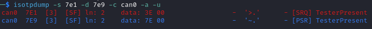

If you send an invalid command, for example if you send "3E 00 00" instead of "3E 00", you should observe a different UDS traffic:

.. code-block:: bash

    $ echo "3E 00 00" | isotpsend -s 7e1 -d 7e9 can0

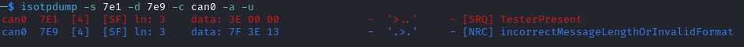

The ECU answers with "7F 3E 13". "7F" means that the request for service ID "3E" was rejected because of error code "13", which as you can observe in the isotpdump terminal means *"Incorrect Message Length Or Invalid Format"*.

.. note::
   If you want to communicate with another ECU than ECU B, you will need to change the -s and -d option for all commands.
   You can use ``$ candump can0,7e0:7f0`` instead of isotpdump to display any UDS traffic, but it will not interpret UDS commands for you.

For many services, the first parameter is only 7-bit long, and the first bit is used to indicate positive response suppression.
If you use the parameter "0x80", you are actually sending the parameter "0x00" and asking the ECU to not answer if there is no error.

For example, if you type the following command:

.. code-block:: bash

    $ echo "3E 80" | isotpsend -s 7e1 -d 7e9 can0

you will not receive any answer from the ECU, unless an error occurred.

You may want to use aliases to shorten the commands above. You can create useful aliases with the following script:

.. code-block:: bash

    CAN_INTERFACE_NAME=can0

    ECUB_ISOTP_SEND_CANID=7e1
    ECUB_ISOTP_RECV_CANID=7e9
    ECUC_ISOTP_SEND_CANID=7e2
    ECUC_ISOTP_RECV_CANID=7ea
    ECUD_ISOTP_SEND_CANID=7e3
    ECUD_ISOTP_RECV_CANID=7eb

    alias sendECUB="isotpsend -s $ECUB_ISOTP_SEND_CANID -d $ECUB_ISOTP_RECV_CANID $CAN_INTERFACE_NAME"
    alias sendECUC="isotpsend -s $ECUC_ISOTP_SEND_CANID -d $ECUC_ISOTP_RECV_CANID $CAN_INTERFACE_NAME"
    alias sendECUD="isotpsend -s $ECUD_ISOTP_SEND_CANID -d $ECUD_ISOTP_RECV_CANID $CAN_INTERFACE_NAME"

    alias recvECUB="isotprecv -s $ECUB_ISOTP_SEND_CANID -d $ECUB_ISOTP_RECV_CANID $CAN_INTERFACE_NAME -l"
    alias recvECUC="isotprecv -s $ECUC_ISOTP_SEND_CANID -d $ECUC_ISOTP_RECV_CANID $CAN_INTERFACE_NAME -l"
    alias recvECUD="isotprecv -s $ECUD_ISOTP_SEND_CANID -d $ECUD_ISOTP_RECV_CANID $CAN_INTERFACE_NAME -l"

    alias dumpECUB="isotpdump -s $ECUB_ISOTP_SEND_CANID -d $ECUB_ISOTP_RECV_CANID -c $CAN_INTERFACE_NAME -a -u"
    alias dumpECUC="isotpdump -s $ECUC_ISOTP_SEND_CANID -d $ECUC_ISOTP_RECV_CANID -c $CAN_INTERFACE_NAME -a -u"
    alias dumpECUD="isotpdump -s $ECUD_ISOTP_SEND_CANID -d $ECUD_ISOTP_RECV_CANID -c $CAN_INTERFACE_NAME -a -u"

You will need to execute this script for each terminal that you open (you can simply copy-paste the content in your terminal and execute it).
After that, you will be able to receive data from ECU B with:

.. code-block:: bash

    $ recvECUB

and send data to ECU B simply with:

.. code-block:: bash

    $ echo "3E 00" | sendECUB

You can similarly use the command alias ``dumpECUB`` to dump the traffic above.

RAMN UDS Services
-----------------

.. _diag_sess_control:

Diagnostic Session Control (0x10)
^^^^^^^^^^^^^^^^^^^^^^^^^^^^^^^^^

Many UDS services are not available by default, and you first need to request a "diagnostic session" using the Diagnostic Session Control service.
By default, ECUs are in the "default session" (code 0x01).
Other possible standard sessions are "programming session" (code 0x02), "extended diagnostic session" (code 0x03), and "safety system diagnostic session" (code 0x04).

Real ECUs will often verify that the status of the vehicle allows a session change.
For example, you should not be able to start a programming session while driving a vehicle.
If you connect RAMN to a driving simulator, ECUs will check that the vehicle is currently stopped.
If that is not the case, ECUs will answer with error code "0x22", which means *"Conditions Not Correct"*.

To use this service, provide the session code as the only argument, for example to start a programming session:

.. code-block:: bash

    $ echo "10 02" | isotpsend -s 7e1 -d 7e9 can0

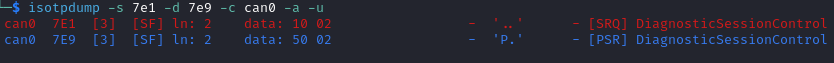

ECU Reset (0x11)
^^^^^^^^^^^^^^^^

This service can be used to reset an ECU. It has only one parameter, which is the reset type.
RAMN ECUs only support reset type 0x01 (Hard Reset), which you can use as follow:

.. code-block:: bash

    $ echo "11 01" | isotpsend -s 7e1 -d 7e9 can0

Or, if you do not want the ECU to answer if it accepts the request:

.. code-block:: bash

    $ echo "11 81" | isotpsend -s 7e1 -d 7e9 can0

.. warning::
    ECUs will not accept reset requests if they are in the default session; you must first use :ref:`diag_sess_control` to use this service.

This command supports functional addressing. If you want to reset all ECUs simultaneously, you can send these commands to ID 0x7df:

.. code-block:: bash

    $ echo "10 02" | isotpsend -s 7df -d 7e9 can0
    $ echo "11 01" | isotpsend -s 7df -d 7e9 can0

Note that the ``-d 7e9`` here is not important; the command is received and processed by **all ECUs**.

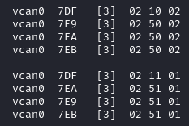

Read Data by Identifier (0x22)
^^^^^^^^^^^^^^^^^^^^^^^^^^^^^^

This is a common service to read data from an ECU.
It accepts two bytes as an argument, which represent the 16-bit Data Identifier (DID) that you wish to read.
Although some ECUs may allow you to read several DIDs at once, RAMN ECUs only allow reading one DID per request.

Some DIDs have a standard meaning (read `this tutorial <https://www.csselectronics.com/pages/uds-protocol-tutorial-unified-diagnostic-services>`_ for a list).
For example, you can ask the ECU's firmware compile time with DID 0xF184:

.. code-block:: bash

    $ echo "22 F1 84" | isotpsend -s 7e1 -d 7e9 can0

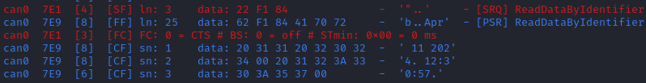

You can also ask the ECU's Serial Hardware (which should be unique per ECU) with DID 0xF18C:

.. code-block:: bash

    $ echo "22 F1 8C" | isotpsend -s 7e1 -d 7e9 can0

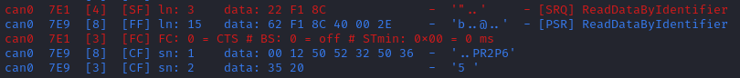

.. warning::
    Read Data By ID might return long data payloads, which means that they will be fragmented over ISO-TP.
    You **must** have an ISO-TP receiver actively set (e.g, with ``$ isotprecv -s 7e1 -d 7e9 -l can0``).
    Without an active receiver, the ECU will not receive the necessary "Flow Control Frame" to continue transmission, and you will only observe the ""First Frame" of its answer).

Write Data by Identifier (0x2E)
^^^^^^^^^^^^^^^^^^^^^^^^^^^^^^^

You can also use UDS to write arbitrary DIDs. Simply provide the DID that you want to write to, and the data that you want to write.
For example, the DID 0xF190 refers to the ECU's Vehicle Identification Number (VIN).
You can write a 17-character string to DID 0xF190 using the Write Data by Identifier service.
Make sure that you first start a programming session:

.. code-block:: bash

    $ echo "10 02" | isotpsend -s 7e1 -d 7e9 can0

Then, use the Write Data by Identifier service:

.. code-block:: bash

    $ echo "2E F1 90 56 49 4E 30 31 32 33 34 35 36 37 38 39 41 42 43 44" | isotpsend can0 -s 7e1 -d 7e9

You should now be able to read whatever VIN you wrote to memory using Read Data By Identifier:

.. code-block:: bash

    $ echo "22 F1 90" | isotpsend -s 7e1 -d 7e9 can0

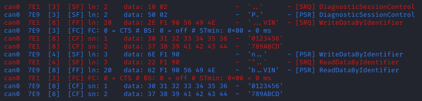

This value is written in flash, so it will persist even after a reset.
If you reflash the ECU and reset its memory, the Read Data by Identifier may complain that your request is out of range.

You can install xxd to make easy conversions between readable ASCII text and hexadecimal strings used by isotpsend and isotprecv:

.. code-block:: bash

    $ sudo apt-get install xxd

Use the following command to convert an ASCII string (e.g., VIN0123456789ABCD) to an hexadecimal string readable by isotpsend (e.g., 2E F1 90 56 49 4E 30 31 32 33 34 35 36 37 38 39 41 42 43 44):

.. code-block:: bash

    $ echo -n "VIN0123456789ABCD" | xxd -p  | sed 's/../& /g'  #converts from ASCII to hexadecimal

and vice versa:

.. code-block:: bash

    $ echo "56 49 4e 30 31 32 33 34 35 36 37 38 39 41 42 43 44" | xxd -r -p #hexadecimal to ASCII

Read DTC Information (0x19)
^^^^^^^^^^^^^^^^^^^^^^^^^^^

A type of information that car enthusiasts typically want to retrieve is `Diagnostic Trouble Codes <https://whiparound.com/dtc-codes/>`_ (DTC).
DTCs are reports of problems that occurred in a vehicle, and are defined in ISO 15031-6.

DTCs are represented by one letter (U, C, P, or B) and four numbers.

The letter indicates the domain of the problem: "U" is for Network (ECU A), "C" is for Chassis (ECU B), "P" is for Powertrain (ECU C), and "B" is for Body (ECU D).
the first digit indicates whether the DTC is standard ("0") or manufacturer specific ("1").

For example, the DTC **"P0650"** means that there was a problem in the powertrain domain.
The 0 means that the DTC is a standard DTC, and in this context, "6" means *"Computer Output Circuit"*, and "05" means *"Malfunction Indicator Lamp (MIL) Control Circuit Malfunction"*.

You will find plenty of information online to interpret DTCs.
If the first letter is a zero, DTCs have a unique definition, but if it is a one, the definition varies by manufacturer and have different meanings depending on the vehicle.

A DTC used to be stored as two bytes in the older KWP2000 protocol, that predates UDS.
UDS added a third byte for a Failure Type Byte (FTB) to report even more information about the problem.
The two bytes that defines the DTC values are called "High Byte" and "Middle Byte". The "Low byte" represents the FTB.

- First letter is represented with the two highest bits: 00 is P, 01 is C, 10 is B, 11 is U.
- First number is represented with bits 5 to 4 of the High byte.
- Second number is represented with bits 0 to 3 of the High Byte.
- Third number is represented with bits 7 to 4 of the Middle Byte.
- Fourth number is represented with bits 0 to 3 of the Middle Byte.

For, example, The DTC **P0650** is represented in UDS as below:

.. parsed-literal::

    Byte      |         High Byte    |    Middle Byte    |    Low Byte     |
    Bit index | 7 6 | 5 4 | 3 2 1 0  | 7 6 5 4 | 3 2 1 0 | 7 6 5 4 3 2 1 0 |
    Value     | 0 0 | 0 0 | 0 1 1 0  | 0 1 0 1 | 0 0 0 0 |      FTB        |

which would appear as **"06 50 <FTB>"** in a UDS payload.

Finally, a last byte indicates the status of the DTC. Each bit of that byte represent a flag with the following definitions:

- Bit 0 means "test failed".
- Bit 1 means "test failed this operation cycle".
- Bit 2 means "pending DTC".
- Bit 3 means "confirmed DTC".
- Bit 4 means "test not completed since last clear".
- Bit 5 means "test failed since last clear".
- Bit 6 means "test not completed this operation cycle".
- Bit 7 means "warning indicator requested".

In total, ECUs will therefore send you four bytes per DTC.
To request a DTC read, you need to provide one sub-function and one DTC status mask.
RAMN ECUs support sub-function 0x01, which returns the number of DTCs matching the provided mask, and sub-function 0x02, which returns the actual DTCs, concatenated in the same frame.

For example, if you want to request the number of pending DTCs, you can use sub-function 0x01 with parameter 0x04 ("pending DTC" must be set):

.. code-block:: bash

    $ echo "19 01 08" | isotpsend -s 7e1 -d 7e9 can0

The ECU answers with five bytes:

- First byte is 0x19 + 0x40 = 0x59 to signal it accepted the request.
- Second byte repeats the sub-function byte.
- Third byte is the "DTC Status Availability Mask" - which bits of the status flag can actually be checked by the ECU.
- Fourth byte is the "DTC Format Identifier" (0x00 for the ISO15031-6 format)
- The last two bytes are the number of DTCs.

For demonstration purpose, RAMN ECUs ensure that they have at least one DTC in memory when they reset. Its flag is always mark as pending, and the ECU does not allow you to filter by mask.

You can ask ECU B how many DTCs is has in memory with the following command:

.. code-block:: bash

    $ echo "19 01 FF" | isotpsend can0 -s 7e1 -d 7e9

And you can ask ECU B to send you all its DTCs using the following command:

.. code-block:: bash

    echo "19 02 FF" | isotpsend can0 -s 7e1 -d 7e9

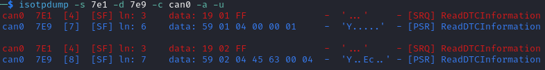

The "59 01 04 00 00 00 01" means that the ECU accepted your request for service 0x19 and sub-function 0x01 (read number of DTCs), it only supports 0x04 mask (for pending DTCs), it uses DTC format 0x00, and there are 0x0001 DTC stored  in memory.

The "59 02 04 45 63 00 04" means that the ECU accepted your request for service 0x19 and sub-function 0x02 (read DTCs), it supports a 0x04 mask, and there is one DTC: 0x4563 with FTB 0x00 and status 0x04 (pending).
0x4563 starts with "01", which means this is a DTC for the chassis domain ("C"), so the corresponding DTC is "C0563" (arbitrary set for demonstration purpose).

Clear Diagnostic Information (0x14)
^^^^^^^^^^^^^^^^^^^^^^^^^^^^^^^^^^^

This service can be used to erase DTCs from the ECU's memory. It is used with a 3-byte parameter to indicate which group of DTCs you want to erase.
Emissions-related systems DTCs can be erased with "00 00 00", and all DTCs can be erased with "FF FF FF". Other possible values are manufacturer-specific.

For example, you can erase all DTCs in ECU B's memory using:

.. code-block:: bash

    $ echo "14 FF FF FF" | isotpsend can0 -s 7e1 -d 7e9

You can verify that DTCs are erased by this command by reading the number of DTCs before and after executing it.
**The ECU will automatically regenerate a DTC after a reset event**.

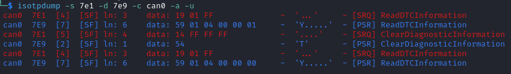

Control DTC Settings (0x85)
^^^^^^^^^^^^^^^^^^^^^^^^^^^

This service allows temporarily disabling DTCs to prevent ECUs from adding DTCs while you are in the middle of a diagnostic.
You can use it with sub-function 0x01 to allow new DTCs, and 0x02 to disable them.

To enable DTCs:

.. code-block:: bash

    $ echo "85 01" | isotpsend can0 -s 7e1 -d 7e9

To disable them:

.. code-block:: bash

    $ echo "85 02" | isotpsend can0 -s 7e1 -d 7e9

.. _security_access:

Security Access (0x27)
^^^^^^^^^^^^^^^^^^^^^^

Some services may require that you first unlock the ECU before you can use them.
You will recognize them because they will reply with error code 0x33 (Security Access Denied) to your requests.

The Security Access service can be used to unlock an ECU.

Security Access can be used to implement a simple `challenge/response authentication <https://en.wikipedia.org/wiki/Challenge%E2%80%93response_authentication>`_ with an ECU.
You first need to request a "seed" from the ECU.
You must then perform some top-secret algorithm to compute a "key" from that seed, and send that "key" to the ECU to unlock it.
Note that the key here does not refer to an encryption key; it refers to the response to the challenge.

There are different security levels available for this service.
To request a seed for level 1, use the following command:

.. code-block:: bash

    $ echo "27 01" | isotpsend can0 -s 7e1 -d 7e9

You should observe that the ECU sends you a 4-byte seed in response.
That seed is generated from the ECU's True Random Number Generator (TRNG). You can request as many as you want.

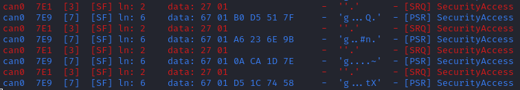

To unlock the ECU, you need to compute the value of the seed XOR 0x12345678.
**This is just for demonstration purposes, and it is not a secure authentication mechanism**.

In Linux, you can compute the "key" to send to the ECU with the following command (using 7D 70 9F 4D as an example):

.. code-block:: bash

    $ printf "%08X " $((0x7D709F4D ^ 0x12345678)) | sed 's/../& /g'

You can send your answer (in this case, 6F 44 C9 35) to the ECU by using the same command as the request, but adding 1 to the security level:

.. code-block:: bash

    $ echo "27 02 6F 44 C9 35" | isotpsend can0 -s 7e1 -d 7e9

If the ECU accepts your UDS request (first byte is 0x67), it means that you provided the correct "key" and the ECU is now unlocked for level 1.

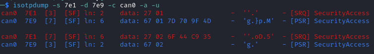

When experimenting with Security Access, you may notably encounter the following error codes:

- 0x24 (Request sequence error): you tried a key without asking for a seed first.
- 0x35 (invalid Key): you provided the wrong key.
- 0x36 (Exceeded number of attempts): you had too many failed attempts.
- 0x37 (Required time delay not expired): you need to wait longer before attempting to unlock the ECU (typically after a reset, to prevent bruteforcing).

Routine Control (0x31)
^^^^^^^^^^^^^^^^^^^^^^

The Routine Control service can be used to implement features not covered by standard services.
Routines are identified by a two-byte identifier.
Similarly to DIDs, there are many standard routine identifiers defined by the UDS standard, but identifiers 0x0200 to 0xDFFF are ECU specific.

The Routine Control service can be used with three sub-functions:

- 0x01 to start a routine.
- 0x02 to stop a routine.
- 0x03 to request the results of a routine.

This service is used with the following parameters: <sub-function> <routine identifier> <optional routine parameter(s)>.
The following routines are available with RAMN ECUs:

- Routine 0x0200 can be used to ask the ECU to stop transmitting periodic CAN messages.
- Routine 0x0201 can be used to erase the EEPROM (where DTCs and VIN are saved).
- Routine 0x0202 can be used to copy the EEPROM to the alternative memory bank (when reflashing an ECU over UDS).
- Routine 0x0203 can be used to ask the ECU to echo what you transmitted (for load test).
- Routine 0x0204 can be used to ask the ECU to echo the first 4-bytes of a request (for PC -> ECU link test).
- Routine 0x0205 can be used to ask the ECU to transmit a UDS payload of a specified size (for ECU -> PC link test).
- Routine 0x0206 can be used to compute the CRC of the ECU's flash.
- Routine 0x0207 can be used to enable autopilot (to use with CARLA).
- Routine 0x0210 can be used to reset BOOT Option bytes (to salvage an ECU with a bad firmware).
- Routine 0x0211 can be used to force an ECU to swap memory banks (also to salvage an ECU).
- Routine 0xFF00 can be used to erase the alternative firmware.
- Routine 0xFF01 can be used to validate memory and swap memory banks.

**Because these routines may modify the ECU flash, do not tinker with them unless you know what you are doing.**

For example, you can ask ECU B to stop transmitting periodic messages with:

.. code-block:: bash

    $ echo "31 01 02 00" | isotpsend can0 -s 7e1 -d 7e9

And you can ask ECU B to resume transmitting periodic messages with:

.. code-block:: bash

    $ echo "31 02 02 00" | isotpsend can0 -s 7e1 -d 7e9

.. _read_memory_by_address:

Read Memory by Address (0x23)
^^^^^^^^^^^^^^^^^^^^^^^^^^^^^

The Read Memory by Address service can be used to read an arbitrary ECU address.
There are two arguments that you naturally need to provide: the address and the number of bytes that you want to read.

Contrary to the DIDs used by the Read Data by Identifier service, real ECU addresses may have different sizes depending on microcontroller architectures.
Therefore, you must provide a third argument that specifies the size of the address and memory fields (*address length format identifier*).
This argument is a byte, which highest 4 bits indicate the size of the "size" parameter, and the lowest 4 bits indicate the size of the "address" parameter.

The format of a Read Memory by Address parameters is <format identifier> <address> <size>.

For example, let us assume that you want to read 4 bytes from address 0x08000000 (start of RAMN ECU program flash).
"4" fits into a single byte, so you could use one byte to provide the size that you want to read.
The addresses used by STM32 microcontrollers are 32-bit long (4 bytes).
Therefore, you can use format identifier 0x41 (4-byte for the address, 1 byte for the size)

You could ask a memory read using:

.. code-block:: bash

    $ echo "23 14 08 00 00 00 04" | isotpsend can0 -s 7e1 -d 7e9

The format identifier refers to the **size of the size parameter** (It is NOT the number of bytes that you want to read), which can be confusing to some.
If you wanted, you could provide the size parameter (4) as a 2-byte or a 4-byte parameter.
Therefore, the commands below are strictly equivalent to the command above:

.. code-block:: bash

    $ echo "23 24 08 00 00 00 00 04" | isotpsend can0 -s 7e1 -d 7e9
    $ echo "23 34 08 00 00 00 00 00 04" | isotpsend can0 -s 7e1 -d 7e9
    $ echo "23 44 08 00 00 00 00 00 00 04" | isotpsend can0 -s 7e1 -d 7e9

The service immediately returns the data that was read.
For example, you can read the first 256 bytes of the program flash of ECU B (address 0x08000000) with:

.. code-block:: bash

    $ echo "23 24 08 00 00 00 01 00" | isotpsend can0 -s 7e1 -d 7e9

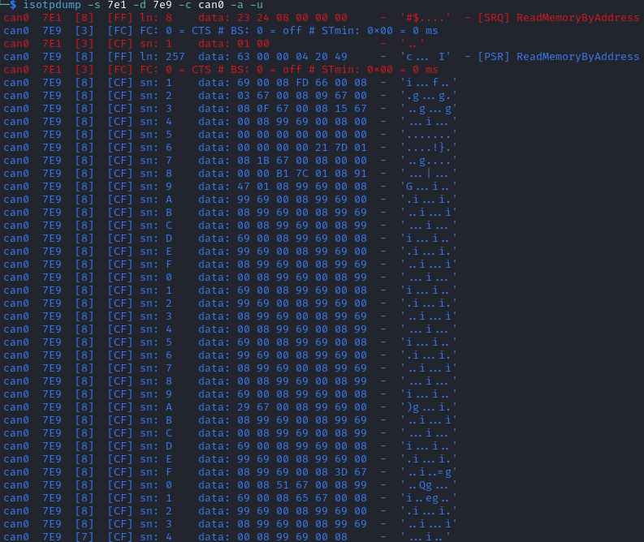

Note that in this case, both the request and the answer are fragmented ISO-TP frames, so you must have isotprecv active in another terminal.

Similarly, you can read the RAM of the microcontroller (starting at address 0x20000000):

.. code-block:: bash

    $ echo "23 24 20 00 00 00 01 00" | isotpsend can0 -s 7e1 -d 7e9

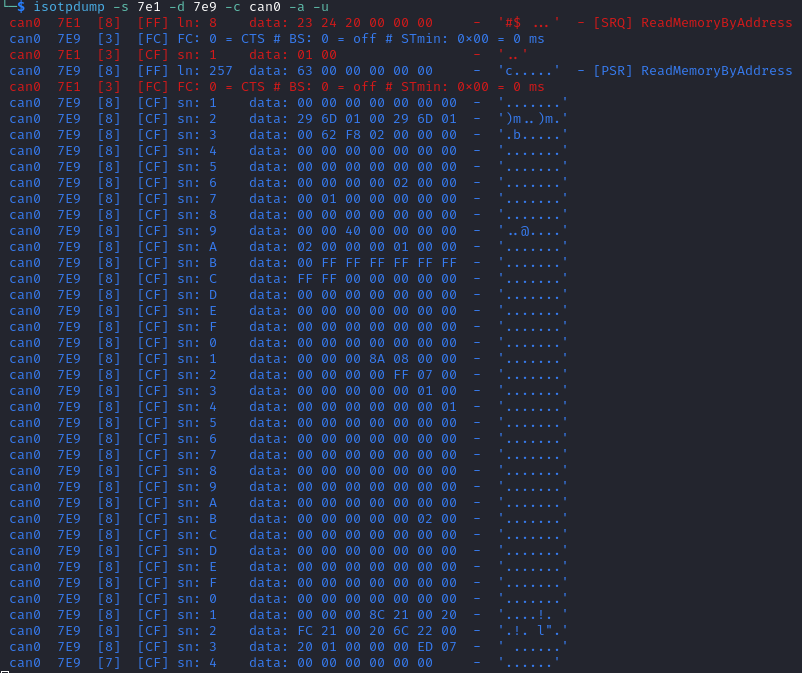

If you want to know at what addresses RAMN ECUs store their variables, you must compile the firmware and look at the ".map" file that the build process generates.

.. _write_memory_by_address:

Write Memory by Address (0x3D)
^^^^^^^^^^^^^^^^^^^^^^^^^^^^^^

Write Memory by Address works the same as Read Memory by Address, except that it takes an additional argument to specify the data that you want to write at a specified address.
**Because this allows overwriting the RAM (and only the RAM), it may crash the ECU if you do not know what you are doing.**

For example, you can write "01 02 03 04" to memory address 0x20000000 using the following command:

.. code-block:: bash

    echo "3D 24 20 00 00 00 00 04 01 02 03 04" | isotpsend can0 -s 7e1 -d 7e9

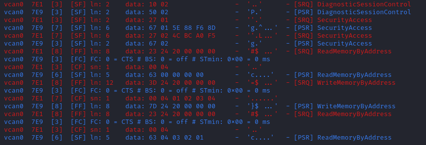

This command will only be accepted if you first ask for a programming session and unlock the ECU with :ref:`security_access`.
You can check that the memory was correctly written by using Read Memory by Address before and after.
Variable addresses depend on the exact version of the firmware that you use.
In the version used in this example, 0x20000000 corresponds to the "error status" variable of the CAN adapter, which can be overwritten without impacting stability.
**If you do not know what variable(s) you overwrote with your command, you should reset the ECU.**

Link Control (0x87)
^^^^^^^^^^^^^^^^^^^

This service can be used to change the baudrate of the CAN bus, which can be useful for example to reflash ECUs over UDS faster.
It requires two steps:

- One command to verify that ECUs will accept the baudrate change.
- One command to transition to the new baudrate.

Note that while real ECUs would automatically revert to the original baudrate after a diagnostic session is over, RAMN ECUs keep the same baudrate until the next reset.
Standard implementations use functional addressing and positive response suppression to send the transition command to all ECU simultaneously.
RAMN ECUs will however wait one second (with their CAN controller OFF) before changing baudrate to tolerate more timing issues, so you can talk to each ECU individually.

You can use this service with one of three sub-functions:

- 0x01 to verify a baudrate change using a one-byte baudrate identifier (e.g., 0x12 for 500000 bps).
- 0x02 to verify a baudrate change using a three-byte specific baudrate value (e.g., 0x7A120 for 500000 bps).
- 0x03 to transition to the new baudrate.

RAMN ECUs support sub-functions 0x01 and 0x03.
The parameter that you must provide to sub-function 0x01 is a one-byte identifier:

- 0x10 means 125000 bps.
- 0x11 means 250000 bps.
- 0x12 means 500000 bps.
- 0x13 means 1000000 bps.

To transition to the new baudrate, use sub-function 0x03 without any argument.
If you want to ask the ECU to not answer if there is no error, use 0x83 instead.

When changing the baudrate of ECUs, you will need to also update the baudrate of your CAN adapter.
If you are using an slcan adapter, you will need to restart slcand and use the -s option (see :ref:`slcan_baudrate`).

Use -s4 for 125000 bps, -s5 for 250000 bps, -s6 for 500000 bps, and -s\ **8** for 100000 bps.

For example, the following commands can be used to update RAMN's baudrate to 1000000 bps for all ECUs, **one by one** (assuming your interface is /dev/ttyACM0):

.. code-block:: bash

    echo "87 01 13" | isotpsend can0 -s 7e1 -d 7e9 -b
    echo "87 01 13" | isotpsend can0 -s 7e2 -d 7ea -b
    echo "87 01 13" | isotpsend can0 -s 7e3 -d 7eb -b

    echo "87 03" | isotpsend can0 -s 7e1 -d 7e9 -b
    echo "87 03" | isotpsend can0 -s 7e2 -d 7ea -b
    echo "87 03" | isotpsend can0 -s 7e3 -d 7eb -b

    sleep 0.5

    sudo killall -w slcand #turn off slcan interface
    sudo slcand -o -c -s8  /dev/ttyACM0 && sudo ip link set up can0

This should also restart your CAN interface, so you will need to restart all your CAN commands.

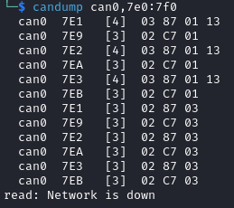

You can simplify the traffic by using functional adressing to send the command simultaneously to all ECUs, and use positive response suppression to ask them to not answer unless an error occurs.

.. code-block:: bash

    echo "87 81 13" | isotpsend can0 -s 7df -d 7e9 -b
    echo "87 83" | isotpsend can0 -s 7df -d 7e9 -b

    sleep 0.5

    sudo killall -w slcand #turn off slcan interface
    sudo slcand -o -c -s8  /dev/ttyACM0 && sudo ip link set up can0

This achieves the same baudrate change with only two CAN messages.

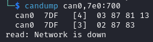

.. _request_upload:

Request Upload (0x35)
^^^^^^^^^^^^^^^^^^^^^

This service can be use to request a data "upload" to an ECU. Note that in embedded systems, "upload" typically refers to ECU -> computer transfers (which means that you are "downloading" data to your computer).
This can be used to dump RAMN ECU's flash.
The same result can be achieved with the :ref:`read_memory_by_address` service, but this service supports compression and encryption when available.

It is used as follows:

- Call this service to request a data upload.
- Call the :ref:`transfer_data` service as many times as needed to receive the data.
- Call the :ref:`transfer_exit` service to finish the transfer.

This service has several arguments:

- One byte to specify compression and encryption methods. RAMN only supports 0x00, which means neither is used.
- One byte to specify the length of the address and size fields (similar to :ref:`read_memory_by_address`). RAMN ECUs support 0x44 (4-byte size, 4-byte address).
- Several bytes to specify the address of the data.
- Several bytes to specify the length of the (uncompressed) data.

For example, you can request a transfer of 256 (0x100) bytes from address 0x08000000 with:

.. code-block:: bash

    $ echo "35 00 44 08 00 00 00 00 00 01 00" | isotpsend can0 -s 7e1 -d 7e9 -b

The ECU should answer with:

- The length of its address and size fields. Because there is no address, the address size is always 0 here, and only the 4 highest bits matter.
- The maximum size that it will use for the transfer (including service identifier and data parameter).

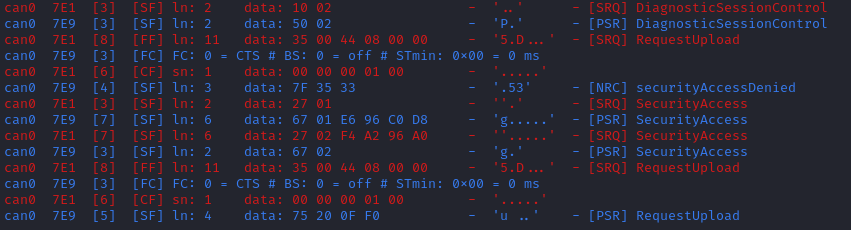

For example, in this case, ECU B answered with "75 20 0F F0".
75 means that it accepts the upload, 20 means that it provides the size of the "size" parameter (the next parameter) as 2 bytes, and the next two bytes indicates that it will transfer data with blocks of size 0xFF0 (4080 bytes).
The ECU is now waiting for you to initiate the transfer.

.. _transfer_data:

Transfer Data (0x36)
^^^^^^^^^^^^^^^^^^^^

Transfer Data is used to implement the transfer started by another service (e.g., :ref:`request_upload` or :ref:`request_download`).
Each call to the Transfer Data service corresponds to the transfer of a data block.
You must provide a "block counter", which starts at 0x01 for the first block.
It overflows after 0xFF and starts again from 0x00.

For example, you can execute the following command after the :ref:`request_upload` example:

.. code-block:: bash

    $ echo "36 01" | isotpsend can0 -s 7e1 -d 7e9 -b

The ECU will answer with an echo of the block counter, followed by the data to read.

If you are trying to read or write data beyond the specified data size, you will get the error code 0x24, for "\ *request sequence error*\ ".

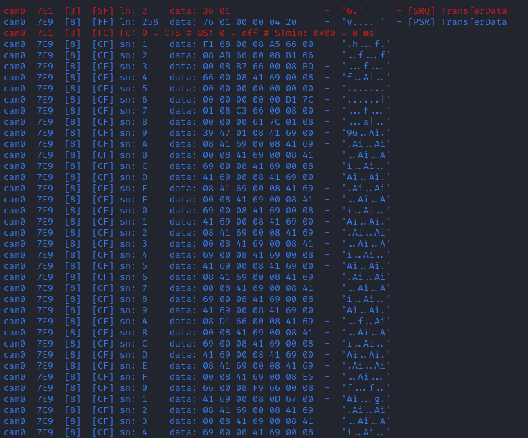

If you are writing data, you must provide the data bytes after the block counter, and the ECU will only answer with an echo of the block counter.

.. _transfer_exit:

Request Transfer Exit (0x37)
^^^^^^^^^^^^^^^^^^^^^^^^^^^^

The Request Transfer Exit service is used to terminate a transfer.
It must be called if you want to confirm a download or initiate another transfer.
This service may have optional arguments, but RAMN ECUs require none, so it is used simply by sending "37":

.. code-block:: bash

    $ echo "37" | isotpsend can0 -s 7e1 -d 7e9 -b

which should be answered with "77" by the ECU.

.. _request_download:

Request Download (0x34)
^^^^^^^^^^^^^^^^^^^^^^^

Request Download works the same as :ref:`request_upload`, but the data is on the client's side request instead of the ECU's side answer.
It is supported by RAMN ECUs only if they have a dual memory bank (microcontroller reference ending with CET6).
Contrary to :ref:`write_memory_by_address`, this service can write data to the ECU's flash, e.g., for a firmware update.

For example, you can use the following command to initiate a download of 0x100 bytes at address 0x08000000:

.. code-block:: bash

    $ echo "34 00 44 08 00 00 00 00 00 01 00" | isotpsend can0 -s 7e1 -d 7e9 -b

The ECU will specify the size of the data that must be included in the following "Transfer Data" calls, so you must adapt to whatever value the ECU sends back.

Finishing a "Request Download" transfer of a firmware file does not immediately make the ECU use the new firmware that you uploaded.
You need to use routine controls as well to validate the new firmware.
With RAMN, this can be done with:

- Routine control 0x0202 to ask the ECU to copy its current EEPROM to the alternative memory bank.
- Routine control 0xFF01 to ask the ECU to swap banks (and use the new firmware).
