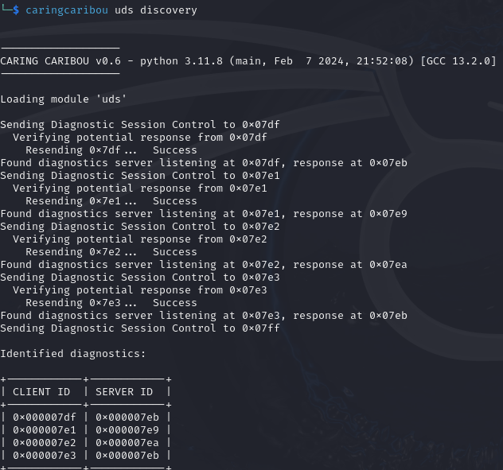
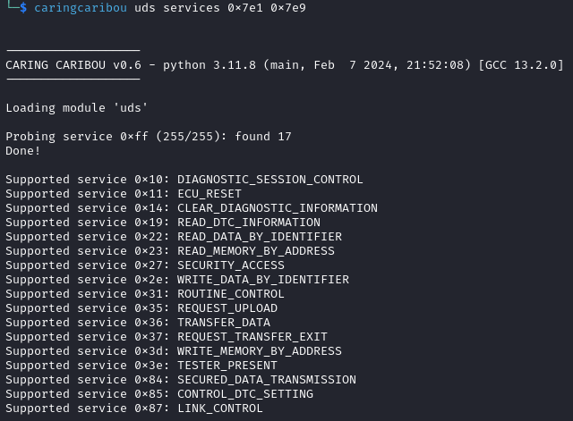
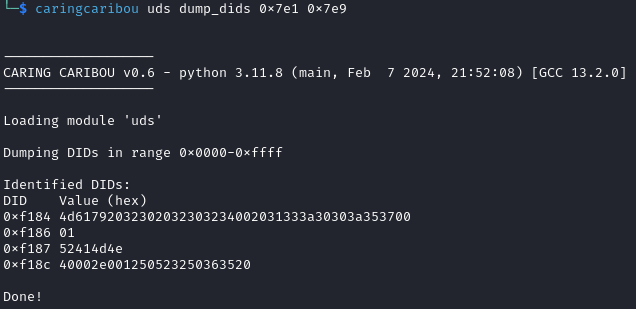

Going Further
=============

Using External Adapters
-----------------------

Although you can use ECU A as a USB to CAN adapter, you may prefer to use an external CAN adapter and an analysis tools suite that goes with it.
For example, you could use `BUSMASTER <https://rbei-etas.github.io/busmaster/>`_ with a `PCAN-USB <https://www.peak-system.com/PCAN-USB.199.0.html?&L=1>`_.
These tools typically allow you to load a database file ("DBC file"), which specifies what each bit in CAN frames represents.

DBC File for RAMN
^^^^^^^^^^^^^^^^^^

The "DBC" and "DBF" files for RAMN are available in the `misc folder <https://github.com/ToyotaInfoTech/RAMN/tree/main/misc>`_.
You can use these files to facilitate the analysis of RAMN's default signals.

For example, with BUSMASTER and a compatible external adapter, you can select "Database -> Associate" and load the .DBF file.

.. image:: img/busmaster_dbc.png
   :align: center

This will allow you to replace the CAN identifiers and payloads with mnemonics, as shown below.

.. image:: img/busmaster_dbc2.png
   :align: center

.. image:: img/busmaster_dbc3.png
   :align: center

This will allow you to record and display graphs of values observed on the CAN bus.

.. image:: img/busmaster_dbc4.png
   :align: center

RAMN's GitHub repository features `an example of PID control <https://github.com/ToyotaInfoTech/RAMN/blob/main/misc/PID_example.pdf>`_ implemented on RAMN ECUs in closed-loop with a driving simulator (see :ref:`carla_tutorial`).

Other CAN Tools
---------------

Other CAN software tools can be used to interact with RAMN's ECUs.

For example, `Caring Caribou <https://github.com/CaringCaribou/caringcaribou>`_ offers various features to interact with UDS and XCP.
Follow the `instructions here <https://github.com/CaringCaribou/caringcaribou/blob/master/documentation/howtoinstall.md>`_ to install it:

.. code-block:: bash

    $ git clone https://github.com/CaringCaribou/caringcaribou
    $ cd caringcaribou
    $ cd python3 setup.py install

Then create a .canrc file in your home directory (you can use ``$ nano ~/.canrc``) with the following content:

.. code-block:: bash

    [default]
    interface = socketcan
    channel = can0

You should then be able to use caring caribou's modules.

UDS
^^^

You can use the discovery module to find out the CAN IDs used by RAMN's ECUs.

.. code-block:: bash

    $ caringcaribou uds discovery

You can find out which services are supported by ECU B using the "services" module:

.. code-block:: bash

    $ caringcaribou uds services 0x7e1 0x7e9

In a different window, you can use ``$ isotpdump can0 -s 7e1 -d 7e9 -c -u`` to observe traffic; make sure your receiver is closed.

You can read all possible DIDs of ECU B with:

.. code-block:: bash

    $ caringcaribou uds dump_dids 0x7e1 0x7e9

If you get errors, try executing ``$ sudo ifconfig can0 txqueuelen 10000``.

XCP
^^^

Use the help page to read how to use the XCP module of Caring Caribou:

.. code-block:: bash

    $ caringcaribou xcp --help

You can scan for XCP pairs using the discovery module (the autoblacklist option listens for traffic first to avoid false positives):

.. code-block:: bash

    $ caringcaribou xcp discovery -autoblacklist 10

You can ask the ECUs their basic information, e.g. for ECU B:

.. code-block:: bash

    $ caringcaribou xcp info 0x552 0x553

In a different window, use ``$ candump can0,552:7fe`` to observe XCP traffic.

You can try dumping the first 256 bytes of the firmware of ECU B with XCP using the following command:

.. code-block:: bash

    $ caringcaribou xcp dump 0x552 0x553 0x08000000 0x100 -f dump.bin

Scripting CAN
-------------

For CTFs and other advanced CAN activities, you can use python-can to automate CAN communications.

`python-can <https://python-can.readthedocs.io/en/stable/>`_ can be used to automate the transmission of frames directly at the CAN layer.
You can find a list of examples `here <https://github.com/hardbyte/python-can/tree/main/examples>`_.
The example `send_one.py` will show you how to simply send a CAN message, `receive_all.py` will show you how to receive CAN messages, and `asyncio_demo.py` will show you how to link reception and transmission of CAN messages.

Similarly, `can-isotp <https://can-isotp.readthedocs.io/en/latest/>`_ can be used to automate the transmission of ISO-TP messages.
Refer to its `documentation <https://can-isotp.readthedocs.io/en/latest/isotp/examples.html>`_ for examples.

Finally, `udsoncan <https://udsoncan.readthedocs.io/en/latest/udsoncan/examples.html>`_ can be used for UDS exchanges.
