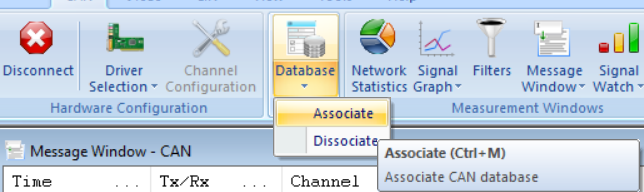
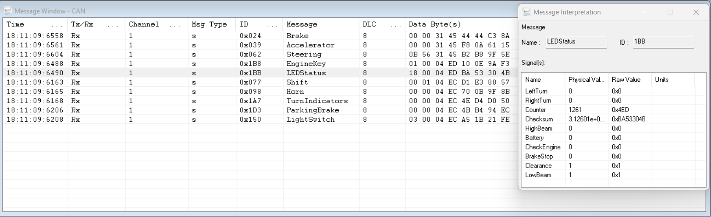
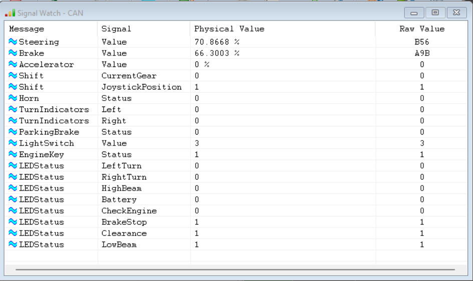
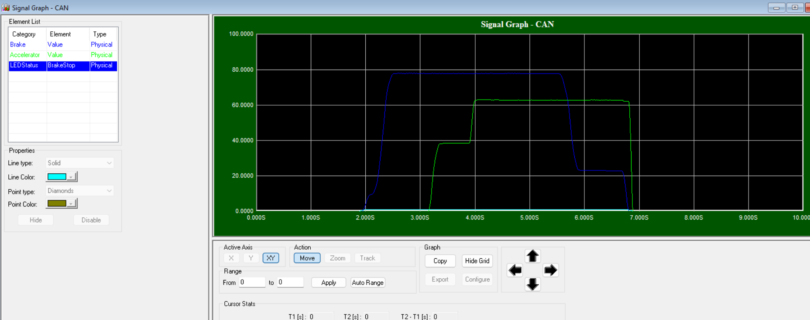

Going Further
=============

Using External tools
--------------------

Although you can use ECU A as a USB to CAN adapter, you may prefer to use an external CAN tool and its analysis tool suite.
For example, you could use `BUSMASTER <https://rbei-etas.github.io/busmaster/>`_ with a `PCAN-USB <https://www.peak-system.com/PCAN-USB.199.0.html?&L=1>`_.
These tools typically allow you to load a database file ("DBC file"), which specifies what each bit in CAN frames represents.

DBC File for RAMN
^^^^^^^^^^^^^^^^^^

The "DBC" and "DBF" files for RAMN are available in the `misc folder <https://github.com/ToyotaInfoTech/RAMN/tree/main/misc>`_.
You can use these files to facilitate the analysis of RAMN's default signals.

For example, with BUSMASTER and a compatible external adapter, you can select "Database -> Associate" and load the .DBF file.

This will allow you to replace the CAN identifiers and payloads with mnemonics, as shown below.

This will allow you to record and display graphs of values observed on the CAN bus.

RAMN's GitHub repository features `an example of PID control <https://github.com/ToyotaInfoTech/RAMN/blob/main/misc/PID_example.pdf>`_ implemented on RAMN ECUs in closed-loop with a driving simulator (see :ref:`carla_tutorial`).
