.. _interacting_isotp:

Interacting with ISO-TP
=======================

As explained in :ref:`interacting_with_CAN`, ECUs often offer diagnostic features over CAN, following the requirements of several standard documents:

- `Unified Diagnostic Services (UDS) <https://en.wikipedia.org/wiki/Unified_Diagnostic_Services>`_
- `Keyword Protocol 2000 (KWP2000) <https://en.wikipedia.org/wiki/Keyword_Protocol_2000>`_
- `Universal Measurement and Calibration Protocol (XCP) <https://en.wikipedia.org/wiki/XCP_(protocol)>`_

Diagnostics involve large data transfers between a client (the diagnostic tool) and a server (the ECU), e.g., to send a new firmware file to an ECU.
CAN frames can only hold a payload up to 8 bytes (64 bytes for CAN FD), therefore it is preferable to use a transport layer to enable the transfer of larger payloads.
`ISO-TP (ISO 15765-2) <https://en.wikipedia.org/wiki/ISO_15765-2>`_ (sometimes referred to as CAN-TP) is a transport layer designed to facilitate such transfers.

ISO-TP Basics
-------------

ISO-TP (ISO 15765-2) is the transport layer used by UDS and KWP2000. It allows the transfer of payloads of up to 4095 bytes.
It works by using the first byte(s) of every CAN frame as a header, not dissimilar to how, for example, the IP protocol occupies the first bytes of an Ethernet frame.

ISO-TP is typically used to establish a one-to-one communication channel: one client and one server.
The client sends requests by sending CAN frames with a specific (static) identifier, and the server responds by sending CAN frames with another specific (static) identifier.
For example, RAMN's ECU B listens to CAN frames with the ID 0x7e1 (transmitted by a diagnostic tool) and interprets them as ISO-TP frames, and answers to them by transmitting CAN frames with the ID 0x7e9.
This is called **normal addressing**, however there are other types of addressing (See :ref:`isotp_addressing`).

ISO-TP headers use a **dynamic size** header (Protocol Control Information, PCI).
The type of header is defined by the first nibble (**the first four bits**) of the header.
There are four types of headers:

- **Single Frame [SF, first byte is 0X]**: this is a one-byte header for ISO-TP payloads that are 7 bytes or less.
- **First Frame [FF, first byte is 1X]**: this is a two-byte header that **starts** the transmission of ISO-TP payloads that are 8 bytes or more.
- **Consecutive Frame [CF, first byte is 2X]**: this is a one-byte header that **continues** a transmission started by a "First Frame" header.
- **Flow Control Frame [FC, first byte is 3X]**: this is a three-byte header used by the **receiver** to control the speed of the ISO-TP transfer.

Although ISO-TP features a flow control mechanism, it does not include an "acknowledgment" mechanism to confirm that a frame was reconstructed correctly.
CAN frames representing ISO-TP data may be padded with arbitrary values (common padding values include 0xCC, 0xAA, and 0x00) so that they are always 8-byte long.

Single Frame
""""""""""""

Single Frames (header format "0X") are simple ISO-TP frames: their header indicates that the entirety of the ISO-TP payload is contained within the CAN frame, after the header.
This implies that the ISO-TP frame is 7 bytes or less, otherwise the payload and its one-byte header would not fit in a single CAN frame.

The value of the second nibble represents the length of the ISO-TP payload.
For example, "01" represents an ISO-TP payload of one byte, and "05" represents an ISO-TP payload of five bytes.

With Single Frames, there is no need for flow control, so the Single Frame represents the whole ISO-TP transfer.
As an example, if a diagnostic tool wants to transmit the ISO-TP payload "00 11 22 33 44" (5 bytes) to ECU B, it would send the following CAN frame:

.. parsed-literal::

    ID: 0x7e1  DLC: 6  Payload: **05** 00 11 22 33 44

Note that the ISO-TP payload size is **5 bytes**, but the associated CAN frame is **6 bytes**, because one byte of the CAN frame is used as a header.

First Frame and Consecutive Frame
"""""""""""""""""""""""""""""""""

First Frames (header format "1XXX") and Consecutive Frames (header format "2X") are used together to transfer payloads larger than 7 bytes.
The First Frame specifies the length of the ISO-TP payload, and **includes the first 6 bytes** of that payload.
The second nibble of the first byte, concatenated with the second byte of the header, represents the length of the payload.
For example, a header of "10 09" represents an ISO-TP frame of nine bytes, and "1F FF" represents an ISO-TP frame of 0xFFF (4095) bytes.

Consecutive Frames contain the rest of that payload.
The second nibble of the header byte is an index to ensure that the payload can be reconstructed in order.

As an example, if a diagnostic tool wants to transmit the ISO-TP payload "00 11 22 33 44 55 66 77 88 99 AA BB CC DD" (14 bytes) to ECU B, it would send the following CAN frames:

.. parsed-literal::

    ID: 0x7e1  DLC: 8  Payload: **10 0E** 00 11 22 33 44 55
    ID: 0x7e1  DLC: 8  Payload: **21** 66 77 88 99 AA BB CC
    ID: 0x7e1  DLC: 2  Payload: **22** DD

Note that this represents the entirety of what is sent by the diagnostic tool, but for frames larger than 7 bytes, the diagnostic tool actually  **must wait for Flow Control Frames**, described below.

Flow Control Frame
""""""""""""""""""

Flow Control Frames (header format "3XYYZZ") are sent by the ISO-TP **receiver** to control the speed of transfer. Because they are sent by the receiver, they are transmitted on a different CAN ID than other frames.
A Flow Control Frame will at least always be found as an answer to a "First Frame".

A Flow Control frame has the format "3X YY ZZ", containing the following parameters:

- **Flag [X, 4 bits]**: This contains actual flow control data. 1 is for "Continue", 2 is for "Wait", and 3 is for "Abort".
- **Block Size [YY, 8 bits]**: This specifies how many frames the client should send before waiting for another Flow Control Frame. 0 means "send everything without waiting".
- **Separation Time minimum (STmin) [ZZ, 8 bits]**: this specifies how long the client should wait between frame transmissions. 0 means "send as fast as possible", values between 1 to 127 specifies a delay in milliseconds. 0xF1 to 0xF9 are used to specify large delays between 100 and 900 milliseconds. Values in-between are reserved by the standard.

Modern ECUs will often answer to a "First Frame" with "30 00 00", which means "send everything at maximum speed" - in that case, this would be the only Flow Control frame in the exchange.

If the ECU answered "30 00 F9" instead, the client would also send all frames without waiting for a Flow Control Frame, but it would wait 900 milliseconds between each frame.

If the ECU answered "30 01 00", the client would send the first "Consecutive Frame" and wait for another Flow Control Frame before proceeding.

Examples
""""""""

Below is an example of a full ISO-TP transfer:

.. parsed-literal::
    ID: 0x7e1  DLC: 8  Payload: **10 0E** 00 11 22 33 44 55 ("I want to send a 14-byte payload, here are the first bytes")
    ID: **0x7e9**  DLC: 3  Payload: **30 00 00** ("Send the rest without waiting, at maximum speed")
    ID: 0x7e1  DLC: 8  Payload: **21** 66 77 88 99 AA BB CC ("Here is the second part")
    ID: 0x7e1  DLC: 2  Payload: **22** DD ("Here is the third part")

Note that there is no acknowledgment at the end.
If the ECU used a Block Size different from zero, the same data exchange would be as below.

.. parsed-literal::
    ID: 0x7e1  DLC: 8  Payload: **10 0E** 00 11 22 33 44 55 ("I want to send a 14-byte payload, here are the first bytes")
    ID: **0x7e9**  DLC: 3  Payload: **30 01 00** ("Send one CAN frame and wait")
    ID: 0x7e1  DLC: 8  Payload: **21** 66 77 88 99 AA BB CC ("Here is the second part")
    ID: **0x7e9**  DLC: 3  Payload: **30 01 00** ("Send one CAN frame and wait")
    ID: 0x7e1  DLC: 2  Payload: **22** DD ("Here is the third part")

ISO-TP on Linux
---------------

The package can-utils proposes `various tools <https://github.com/linux-can/can-utils/blob/master/README.md>`_ to interact with ISO-TP.
There are three commands that you will probably want to use: **isotpsend** to send ISO-TP frames, **isotprecv** to receive ISO-TP frames, and **isotpdump** to dump and interpret ISO-TP traffic.
In addition, you can still use the basic commands introduced in the previous guide (See :ref:`interacting_with_CAN`).

UDS commands are presented in detail in another section.
This section will mostly use the basic UDS command "3E 00", which should be answered by an ECU with "7E 00". We will send it to ECU B, which uses the ID 0x7e1 to receive commands and ID 0x7e9 to answer them.
Any other random commands, likely invalid, should be answered by "7F <first byte you sent> <error code byte>" to indicate an error with your command.

candump
"""""""

When experimenting with ISO-TP, you will probably want to display the raw CAN traffic.
This can be done using candump with the correct filters.
For example, if you want to display CAN frames for the ISO-TP traffic of ECU B, you should only display CAN frames with IDs 0x7e1 and ID 0x7e9:

.. code-block:: bash

    $ candump can0,7e1:7ff,7e9:7ff

If you want to display all ISO-TP frames typically found in modern vehicles, you can filter frames with an ID between 0x7e0 and 0x7f (See :ref:`can_filters`):

.. code-block:: bash

    $ candump can0,7e0:7f0

When experimenting with ISO-TP, it is recommended that you always keep a terminal with this command executed, so that you can observe CAN frames directly.

cansend
"""""""

Although it is not recommended, there is nothing preventing you to create ISO-TP header and sending CAN frames manually.
To send the ISO-TP payload "3E 00" to ECU B, you can type:

.. code-block:: bash

    $ cansend can0 7e1#023E00

On your candump terminal, you should observe two messages:

- Your request ("3E 00", transmitted by you on ID 0x7e1).
- The answer from the ECU ("7E 00", transmitted by ECU B on ID 0x7e9).

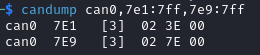

Notice that the CAN frames have a DLC (payload size) of 3, but the ISO-TP payload is 2 bytes - because the first byte of the CAN payload is used to indicate the size of the ISO-TP payload.
Notice also that your request CAN message does not specify what the answer CAN ID is - this is statically set, unlike source and destination ports in other protocols such as TCP.

If you ignore the Flow Control Frames and just hope that you get the timing right, you can also directly send fragmented frames.
For example, to send payload 00 11 22 33 44 55 66 77 (8 bytes), you can type:

.. code-block:: bash

    $ cansend can0 7e1#1008001122334455 && cansend can0 7e1#216677

And observe the answer in candump.

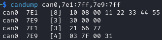

Although there may be error messages at the layer above ISO-TP (such as the "7F 00 31" UDS error message in the screenshot above),
**there are no error messages at the ISO-TP layer**.
If you make mistakes when formatting an ISO-TP frame, the ECU will simply not answer.
For example, the ECU does not answer to the wrongly formatted requests below, and does not report the errors.

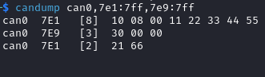

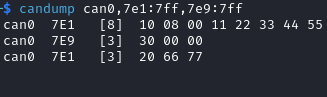

ECUs typically have a very fast timeout for ISO-TP requests, and will close the transfer if frames are not send fast enough.
It is recommended that you do not format ISO-TP frames yourself, but use a tool such as **isotpsend** instead.

isotpsend
"""""""""

The command isotpsend allows you to send an arbitrary payload to an ISO-TP server.
As arguments, you need to provide the can interface, the source CAN ID (the one used by the client to transmit data), and the destination CAN ID (used by the server to transmit Flow Control Frames).
The payload must be provided as stdin, byte by byte. This can be done in Linux using the echo command.
For example, use the following command to send the two-byte ISO-TP payload "3E 00" to ECU B:

.. code-block:: bash

    $ echo "3E 00" | isotpsend -s 7e1 -d 7e9 can0

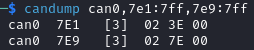

This is the exact same CAN traffic as the previous one with candump, except this time you do not need to add the header yourself. You do however need to provide the destination ID because isotpsend waits for Flow Control Frames.

.. note::
    Note that the "source" corresponds to the ID that the target ECU listens to - which may feel a bit counterintuitive to some. The analogy to the TCP protocol's "source" and "destination" is limited: for ISO-TP, "source" and "destination" IDs are a static pair.
    If you want to talk to another ECU, you need to change **both** the source and destination.

You can send payloads of up to 4095 bytes with isotpsend without worrying about ISO-TP formatting. For example:

.. code-block:: bash

    $ echo "00 11 22 33 44 55 66 77 88 99 AA BB CC DD EE FF 00 11 22 33" | isotpsend -s 7e1 -d 7e9 can0

Should show the traffic shown in the screenshot below.

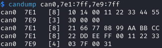

If you just want to test an ISO-TP link and do not care about the payload, you can use the -D option to ask isotpsend to generate a payload of a specific size for you.
You can also use the -f function to force the value (in ns) of the Separation Time of the client.
For example, use the following command to generate a 100-byte payload and send it with a delay of 1 s between transmissions:

.. code-block:: bash

    $ isotpsend -s 7e1 -d 7e9 -D 100 -f 1000000000 can0

You should be able to observe a slow transmission in your candump terminal.

.. image:: img/isotpsend_test2.png
   :align: center

isotprecv
"""""""""

The command isotpsend allows you to send ISO-TP frames, but it does not listen to the answer from the server (the ECU). For this, you need to use isotprecv in another terminal with the same parameters:

.. code-block:: bash

    $ isotprecv -s 7e1 -d 7e9 can0

This will receive one payload and close, but you can use the -l option to listen to multiple ISO-TP payloads:

.. code-block:: bash

    $ isotprecv -s 7e1 -d 7e9 -l can0

If you open one of these commands in a terminal, and use isotpsend in another terminal, you should be able to see the ECU's answers to your ISO-TP payloads in the isotprecv terminal. For example, type the following command in another terminal:

.. code-block:: bash

    $ echo "3E 00" | isotpsend -s 7e1 -d 7e9 can0

and observe the isotprecv terminal, which should show the answer from the ECU.

.. image:: img/isotprecv_test.png
   :align: center

.. warning::

    Do not switch the source and destination when using isotprecv and isotpsend - they should be using the same arguments.
    If you use ``isotprecv -s 7e9 -d 7e1 can0`` instead, you will not listen to ECU B's answers, but you will be pretending to be ECU B and be listening to the same commands as it does.
    Typically, source IDs are lower than destination IDs in real ECUs, therefore:

        - If the first parameter is lower than the second parameter, you are listening to the ECU's answers (typical usage).
        - If the second parameter is lower than the first parameter, you are pretending to be an ECU (e.g., if you want to develop an ECU simulator).

Note that the request is not displayed in isotprecv, only the answer. You can use isotpdump to display both requests and answers in the same terminal.

isotpdump
"""""""""

The command isotpdump will display both requests and answers in the same window.
Similarly to candump, it is recommended that you keep a terminal opened with it.

Use the following command to dump the traffic between you and ECU B:

.. code-block:: bash

    $ isotpdump -s 7e1 -d 7e9 -c can0

The -c option adds color to messages, to easily differentiate requests (in red) from answers (in blue).

If you type the following isotpsend command in another terminal, you should be able to observe ISO-TP traffic.

.. code-block:: bash

    $ echo "3E 00" | isotpsend -s 7e1 -d 7e9 can0

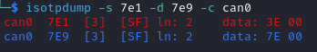

You can use the options -a to add ASCII display, and -u to interpret the payload as UDS traffic:

.. code-block:: bash

    $ isotpdump -s 7e1 -d 7e9 -c can0 -a -u

.. image:: img/isotpdump_test3.png
   :align: center

Contrary to candump, isotpdump gets rid of the header for you so you can easily identify the actual ISO-TP payload.
However, it still displays CAN frames one by one. This can be a bit overwhelming with large payloads, for example:

.. code-block:: bash

    $ isotpsend -s 7e1 -d 7e9 can0 -D 200

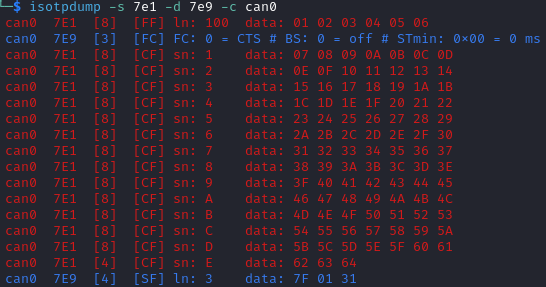

isotpsniffer
""""""""""""

If you only want to see the reconstructed payload, you can use isotpsniffer instead.
You can use it with the syntax below:

.. code-block:: bash

    $ isotpsniffer -s 7e1 -d 7e9 can0 -c

which should only display the recontructed payload, e.g., when using isotpsend with a large payload:

.. code-block:: bash

    $ isotpsend -s 7e1 -d 7e9 can0 -D 100

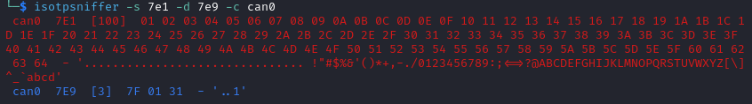

isotpperf
"""""""""

You can measure the performance of the ISO-TP connection using isotpperf, e.g., with ECU B:

.. code-block:: bash

    $ isotpperf -s 7e1 -d 7e9 can0

This will display ongoing transfers and measure how long they take.

You can try various transfers when forcing the STmin value locally with the -f option. Open another window and type the following commands to send payloads with the maximum size and different timings:

.. code-block:: bash

    $ isotpsend -s 7e1 -d 7e9 can0 -f 100000 -D 4095
    $ isotpsend -s 7e1 -d 7e9 can0 -f 1000000 -D 4095
    $ isotpsend -s 7e1 -d 7e9 can0 -f 10000000 -D 4095

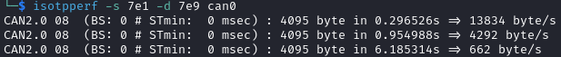

isotpserver
"""""""""""

If you want to access an ECU's ISO-TP server over an IP network, you can use isotpserver.
For example, if you want to forward ISO-TP traffic from ECU B (ISO-TP pair 0x7e1/0x7e9) to IP port 7777, you can use the following command:

.. code-block:: bash

    $ isotpserver -s 7e1 -d 7e9 -l 7777 can0

.. warning::
    This command lets anyone who can access your IP server communicate with ECU B. Only use this if you know what you are doing.

You can connect to this port using for example netcat:

.. code-block:: bash

    $ nc localhost 7777

You can send ISO-TP frames as ASCII embedded in <>, for example if you type "<3E00>" and press ENTER, you should receive "<7E00>" in the same terminal.

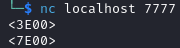

This command can be useful to share one ECU remotely with multiple people.
However, note that ISO-TP answers (and answers only) will be broadcast to all clients.
You can also use the **isotptun** command to create an IP over ISO-TP tunnel.

(Slightly) Advanced ISO-TP concepts
-----------------------------------

Physical and Functional Addressing
""""""""""""""""""""""""""""""""""

There are two types of addressing:

- Physical Addressing
- Functional Addressing

In Normal addressing, a diagnostic tool only talks to one ECU at a time.

In Functional addressing, a diagnostic tool can talk to a group of ECUs simultaneously.
It is only supported for Single Frames, which do not require flow control and can therefore easily be received by several receivers at once.
A functional address often used by ECUs is 0x7DF, as defined by `OBD-II PIDs <https://en.wikipedia.org/wiki/OBD-II_PIDs>`_.

.. _isotp_addressing:

Addressing
""""""""""

There are different types of addressing defined in ISO-TP:

- **Normal Addressing**: the address IDs are fully contained in the CAN Identifier (e.g., 0x7e1 and 0x7e9 for ECU B). It works with both standard (11-bit) and extended (29-bit) CAN identifiers.
- **Normal Fixed Addressing**: this is a subformat of normal addressing, only for 29-bit extended identifiers, where addresses must follow the `J1939 format <https://www.csselectronics.com/pages/j1939-explained-simple-intro-tutorial>`_.
- **Extended Addressing**: The first byte of the CAN payload is used as an additional address byte. This means that the header size becomes two bytes for Single Frames and Consecutive Frames, three for First Frames, and four for Flow Control Frames.
- **Mixed Addressing**: a mix of normal fixed addressing and extended addressing.

CAN FD
""""""

The newer version of ISO-TP makes use of the extra bandwidth provided by CAN FD (See :ref:`can_fd`).
Concretely:

- Single Frames can hold a payload of up to 62 bytes. To use this, the first byte of the CAN frame should be "00", and the following byte should indicate the ISO-TP payload size (up to 62 bytes, because the first two bytes are occupied by the header).
- Fragmented frames (First Frames + Consecutive Frames) can hold a payload of up to 4 Gigabytes in size. To use this, the first two bytes should be "1000", and the four following bytes should indicate the ISO-TP payload size.

Troubleshooting
"""""""""""""""

If you encounter timeout issues (error messages such as "read socket t: Connection timed out"), it indicates that the connection is unreliable, i.e., either that:

- ECU A (your USB to CAN adapter) is not fast enough to transfer data from USB to CAN.
- Your PC is not sending the correct data over USB.

If ECU A is the problem, it should display an error message on its screen.

If you are using a virtual machine, its USB settings may not be reliable enough.
In VirtualBox, go to Settings -> USB and check "USB 3.0 (xHCI) Controller" (make sure your virtual machine is shut down).

If it still fails, try using the -f option with isotpsend to force it to slow down, e.g., with "-f 100000".
