.. _protocol_tutorial:

The CAN Protocol in Depth
=========================

.. warning::

	This section is still a work in progress. Please make sure you have the latest RAMN firmware from Github, and contact us if you notice issues.

Introduction
------------

Up to this point, we have treated the CAN protocol as a transparent layer: we can "magically" exchange messages between ECUs using tools such as *cansend* and *candump*.
In this tutorial, we experiment with the CAN protocol at the physical level, and interact directly with the bitstream of the CAN bus.

If you have not already, you should read the :ref:`advanced_can` section (although you may skip the "CAN filters" and "bit timings" part).

Quick Practical Refresher
^^^^^^^^^^^^^^^^^^^^^^^^^

Below is a quick (slightly simplified) refresher about the CAN bus that may help you understand this tutorial.

- CAN Frames are `NRZ bitstreams <https://en.wikipedia.org/wiki/Non-return-to-zero>`_ (simple streams of 0s and 1s) with a common nominal baud rate (typically 500kbps).
- Check Wikipedia for the  `standard CAN frame format <https://en.wikipedia.org/wiki/CAN_bus#Base_frame_format>`_ and `extended CAN frame format <http://en.wikipedia.org/wiki/CAN_bus#Extended_frame_format>`_. Valid frames start with one 0 (SOF) and end with eleven 1s (ACK delimiter, EOF, IFS).
- **Dominant/Recessive**: A 0 bit is *dominant* and a 1 bit is *recessive*. If several ECUs simultaneously transmit a bit, the resulting bit is 0 if any ECU transmits 0, and 1 only if all ECUs transmit 1.
- **Bit stuffing**: To help synchronize clocks, from the SOF bit to CRC0 bit (included), if there are five successive identical bits (00000 or 11111), then one bit of the opposite value is inserted after.
- **Acknowledgement**: The ACK bit of a CAN frame is set to 0 by the ECU(s) that receive the frame (**not** the one transmitting the frame).
- **Error Flag**: Six successive 0 bits (which violate bit stuffing and should always trigger an error detection) represent an *Active Error Flag*. When other ECUs detect an error, they will in turn send their own *Active Error Flag*. Depending on the error detection timing, the total "superposed" *Active Error Flag* can be any size between six and twelve 0 bits.
- **Error Frame**: The *Error Flag* above, along with an 8-bit recessive *Error Delimiter* and a 3-bit recessive *Interframe Space*, represent an *Error Frame*.
- **Overload Frame**: If an *Error Frame* is sent during the *Interframe Space* (IFS) field of a CAN frame (the very last bits), it actually represents an *Overload Frame*. It signals that an ECU needs time to process a frame and is not considered a real "error".
- **Error Active**: The normal operation mode of CAN controllers is the **Error Active** mode, where they actively transmit **Active Error Flags** to destroy and report invalid CAN frames.
- **Error Passive**: ECUs maintain both a *Receive Error Counter* (REC) and *Transmit Error Counter* (TEC), that are increased and decreased following certain rules. Above a certain number of errors, to avoid destroying CAN traffic with *Active Error Flags* by mistake, ECUs will enter **Error Passive** mode, where they only send *Passive Error Flags* (six recessive 1 bits instead of dominant 0 bits) and wait longer between transmissions. If the TEC reaches 256, the ECU disconnects itself from the bus ("**bus-off**").
- **Bus idle**: This is the condition when no CAN frame is being actively transmitted (normally, just after the IFS0 bit).   
   
The Physical Layer
^^^^^^^^^^^^^^^^^^

The block diagram of the four ECUs of RAMN and their connection to the CAN bus is shown below.
It is important to note that **All ECUs are connected to a common CAN bus** ("bus topology").

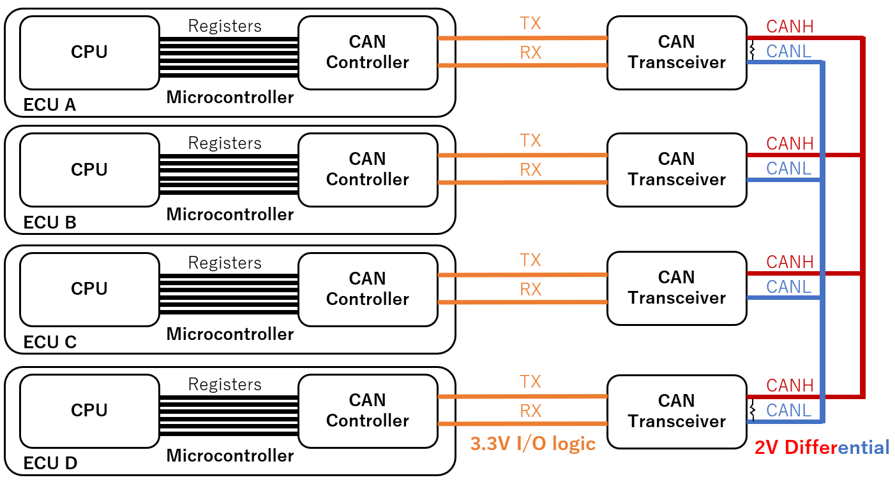

Dominant and Recessive
^^^^^^^^^^^^^^^^^^^^^^

Ultimately, the CAN bus is a simple serial bus: the bits representing a CAN frame are sent one by one according to a fixed clock (500 kbps for RAMN).
Arbitrarily, a "0" bit is represented by a "**dominant**" signal, and a "1" bit is represented by a "**recessive**" signal.

A CAN bus is a pair of two wires: **CANH** (*CAN High*) and **CANL** (*CAN Low*). 

- A 2V voltage difference between **CANH** and **CANL** represent a **"dominant"** state.
- A 0V difference between **CANH** and **CANL** represent a **"recessive"** state.

This is called **differential signaling**, and its main purpose is to protect the signals from interferences: if a perturbation affects **CANH** (and results for example in a +1V voltage spike), then it is likely to also affect **CANL** (also experiencing a +1V spike), and as a result the **CANH-CANL voltage difference remains unchanged**.
The reason **CANH** and **CANL** wires are typically twisted together is to ensure this coupling physically.
Note that the "recessive" status is also the status of the bus when it is idle: a period of inactivity can technically be seen as a long streak of "1" bits.

Because all ECUs are connected to the same CAN bus, it is likely that different ECUs may attempt to transmit a different bit at the same time.
The "dominant/recessive" mechanic is here to handle those **collisions**: a dominant bit always win over a recessive bit:

- The CAN bus is only in the recessive state if **all ECUs** are sending a recessive bit.
- The CAN bus is in the dominant state if **any ECU** (one or more) is sending a dominant bit.

In other words, 0 always wins over 1 on a CAN bus.
This explains why lower arbitration IDs have a higher priority: If one ECU attempts to transmit the arbitration ID 0x000 and another ECU attempts to transmit IDx7FF, then the 0s will win and ECUs will see ID 0x000 on the CAN bus.
The ECU transmitting ID 0x7FF can detect that it lost arbitration (because the CAN bus did not match the bitstream that it was sending), but the ECU transmitting 0x000 does not even know that another ECU was also trying to transmit at the same time (assuming they are perfectly synchronous).
(Note that the ECU losing arbitration gives up at the first mismatching bit and does not attempt to transmit the other bits).

Electronic Components
^^^^^^^^^^^^^^^^^^^^^

To communicate on a CAN bus, an ECU needs at least at **CAN controller** and a **CAN transceiver**. 

The role of the CAN controller is to handle the logic of the CAN protocol: bit stuffing, arbitration, error frames, etc.
The CAN controller is however simple at the physical level: it only understands 3.3V Input/Output signals (**CAN RX** and **CAN TX**).
For the vast majority of cases\ [#f1]_, **the CAN controller is internal to the microcontroller of the ECU** (and is therefore referred to as "CAN peripheral"). You can learn more about RAMN's ECU's internal CAN controller by reading `AN5348 <https://www.st.com/resource/en/application_note/an5348-introduction-to-fdcan-peripherals-for-stm32-mcus-stmicroelectronics.pdf>`_.
Note that this CAN controller supports CAN FD, but we only consider CAN for this tutorial.

The role of the CAN transceiver is to handle the physical layer: it translates the 3.3V RX/TX signals of the CAN controller to CANH/CANL 2V-differential signals, and allow the reliable connection of many nodes on a common bus (you cannot just connect CAN TX and CAN RX pins together).
Depending on component availability, RAMN may use the `MCP2558FD <http://ww1.microchip.com/downloads/aemDocuments/documents/OTH/ProductDocuments/DataSheets/20005533A.pdf>`_ or the `ATA6561 <https://ww1.microchip.com/downloads/aemDocuments/documents/OTH/ProductDocuments/DataSheets/20005991B.pdf>`_.
At a high level, the role of the CAN transceiver is purely to ensure the reliability of the CAN bus signals\ [#f2]_. However, CAN transceivers may include some additional functions.
For example, the ATA6561 is able to enter a "standby mode" to save power during periods of bus inactivity. Modern CAN transceivers such as the `TJA115x family <https://www.nxp.com/docs/en/fact-sheet/SECURCANTRLFUS.pdf>`_ offer security features to protect from certain known attacks on the CAN bus.

.. note::

	CAN Transceivers typically feature a "dominant timeout" function: the transceiver will disconnect itself from the CAN bus if it detects that the CAN controller is asserting a dominant state for too long (~1.9ms for the MCP2558FD, up to 3ms for the ATA6561). Concretely, it means very low baud rates cannot be achieved, and the CAN controller cannot transmit absolutely anything it wants.

As a result, the life of a CAN frame is as below:

- The CPU of an ECU decides the content (arbitration ID, data, etc.) of a CAN frame.
- The CPU uses various registers to request the transmission of the CAN frame to its CAN controller.
- The CAN controller generates the bitstream of the CAN frame (including bit stuffing).
- The CAN controller monitors the status of the CAN bus using its RX pin and waits for an opportunity to transmit ("bus idle").
- The CAN controller uses its TX pin to transmit its CAN frame. It uses the RX pin simultaneously to ensure the transmission was successful, and goes back to the previous step if it was not.

During this process, the CAN transceiver does the translation between the 3.3V RX/TX signals and the differential CANH/CANL signals.

.. [#f1] On other hardware platforms, you may encounter external CAN controllers (such as the `MCP2518FD <https://ww1.microchip.com/downloads/aemDocuments/documents/OTH/ProductDocuments/DataSheets/External-CAN-FD-Controller-with-SPI-Interface-DS20006027B.pdf>`_. This may notably be the case if an ECU needs many CAN controllers.
.. [#f2] In fact, if you did not care about reliability, you could replace the CAN transceiver with `a resistor and some diodes <https://community.st.com/t5/stm32-mcus-products/on-board-communication-via-can-without-transceiver/td-p/152684>`_.

.. note:: 

	RAMN features probes to connect to CANH and CANL, and ECU D has debug traces to connect to its CAN RX and CAN TX pins.  
	Should you want to connect a logic analyzer to your RAMN, you need to configure it properly (note that **you do not need a logic analyzer for this tutorial**, but you may want to connect one to observe the CAN bus with your own tools).
	Technically, the "common-mode" voltage of a CAN bus (the voltage of CANH/CANL relative to ground during a recessive state) is not guaranteed to be fixed, so you should use a logic analyzer with differential inputs.
	In practice, however, nothing is likely to perturbate that voltage on a RAMN board, so you can consider the following:

	- CANH is 2.5V during a one, 3.5V during a zero.
	- CANL is 2.5V during a one, 1.5V during a zero.
	- CAN RX/TX are 3.3V during a one, 0V during a zero.
	- For differential inputs: CANH-CANL is 0V during a one, 2V during a zero.

	If you connect a logic analyzer with a CAN protocol decoder, make sure that your decoder has the correct definition for zero and one (since it depends on where and how you connect, you may need to invert it).
	Consult the CAN transceiver datasheets to know the variation ranges (for example, according to the datasheets, CANH/CANL difference can vary between 1.5V and 3V).

Preliminary Experiments
-----------------------

Before interacting with the 1s and the 0s of the CAN bus, we recommend that you become familiar with some useful RAMN features and some quirks of the CAN bus.
For the rest of this tutorial, we will make heavy uses of RAMN's CLI. If you have not yet, make sure that you are able to send and receive commands as explained in the :ref:`usb_tutorial` section.
You do not need to be familiar with the slcan commands, only with the :ref:`usb_cli`.

Power Supply Control
^^^^^^^^^^^^^^^^^^^^

Connect to your RAMN over USB and use the shift lever joystick to switch to the "CAN RX Monitor" screen (press joystick to the right once).
On this screen, you can see recent CAN messages for each identifier.

Open a serial terminal, configure it correctly, and use the '#' command to enter the CLI mode.
You can use the ``enable`` and ``disable`` commands to control the power supply of ECU B, C, and D.
Try to disable ECU B and observe the traffic.

.. code-block:: text

	#
	disable B
	
You should be able to observe something obvious: if you turn off the power supply of an ECU, it will stop transmitting its messages, so that arbitration IDs that it normally transmits will disappear from the CAN bus.

.. note::

	In general, you should not assume that if an arbitration ID disappears when an ECU is disconnected, then it was necessarily transmitted by that ECU: indeed, some ECUs only transmit some (periodic) messages as a response to other (periodic) messages.
	However, that is not the case for RAMN, so you can safely assume that if an arbitration ID disappears when the ECU is powered-off, then the ID is transmitted by that ECU. If you ever forget which ECU sends which arbitration IDs, simply disable/enable it and observe the difference.

Next, try to disable ECU C:

.. code-block:: text

	disable C
	
Now, try moving the shift lever joystick again, and notice that the screen will not change. Obviously again, if you disable ECU C, the sensors handled by ECU C will not work anymore.
If for some reason, ECU C enters the "bus-off" mode, then the controls will not work either, even though ECU C is powered on.
If you ever need to change screen while experimenting (e.g., because you want to move to the CAN stats screen), make sure ECU C is powered on with the enable command, and reset it if needed.

The command accepts several ECUs at once. For example, If you want to make sure only ECU D is enabled, you can use:

.. code-block:: text

	disable BC
	enable D

If you need to reset an ECU, you can use the ``reset`` command, for example:

.. code-block:: text

	reset D
	

Acknowledgement and Auto-Retransmission
^^^^^^^^^^^^^^^^^^^^^^^^^^^^^^^^^^^^^^^

At this stage, only ECU A and ECU D are powered on, and you should only observe IDs 0x1B8 and 0x1BB on the screen, both transmitted by ECU D.
The content of those CAN messages is constantly changing (with changing parts highlighted in white).
If you remember, a CAN bus needs to have at least one active receiver to send the **Acknowledgement (ACK)** bit of a CAN frame.
Right now, ECU B and C have been disabled, so only ECU A is able to acknowledge. What happens if we ask ECU A to stop acknowledging frames?

We cannot disable the power supply of ECU A (it is the one answering to you over USB), however, we can ask ECU A to enter a **listen-only mode** in which it does not acknowledge frames, using the ``can ack 0`` command.

.. code-block:: text

	can ack 0
	
Observe ECU D LEDs: you should observe that the **Check Engine LED is now lit**.
Observe ECU A's screen: there is **only one message** being sent (with ID 0x1B8), and its content is **not changing anymore**.
Wait for about 30 seconds, and you should observe that the LED is now blinking, and no message is visible on the CAN RX Monitor screen.

What is happening here? First, you need to understand what the Check Engine LED indicates:

- **ECU D will light up its Check Engine LED when it detects a CAN error**.
- **ECU D will blink its Check Engine LED when it enters the bus-off mode** and disconnects from the CAN bus.

.. note::

	The Check Engine LED will light up if **any CAN error is detected**, and will not turn off unless your reset the ECU (with ``reset D``) or reset the CAN peripheral of ECU D (with ``resetcan D``, which only works if ECU D is not in bus-off mode).
	
	The Check Engine LED **does not represent** the value of CAN error counters (REC and TEC), which automatically go back to zero when errors do not happen.

When you prevent ECU A from acknowledging CAN frames, no ECU is left to acknowledge ECU D's CAN frames. 
As a result, ECU D encounters a CAN error when transmitting its CAN frame.
By default, **auto-retransmission** is on. As a result, ECU D is endlessly trying to send its CAN frame and is effectively **spamming** the bus with the same CAN frame, that it is waiting for someone to acknowledge.
Later in this tutorial, we will observe in detail what is happening, but for now you should be aware of this tendency to spam the bus until success when auto-retransmission is on.

There is a failsafe in RAMN to prevent the ECU from spamming the bus. As a result, ECU D ultimately disconnects itself, but note that this is not a **mandatory behavior** from CAN specifications.

Changing CAN Parameters
^^^^^^^^^^^^^^^^^^^^^^^

It is possible to change some settings of RAMN's ECU CAN controllers over UDS, using the ``uds`` command.
UDS routine control 0x0222 can be used with three 1-byte parameters to change:

- The **Bus-off auto-recovery** parameter (default:0): if set to 1, the ECU will immediately reset its CAN controller when entering bus-off mode (non-standard behavior)
- The **CAN frame auto-retransmit** parameter (default:1): if set to 0, the ECU CAN controller will not reattempt failed CAN transmissions.
- The **Transmit Pause** parameter (default:0): if set to 1, the ECU CAN controller will add a transmission delays between CAN frames (non-standard behavior).

Before you change parameters, you need to make sure that the target ECU is not in bus-off mode. You can do so by reenabling acknowledgements from ECU A and resetting ECU D:

.. code-block:: text

	can ack 1
	reset D

Then, for example, you can enable bus-off auto-recovery, disable auto-retransmission, and disable transmit pause with:

.. code-block:: text

	uds D 31010222010000

The ``010000`` here represents 01 for bus-off auto-recovery, 00 for auto-retransmission, and 00 for transmit pause.

.. warning::

	Many commands may not work properly if ECU A is in listen-only mode, so always remember to leave that mode with ``can ack 1``.

Now, try to put ECU A in silent mode with:

.. code-block:: text

	can ack 0
	
You should observe:

- That the screen freezes for about 1.6 seconds (no message is received).
- After that, message 1B8 is transmitted periodically again, but not message 1BB.

The first observation is caused by the **Error Active/Error Passive mechanism** of the CAN bus: ECU D will actively destroy 16 frames (1 per 100ms) with **Active Error Flags**, then it will enter **Error Passive mode** and stop sending **Active Error Flags**.
The STM32 CAN peripheral in listen-only mode does not care about the ACK field, so once ECU D enters **Error Passive** mode and stops sending **Active Error Flags**, ECU A starts accepting the not-ACKed CAN frames.
Note that technically ECU D is still sending **Passive Error Flags**, but from ECU A's point of view, they are indistinguishable from a regular "End of Frame (EOF)" field, which also consists of recessive bits.

The second observation is that ECU D always fails to send the 0x1BB frames, which normally always follow 0x1B8.
Why? Because STM32 CAN peripherals are **very quick to abandon transmission**:

- Transmission will be aborted if arbitration is lost (as per standard), but it will not be automatically reattempted (even though no CAN error happened).
- Transmission will be aborted if the previous frame encountered an error (and the CAN peripheral need time to process it).

As a result, you should keep in mind that **when auto-retransmission is off, you should expect some valid frames to not be transmitted** (and it can be a little counterintuitive sometimes).

.. note::

	The first observation is relevant to security: a CAN error on a CAN frame does not mean that the content of that frame cannot be read and processed by other ECUs. 
	Although the CAN frame sent by ECU D is technically invalid (because it was not acknowledged), it is still processed by ECU A and displayed on its screen.
	
	
The "silence" and "talk" Commands
^^^^^^^^^^^^^^^^^^^^^^^^^^^^^^^^^

If you want to make an ECU stop transmitting CAN frames but still want it to acknowledge CAN frames, you can use the ``silence`` and ``talk`` commands instead of ``disable`` and ``enable`` commands.
For example:

.. code-block:: text

	silence BC
	talk D 

Will make it so that only ECU D attempts CAN transmissions, but ECU B and C are still there to acknowledge CAN frames and monitor the CAN bus (and generate Error Flags if necessary).

.. _bitbang_module:

RAMN's Bitbang Module
---------------------

What is Bitbanging
^^^^^^^^^^^^^^^^^^

In order to interact directly with the bitstream of the CAN bus with ECU A, we use a method called **bitbanging**: we reconfigure ECU A's microcontroller so that CAN TX and CAN RX become general purpose input/output pins ("GPIO").
We use timers and dedicated software loops that directly reads and write to these pins (You can check the `source code here <https://github.com/ToyotaInfoTech/RAMN/blob/main/firmware/RAMNV1/Core/Src/ramn_bitbang.c>`_).

This is illustrated in the figure below:

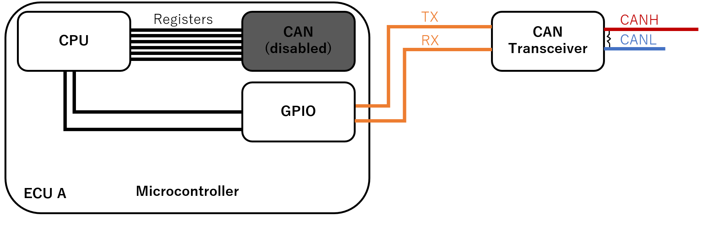

This approach has several limitations:

- The timing is not perfect: the microcontroller is doing its best but cannot be as fast and accurate as a dedicated peripheral or FPGA.
- ECU A will stop acknowledging CAN frames (unless you reprogram it to), so for most scenarios you will need to ensure that at least two ECUs are powered on.
- ECU A will stop all its normal activities (such as updating its screen) when in bitbang mode.

The bitbang commands all start with ``bitbang`` (or ``bb`` as a shortcut).
Type ``bb help`` for a list of supported commands.

.. code-block:: text

	#
	bb help
	
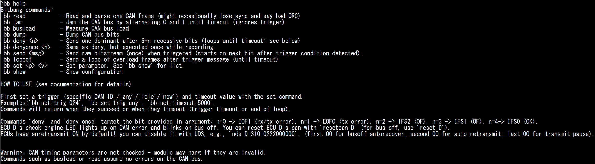

Interpreting the Bitstream
^^^^^^^^^^^^^^^^^^^^^^^^^^

First, reset the board to make sure it is in a known state, then enter the CLI mode again:

.. code-block:: text

	#
	reset
	#

You can use the ``bb read`` (or ``bitbang read``) command to read CAN messages. By default, the module will dump and interpret the first CAN frame that it finds.
Try to read several messages:

.. code-block:: text

	bb read
	bb read

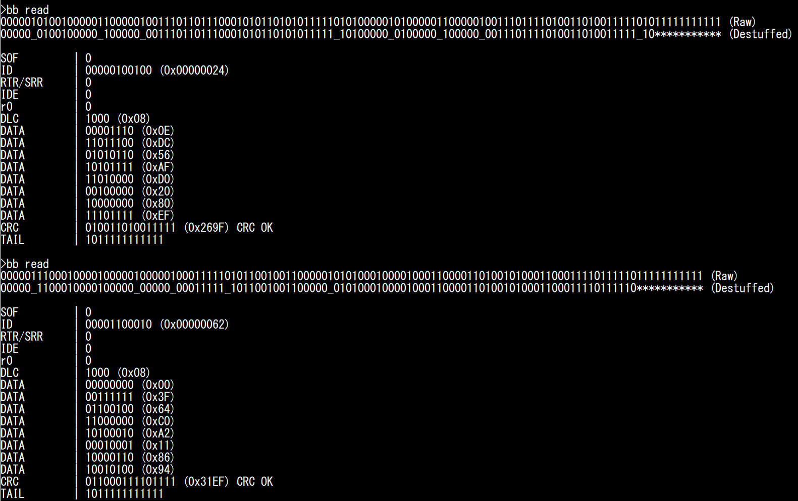

You can observe the **raw bitstream** and the same **bitstream after removing bit stuffing**: stuffed bits are replaced by "_", and the trailing "1"s (EOF and IFS) are replaced by \*.
The module also details the value of each bitfield.

The last bits (CRC Delimiter, ACK, ACK delimiter, EOF, and IFS) are merged in a single field that we call "Tail" (not a standard term).
During normal conditions, it should be equal to 1011111111111: "1" for CRC Delimiter, "0" for ACK, and "1"s for CRC delimiter, EOF and IFS.
Any other value would indicate an Acknowledgement error, CRC error, or overload condition.

.. warning::

	You might occasionally see "BAD CRC" when reading messages. This is likely a limitation of the bitbang module, not an actual CRC mistake on the CAN bus, which is extremely rare.

.. note::

	Bit stuffing is performed between the SOF and CRC0 bits. CRC0 is followed by CRC Delimiter (always "1"). You can observe where bit stuffing stops on the screenshot above:

	- For the first message, there is a 5-bit "1" streak that ends at CRC0. The CAN controller stuffed a "0" between CRC0 and CRC Delimiter.
	- For the second message, there is a 5-bit "1" streak that ends at CRC Delimiter: this is outside the bit stuffing zone and the CAN controller did **not** stuff a bit between CRC Delimiter and ACK bit. 

You can modify some bitbang module parameters.
Type ``bb show`` to see the list of possible settings.

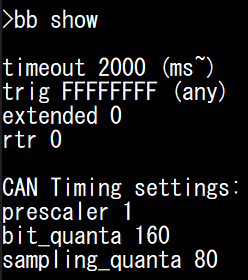

You can modify these parameters using the ``bb set`` command.

If you ever need to modify the baud rate of the CAN bus, you can modify the **prescaler**, **bit_quanta**, and **sampling_quanta** settings:

- **prescaler** corresponds to the clock divider used for the bitbang module timer (80 MHz).
- **bit_quanta** corresponds to the number of clock cycles needed to achieve the desired baud rate (160 for 500kbps when **prescaler** is 1).
- **sampling_quanta** corresponds to the clock cycle where the bitbang module actually reads the CAN bus (preferably, half of **bit_quanta** to aim for the middle). Do note that this is to leave enough processing time to swap arbitrary bits; the recommended sampling point for regular operations is 87.5% and not 50%.

Although it should not be necessary, if you encounter too many issues with this module you can try compensating for small clock errors by using ``bb set bit_quanta 159`` or ``bb set bit_quanta 161``.

You can also modify the following settings:

- **trig**: the arbitration ID that will trigger the bitbang module. You can use a specific ID (e.g., "1BB"), **"any"** (any ID), **"now"** (trigger immediately), or **"idle"** (trigger when bus idle is detected).
- **extended** and **rtr**: set those to one if you are looking for frames with the IDE or RTR bit sets.
- **timeout**: when to stop the bitbang command. This may apply either to a trigger wait timeout, or to leave a bitbang commands that loops.

Try replacing the trigger and see if you can read less frequent frames such as "1BB", which you are unlikely to catch with the "any" trigger.

.. code-block:: text

	bb set trig 1bb
	bb read
	
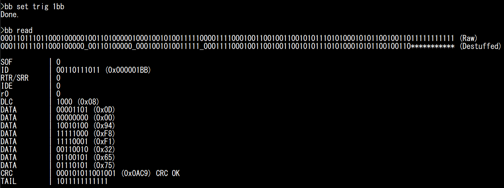

.. _saving_frames:

Saving CAN Frames to Replay Later
^^^^^^^^^^^^^^^^^^^^^^^^^^^^^^^^^

Later in this tutorial, we will want to transmit our own CAN frames, mostly to check if other ECUs received it correctly.
For this, we can use ID 0x24 (brake pedal signal): when the brake pedal is at 0%, ECU D's Stop LED should be off, and when it is at 100%, ECU D's lamp should be on.
Saving those CAN frames would therefore provide us with a convenient way to verify if a CAN message was received by ECU D or not, by replaying them and observing if the LED lights up or not.

First, make sure the Stop LED is turned off: release ECU B's handbrake and put ECU C's brake pedal at 0%. Then, set 024 as the trigger and record two bitstreams (first at 0%, then at 100%).

.. code-block:: text

	bb set trig 024
	* manually set brake to 0% *
	bb read
	* manually set brake to 100% *
	bb read
	
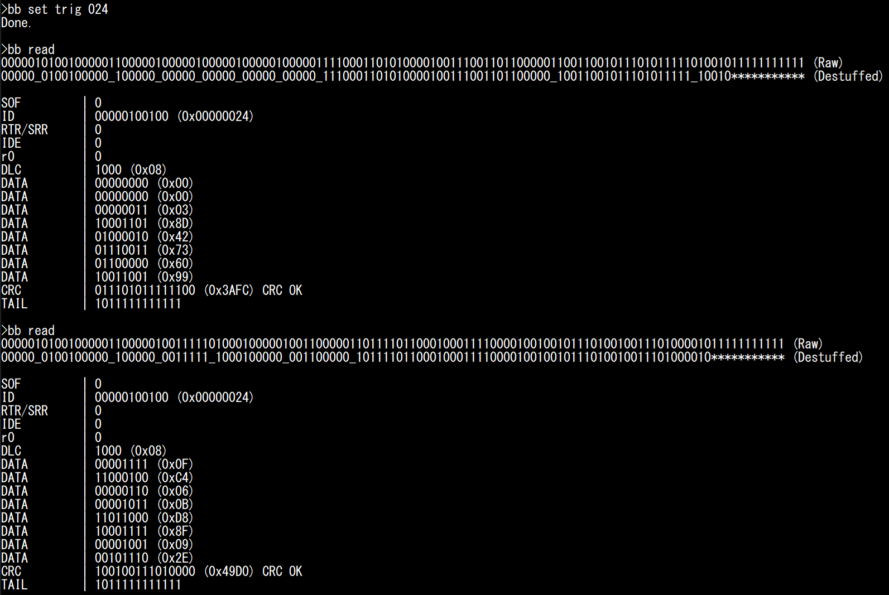
	
**Make sure you get CAN messages with correct CRC values** (It should say "CRC OK"). You should observe that the first two DATA bytes should be close to 0000 for 0%, and close to 0FFF for 100% (it is 0FC4 on the screenshot above).	

Note that, technically, it is better to replace the ACK bit (first 0 from the end) by 1, because we want other ECUs to set it to 0 themselves to confirm reception, however nobody will complain if you acknowledge your own messages.

You can use the following raw bitstreams later, to replay the brake message.

.. code-block:: text
	
	- Brake at   0%, w/ ACK: 000001010010000011000001000001000001000001000001111000110101000010011100110110000011001100101110101111101001011111111111
	- Brake at   0%: NO ACK: 000001010010000011000001000001000001000001000001111000110101000010011100110110000011001100101110101111101001111111111111
	- Brake at 100%, w/ ACK: 000001010010000011000001001111101000100000100110000011011110110001000111100001001001011101001001110100001011111111111
	- Brake at 100%: NO ACK: 000001010010000011000001001111101000100000100110000011011110110001000111100001001001011101001001110100001111111111111 

The Shape of the Traffic
^^^^^^^^^^^^^^^^^^^^^^^^

Now that you know what individual CAN frames look like, it is time to see how these fit into a common CAN bus.

You can use the ``bb dump`` command to dump the CAN bitstream, without trying to interpret it.
You can use any trigger you want, but we recommend use the "now" trigger to start dumping as soon as possible, which should be a random timing.

Reset the board and try the ``bb dump`` command (with the "now" trigger) several times.

.. code-block:: text

	reset
	#
	bb set trig now
	bb dump
	bb dump

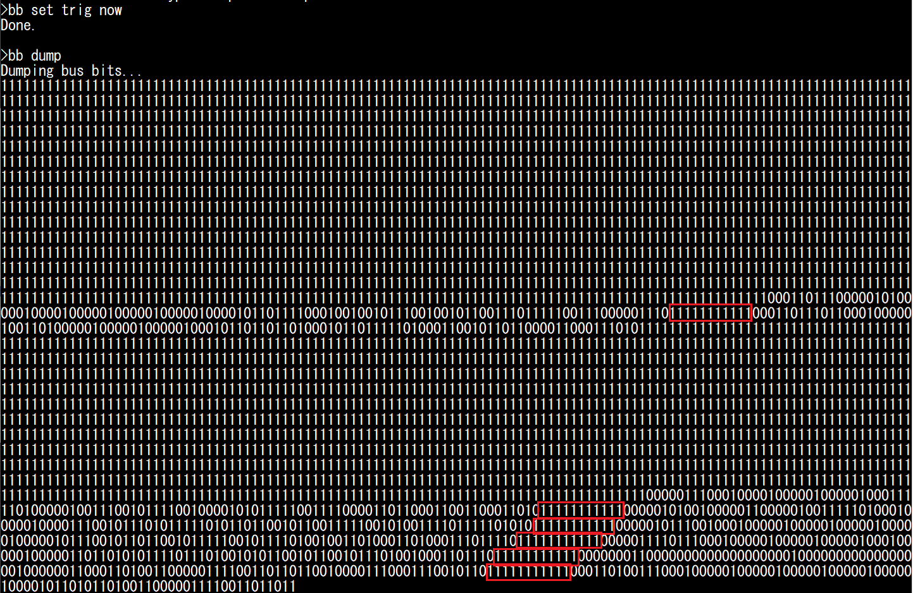

Under normal conditions, **CAN frames should always be separated by at least 11 recessive bits**.
Streaks of 11 recessive bits are highlighted in red in the screenshot above, and you should quickly learn to recognize this delimiter between frames.

You should be able to make the following observations:

- Most of the time, the bus is idle and nothing is happening (we read long trails of "1"s).
- A CAN transmission is rarely alone, but immediately followed by other frames.

There are two reasons that you will often see those "bursts" of messages, instead of individual random frames:

- ECUs tend to send several CAN frames with the same timer, so CAN frames end up queued for transmission at the same time. This is not true for all ECUs, but this is true for RAMN ECUs.
- RAMN ECUs have a similar boot time, so they tend to start in a synchronize state. Due to clock inaccuracies, they do eventually slowly drift away.

For the second point, you can mitigate it by using the ``randomize`` command (which is not a ``bb`` command): it will reset ECUS B/C/D with a random delay to prevent synchronization.
You can try it for yourself and see how the shape of the traffic differs each time (use ``bb set trig 024`` to always trigger on the same ID).

Bus Load
^^^^^^^^

The percentage of time during which CAN transmissions are occurring (from SOF to IFS0) corresponds to what is called the **bus load**.
Because all messages must share the same CAN bus, the total bus load of a CAN bus corresponds to the sum of the contribution of each message (from each ECU).
Naturally, messages with fast periods (such as 10 ms for the brake and accelerator of ECU C) contribute more than messages with slow periods (such as 100 ms for ECU D's messages).
Because of bit stuffing, the length of a CAN frames is not fixed (read this `Wikipedia article <https://en.wikipedia.org/wiki/CAN_bus#Bit_stuffing>`_ for exact boundaries).

You can read several messages with ``bb read``, and you'll observe that they are mostly about 120-bit long.
With a bit time of 2 µs (corresponding to a 500kbps baud rate), we can estimate the duration of a RAMN ECU CAN frame to be about 240 µs.

You can measure the busload using ``bb busload``.
This command will measure the busload for the duration of the **timeout** parameter.

If you want to know the bus load contribution of ECU D, you can silence ECU B and C and measure what the bus load is. You can repeat this for each ECU. You can increase the timeout value for more accurate measurements.

.. warning::

	You must use ``silence`` and ``talk`` for this, and not ``disable`` and ``enable``: remember that you need some ECUs to be active to acknowledge the CAN frames.

You can measure the bus load when each ECU is active individually, and when they are all active at the same time, using the following commands:

.. code-block:: text

	reset
	#
	bb set trig now
	silence BCD
	talk B
	bb busload
	silence BCD
	talk C
	bb busload
	silence BCD
	talk D
	bb busload
	talk BCD
	bb busload

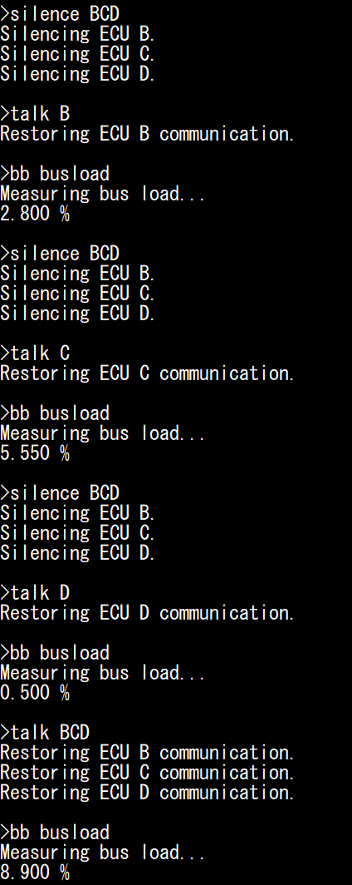

You can confirm these values are within the expected range: for example, ECU D sends two messages (ID 0x1B8 and ID 0x1BB) with an 8-byte payload, every 100 ms. Assuming the 240 µs bitstream length discussed above, this means ECU D is transmitting a message during approximately 0.240+0.240/100 = 0.48% of the time. 

.. note:: 

	If you're looking for a small challenge, you may try to find yourself the shortest and longest possible valid CAN frames bitstreams (by influencing bit stuffing with your data).

Transmit Pause
^^^^^^^^^^^^^^

You can observe the impact of the **"Transmit Pause"** parameter previously discussed, using the ``uds`` command.
You should set the trigger on message 024, so you can observe the burst of CAN frames sent by ECU C (at least two frames).

.. code-block:: text

	silence BD
	talk C
	uds C 31010222000101
	bb set trig 024
	bb dump

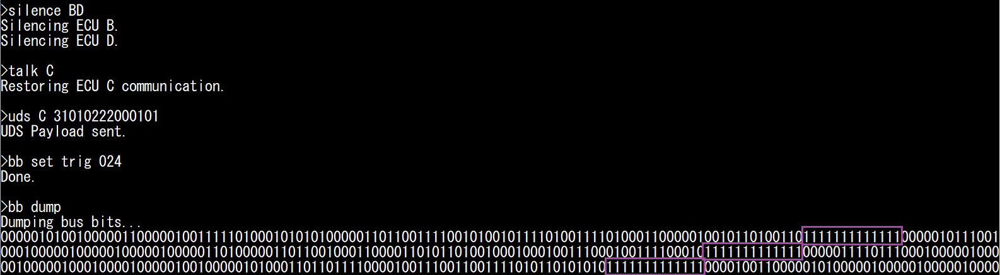

You should observe that ECU C's CAN frames are now separated by 13 recessive bits instead of 11, indicating a 2-bit pause.

Screaming ECUs and the "Error Passive" Punishment
^^^^^^^^^^^^^^^^^^^^^^^^^^^^^^^^^^^^^^^^^^^^^^^^^

Earlier, we observed the "**spamming behavior**" of ECUs when auto-retransmission is enabled and there is no acknowledgement.
Now, we can see what happens at the bitstream level.

Reset the board to ensure auto-retransmission is enabled. Then, disable ECU B and C to only leave ECU D active on the CAN bus.
Set the trigger to "any" to catch the first message.

.. code-block:: text

	reset
	#
	disable BC
	bb set trig any
	bb dump
	
You should obtain a pattern similar to the screenshot below.

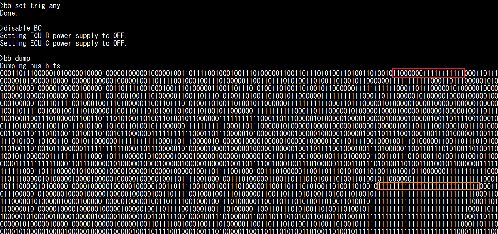
   

What is happening here?

As soon as you start the ``bb dump`` command, ECU A enters bitbang mode and there is nobody left on the CAN bus to acknowledge ECU D's CAN frames. 
Until then, ECU A was acknowledging them, so you can assume ECU D has a Transmit Error Counter (TEC) equal to 0.
You can see at the end of the first frame the bit string "1100000011111111111" (highlighted in red).
The first 1 corresponds to the CRC delimiter. The second 1 corresponds to the ACK bit, that nobody set to 0.
ECU D detected this, and as a result transmitted six 0s, which is an **Error Flag** (and you should become familiar with spotting them).
ECU D then waited 11 recessive bits before attempting transmission again.
ECU D repeated this for 15 attempts. At the 16th attempt, the TEC became too high and ECU D entered **Error Passive** mode:

- It waits an additional 8 recessive bits before attempting retransmissions.
- It stops sending **Active Error Flags** (six 0s) and replace them with **Passive Error Flags** (six 1s).

As a result, you can see the 111111111111111111111111111 pattern (highlighted in orange) repeated a lot. It corresponds to:

- 1 CRC delimiter
- 1 (recessive) ACK slot
- 6 Error Flag bits
- 8 EOF
- 3 IFS
- 8 additional bit wait time.

This sums up to a total of 27 recessive bits.
On your screen, you may see an additional 1 to 4 more recessive bits corresponding to CRC0, CRC1, etc. if they happened to be equal to 1.

.. note::

	If you are curious, you can also execute ``bb busload`` and you should observe that the bus load is now 85%, even though only ECU D is active.
	This is a bit inaccurate, because the ``bb busload`` command assumes a regular CAN bus traffic, which is not our case here.
	The actual bus load corresponds to about 125/133 (~94%), corresponding to an 8-bit idle time for a repeated 125-bit frame (same length as before, but we replace the 1-bit ACK delimiter by the 6-bit Passive Error Flag).
	**Thanks to the Error Passive mode, other CAN frames (including those with lower priority over our repeated frame) can win arbitration and still have a window to be transmitted.**
	This is not particularly useful in this case (because if another ECU were active, the ACK error would not exist), but it is useful for other conditions that may cause an ECU to repeatedly fail.

Sending Arbitrary Bitstreams
^^^^^^^^^^^^^^^^^^^^^^^^^^^^

It is now time to send our own custom bitstreams.
Start by resetting the board, and ensure that the Stop LED of ECU D is off (release ECU B's handbrake and move ECU C's brake pedal to 0%).
Then, silence ECU B, C, and D, so that you are the only one transmitting CAN frames.

.. code-block:: text

	reset
	#
	silence BCD
	
Now, use ``bb set trig idle`` to trigger the transmission on bus idle condition, and use ``bb send <arbitrary_bitstring>`` to send the raw bitstreams that you recorded previously (preferably after manually setting the ACK bit slot to 1).

.. code-block:: text

	bb set trig idle
	bb send 000001010010000011000001001111101000100000100110000011011110110001000111100001001001011101001001110100001111111111111
	
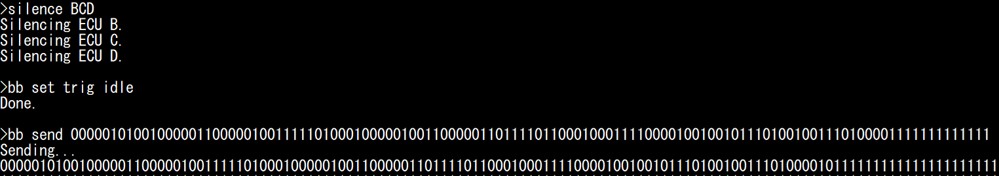
   
You should observe that the Stop LED will light up, confirming that ECU D received your message.
If you look at the CAN bus status, you will also observe that other ECUs replaced your ACK 1 by an ACK 0, meaning they received your message correctly.
Try sending the brake 0% message to turn off the Stop LED again.

.. code-block:: text

	bb send 000001010010000011000001000001000001000001000001111000110101000010011100110110000011001100101110101111101001111111111111

.. _generating_error:

Generating CAN Errors
^^^^^^^^^^^^^^^^^^^^^

Now comes the fun part: you can swap some bits and observe **how** and **when** Error Flags are generated.
If you struggle to identify bitfields in the bit streams, refer to the screenshots in the :ref:`saving_frames` section.

To begin, disable ECU B and C to make sure only ECU D is influencing the CAN bus. Then, ask ECU D to stay silent so that only we are transmitting on the CAN bus (and ECU D only either acknowledges or reports an error).

.. code-block:: text

	disable BC
	silence D
	
When you swap bits of your own bit stream, you may generate different types of error, that are detected at a different timing:

- You may violate the bit stuffing rule ("**Bit Stuffing Error**").
- You may swap a reserved bit which **must** be set to a specific value ("**Form Error**").
- You may swap a bit that leads to an invalid CRC ("**CRC Error**").

Bit Stuffing Errors and Form Errors are detected and reported immediately, CRC Errors are reported after the CRC field.

First, let us start with bit stuffing. Let us observe what happens when we send a string of six zeroes.

.. code-block:: text

	bb set trig idle
	bb send 000000
	
.. note::

	Remember that "1" is recessive and corresponds to "do nothing", so the three commands below are equivalent:
	
		.. code-block:: text

			bb send 000000
			bb send 00000011111111111
			bb send 00000011111111111111111111111111111111111111111111111111111111
		
	We never need to send a trail of 1s at the end, but sometimes we will anyway, in order to highlight the fact that other ECUs transmitted a 0 when we were transmitting a 1.

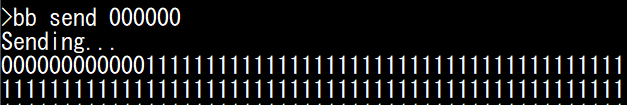
   
We observe twelve consecutive 0s: the first six 0s sent by ourselves, and the second six 0s sent by ECU D as an Error Flag.
Those 12-bit dominant bits, along with 11 recessive EOF and IFS bits, form the longest possible "valid" **Error Frame** (technically, IFS is not part of that frame and is a separate "silent time", but most people will lump them together).
If you look at ECU D, you should observe that the Check Engine LED is now lit: ECU D is aware of the error.
   
.. note::

	Generating CAN bus errors will increment the CAN Errors counters. If you wish to reset those counters, you must reset the ECU (using for example "reset D"), and silence ECU D again:
	
	.. code-block:: text

		reset D
		silence D

Swapping Some Bits
^^^^^^^^^^^^^^^^^^

It is important that you pay attention to bit stuffing so that the errors that you generate are not all plain-and-simple "Bit Stuffing errors".

This requires careful attention: your swapping may have removed the need for a stuffed bit further down the line that you need to remove yourself, or added the need for a stuffed bit that you need to add yourself.
We demonstrate a few cases, using the 100% brake message above.

First, reset ECU D to make sure it is in Error Active mode:

.. code-block:: text
	
	reset D
	silence D

We can try to see what happens when we send a "r0" reserved bit with a value of "1" instead of "0".
For this case, we do not bother sending the full bit stream, because we expect the error to be detected immediately after r0 and want to observe it without impacting the bus ourselves.

If we send the following message:

.. code-block:: text

	bb set trig idle
	bb send 00000101001000011
	
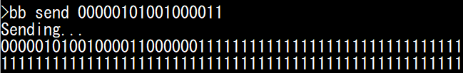
   
We observe that ECU D destroys the message as soon as the r0 bit is detected as wrong. This results in an Active Error Flag of six 0s (all sent by ECU D), which is the shortest possible Error Flag.
Contrarily to the previous case, none of the 0s are set by ourselves.

Finally, let us observe what happens on "non-reserved" fields, by swapping a bit in the DATA field (offset 54), that does not influence bit stuffing.
For reference, we can first send the original non-swapped message.

.. code-block:: text

	bb send 000001010010000011000001001111101000100000100110000011011110110001000111100001001001011101001001110100001111111111111
	bb send 000001010010000011000001001111101000100000100110000010011110110001000111100001001001011101001001110100001111111111111

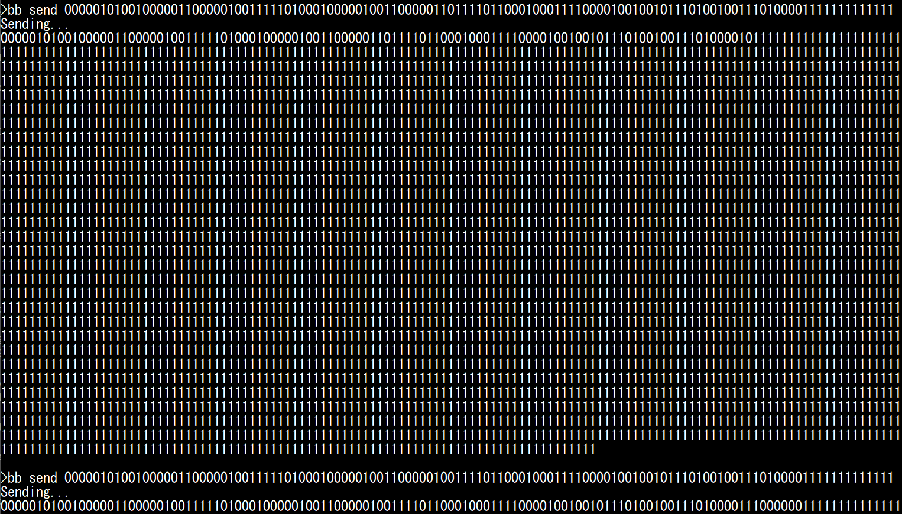
   
Interestingly, we observe that when we swap a bit in the data field (and the CRC is not valid anymore, but bit stuffing is still valid), the ECU will not ACK the message, wait for the ACK delimiter, then sends a 6-bit Active Error Flag.
This means the error is detected and reported significantly later than in the previous cases.

.. note::

	Security professionals you may wonder what happens if we change the DLC field to something above 8, with a valid CRC.
	You do not need bitbanging for this: STM32's FDCAN peripheral will happily transmit and receive such CAN frames, but will simply consider the size to be 8 bytes.

Forcing Error Passive mode
^^^^^^^^^^^^^^^^^^^^^^^^^^

By reusing the Error Flag of the :ref:`generating_error` section, we can generate 16 valid Error Frames with the following command:	

.. code-block:: text

	reset
	#
	disable BC
	silence D
	bb set trig idle
	bb send 00000011111111111111111000000111111111111111110000001111111111111111100000011111111111111111000000111111111111111110000001111111111111111100000011111111111111111000000111111111111111110000001111111111111111100000011111111111111111000000111111111111111110000001111111111111111100000011111111111111111000000111111111111111110000001111111111111111100000011111111111111111

Execute it 8 times and observe what happens when you execute it a 9th time (and generate more than 128 errors):

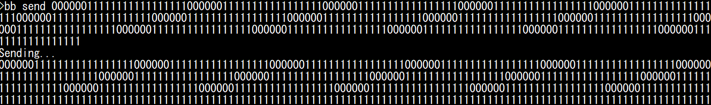
   
We can observe that ECU D enters Error Passive mode and stop sending Error Flags after 128 receive errors (significantly more errors than when transmitting).
You can keep transmitting Error Frames, but ECU D will not enter bus-off mode, because it is not transmitting any frame so its TEC counter is still at 0.
   
.. note::
   
	If you want to make the process above shorter, you can play the **Error Frame Inception game**: generate a bit stuffing error, which triggers an Error Frame from ECU D, then send a dominant bit during the EOF field of that frame to trigger a Form Error, which triggers a new Error Frame that we can repeatedly target.
	Each time, we need to wait six recessive bits, to let ECU D think that the Error Flag superposition is over and it has entered EOF territory. For example, to generate 16 errors:

	.. code-block:: text

		bb send 0000001111111011111110111111101111111011111110111111101111111011111110111111101111111011111110111111101111111011111110111111101111111
	 
	.. image:: img/bb_send4.png
	   :align: center 
	   
	  
	Finally, if you want to put ECU D in Error Passive mode in one shot, a long dominant string also typically works (as long as it is less than 2ms in duration, which is the case here):

	.. code-block:: text

		bb send 000000000000000000000000000000000000000000000000000000000000000000000000000000000000000000000000000000000000000000000000000000000000  

Goodbye IFS0
^^^^^^^^^^^^

Remember when we said that CAN frames must be separated by 11 recessive bits? That is a lie, 10 bits are enough, because according to the CAN specifications **we can just skip IFS0**.
To try this, copy paste a message twice, and remove one bit in the 11-bit recessive streak between them.
Send them to ECU D. You'll notice it does not trigger an error and ECU D happily processes and acknowledges both messages.

.. code-block:: text

	reset D
	silence D
	* Below line to turn OFF: brake 100% then brake 0% *
	bb send 00000101001000001100000100111110100010000010011000001101111011000100011110000100100101110100100111010000111111111111000001010010000011000001000001000001000001000001111000110101000010011100110110000011001100101110101111101001111111111111
	* Below line to turn ON: brake 0% then brake 100% *
	bb send 00000101001000001100000100000100000100000100000111100011010100001001110011011000001100110010111010111110100111111111111000001010010000011000001001111101000100000100110000011011110110001000111100001001001011101001001110100001111111111111

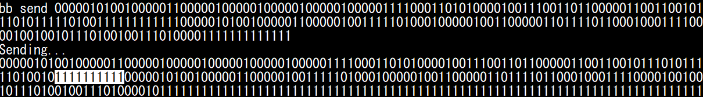
	  
Protocol Level Attacks
----------------------

In this section, we use ECU A to demonstrate attacks that are implemented by tools such as `canhack <https://github.com/kentindell/canhack>`_.
We limit the scope to attacks that can be performed only by interacting with the CAN TX CAN RX pins, but note that some CAN protocol level attack tools may implement more attacks using special hardware such as analog switches (e.g., to force a recessive state even when a dominant bit is sent).

ASAP Replacement
^^^^^^^^^^^^^^^^

Before using our bitbang module, we can demonstrate what can be done with a regular CAN peripheral.

In the :ref:`interacting_with_CAN` Section, we demonstrated how we can record CAN messages and replay them.
Notably, we recorded the brake message (ID 0x024, normally transmitted by ECU C) and replayed it to demonstrate how we can make the Stop LED light up on ECU D, which can be called an "attack" on the CAN bus, since we try to take over the controls.
However, this "attack" was not very subtle or efficient: because ECU C was still actively transmitting the 0x024 message, whatever value we sent was quickly overwritten. If we sent too many messages, we would generate CAN bus errors.
Therefore, a more elegant solution is needed.

An obvious solution is to not send our custom 0x024 CAN frames at a random timing, but **as soon as the original message transmitted by ECU B is received**, in order to immediately overwrite it as soon as possible (ideally, before it impacts the ECU's processing loop).
You could implement this on your computer (in fact, you are invited to try it with your own script), but the latency is likely to be too long to provide satisfiable results, and you might experience some blinking.

You can use the ``replace`` command to instruct ECU A to immediately send a CAN frame when a specific ID is received (and to do this with the highest priority). This ensures that the original CAN frame is overwritten by your value at the **earliest opportunity**.

For example, reset your RAMN to make sure it is in a known state, then ensure the controls are so that ECU D's Stop LED is OFF (handbrake released and brake pedal at 0%).
Then, enter the CLI mode and type the following command to overwrite the 0x024 brake message with a value of 100%:
	
.. code-block:: text

	replace 024 0FFF

You should observe that:

- The Stop LED lights up, and should not be blinking (unless you are unlucky and the ECU D updated its LED in the ~240 microseconds window needed to transmit our replacement message).
- The Check Engine LED should be off (we do not generate any error).
- Other controls (e.g., lighting and blinkers) are still functional.

To stop the replacing module, simply type:

.. code-block:: text

	replace

Note that this method is still very much detectable:

- ECU B can detect that you are sending a message with an ID that belongs to it.
- ECU D can detect that it is receiving twice as many 0x024 frames as it should.

Flooding the Bus and Exposing Priority Inversions
^^^^^^^^^^^^^^^^^^^^^^^^^^^^^^^^^^^^^^^^^^^^^^^^^

Another common "attack" is a Denial of Service attack that leverages the bus topology of the CAN bus and the arbitration process: if you flood the bus with high-priority messages, you will hog the bus and prevent other ECUs from communicating, thus disabling some features.
Again, you could implement this from your computer, but it is better achieved in real time by ECU A, because we want to make sure that we leave absolutely zero opportunity to talk to other ECUs.

You can use the ``flood`` command to flood the bus with the frame that you provide as argument. If you want to make sure that the bus is entirely flooded, you will need a payload size above 3 bytes.
For example, use CAN ID 0x000 and content 0011223344556677. **For now, do not use IDs actually used by ECUs - this will cause ECUs to enter bus-off mode, which we will discuss later**.

.. code-block:: text

	flood 000 0011223344556677

Observe what happens:

- No control is responsive anymore (no message can have higher priority than 0).
- No CAN error is generated (Check Engine LED off).

Needless to say, this attack is extremely obvious to every ECU, since they receive many more frames than usual.
To stop the bus flooding, simply type ``flood`` again:

.. code-block:: text

	flood

Next, try flooding the bus with ID 0x1A8: this ID is higher than all CAN frames sent by ECU C (notably those representing the brake pedal and shift lever), but lower than some frames sent by ECU B.

.. code-block:: text

	flood 1A8 0011223344556677

Observe what happens now:

- ECU C's controls are still active: you can light up ECU D's Stop LED by moving the brake pedal, and light up the blinkers by moving the joystick left or right.
- ECU B's controls are not active: you cannot control the Stop LED using the handbrake, or the Clearance/Low Beam/High Beam LEDs with the lighting switch.

Why is this happening? We are using an ID that is high enough to let ECU C's messages go through, but not ECU B's messages.

By now, you should be screaming: **something is wrong, the lighting switch's message CAN ID is 0x150, and 0x150 is lower than 0x1A8, so the lighting switch should still work!**
This is a simple case of **priority inversion** due to the default configuration of STM32's CAN peripheral.

RAMN's STM32 microcontroller CAN peripheral is configured in a simple "FIFO" mode: it will transmit the messages in the order in which they are meant to be sent, and because by default auto-retransmission is enabled, it will never give up.
ECU B is trying to send CAN IDs 0x062 (steering), 0x150 (lighting switch), and 0x1d3 (handbrake).
ECU C is trying to send CAN IDs 0x024 (brake), 0x39 (accelerator), 0x77 (shift lever), 0x98 (horn), and 0x1A7 (blinkers).

When we are flooding the bus with 0x1A8, ECU C does not care because all its IDs are below 0x1A7, so ECU C's controls still work.
However, ECU B becomes **stuck trying to send 0x1D3**, which is above 0x1A7 and therefore cannot be sent.
Because ECU B is stuck on ID 0x1D3, it cannot transmit ID 0x150, hence the **priority inversion** (note that this should not happen during normal operations, because the CAN bus is not supposed to be 100% filled like this).

How do we prevent this? The proper answer is to stop using the default "**FIFO mode**" (*FDCAN_TX_FIFO_OPERATION*), and use the "**Queue mode**" (*FDCAN_TX_QUEUE_OPERATION*) instead, which is designed for this exact case.
RAMN does not implement this by default as it would make it more complicated to customize. However, it is possible and easy to implement if your traffic is well defined.

At this point, there is a quick fix that you can try: simply disable auto-retransmission using UDS. Note that this is not ideal, since some frames will be dropped for various reasons (such as lost arbitration), but it can be used to visualize the solution.
To try this, disable auto-retransmission for ECU B and C:

.. code-block:: text

	uds B 31010222000000
	uds C 31010222000000
	
Now, try flooding the bus with different IDs and observe how you can partially disable controls (instead of the full ECUs). **Do not reuse the same IDs as actual controls for now, as we want to avoid errors**. 
For example, the command below will disable all controls except the brake pedal:

.. code-block:: text

	flood 025 0011223344556677
	

Similarly, the command below will disable only the handbrake:

.. code-block:: text

	flood 1D2 0011223344556677
	
	
Bus-off Attacks
^^^^^^^^^^^^^^^

Until now, we have only used IDs not used by actual CAN frames transmitted by ECUs.
If we use an ID normally transmitted by an ECU, we will cause transmission errors and we may force an ECU to enter bus-off mode (which is known as a "**bus-off attack**").

For example, use the joystick to select the "CAN RX MONITOR" screen on ECU A, and observe what happens when you flood the bus with ID 0x24, normally transmitted by ECU C:

.. code-block:: text

	flood 024 0011223344556677
	* wait 1s, then use command below to stop the flooding *
	flood
		
You should observe that all ECU C's controls have become unresponsive, because it has entered bus-off mode due to the CAN Errors (collisions) than happened when it tried to transmit its own CAN frames with ID 0x024.
When you cause an ECU to enter bus-off mode, **all the IDs it normally transmits will stop being transmitted, not just the ID you targeted** (for example, if you target ID 0x1D3, ID 0x62 and ID 0x150 will also stop).

You can also try to make ECU D enter bus-off mode, which will be indicated by a blinking Check Engine LED, by targeting ID 0x1B8 or 1BB, which ECU D normally transmits:

.. code-block:: text

	flood 1b8 0011223344556677
	* wait 1s, then use command below to stop the flooding *
	flood

Generally, the TEC error counter will be incremented by 8 when a transmission error happens, and be decreased by 1 when a successful transmission happens.
There, It only takes 32 successive transmission errors to reach the value of 256 and make the ECU enter bus-off mode.
When auto-retransmission is enabled, this is guaranteed to happen very quickly.

If auto-retransmission is disabled with the UDS command of the previous section, then bus-off will only happen if you cause enough errors.
For example, you can try targeting ID 0x1A7 sent by ECU C, and you will notice that errors happens on the CAN bus (because ECU D's Check Engine LED lights up), but not enough to cause a bus-off.
This is because ECU C is also sending messages 0x024 and 0x039 with a short period (~10ms). Since message 0x1A7 has a long period (100ms), ECU C has enough successful transmissions between 0x1A7 frames to decrease its TEC error counter back to 0.

.. code-block:: text

	reset
	#
	uds C 31010222000000
	flood 1A7 0011223344556677
	* wait 10s, then use command below to stop the flooding *
	flood

However, if you target for example ID 0x39, then the ECU will enter bus-off because successful transmission of 0x024 only is not enough to counter the errors caused by 0x039.

Before moving on, you should also note that:

- Not all CAN errors increase the error counters: for example, the absence of ACK dominant bit when transmitting will not increase the TEC error counter past 128, hence the "screaming ECU" we encountered before.
- You can only target ECUs that are transmitting CAN messages, not receive-only ECUs (since their TEC will always stay at 0).

Jamming
^^^^^^^

If your goal is to induce a bus-off status without being subtle, you can use the ``bb jam`` command to transmit the bitstream "01010101..." for as long as the timeout parameter is set (note that we cannot transmit only zeroes, as the transceiver would disconnect us after about 2ms).

Using this module, we can for example observe that when ECUs are in receive-only mode, they will not go into bus-off mode.
You can confirm that errors are received by ECUs even when they do not transmit, which is why ECU D's Check Engine LED will light up.
ECUs will enter "Error Passive" mode after 128 errors, which you can confirm by using the ``bb send 000000111111`` command and observing ECUs do not send an Error Flag, because we observe 0000001111111 instead of 000000000000 (see :ref:`generating_error`).

.. code-block:: text

	reset
	#
	silence BCD
	bb jam
	bb set trig idle
	bb send 000000111111
	
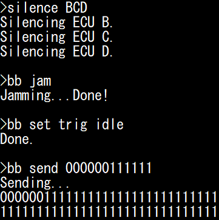
	
Although the ECUs are in Error Passive mode, they are still actively listening and acknowledging valid frames.
You can confirm this by sending the "brake 100%" message and checking that ECU D's LED light up (and the ACK bit is set).
After one valid message is received, the ECU will go back to Error Active mode: you can check this by sending the 000000111111 string again, and observing that this time you observe 000000000000 on the bus (first 6 dominants sent by yourself, 6 others sent by ECUs BCD simultaneously).

.. code-block:: text

	bb send 000001010010000011000001001111101000100000100110000011011110110001000111100001001001011101001001110100001111111111111
	bb send 000000111111

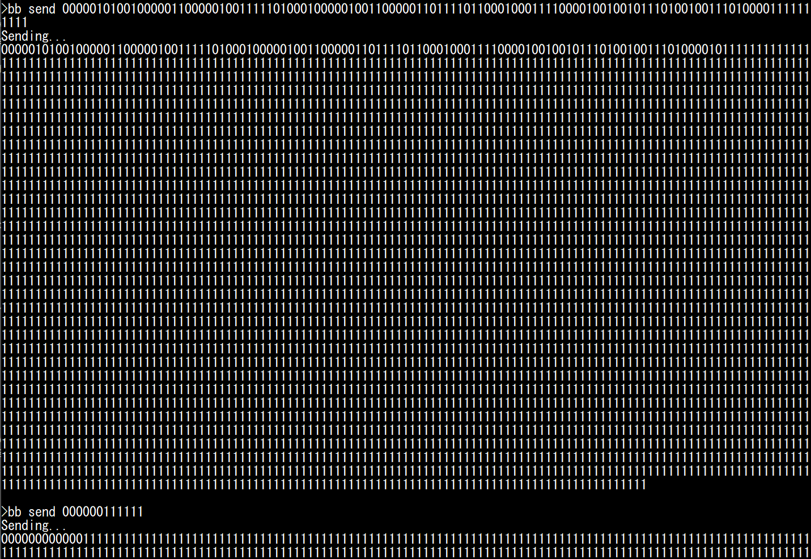

You can resume communications with the "talk BCD" command. If you jam the bus while the ECUs are active, you will see that they enter bus-off mode.
If auto-retransmit is on (as it is by default), ECUs will enter bus-off mode very shortly after they attempt transmission (because they immediately retry and fail).
You should observe that ECU D's Check Engine LED starts blinking, indicating that in entered bus-off.

.. code-block:: text

	talk BCD
	bb jam
	

.. warning::

	When an ECU enters bus-off, it will stop **both transmitting and receiving**. This means that commands that rely on CAN (such as UDS commands) will stop working.
	If you have not enabled bus-off auto recovery, you will need to reset the board to make the ECUs listen to you again.

If bus-off auto-recovery is off, it would take a few seconds of jamming to disable ECUs transmitting few messages, such as ECU D.
As a result, if you disable auto-retransmission and use ``bb jam`` with a 500 ms timeout, only ECU B and C, which transmit messages more frequently, will enter bus-off mode.

.. code-block:: text

	reset
	#
	uds B 31010222000000
	uds C 31010222000000
	uds D 31010222000000
	bb set timeout 500
	bb jam

Finally, if you enable bus-off auto-recovery, you will observe that ECU D's Check Engine LED flickers when the jamming is ongoing (indicating that ECU D is trying to enter bus-off), but communications will resume once jamming stops.
According to specifications, this should technically only be allowed after ECUs observe 128 occurrences of 11 recessive bits (the equivalent of 128 valid messages), but it is not automatic with STM32's CAN controllers.

.. code-block:: text

	reset
	#
	uds B 31010222010100
	uds C 31010222010100
	uds D 31010222010100
	bb set timeout 5000
	bb jam

Overloading with Overload Frames
^^^^^^^^^^^^^^^^^^^^^^^^^^^^^^^^

The "jamming" approach (as well as the flooding approach) can allow an attacker to completely stop ongoing communications.
They however have a major drawback: they are both very easily detectable, because they either flood the bus with messages or generate many errors.
 
.. note::

	To be exactly correct, ECUs B/C/D employ hardware filters, so their software is not aware that a bus flooding attack is ongoing, because they are configured to ignore frames with IDs that they do not care about.

Previously, we saw that the case of an Error Flag being sent during IFS1 or IFS2 actually corresponds to an Overload Flag, an old mechanism for ECU to stall the bus if they needed more time to process a CAN frame.
This mechanism is not really useful anymore, therefore CAN controllers do not even bother reporting Overload Flags. However, this mechanism is still present, so it can be abused. 

The `Freeze Doom Loop Attack <https://kentindell.github.io/2020/01/20/new-can-hacks/>`_ abuses Overload Frames by continuously sending Overload Flags on IFS1 or IFS2 (first on a legitimate CAN frame, then on the resulting Overload Frames' IFS1/IFS2).

First, let us observe a short Overload Frame loop in action. We can use ``bb send`` with the following bitstream:

.. code-block:: text

	reset
	#
	silence BCD
	bb set trig idle
	bb send 00000101001000001100000100111110100010000010011000001101111011000100011110000100100101110100100111010000111111111110111111111111111011111111111111101111111111111110111111111111111011111111111111101111111111111110111111111111111

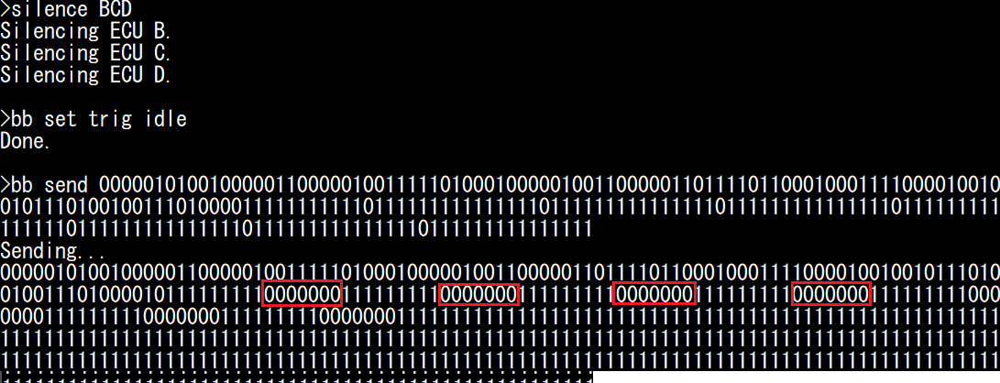

This bitstream is a valid CAN message (you should notice that it turns the Stop LED on), but it has the IFS1 bit set to 0 instead of 1.
This will cause 6 dominant bits to be sent by other ECUs (for a total of 7 dominant bits, which form the superposed Overload Flag, highlighted in red).

An Overload Flag is normally followed by 11 recessive bits (8-bit Error/Overload Delimiter and 3-bit IFS). 
Since we want to target IFS1 again, we must therefore wait 9 recessive bits after the 7-bit Overload Flag, so we send 6+9=15 recessive bits after our dominant (which is already part of the 7-bit flag).
We therefore repeat 0111111111111111 after the first IFS1 to repeat the attack as many times as we want.

Although those look like Error Frames, they are technically Overload Frames. As a result, you should observe that the Check Engine LED **does not light up**.

You can use ``bb loopof`` to repeat this for as long as the timeout parameter is set. You need to specify the message that you want to target (for example, ID 0x024). Try it for 30 seconds:

.. code-block:: text

	talk BCD
	bb set trig 024
	bb set timeout 30000
	bb loopof

You should observe that controls will stop working: this is because the bus is entirely busy with Overload Frames.
**Contrarily to the previous methods, CAN controller will not be notified of CAN errors or message spam**, making the attack more stealthy (again, the Check Engine LED does not light up).
ECUs can still notice there is an issue with the CAN bus (because they stop receiving regular CAN frames and always fail transmission), but this attack is more subtle than the previous ones and require extra attention from security engineers.

Selective Denials
^^^^^^^^^^^^^^^^^

You can use the ``bb deny`` and ``bb denyonce`` module to force a dominant on one arbitrary bit of CAN frames ("denial") with a specific CAN ID (specified using the ``bb set trig <id>`` command).
These modules are similar, but:

- ``bb denyonce`` will perform the denial once and record the bus while it is happening (so you can observe the bus).
- ``bb deny`` will immediately rearm and repeat the denial until the timeout value expires.

For ease of implementation, those modules can only target bits after EOF1.
This is however enough to (at least) cause an error that will cause ECUs to drop the targeted frame and generate a CAN Error Frame.

You need to provide one argument: the offset (from EOF1) of the bit that you want to target:

- ``deny 0`` will target EOF1.
- ``deny 1`` will target EOF0.
- ``deny 2`` will target IFS2.
- ``deny 3`` will target IFS1.
- ``deny 4`` will target IFS0.
- Higher values will target bits after the targeted CAN frame.

Usually, you will want to use this module either to target EOF1 or EOF0:

- If you target EOF1, you will cause the frame to be dropped **for everybody**.
- If you target EOF0, you will trigger an error **only for the transmitter**.

This is because EOF1 is considered a "must be recessive" bit by both the transmitter and receivers, but the EOF0 bit is only considered "must be recessive" by the transmitter; it is considered "do not care" by receivers.

Therefore:

- ``deny 0`` will prevent a frame from ever being sent and received (always cause Form Errors).
- ``deny 1`` will not prevent a frame from being received, but will make the transmitter think it failed ( ``denyonce 1`` will cause a `Double Receive <https://kentindell.github.io/2020/01/20/new-can-hacks/>`_).

Again, the behavior of ECUs will depend on whether frame auto-retransmission is enabled or not.

You can observe the effects yourself. First, make sure the Stop LED and Check Engine LED are off (reset the board and make sure the handbrake and the brake pedal are released).
First, let us see what happens when we send ourselves a CAN frame to turn on the Stop LED LED, but with the EOF1 bit set to 0.

.. code-block:: text

	reset
	#
	silence BCD
	bb set trig idle
	bb send 000001010010000011000001001111101000100000100110000011011110110001000111100001001001011101001001110100001111111101111

**The Stop LED stays off (message not processed), and the Check Engine LED turns on (error detected)**. You should observe 7 dominant bits after EOF1: the first bit is the one we swapped, the 6 others are sent by ECU B/C/D because they detected an error.
We can effectively destroy this frame by forcing EOF1 to zero (**even though the error comes after the ACK**).

Now, observe what happens when do the same thing with EOF0:

.. code-block:: text

	reset
	#
	silence BCD
	bb set trig idle
	bb send 000001010010000011000001001111101000100000100110000011011110110001000111100001001001011101001001110100001111111110111

**The Stop LED should turn on, and the Check Engine LED stays off: this is a valid message for ECU D.**
**You should still observe 7 dominant bits**: ECU B/C/D are effectively sending an "Overload Flag", which does not impact frame processing.

Now, let us use the ``bb denyonce 1`` command to see what happens when we force a dominant on EOF0 for a message sent by ECU D (for example, 1b8):

.. code-block:: text

	reset
	#
	silence BC
	bb set trig 1b8
	bb denyonce 1

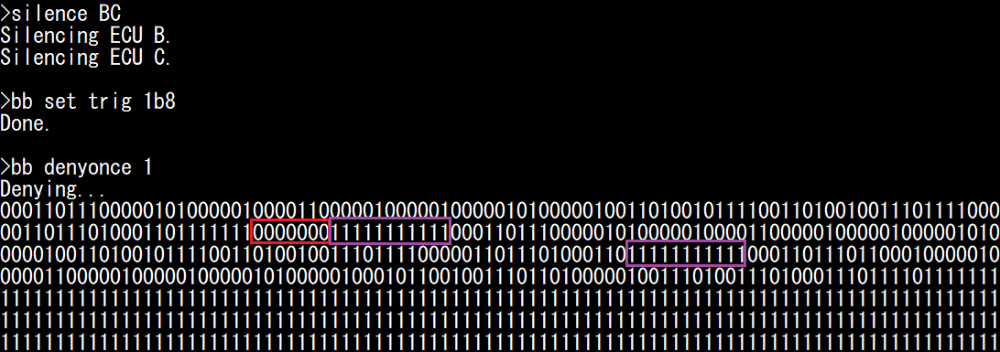

The bitstream is identical, however **it was considered as an actual error by ECU D (not an overload)**, so the Check Engine LED is on.
Because auto-retransmission was on, we also see a total of three frames: the first frame that we targeted, the same frame reattempted by ECU D (and untouched by us), and one frame with ID 0x1BB that normally follows it.
**From the point of view of receiving ECUs (ECU B and C), it is as if ECU D sent the same message twice. But from ECU D's point of view, it only transmitted it successfully once** ("`Double Receive <https://kentindell.github.io/2020/01/20/new-can-hacks/>`_").
Although not necessarily a critical problem, it may be pertinent to cybersecurity (or safety) engineers, since an attacker is able to extract two messages from an ECU without other ECUs noticing that it was done on purpose (and, in case of a bad implementation, could potentially lead for example to desynchronization of freshness values).

If we target EOF1, we can cause errors on a specific arbitration ID.
This is ultimately similar to flooding the bus with the targeted arbitration ID, but it is more subtle since we are not flooding the bus.
Therefore, we do not resource-starve lower priority IDs, and we do not directly send any message (so the total frame count do not change).
The same observations as previously discussed apply:

- If auto-retransmission is ON, the ECU will reattempt transmission (and fail) and it will enter bus-off mode quickly (and you may observe priority inversion).
- If auto-retransmission is OFF, ECU will enter bus-off only if we target high-frequency messages.

As discussed before, the TEC error counter increases by 8 for each TX error, but only decreases by 1 after a successful transmission.
Therefore, we can permanently block a CAN message only if there are at least 8 other CAN frames transmitted by the same ECU during its period, or if bus-off auto-recovery is enabled.
For example, let us continuously deny message 0x24 of ECU C for 20 seconds, after disabling auto-retransmission and enabling bus-off auto-recovery.

.. code-block:: text

	reset
	#
	uds C 31010222010000
	bb set trig 024
	bb set timeout 20000
	bb deny 0
	

You should observe that the highest message priority (brake signal, 0x24) has no effect anymore (Stop LED does not light up), but you can still control the blinkers by pressing left/right on the joystick, even though they are controlled by a lower-priority message from the same ECU.

.. note::

	When auto-retransmission is enabled, you may notice that "denying" a specific arbitration ID may cause the following lower-priority IDs to not be transmitted, this is caused by STM32 CAN peripheral being quick to give up transmission, and is not a quirk true of all ECUs in general.
