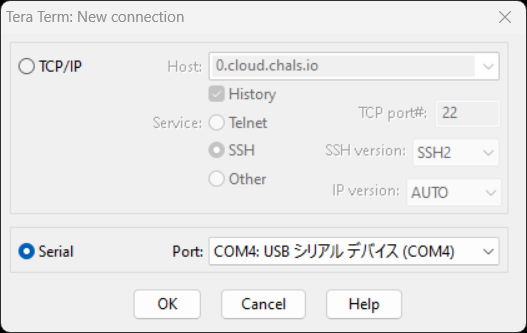
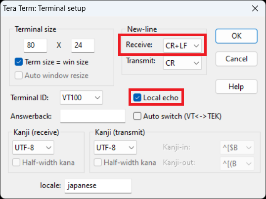
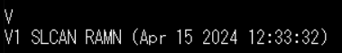
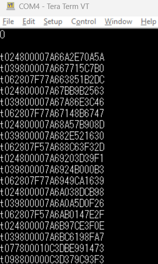
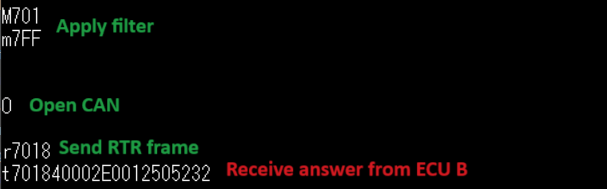
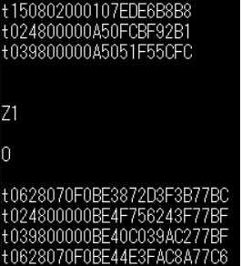
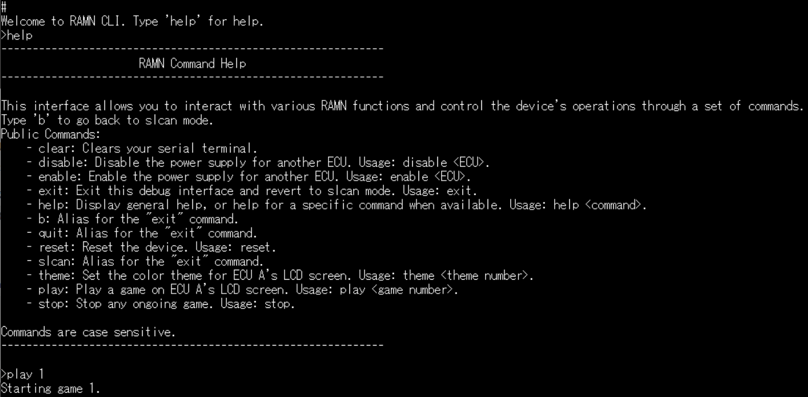

.. _usb_tutorial:

Interacting with USB
====================

RAMN's ECU A features a USB connector that implements a virtual serial port.
That serial port can turn ECU A into a USB to CAN adapter using standard :ref:`slcan_commands`.
This is how the programs that we used so far in this guide were able to read and receive CAN messages with RAMN's USB port.

RAMN's USB port also implements various :ref:`custom_usb_commands` that can be used to perform actions not covered by the slcan protocol, such as disabling the power supply of a specific ECU.
Custom commands compatible with slcan are not very user-friendly; however, it is possible to use a :ref:`usb_cli` that resembles a traditional Linux interface instead.

If you are not familiar with serial terminals, keep in mind the following items:

- When using RAMN's slcan interface, you need to specify "CR" as the endline character.
- You must ensure that the serial port of RAMN is not being used by any other program (virtual machine or programs accessing CAN).
- By default, you should not expect any serial interface to support the "backspace" character. If you made a mistake while typing a command, you need to restart from the beginning. RAMN's :ref:`usb_cli` supports backspaces to be more user-friendly.

Opening a terminal
------------------

Windows
^^^^^^^

A serial port can be accessed on Windows using a program such as `TeraTerm <https://teratermproject.github.io/index-en.html>`_ or `Putty <https://www.putty.org/>`_.
We use TeraTerm in this guide.

Connect RAMN to a USB port of your computer. Open TeraTerm, select "Serial", then press OK to open the serial port.
If you see several COM ports, identify which COM port is assigned to RAMN by finding the one that appears and disappears when you plug and unplug RAMN.
If you do not see any COM port, verify that it is not currently being forwarded to a virtual machine.
If you do not see a COM port but a "DFU" device, it means that you need to flash the board first (see :ref:`flashing_scripts`).

After opening the port, select "Setup -> Terminal..." in the top menu bar, and change the following settings:

- Select "CR+LF" in the New-Line Receive options. This will ensure that slcan answers will appear on different lines.
- Check "Local echo" if you want the terminal to also display what you are typing.

You should then be able to type serial commands and observe their answers on your terminal.

Linux
^^^^^

If you prefer to use Linux, you need to use a terminal that handles "CR-endline" devices well.
We recommend that you use picocom, which you can install with the following command:

.. code-block:: bash

    $ sudo apt-get install picocom

Identify what name was assigned to your device with the command ``dmesg`` (find which device appears when you plug in your RAMN board).
It is typically given a name such as "dev/ttyACM0".
You can open RAMN's serial port using the following command:

.. code-block:: bash

    $ picocom --imap crcrlf --echo /dev/ttyACM0

From there, you should be able to interact with RAMN directly in your terminal.
Type control A then control Q to exit the interface and revert to your normal Linux terminal.

.. _slcan_commands:

Slcan Commands
--------------

You can find a list of slcan commands in the original `LAWICEL's CAN232 manual <https://www.canusb.com/files/can232_v3.pdf>`_.
RAMN's implementation is slightly simplified in order to tolerate more mistakes from users.
Some slcan commands are not implemented or are slightly modified to better be suited for STM32's CAN FD controllers.

Slcan commands are sent only with ASCII characters; a byte of raw data is actually represented by two hexadecimal ASCII characters\ [#f1]_.

A successful slcan command will be answered by optional arguments and a "CR" character (ASCII 13).
A failed slcan command will be answered by a "BELL" character (ASCII 7), which in TeraTerm should be accompanied by an error sound.

Version - "V"
^^^^^^^^^^^^^

You can get the software version of your slcan adapter using the ``V`` command:

.. parsed-literal::

    V

Serial Number - "N"
^^^^^^^^^^^^^^^^^^^

Similarly, you can get the hardware serial number with the ``N`` command:

.. parsed-literal::

    N

This number corresponds to a "N" to which is concatenated the 12-byte unique device ID of the STM32 microcontroller of ECU A.

Open - "O"
^^^^^^^^^^

You can start forwarding CAN messages to the serial interface by typing ``O`` (capital letter o) in your terminal and pressing ENTER.
This command has no argument.

.. parsed-literal::

    O

This command should show you the current CAN traffic, confirming that you have a working board.

Close - "C"
^^^^^^^^^^^

You can stop the traffic from the previous command by using the command ``C``, which closes the port.
It has no argument.

.. parsed-literal::

    C

Listen - "L"
^^^^^^^^^^^^

The ``O`` command sets up the CAN controller in normal mode, which means that you are able to also send CAN messages.
The ``L`` command allows you to use the "Listen-only" mode of the CAN controller, preventing you from sending CAN messages and inadvertently impacting ongoing CAN traffic.

.. parsed-literal::

    L

Set Baudrate (identifier) - "S"
^^^^^^^^^^^^^^^^^^^^^^^^^^^^^^^

The ``S`` command allows you to change the baudrate of the CAN controller.
You need to reopen the port (e.g., with ``O`` or ``L`` commands) afterwards to validate the change.
The ``S`` command uses a 1-digit identifier to specify the baudrate. See :ref:`slcan_baudrate` for a list of these identifiers.

For example, you can use this command with baudrate identifier 6, which refers to RAMN's default 500 kbps:

.. parsed-literal::

    S6

Note that RAMN automatically assumes a 500 kbps baudrate, so you actually do not need to execute this command.

Set Baudrate (identifier) - "s"
^^^^^^^^^^^^^^^^^^^^^^^^^^^^^^^

If your desired baudrate does not have an identifier, you can change the baudrate with the ``s`` command instead.
You cannot provide a baudrate directly, instead you must provide the bit timings for the CAN controller.
Refer to :ref:`bit_timings` to understand how bit timings work.

You must provide two bytes to this function: TSEG1 and TSEG2, assuming a 40 MHz clock.
For example, to set up a 500 kbps baudrate directly, you can use this command:

.. parsed-literal::

    s3C13

which will set TSEG1 to 0x3C (60) and TSEG2 to 0x13 (19), following the example in :ref:`bit_timings`.

Transmit - "t" and "T"
^^^^^^^^^^^^^^^^^^^^^^

You can use ``t`` to send a CAN frame with a **standard** identifier, and ``T`` to send a CAN frame with an **extended** identifier.
You must provide the CAN ID, DLC, and payload, in order.

You must provide 3 digits for standard identifiers, and 8 digits for extended identifiers.
The number of digits is fixed, so you must pad with zeroes if necessary.
The DLC is only **one digit**. The payload comes after the DLC, in hexadecimal.

For example, you can send a CAN frame with standard identifier 0x024, DLC 2, and binary data "0x11 0xFF" with the following command:

.. parsed-literal::

    t024\ **2**\ 11FF

To transmit a CAN frame with an **extended identifier**, use the "T" command instead:

.. parsed-literal::

    **T00000**\ 024211FF

Note that there is no "receive" command: when the CAN adapter receives a CAN message, it forwards it to the USB serial interface using the ``t`` and ``T`` commands, but you are receiving them instead of transmitting them.

Transmit RTR - "r" and "R"
^^^^^^^^^^^^^^^^^^^^^^^^^^

The commands ``r`` and ``R`` are used similarly to ``t`` and ``T``, but for RTR commands, respectively for standard and extended identifiers.
You should not provide a payload to this command, but you still need to provide a one-digit DLC.

For example, to transmit an RTR request with standard identifier 0x701 and DLC 8:

.. parsed-literal::

    r7018

And to send the same frame with an extended identifier instead:

.. parsed-literal::

    R7018

If you type this without filters, it will however be difficult to observe the answer from ECU B.

Set Filter - "m" and "M"
^^^^^^^^^^^^^^^^^^^^^^^^

Hardware filters can be set using the ``M`` and ``m`` commands: ``M`` selects the value and ``m`` selects the mask.
Refer to :ref:`can_filters` to understand how CAN filters work by default.

The format is slightly different from the format in the original specifications.
**Filters apply independently to standard and extended identifiers.**

If you want to apply filters for standard identifiers, use a three-digit argument.
For standard identifiers, use an eight-digit argument.

For example, to apply filter value "701" and mask "7ff" (to only receive ID 0x701), use:

.. parsed-literal::

    M701
    m7FF

This will however not allow you to filter extended identifiers.
If you also want to receive the same ID but with an extended identifier, you need to also set the same filter for extended identifiers:

.. parsed-literal::

    M00000701
    m7FFFFFFF

You need to apply this filter by opening the CAN peripheral again (e.g., ``O`` or ``L``).
You should be able to see that after applying this filter, you can send an RTR frame and observe the answer directly in the terminal:

The last command should be received on the terminal, not sent by yourself.

.. warning::
    Software tools (such as candump) typically use software filters instead of hardware filters for slcan frames.
    If you apply a filter in hardware, it will likely stay until the next reset and may not be overridden by filter settings in your CAN software tools.

Filter Type - "W"
^^^^^^^^^^^^^^^^^

RAMN uses by default the "value and mask" filter explained in :ref:`can_filters`.
You can use the slightly modified command "W" to specify a different filter type.

- W0 uses the "RANGE" filter type of STM32, which specifies a range of IDs that you want to receive.
- W1 uses the "DUAL" filter type of STM32, which specifieds two IDs that you want to receive.
- W2 uses the "value and mask" filter (default, also used when an invalid argument is provided).
- W3 uses the "RANGE NO EIDM" STM32 filter type.

Provide the first argument to the filter with the "M" command, and the second argument with the "m" command.

For example, Use "W0" to specify directly a range of IDs that you want to receive.
If you want to receive IDs from 0x700 to 0x703, you can use:

.. parsed-literal::

    W0
    M700
    m703

which is more human-readable than the "value and mask" equivalent.
Again, this only applies to standard identifiers, so you must also use m00000700 and M00000703 to also receive extended identifiers.

Read Status - "F"
^^^^^^^^^^^^^^^^^

This command returns one byte (as two hexadecimal characters) to report the status of the CAN controller.
Refer to the `CAN232 datasheet <https://www.canusb.com/files/can232_v3.pdf>`_ (F[CR] command) for the meaning of each bit.
The "arbitration lost" flag is not supported.

This command is implemented for compatibility with slcan, but it is recommended that you use the custom command "E" to read STM32 controller flags directly instead.

Enable Timestamps - "Z"
^^^^^^^^^^^^^^^^^^^^^^^

You can enable timestamps with ``Z1`` and disable them with ``Z0``.
Timestamps are added at the end of each frame as a 2-byte value (four digits) that is incremented every millisecond and overflows at 0xEA60 (60000).
Note that these are not technically real "CAN hardware" timestamps, they are software timestamps using a timer of freeRTOS.

Unsupported commands
^^^^^^^^^^^^^^^^^^^^

The following slcan commands are not supported by RAMN: "X", "U", "P", "A", "Q". This should however not prevent you from using RAMN with most tools, such as slcand.

.. _custom_usb_commands:

Custom RAMN commands
--------------------

Read Error Flags - E
^^^^^^^^^^^^^^^^^^^^

This command dumps all possible CAN errors and CAN protocol status registers of STM32's CAN FD controller.
See ``RAMN_DEBUG_DumpCANErrorRegisters`` in `ramn_debug.c` for the meaning of each bit.

Read FIFO Status - q
^^^^^^^^^^^^^^^^^^^^

This command dumps all possible FIFO status variables.
See ``reportFIFOStatus_USB`` in `main.c` for the meaning of each bit.

Read CAN Statistics - I
^^^^^^^^^^^^^^^^^^^^^^^

This command dumps CAN statistics, such as the number of messages received and transmitted.
See ``RAMN_DEBUG_ReportCANStats`` in `ramn_debug.c` for the meaning of each bit.

Set Bit timings with Prescaler - k
^^^^^^^^^^^^^^^^^^^^^^^^^^^^^^^^^^

This command can be used to set nominal bit timings with a 2-byte prescaler.
Its format is  ``kxxxxyyzz``, where xxxx is the prescaler, yy is TSEG1, and zz is TSEG2.
For example, to set a 500 kbps baudrate, instead of using TSEG1 = 69 and TSEG2 = 20, you could use a prescaler of 2 with TSEG1 = 30 (0x1E) and TSEG2 = 9 (0x9):

.. parsed-literal::

    k00021E09

Set Synchronization Jump Width - G
^^^^^^^^^^^^^^^^^^^^^^^^^^^^^^^^^^

This command allows you to set the Synchronization Jump Width (SJW) parameter of the CAN FD controller.
You can use ``Gxx`` to provide only the nominal SJW (xx), or ``Gxxyy`` to provide both nominal (xx) and data SJW (yy).

For example, use the following command to set the nominal SJW to 10 (0x0A):

.. parsed-literal::

    G0A

You can for example observe how using a large SJW allows you to tolerate more timing errors.
For example, if you type:

.. parsed-literal::

    G01
    s3C12

and set up a wrong baudrate of 506.3 kbps with a small SJW of 1, you will not observe any message, but only CAN errors.
However, if you reset the board and set up a baudrate of 506.3 kbps with a large SJW of 16, you should be able to observe RAMN's 500 kbps traffic without errors:

.. parsed-literal::

    G10
    s3C12

Enable Auto-Retransmission - a
^^^^^^^^^^^^^^^^^^^^^^^^^^^^^^

The ``a`` command can be used to enable automatic CAN message retransmission.
When enabled, if ECU A fails to transmit a message, it will automatically retransmit it.
Use ``a0`` to disable it and ``a`` to enable it.

Open in restricted mode - l
^^^^^^^^^^^^^^^^^^^^^^^^^^^

The ``l`` command (lowercase l) can be used to start the CAN peripheral in "restricted operations" mode, where the peripheral will be able to acknowledge CAN frames but not be able to transmit frames or error/overload frames.
It is different from the listen-only mode (``L``) because this mode does acknowledge CAN frames.

Custom CAN FD commands
----------------------

The following custom commands can be used to use CAN FD with RAMN's ECU A. Note that these settings only apply to ECU A, not to other ECUs.
Refer to :ref:`can_fd` to learn more about CAN FD.

Frame mode - f
^^^^^^^^^^^^^^

Use f to select in which mode the FD CAN peripheral should be opened:

- ``f0`` for classic CAN mode
- ``f1`` for CAN FD mode without Bitrate switching
- ``f2`` for CAN FD mode with Bitrate switching

Enable ISO mode - i
^^^^^^^^^^^^^^^^^^^

Use ``i0`` to set up the peripheral in non-ISO CAN FD mode, and ``i1`` in ISO CAN FD mode.

Set Data bit timings - K
""""""""""""""""""""""""

Use ``Kxxyyzz`` to set xx as the prescaler, yy as TSEG1 and zz as TSEG2.
Note that for this command, the prescaler is only one byte.

For example, to use a 2 Mbps data baudrate, use:

.. parsed-literal::

    K010F04

Send CAN FD frame without BRS - 0
^^^^^^^^^^^^^^^^^^^^^^^^^^^^^^^^^

Start a frame with ``0`` to specify that you want to execute the rest of the command as CAN FD **without** BRS.
For example, use the following command to send a **CAN FD frame without Bitrate Switching**, with CAN ID 0x24, DLC 2 and payload 0x01FF.

.. parsed-literal::

   0t024201FF

You can also use the same prefix for the ``r``, ``t``, and ``T`` command.

Send CAN FD frame with BRS - 1
^^^^^^^^^^^^^^^^^^^^^^^^^^^^^^

Similarly, start a frame with ``1`` to specify that you want to execute the rest of the command as CAN FD **with** BRS.
For example, use the following command to send a **CAN FD frame with Bitrate Switching**, with CAN ID 0x24, DLC 2 and payload 0x01FF.

.. parsed-literal::

   1t024201FF

You can also use the same prefix for the ``r``, ``t``, and ``T`` command.

Include ESI bit - v
^^^^^^^^^^^^^^^^^^^

Use ``v0`` and ``v1`` to enable or disable the addition of an "i" at the end of CAN FD frames that have the "ESI" flag set as "PASSIVE".

Custom ECU control commands
---------------------------

Display Help - H
^^^^^^^^^^^^^^^^

This command returns a link to RAMN's documentation. It can also be called with ``h`` and ``?``.

Get Random Byte - j
^^^^^^^^^^^^^^^^^^^

This command returns a random **byte** from ECU A's True Random Number Generator.

Get Random Integer - J
^^^^^^^^^^^^^^^^^^^^^^

This command returns a random **integer** from ECU A's True Random Number Generator.

Enable Debug logs - d
^^^^^^^^^^^^^^^^^^^^^

This command enable debug logs: errors will be displayed in a human-readable manner.
Type ``d1`` to enable debug logs and ``d0`` to disable them.

Dump Status on Errors - @
^^^^^^^^^^^^^^^^^^^^^^^^^

The command ``@1`` will automatically dump the CAN FIFO status and CAN Error status registers when an error is detected.
It can be disabled with ``@0``.

Restart in DFU Mode - D
^^^^^^^^^^^^^^^^^^^^^^^

This command can be used to restart the microcontroller in DFU mode, in order to reflash it over USB (see :ref:`embedded_bootloader` for details).
Use ``DzZ`` to execute it.

Start ECU bootloader - p
^^^^^^^^^^^^^^^^^^^^^^^^

This command can be used to restart ECU B, C, or D in bootloader mode, in order to reflash them over CAN FD (from ECU A's USB; see :ref:`embedded_bootloader` for details).
Use ``pB`` to start ECU B in bootloader mode, ``pC`` for ECU C, and ``pD`` for ECU D.

Reset - n
^^^^^^^^^

The command ``n`` will perform a reset for all ECUs.

Enable Power Supply - y
^^^^^^^^^^^^^^^^^^^^^^^

This command can be used to independently enable or disable the power supplies of ECU B, C, and D, respectively.
Its format is ``yxz``, where x is the ECU name and z is the power supply status (0 or 1).
For example, type the following command to disable ECU D's power supply.

.. parsed-literal::

   yD0

You should be able to see the LEDs turning off. Type the following command to enable ECU D's power supply again:

.. parsed-literal::

   yD1

Enable All Power Supplies - Y
^^^^^^^^^^^^^^^^^^^^^^^^^^^^^^

This command is similar to the previous command, but applies to ECU B, C, and D almost simultaneously.
Use ``Y0`` to disable all their power supplies, and ``Y1`` to re-enable them.

Send UDS Message - %
^^^^^^^^^^^^^^^^^^^^^

The command ``%`` can be used to send UDS message over USB to ECU A, without using CAN.
Simply provide the size and the UDS payload in an hexadecimal string. The size should be provided first with three digits.
For example, use the following command to send a "Tester Present" UDS command (2-byte payload) of "3E00":

.. parsed-literal::

   %0023E00

Enter Command Line Interface - #
^^^^^^^^^^^^^^^^^^^^^^^^^^^^^^^^

Type ``#`` to enter a more user-friendly :ref:`usb_cli`.
Contrary to the direct slcan serial interface, it supports backspace characters and provides more human-readable command names.

Exit Command Line Interface - b
^^^^^^^^^^^^^^^^^^^^^^^^^^^^^^^

The command ``b`` can be used to exit the :ref:`usb_cli` and ensure that the device is currently accepting slcan commands.
It is available both in normal slcan mode and in the Command Line Interface mode.

Display freeRTOS Stats - X
^^^^^^^^^^^^^^^^^^^^^^^^^^

The command ``X`` can be used to display freeRTOS runtime stats, including CPU usage and stack usage.
Note that statistics start from boot and are never reset (therefore, CPU usage only represents the overall average from boot time).

Internal commands
^^^^^^^^^^^^^^^^^

The following commands are used internally by RAMN's scripts:

- The ``c`` command (either ``c0`` to enable it or ``c1`` to disable it) is used to activate the device in "CARLA" mode, where it periodically updates the driving simulator about the CAN bus status with serial packets.
- The ``u`` command is an update command used to synchronize a driving simulator and the RAMN board.
- The ``w`` command is used to apply new CAN peripheral settings without opening the slcan port.

.. _usb_cli:

Command Line Interface
----------------------

RAMN's Command Line Interface (CLI) provides the same custom features as offered over CAN, but in a more user-friendly manner.
Simply type the ``#`` custom slcan command to open it.
Then, you can type regular commands, such as "help" to display a help page.

You can for example type ``play 1`` to start a Chip-8 game on it, or ``theme 3`` to change the screen's theme to theme number 3.
If you type an invalid command, you will get a human-readable error message instead of just a "BELL" sound.

.. rubric:: Footnotes

.. [#f1] For example, to send "7F" to represent the byte 0x7F, you actually send the ASCII characters 0x37 ("7") and 0x46 ("F") in binary data.
